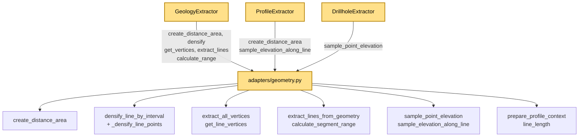

---
tags:
  - secinterp
  - code-walkthrough
  - gui
  - adapters
aliases:
  - geometry.py
  - create_distance_area
  - densify_line_by_interval
  - sample_point_elevation
  - sample_elevation_along_line
  - prepare_profile_context
cssclass: secinterp-note
---

# `gui/adapters/geometry.py`

> [!abstract] One-line summary
> QGIS geometry toolkit of the Extract phase (no classes): `QgsDistanceArea`, line densification, vertex extraction, segment ranges and DEM elevation sampling that used to live in `core/utils` and was moved here to keep the core QGIS-agnostic.

**Path**: `gui/adapters/geometry.py` (226 lines)
**Main function**: `sample_elevation_along_line` (most composite); module of supporting pure functions
**Layer**: GUI · Adapter / toolkit (depends on QGIS by design)
**Tags**: #secinterp #gui #adapters

---

## 🎯 Why does this file exist?

The docstring says it plainly: these helpers *used to be in `core/utils`* and
were moved to `gui/adapters` because they tied the core to QGIS. Centralizing
them here keeps the architectural boundary in one place:

| Problem | Solution |
|---------|----------|
| The core imported `QgsDistanceArea`/`QgsGeometry` via `core/utils` | All QGIS-dependent code now lives in this GUI module |
| Three extractors repeated densify + vertices + sample | Shared functions: `densify_line_by_interval`, `get_line_vertices`, `sample_*` |
| Measuring distances requires ellipsoid and `transformContext` | `create_distance_area(crs)` configures it in one spot |
| `QgsTask` cannot receive live geometries | Extractors convert here and pass tuples/WKT to the core |

> [!important] Architectural note
> **Classless** module: 10 public functions + 1 private (`_densify_line_points`,
> pure math). It is the shared "Extract toolkit" of `GeologyExtractor`,
> `ProfileExtractor` and `DrillholeExtractor`. The only QGIS-free math
> (`_densify_line_points`) is a natural candidate to move back to the core if it
> ever needs reuse without QGIS.

---

## 🧬 Relationship diagram



> [!tip] How to read
> Three consumers, one toolkit. `GeologyExtractor` is the heaviest client
> (5 functions); `DrillholeExtractor` only uses `sample_point_elevation`.

---

## 📦 Imports — architectural reading

```python
# gui/adapters/geometry.py
from __future__ import annotations

import math
from typing import Any

from qgis.core import (
    QgsCoordinateReferenceSystem,
    QgsDistanceArea,
    QgsGeometry,
    QgsPointXY,
    QgsProject,
    QgsRaster,
    QgsRasterLayer,
    QgsVectorLayer,
    QgsWkbTypes,
)
from qgis.PyQt.QtCore import QCoreApplication

from sec_interp.core.exceptions import GeometryError
```

| # | Observation |
|---|-------------|
| ① | Nine `qgis.core` classes: the most QGIS-coupled module of the package, deliberately. |
| ② | `QgsWkbTypes` is only used for the `LineGeometry` check in `get_line_vertices`. |
| ③ | `QgsRaster.IdentifyFormat.IdentifyFormatValue` (in `sample_point_elevation`) vs `dataProvider().sample` (in `sample_elevation_along_line`): two sampling APIs coexist. |
| ④ | Single core import: `GeometryError` (exceptions, no QGIS dependencies). |
| ⑤ | `QCoreApplication.translate` used directly with the `"GeometryExtraction"` context (no `tr` class wrapper — there are no classes). |
| ⑥ | `math` (hypotenuse, ceiling) and `Any` (the polymorphic `point` of `sample_point_elevation`) complete the block. |

---

## 🏗️ Structure inventory

**Public functions (10):**
- `create_distance_area(crs)` — configured `QgsDistanceArea` (CRS + ellipsoid).
- `extract_all_vertices(geometry)` — every vertex of any geometry (`[]` when null).
- `get_line_vertices(geometry)` — vertices requiring `LineGeometry` (raises `ValueError`).
- `extract_lines_from_geometry(geometry)` — linear `QgsGeometry` list from single/multi.
- `densify_line_by_interval(geometry, interval)` — densifies a line every `interval`.
- `calculate_segment_range(seg_geom, line_start, da)` — `(dist_start, dist_end)` or `None`.
- `sample_point_elevation(raster_layer, point, band_number=1)` — point elevation (`QgsPointXY` or tuple).
- `sample_elevation_along_line(geometry, raster_layer, band_number, distance_area, reference_point=None, interval=None)` — `list[QgsPointXY]` profile in `(dist, elev)` coords.
- `prepare_profile_context(line_lyr)` — `(line_geom, line_start, da)` with full validation.
- `line_length(line_lyr)` — first-feature length or `None`.

**Private function (1):**
- `_densify_line_points(points, interval)` — pure linear interpolation between vertices.

---

## 📁 Files in the package

The toolkit lives in the `gui/adapters/` package (the full Extract phase):

| File | Lines | Role |
|---|--:|---|
| `__init__.py` | 7 | Package docstring: Extract-then-Compute contract |
| `drillhole_extractor.py` | 369 | `DrillholeExtractor` → `DrillholeContext` |
| `geology_extractor.py` | 235 | `GeologyExtractor` → `GeologyContext` |
| `geometry.py` | 226 | QGIS geometry toolkit (this note) |
| `layer_resolver.py` | 113 | `LayerResolver` + `resolve_layer` (layer cache) |
| `structure_extractor.py` | 226 | `SectionContext` + `StructureExtractor` |
| `validation_extractor.py` | 176 | `resolve_layer_metadata`, `build_validation_params` |
| `feature_fetcher.py` | 84 | `DataFetcher` (bulk child reads) |
| `profile_extractor.py` | 86 | `ProfileExtractor` → `ProfileData` |

---

## 📖 Function-by-function walkthrough

### `create_distance_area` — the measurement datum

```python
def create_distance_area(crs: QgsCoordinateReferenceSystem) -> QgsDistanceArea:
    da = QgsDistanceArea()
    da.setSourceCrs(crs, QgsProject.instance().transformContext())
    da.setEllipsoid(crs.ellipsoidAcronym())
    return da
```

Three lines preventing the classic degrees-measuring bug: sets source CRS and
the CRS's own ellipsoid. Every `measureLine` in the plugin uses this object.
The module's only `QgsProject` call (via `transformContext()`).

### `extract_all_vertices` — vertices of any geometry

```python
def extract_all_vertices(geometry: QgsGeometry) -> list[QgsPointXY]:
    if not geometry or geometry.isNull():
        return []
    return [QgsPointXY(v) for v in geometry.vertices()]
```

Tolerant: null geometry → `[]`. Iterates `geometry.vertices()` (unified API that
works for point, line and polygon) wrapping each vertex in `QgsPointXY`.

### `get_line_vertices` — vertices requiring a line

```python
def get_line_vertices(geometry: QgsGeometry) -> list[QgsPointXY]:
    if not geometry or geometry.isNull():
        raise ValueError(... "Geometry is null or invalid")  # translated
    if geometry.type() != QgsWkbTypes.GeometryType.LineGeometry:
        raise ValueError(f"Expected LineGeometry, got {geometry.type()}")
    vertices = extract_all_vertices(geometry)
    if not vertices:
        raise ValueError(... "Line geometry has no vertices")  # translated
    return vertices
```

Strict, unlike the previous one: three guards (`null`, `non-line`, `vertex-less`)
with `ValueError`. Two user messages go through
`QCoreApplication.translate("GeometryExtraction", ...)`; the type message mixes
an untranslated f-string (an i18n detail to polish). Used by `densify_*`,
`calculate_segment_range` and `sample_elevation_along_line`.

### `extract_lines_from_geometry` — de-multiplying

```python
def extract_lines_from_geometry(geometry: QgsGeometry) -> list[QgsGeometry]:
    geometries: list[QgsGeometry] = []
    if not geometry or geometry.isNull():
        return geometries
    if geometry.isMultipart():
        for part in geometry.asGeometryCollection():
            geometries.append(QgsGeometry(part))
    else:
        geometries.append(QgsGeometry(geometry))
    return geometries
```

Splits multi-geometries via `asGeometryCollection()`, wrapping each part in a new
`QgsGeometry` (a copy, not a view). Used by geology's `_intersect_outcrop`: a
line↔polygon intersection usually yields multilines.

### `densify_line_by_interval` + `_densify_line_points` — densification

```python
def densify_line_by_interval(geometry: QgsGeometry, interval: float) -> QgsGeometry:
    if not geometry or geometry.isNull():
        return QgsGeometry()
    verts = get_line_vertices(geometry)
    points = [(p.x(), p.y()) for p in verts]
    densified = _densify_line_points(points, interval)
    return QgsGeometry.fromPolylineXY([QgsPointXY(x, y) for x, y in densified])

def _densify_line_points(points, interval):
    if not points or interval <= 0:
        return points
    result = [points[0]]
    for i in range(len(points) - 1):
        p1, p2 = points[i], points[i + 1]
        ...  # interpolates t=j/num_segments; zero-length segments skipped
        result.append(p2)
    return result
```

The pattern is extract→pure math→rebuild: vertices come out as tuples,
`_densify_line_points` interpolates linearly (`t = j/num_segments`) and the
result returns via `QgsGeometry.fromPolylineXY`. Zero-length segments are
skipped; `interval <= 0` returns the points untouched. `_densify_line_points`
imports nothing QGIS: the only piece reintegrable into the core.

### `calculate_segment_range` — one run's range

```python
def calculate_segment_range(seg_geom, line_start, da):
    try:
        verts = get_line_vertices(seg_geom)
        ...  # measureLine to each end from line_start + normalize order
        return dist_start, dist_end
    except ValueError:
        return None
```

Measures from the section origin to each end and normalizes the order (the
intersected run may come back reversed). Any `ValueError` from
`get_line_vertices` → `None`, and the caller drops the run.

### `sample_point_elevation` — polymorphic point elevation

```python
def sample_point_elevation(raster_layer, point, band_number=1):
    if not raster_layer or not raster_layer.isValid():
        return 0.0
    try:
        pt = point if isinstance(point, QgsPointXY) else QgsPointXY(point[0], point[1])
        ...  # identify(pt, IdentifyFormatValue) → float(val) or 0.0
    except (AttributeError, ValueError, TypeError):
        pass
    return 0.0
```

Accepts `QgsPointXY` or an `(x, y)` tuple (drillholes' `_sample_elevation` uses
tuples). Uses the `identify` API (not `sample`): returns `0.0` on invalid raster,
invalid `identify`, `None` value or exception. Note the asymmetry with
`sample_elevation_along_line`, which uses `sample(pt, band) → (val, ok)`.

### `sample_elevation_along_line` — full profile

```python
def sample_elevation_along_line(
    geometry, raster_layer, band_number, distance_area,
    reference_point=None, interval=None,
) -> list[QgsPointXY]:
    if interval is None:
        interval = raster_layer.rasterUnitsPerPixelX()
    try:
        densified_geom = densify_line_by_interval(geometry, interval)
    except (ValueError, RuntimeError):
        densified_geom = geometry
    vertices = get_line_vertices(densified_geom)
    points = []
    current_dist = 0.0
    if reference_point:
        current_dist = distance_area.measureLine(reference_point, vertices[0])
    for i, pt in enumerate(vertices):
        ...  # accumulates current_dist + sample(pt, band) → QgsPointXY(dist, elev)
    return points
```

The most composite function: default interval = raster resolution, densify with
degradation, optional start offset (`reference_point`) and an accumulate +
`sample` loop. Returns points in **profile space** (`x=distance`, `y=elevation`),
not geographic — `ProfileExtractor` rounds them to `(dist, elev)`.

### `prepare_profile_context` — validated common context

```python
def prepare_profile_context(line_lyr):
    line_feat = next(line_lyr.getFeatures(), None)
    if not line_feat:
        raise GeometryError("Line layer has no features", {"layer": line_lyr.name()})
    line_geom = line_feat.geometry()
    ...  # null geometry / no vertices → GeometryError with details
    if line_geom.isMultipart():
        line_start = line_geom.asMultiPolyline()[0][0]
    else:
        polyline = line_geom.asPolyline()
        line_start = polyline[0] if polyline else QgsPointXY(0, 0)
    da = create_distance_area(line_lyr.crs())
    return line_geom, line_start, da
```

Packages the `(line_geom, line_start, da)` trio every profile needs, with
`GeometryError` + `details={"layer": ...}` on each failure. Note: its messages
**do not** go through `QCoreApplication.translate` (unlike
`get_line_vertices`): an i18n inconsistency to fix.

### `line_length` — quick length

```python
def line_length(line_lyr: QgsVectorLayer) -> float | None:
    line_feat = next(line_lyr.getFeatures(), None)
    if not line_feat:
        return None
    line_geom = line_feat.geometry()
    if not line_geom or line_geom.isNull():
        return None
    return line_geom.length()
```

Cheap read without densifying (`QgsGeometry.length()`, CRS units). Used by
`ProfileExtractor.calculate_lod_interval` for the level of detail.

---

## 🔄 Data flow

| Phase | Input | Transformation | Output |
|-------|-------|----------------|--------|
| Datum | `crs` | ellipsoid + `transformContext` | `QgsDistanceArea` |
| Vertices | `QgsGeometry` | `vertices()` / type check | `list[QgsPointXY]` |
| Densify | line + `interval` | tuples → interpolation → `fromPolylineXY` | dense line |
| Range | run + origin + `da` | two `measureLine` + order | `(dist_start, dist_end)` |
| Point sample | raster + point | `identify` | `float` (0.0 on failure) |
| Profile | line + raster + `da` | densify → accumulate → `sample` | `list[QgsPointXY(dist, elev)]` |
| Context | `line_lyr` | validation + `create_distance_area` | `(geom, start, da)` |

---

## 🏛️ Design patterns present

| Pattern | Where | Purpose |
|---------|-------|---------|
| **Toolkit module (pure functions)** | whole file | Utilities with no shared state |
| **Extract-then-Compute (Extract side)** | sampling and measuring | QGIS here; the core receives primitives |
| **Graceful degradation** | densify, sampling, ranges | `None`/`0.0`/`[]` instead of exceptions |
| **Polymorphic parameter** | `sample_point_elevation(point)` | Accepts `QgsPointXY` or tuple |

---

## 🧾 API summary

| Symbol | Signature | Typical use |
|--------|-----------|-------------|
| `create_distance_area` | `(crs) -> QgsDistanceArea` | measurement datum |
| `extract_all_vertices` | `(geometry) -> list[QgsPointXY]` | tolerant vertices |
| `get_line_vertices` | `(geometry) -> list[QgsPointXY]` (raises `ValueError`) | strict vertices |
| `extract_lines_from_geometry` | `(geometry) -> list[QgsGeometry]` | de-multiply intersections |
| `densify_line_by_interval` | `(geometry, interval) -> QgsGeometry` | densification |
| `calculate_segment_range` | `(seg_geom, line_start, da) -> tuple \| None` | run range |
| `sample_point_elevation` | `(raster_layer, point, band_number=1) -> float` | point Z (drillholes) |
| `sample_elevation_along_line` | `(geometry, raster_layer, band_number, distance_area, reference_point=None, interval=None) -> list[QgsPointXY]` | profile (topography) |
| `prepare_profile_context` | `(line_lyr) -> tuple[QgsGeometry, QgsPointXY, QgsDistanceArea]` | validated trio |
| `line_length` | `(line_lyr) -> float \| None` | length for LOD |

---

## 🛡️ Error handling

| Situation | Behaviour |
|-----------|-----------|
| Null geometry in `extract_all_vertices` / `extract_lines_*` | `[]` |
| Null / non-line / vertex-less geometry in `get_line_vertices` | `ValueError` (2 messages translated, 1 not) |
| `densify` with null geometry | Empty `QgsGeometry()` |
| `interval <= 0` in `_densify_line_points` | untouched points |
| `calculate_segment_range` with `ValueError` | `None` |
| Invalid raster / invalid `identify` / `None` value | `0.0` |
| `sample(..., ok=False)` in profile | elevation `0.0` |
| `prepare_profile_context` without features / null geometry / no vertices | `GeometryError` with `details` |

---

## 🧪 Associated tests

No dedicated GUI tests for this module; coverage comes from the core mirror and
integration:

- `tests/core/test_geometry_utils.py` — analogous core utilities (pure densify, distances).
- `tests/gui/tasks/test_geology_task.py` and `test_drillhole_task.py` — exercise densify and sampling via extractors.
- `tests/integration/test_geology_structure_workflow.py` — end-to-end profile + intersections.
- `tests/base_test.py` — QGIS mocks (`mock_core`, `mock_gui`) for testing these functions without real QGIS.

> [!warning] Coverage gap
> `_densify_line_points` is pure math testable without QGIS yet has no direct
> test. `sample_point_elevation` (tuple vs `QgsPointXY`) and
> `calculate_segment_range` (reversed run) are ideal cases for a mock-first
> `test_geometry_adapter.py`.

---

## 🧵 Thread-safety and i18n

| Aspect | Detail |
|--------|--------|
| **Thread** | The whole module requires live QGIS objects → main thread. Extractors call in here and only the results (tuples, WKT, floats) travel to the `QgsTask`. |
| **Exception** | `_densify_line_points` is thread-safe by construction (only `math` + tuples). |
| **i18n** | Mixed: `get_line_vertices` translates 2 of 3 messages via `QCoreApplication.translate("GeometryExtraction", ...)`; `prepare_profile_context` translates none. See observations. |

---

## 👀 Observations and notes

> [!success] Strengths
> - Core/GUI boundary in a single documented module (migration from `core/utils` complete).
> - `_densify_line_points` pure and testable in isolation.
> - `calculate_segment_range` normalizes reversed runs (a detail preventing negative segments).
> - `prepare_profile_context` concentrates validation repeated across three extractors.

> [!warning] Points of attention
> - Inconsistent i18n: `prepare_profile_context` translates nothing; `get_line_vertices` translates 2 of 3 messages.
> - Two sampling APIs (`identify` vs `sample`) with no in-code documented rationale.
> - `0.0` as failure elevation pollutes profiles (DEM void = sea level).
> - `asMultiPolyline()[0][0]` without an empty-part guard (also duplicated in extractors).

> [!question] Open questions
> - Move `_densify_line_points` to the core (`core/utils`) and reuse from here?
> - Unify `identify`/`sample` under one function with a flag?
> - Translate `prepare_profile_context` `GeometryError`s with `QCoreApplication.translate`?

---

## 🔗 Related notes

- [[Index]] — vault index
- [[gui_adapters]] — Extract adapters package note
- [[geology_extractor]] — main client (5 toolkit functions)
- [[profile_extractor]] — client of `sample_elevation_along_line` and `line_length`
- [[drillhole_extractor]] — client of `sample_point_elevation`
- [[controller]] — orchestrates the extractors using this toolkit
- [[exceptions]] — `GeometryError` used by `prepare_profile_context`
- [[core_validation]] — QGIS-agnostic validation mirroring these GUI guards

---

*Note of the SecInterp Code Walkthrough v2 vault — v3.9.0*
