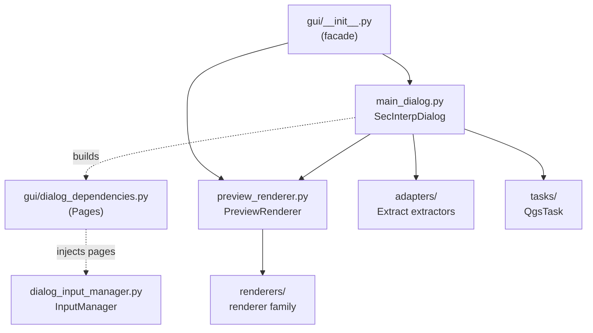

---
tags:
  - secinterp
  - code-walkthrough
  - gui
  - general
aliases:
  - gui/
  - SecInterpDialog
  - PreviewRenderer
  - Pages
cssclass: secinterp-note
---

# `gui/` — Root package of the GUI layer (Extract + Presentation)

> [!abstract] One-line summary
> Package `gui/` (2 files): the plugin's public facade (`__init__.py`, re-exporting `SecInterpDialog` and `PreviewRenderer`) plus `dialog_dependencies.py`, which provides the `Pages` container so dialog managers receive only the dependencies they need (composition-root).

**Path**: `gui/` (2 files, 37 lines)
**Main symbols**: `SecInterpDialog`, `PreviewRenderer`, `Pages`
**Layer**: GUI (Extract + Presentation side; no geological computation lives here)
**Tags**: #secinterp #gui #general

---

## 🎯 Why does this package exist?

`gui/` is the entry point of all QGIS interaction: dialogs, configuration
pages, extractors (adapters), preview renderers, `QgsTask` tasks and map
tools. The two files grouped in this note are the package's "door" and its
"composition contract":

| Problem | Solution |
|---------|----------|
| Consumers (`sec_interp_plugin.py`, tests) should not know the internal location of each class | `__init__.py` re-exports the minimal surface: `SecInterpDialog` + `PreviewRenderer` |
| Dialog managers (`InputManager`, `PreviewManager`, …) tend to couple to the whole `QDialog` | `dialog_dependencies.py` defines `Pages`: a narrow dataclass with only the configuration pages |
| Adding a new manager should not force rewriting signatures | The composition-root (`main_dialog.py`) builds one `Pages` and injects it; each manager declares what it needs |

> [!important] Architectural note
> This package is the **Extract + Present** side of the Extract-then-Compute
> pattern: it extracts primitives/DTOs from live QGIS objects, delegates
> computation to `core/`, and converts results back into layers and symbology.
> `gui/AGENTS.md` forbids business logic, direct I/O, and `QgsTask` with live
> QGIS objects.

---

## 🧬 Relationship diagram



> [!tip] How to read
> Solid arrow = imports/delegates; dashed = builds/injects. `Pages` never
> imports anything from QGIS: it only carries references to already-created pages.

---

## 📦 Imports — architectural reading

```python
# gui/__init__.py
"""GUI module for SecInterp plugin.

Contains dialogs, widgets, and rendering components.
"""

from __future__ import annotations

from .main_dialog import SecInterpDialog
from .preview_renderer import PreviewRenderer

__all__ = [
    "PreviewRenderer",
    "SecInterpDialog",
]
```

```python
# gui/dialog_dependencies.py
"""Narrow dependency containers injected into dialog managers. ... """

from __future__ import annotations

from dataclasses import dataclass
from typing import Any
```

| # | Observation |
|---|-------------|
| ① | `from __future__ import annotations` in both files: repo-wide convention (lazy annotation evaluation, see coding-standards skill). |
| ② | `__init__.py` imports exactly two symbols and publishes them via an ordered `__all__`: a minimal, deliberate public surface. |
| ③ | `dialog_dependencies.py` depends only on `dataclasses` + `typing`: zero coupling to QGIS, Qt, or the dialog itself. |
| ④ | `Pages` fields are typed as `Any` on purpose: pages are heterogeneous Qt widgets and the container must not know their concrete classes. |
| ⑤ | Relative import (`.main_dialog`) in the facade vs. absolute (`sec_interp.gui…`) in the rest of the package: the facade talks about siblings; inner modules use the canonical path. |

---

## 🏗️ Structure inventory

**Root-package modules (grouped in this note):**

- `gui/__init__.py` — 14 lines: docstring + 2 re-exports + `__all__`
- `gui/dialog_dependencies.py` — 23 lines: `@dataclass Pages` with 6 fields

**Sibling subpackages and modules (own note or documented separately):**

- `adapters/` — Extract-phase extractors (see [[gui_adapters]])
- `renderers/` — preview renderer family (see [[gui_renderers]])
- `services/` — namespace reserved for GUI services (see [[gui_services]])
- `tasks/` — background-generation `QgsTask` (see [[gui_tasks]])
- `tools/` — interactive `QgsMapTool` (see [[gui_tools]])
- `dialog_*_manager.py`, `dialog_*_mixin.py` — dialog managers and mixins (see [[main_dialog]])
- `preview_*.py` — layer factory, axes, legend, orchestrator (see [[preview_renderer]])

---

## 📁 Files in the package

| File | Lines | Role |
|---|--:|---|
| [[#__init__\|__init__.py]] | 14 | Public facade: re-exports `SecInterpDialog` and `PreviewRenderer` |
| [[#Pages\|dialog_dependencies.py]] | 23 | Narrow `Pages` container for manager injection (composition-root) |

---

## 📖 File-by-file walkthrough

### `__init__`

```python
from .main_dialog import SecInterpDialog
from .preview_renderer import PreviewRenderer

__all__ = [
    "PreviewRenderer",
    "SecInterpDialog",
]
```

The facade does exactly three things and nothing more: it documents the
module (`GUI module… dialogs, widgets, and rendering components`), imports
the two symbols outsiders need, and declares them in `__all__`. Whoever loads
the plugin (`sec_interp_plugin.py`) can write
`from sec_interp.gui import SecInterpDialog` without knowing which submodule
holds the real class.

| Decision | Detail |
|----------|--------|
| Only two symbols | Everything else (managers, extractors, renderers) is imported by full path; not part of the public contract |
| Alphabetically ordered `__all__` | `PreviewRenderer` before `SecInterpDialog`; repo style convention |
| No logic, no state | An `__init__` with side effects would break imports in tests with mocked QGIS |

> [!note] Why managers are not re-exported
> Managers (`InputManager`, `PreviewManager`, …) are internal composition
> details of the dialog. Exposing them in the facade would invite external
> coupling and hinder refactors such as the mixin extraction documented in
> [[main_dialog]].

### `Pages`

```python
@dataclass
class Pages:
    """Configuration pages consumed by the input manager."""

    dem: Any = None
    section: Any = None
    geology: Any = None
    structure: Any = None
    drillhole: Any = None
    settings: Any = None
```

`Pages` is a **narrow dependency container**: it groups the dialog's six
configuration pages (DEM, section, geology, structures, drillholes, settings)
so `InputManager` receives a single object instead of six parameters or,
worse, the whole dialog.

| Field | Page it carries |
|-------|-----------------|
| `dem` | DEM / relief configuration page |
| `section` | Section-line page |
| `geology` | Outcrop / unit page |
| `structure` | Structural-measurement page |
| `drillhole` | Collar, survey and interval page |
| `settings` | General-settings page |

All default to `None`, so tests can build `Pages(geology=mock)` with only
what they exercise (pattern visible in
`tests/gui/test_dialog_input_manager.py`).

**Who builds it and who consumes it:**

| Role | Location | What it does |
|------|----------|--------------|
| Builder (composition-root) | `gui/main_dialog.py` (~line 114) | Creates `Pages(dem=…, section=…, …)` with the real pages |
| Main consumer | `gui/dialog_input_manager.py` (line 26) | Receives `pages: Pages` in its constructor |
| Test consumers | `tests/gui/test_dialog_input_manager.py`, `tests/gui/test_main_dialog_validation_manager.py` | Build partial `Pages` with mocks |

> [!tip] Miniature composition-root
> `main_dialog.py` acts as the composition root: it knows everyone (pages and
> managers) while each manager only knows its `Pages`. Adding a new field to
> the dataclass is backward-compatible because every field has a default.

**Real construction at the composition-root:**

```python
# gui/main_dialog.py (verified fragment, ~lines 114-117)
from .dialog_dependencies import Pages
...
pages = Pages(
    ...
)
```

The import is local to the method (not at the top): the dialog defers the
import until managers are composed. The fragment confirms the pattern:
`main_dialog.py` is the one that knows the concrete pages and packs them.

| Design property | Evidence in the source |
|-----------------|------------------------|
| Local import | `from .dialog_dependencies import Pages` inside the method, not at the top |
| One-way coupling | `dialog_input_manager.py` imports `Pages`; `dialog_dependencies.py` imports nobody from the dialog |
| Partial construction in tests | `Pages(geology=mock)` / `Pages()` with `None` defaults |

---

## 🗺️ Where each GUI responsibility lives

The root package holds only the facade and the container; the rest of the GUI
layer is spread across submodules with their own notes. Navigation map:

| Responsibility | Module(s) | Note |
|----------------|-----------|------|
| Public surface + `Pages` | `__init__.py`, `dialog_dependencies.py` | This note |
| Main dialog and managers | `main_dialog.py`, `dialog_*_manager.py`, `dialog_*_mixin.py` | [[main_dialog]] |
| Extract phase (layers → DTOs) | `adapters/*.py` | [[gui_adapters]] |
| Present phase (DTOs → symbology) | `renderers/*.py`, `preview_renderer.py` | [[gui_renderers]], [[preview_renderer]] |
| Background (`QgsTask` with DTOs) | `tasks/*.py`, `preview_task_orchestrator.py` | [[gui_tasks]], [[preview_task_orchestrator]] |
| Map tools | `tools/*.py` | [[gui_tools]] |
| GUI service reserve | `services/` | [[gui_services]] |
| Pages and widgets | `ui/` | [[gui_ui]] |

> [!note] Why this map matters
> `gui/` is the plugin's most populated package (over 40 entries across
> modules and subpackages). Without the minimal facade and this map, every new
> reader would have to infer the architecture by direct inspection.

---

## 🔄 Data flow

| Phase | Input | Transformation | Output |
|-------|-------|----------------|--------|
| Import | `from sec_interp.gui import SecInterpDialog` | Facade re-export | Class ready without exposing inner paths |
| Composition | Already-created Qt pages | `Pages(dem, section, geology, structure, drillhole, settings)` | Injectable container |
| Injection | `Pages` | `InputManager(pages)` | Working manager with no reference to the `QDialog` |
| Extraction | QGIS layers via managers → `adapters/` | Extract phase: layers to detached DTOs | Pure contexts toward `core/` |
| Presentation | Result DTOs from `core/` | `preview_renderer` + `renderers/` family | Memory layers and symbology on the canvas |

---

## 🧩 Root-package conventions

| Convention | Where seen | Purpose |
|------------|------------|---------|
| Minimal facade (2-symbol `__all__`) | `__init__.py` | Stable public contract across inner refactors |
| Narrow containers instead of the whole dialog | `Pages` | Break manager ↔ `QDialog`-surface coupling |
| `Any` for heterogeneous widgets | `Pages` fields | The container carries, not types, the UI |
| Content-oriented package docstring | `Contains dialogs, widgets, and rendering components` | Describes *what is inside*, not *how to use it* |

> [!important] Applicable `gui/AGENTS.md` rule
> When a new manager needs another dialog collaborator, the correct path is
> to **extend `Pages`** (or create a second narrow container), never to pass
> the whole `SecInterpDialog`. Passing the full dialog reintroduces the
> coupling this file exists to eliminate.

---

## 🏛️ Design patterns present

| Pattern | Where | Purpose |
|---------|-------|---------|
| **Facade** | `__init__.py` | Minimal public surface over a large package |
| **Composition Root** | `main_dialog.py` + `Pages` | A single place building the dependency graph |
| **Parameter Object** | `Pages` | Six pages travel as one argument with defaults |
| **Dependency Injection** | `InputManager(pages)` | The manager declares dependencies; it does not look them up |

---

## 🧾 API summary

| Symbol | Signature / Inherits | Typical use |
|--------|----------------------|-------------|
| `SecInterpDialog` | re-export of `.main_dialog` | `from sec_interp.gui import SecInterpDialog` in the plugin loader |
| `PreviewRenderer` | re-export of `.preview_renderer` | Native PyQGIS rendering of the interactive preview |
| `Pages` | `@dataclass`, 6 `Any = None` fields | `Pages(geology=page)` in production and in tests with mocks |

---

## 🛡️ Error handling

These two files handle **no errors** by design:

- `__init__.py` does not wrap imports in `try/except`: if `main_dialog` or
  `preview_renderer` fail to import, the failure must be loud and early (the
  plugin load fails, not a mid-session computation).
- `Pages` does not validate: it accepts `None` in every field. "Missing page"
  validation belongs to the consumer (`InputManager` and validators), not to
  the transport container.

---

## 🧪 Associated tests

The facade has no dedicated test (importing it is the smoke test the whole
suite runs). `Pages`, in contrast, appears explicitly in:

- `tests/gui/test_dialog_input_manager.py` — builds `Pages(…)` with mocked
  pages and verifies `InputManager` reads configuration without the real
  dialog; the living proof of the decoupling this note documents.
- `tests/gui/test_main_dialog_validation_manager.py` — builds partial `Pages`
  to exercise manager validation.
- `tests/gui/test_main_dialog_core.py` — covers the dialog acting as
  composition-root and building the real `Pages`.
- `tests/gui/test_preview_renderer_custom.py` — covers the facade's second
  symbol, `PreviewRenderer`, with mocked layers.

| Symbol in this note | Test exercising it | What it verifies |
|---------------------|--------------------|------------------|
| `Pages` | `tests/gui/test_dialog_input_manager.py` | `InputManager` works with mocked pages, no real dialog |
| `Pages` | `tests/gui/test_main_dialog_validation_manager.py` | Validation with partial `Pages` |
| Facade (`SecInterpDialog`) | `tests/gui/test_main_dialog_core.py` | Dialog as composition-root building `Pages` |
| Facade (`PreviewRenderer`) | `tests/gui/test_preview_renderer_custom.py` | Rendering with mocked layers |

---

## 🌐 i18n and migration notes

- These files hold no user-visible strings: nothing to translate (extractors
  do use `QCoreApplication.translate`, see [[gui_adapters]]).
- `Pages` is Qt5/Qt6-agnostic: it only stores `Any` references, so QGIS 4.x
  migration does not affect it (see qgis-migration-4x skill).
- Should pages ever be typed with `Protocol`, `Pages` could adopt those
  protocols without breaking current consumers thanks to the `None` defaults.

---

## 👀 Observations and notes

> [!success] Strengths
> - A genuinely minimal facade: 2 symbols, zero logic, zero state.
> - `Pages` removes manager ↔ dialog coupling in 23 lines with no dependencies.
> - `None` defaults on every field: trivial partial construction in tests.
> - Both files pass `ruff`/`black` with no exceptions and respect the architectural boundary (nothing in `core/` imports GUI).

> [!warning] Points of attention
> - `Pages` only models configuration pages; if more managers need other collaborators (canvas, task manager), analogous containers must be created or this one generalized.
> - Deliberate `Any` typing dilutes IDE help: one `Protocol` per page would improve it at no runtime cost.
> - The facade does not re-export `PreviewTaskOrchestrator` or extractors: whoever needs them must know inner paths (a conscious decision, documented here to avoid confusion).

> [!question] Open questions
> - Is a second container (`Services`/`Tasks`) worthwhile once `gui/services/` stops being an empty namespace? See [[gui_services]].
> - Should `Pages` fields be typed with `Protocol` for autocompletion without importing Qt widgets?

---

## 🔗 Related notes

- [[Index]] — vault index
- [[main_dialog]] — the dialog building `Pages` (composition-root) and the re-exported `SecInterpDialog`
- [[preview_renderer]] — the facade's second symbol
- [[controller]] — domain orchestrator fed by the GUI via Extract
- [[dialog_input_manager]] — main `Pages` consumer
- [[dialog_preview_manager]] — sibling manager orchestrating preview and tasks
- [[preview_task_orchestrator]] — launches `QgsTask` with already-extracted DTOs
- [[gui_adapters]] — Extract-phase extractors
- [[gui_renderers]] — Present-side renderer family
- [[gui_tasks]] — GUI-side background tasks
- [[gui_services]] — namespace reserved for future GUI services
- [[drillhole_service]] / [[geology_service]] — pure computation invoked by the GUI

---

*Note of the SecInterp Code Walkthrough v2 vault — v3.9.1*
