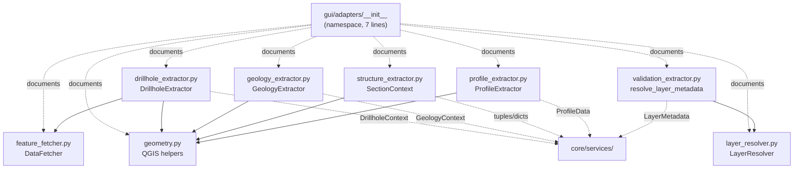
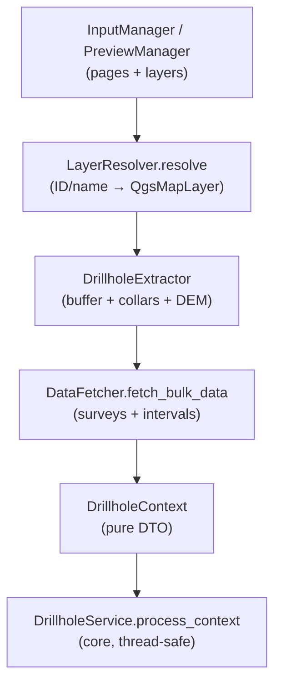

---
tags:
  - secinterp
  - code-walkthrough
  - gui
  - adapters
aliases:
  - gui/adapters/
  - DrillholeExtractor
  - GeologyExtractor
  - StructureExtractor
  - ProfileExtractor
  - DataFetcher
  - LayerResolver
  - SectionContext
cssclass: secinterp-note
---

# `gui/adapters/` — Extract-phase extractors (QGIS → DTOs)

> [!abstract] One-line summary
> Package `gui/adapters/` (1 file): the Extract-phase namespace whose 7-line `__init__.py` states the package contract (bridge between live QGIS objects and the agnostic core), while the 8 sibling extractor modules are documented in their own notes and linked from here.

**Path**: `gui/adapters/` (namespace; 1 grouped file, 7 lines + 8 sibling modules with their own notes)
**Main symbols**: none in `__init__` (pure namespace); `DrillholeExtractor`, `GeologyExtractor`, `SectionContext`, `ProfileExtractor`, `DataFetcher`, `LayerResolver`, `resolve_layer_metadata` in the siblings
**Layer**: GUI · Extract Adapter (the only layer allowed to touch `QgsVectorLayer`, `QgsRasterLayer`, `QgsProject`)
**Tags**: #secinterp #gui #adapters

---

## 🎯 Why does this package exist?

The core is forbidden from importing `qgis.*` (see `tests/core/test_architecture_boundary.py`).
Someone must therefore read layers, features, CRS and rasters, and convert
them into primitives. That "someone" is this package:

| Problem | Solution |
|---------|----------|
| The core cannot touch live QGIS objects | Extractors do all `Qgs*` work and return DTOs (`DrillholeContext`, `GeologyContext`, tuples, dicts) |
| Every service needs the same preamble (resolve layer, request features, transform CRS, buffer) | One extractor per domain (`drillhole_`, `geology_`, `structure_`, `profile_`) plus shared utilities (`geometry`, `layer_resolver`, `feature_fetcher`) |
| Core validation needs metadata without live layers | `validation_extractor` converts `QgsMapLayer` into detached `LayerMetadata` |

> [!important] Architectural note
> **Extract** Adapter of the Extract-then-Compute pattern. Everything needing
> a live QGIS object happens here or in `tasks/` (only with already-extracted
> DTOs); the core only sees WKT, tuples, dicts and domain dataclasses. The
> `__init__.py` re-exports nothing: it documents the contract, not a facade.

---

## 🧬 Relationship diagram



> [!tip] How to read
> Solid arrow = imports; dotted = groups/documents (namespace) or delivers
> DTOs to the core. `geometry.py` is the most reused module: four extractors
> import it.

---

## 📦 Imports — architectural reading

```python
# gui/adapters/__init__.py (complete: 7 lines, zero imports)
"""GUI adapters (Extract phase).

Adapters bridge the QGIS object world and the QGIS-agnostic core layer.
They perform the "Extract" step of the Extract-then-Compute pattern: resolving
layers, reading features, transforming CRS, and buffering — everything that
needs live QGIS objects — so the core never has to.
"""
```

| # | Observation |
|---|-------------|
| ① | **Zero imports**: a namespace importing nothing cannot create cycles; the 8 modules are imported by full path (`sec_interp.gui.adapters.geometry`). |
| ② | The docstring lists the 4 canonical Extract operations: resolving layers, reading features, transforming CRS, and buffering. It is the package checklist. |
| ③ | The closing clause ("so the core never has to") is the architectural invariant: an extractor returning a live QGIS object violates its own contract. |
| ④ | Contrast with `gui/__init__.py` (facade with re-exports): there is **no `__all__`** here because there is no public surface to stabilize; each extractor stands alone. |
| ⑤ | Siblings import `qgis.core` heavily (`QgsFeatureRequest`, `QgsDistanceArea`, `QgsRaster…`): the QGIS licence lives in the modules, not in the namespace. |

---

## 🏗️ Structure inventory

**File grouped in this note:**

- `__init__.py` — 7 lines: package docstring only, no symbols

**Sibling modules (each with its own note; not duplicated here):**

| Module | Lines | Key symbol | Produces (toward the core) |
|--------|------:|------------|----------------------------|
| `drillhole_extractor.py` | 369 | `DrillholeExtractor` | Detached `DrillholeContext` |
| `geology_extractor.py` | 235 | `GeologyExtractor` | `GeologyContext` + `OutcropSegments` |
| `structure_extractor.py` | 226 | `SectionContext` | `line_points`, `line_azimuth`, structures as dicts |
| `geometry.py` | 226 | `create_distance_area`, `extract_all_vertices`, … | Geometric primitives (vertices, buffers, samples) |
| `validation_extractor.py` | 176 | `resolve_layer_metadata` | `LayerMetadata` |
| `layer_resolver.py` | 113 | `LayerResolver`, `resolve_layer` | Resolved `QgsMapLayer` (inner GUI use) |
| `profile_extractor.py` | 86 | `ProfileExtractor` | `ProfileData` (distance, elevation) |
| `feature_fetcher.py` | 84 | `DataFetcher` | Flat survey/interval tuples |

---

## 📁 Files in the package

| File | Lines | Role |
|---|--:|---|
| [[#__init__\|__init__.py]] | 7 | Extract namespace: package-contract docstring, no re-exports or symbols |

> [!note] Where the rest lives
> The 8 extractors have individual notes ([[drillhole_extractor]],
> [[geology_extractor]], [[structure_extractor]], [[profile_extractor]],
> [[feature_fetcher]], [[layer_resolver]], [[geometry]],
> [[validation_extractor]]). This note documents the **package role** and
> links them; their symbols are summarized below without duplicating those notes.

---

## 📖 Walkthrough: the namespace and its siblings

### `__init__`

```python
"""GUI adapters (Extract phase).

Adapters bridge the QGIS object world and the QGIS-agnostic core layer.
They perform the "Extract" step of the Extract-then-Compute pattern: resolving
layers, reading features, transforming CRS, and buffering — everything that
needs live QGIS objects — so the core never has to.
"""
```

The whole file is this docstring. There is nothing to "walk through" in the
method sense — and that is exactly the honest information this note must give:
the `__init__` is a **package marker with a documented contract**. The
decisions it embodies:

| Decision | Effect |
|----------|--------|
| No re-exports | Importing `sec_interp.gui.adapters` loads no QGIS; tests can import the namespace without mocks |
| No `__all__` | Nothing to stabilize as public API |
| Imperative docstring | Every new extractor should tick its boxes (resolve, read, transform, buffer) |

### Domain extractors (4)

Each converts one geological domain into pure DTOs. Full detail in its note;
here the contract each honours:

**`DrillholeExtractor`** (369 lines, see [[drillhole_extractor]]). Reads the
section line and collar layer, buffers (`DEFAULT_BUFFER_SEGMENTS = 8`),
detaches collars, pre-samples DEM elevations, and delegates surveys/intervals
to `DataFetcher`. Takes an optional `data_fetcher` by constructor (injection
for tests). Returns `DrillholeContext`.

**`GeologyExtractor`** (235 lines, see [[geology_extractor]]). Reads the
section line and outcrops, densifies and samples the master profile, and
intersects the section with polygons. Exposes `tr()` via
`QCoreApplication.translate` (GUI-layer i18n convention). Returns
`GeologyContext`.

**`SectionContext` / structural extractor** (226 lines, see
[[structure_extractor]]). Line buffering, filtering of measurements inside the
buffer, and raster elevation sampling. Produces primitives:
`line_points: list[tuple[float, float]]`, `line_start`, `line_azimuth`, and
structures as `{"point": (x, y), "attributes": {...}}`.

**`ProfileExtractor`** (86 lines, see [[profile_extractor]]). Reads the
section line and samples the DEM to return `ProfileData`
(`(distance, elevation)`). Adds `calculate_lod_interval(line_lyr,
canvas_width)`: sampling interval from line length and canvas width (preview LOD).

### Extract infrastructure (4)

**`geometry.py`** (226 lines, see [[geometry]]). QGIS helpers extracted from
`core/utils`: `create_distance_area(crs)`, `extract_all_vertices(geometry)`,
densification, buffers, and raster sampling. The shared base: four extractors
import it (`from sec_interp.gui.adapters import geometry`).

**`LayerResolver` + `resolve_layer`** (113 lines, see [[layer_resolver]]).
Resolves references (ID, name, or object) to `QgsMapLayer` via `QgsProject`
with an inner dict cache (`_cache`, `clear_cache()`). `resolve_layer()` is the
backward-compatible shortcut delegating to the class.

**`DataFetcher`** (84 lines, see [[feature_fetcher]]).
`fetch_bulk_data(layer, hole_ids, fields)` reads surveys and intervals in a
single pass with an `IN (…)`-filtered `QgsFeatureRequest`, sorting surveys by
depth. Survey vs. interval is told apart by the `depth` field.

**`resolve_layer_metadata`** (176 lines, see [[validation_extractor]]).
Converts `QgsVectorLayer`/`QgsRasterLayer` into `LayerMetadata` via
`_GEOMETRY_MAP` (`PointGeometry` → point, etc.) and the
`KIND_VECTOR`/`KIND_RASTER`/`GEOMETRY_*` constants. The bridge to
`core/validation/`.

---

## 🧪 Typical Extract sequence (drillhole example)



| Step | Owner | Live QGIS objects |
|------|-------|-------------------|
| 1. Resolve layers | `LayerResolver` | Yes (`QgsProject`, `QgsMapLayer`) |
| 2. Buffer + spatial filter | `DrillholeExtractor` + `geometry.py` | Yes (`QgsGeometry`, `QgsFeatureRequest`) |
| 3. Raster sampling | extractor + `geometry.py` | Yes (`QgsRasterLayer`) |
| 4. Children (survey/interval) | `DataFetcher` | Yes, in a single bulk pass |
| 5. Packing | extractor | No: from here on only tuples/dicts/DTOs |
| 6. Computation | `core/services` or `QgsTask` | Never |

---

## 📏 Rules for adding a new extractor

| Rule | Rationale |
|------|-----------|
| Live in `gui/adapters/` with its own note | The Extract boundary must be discoverable in one directory |
| Return only primitives, tuples, dicts, or `core/domain` DTOs | Any `Qgs*` in the output breaks [[gui_tasks]] (threads) and the boundary test |
| Reuse `geometry.py` and `LayerResolver` before writing own helpers | Avoids the duplication that motivated extracting `geometry.py` from `core/utils` |
| Expose `tr()` when producing own error messages | Package i18n convention (`GeologyExtractor`, `ProfileExtractor` already do) |
| Raise `DataMissingError` / `GeometryError` / `ValidationError` | The `core/exceptions.py` hierarchy is the only error language the core understands |
| Add an `tests/integration/` case + an optional `tests/core/` case | Existing pattern: real workflow + missing-layer tolerance |

---

## 🔄 Data flow

| Phase | Input | Transformation | Output |
|-------|-------|----------------|--------|
| Resolution | Layer ref (ID, name, object) | `LayerResolver.resolve` + cache | Live `QgsMapLayer` (inner GUI use) |
| Reading | Layer + section line | `QgsFeatureRequest`, buffer, spatial filter | In-memory `QgsFeature`/`QgsGeometry` |
| Detaching | QGIS objects | vertices→tuples, attributes→dicts, raster→elevations | `DrillholeContext`, `GeologyContext`, `ProfileData`, `LayerMetadata` |
| Computation | Pure DTOs | `core/` services (see [[controller]]) | `GeologyData`, `StructureData`, segments |

> [!important] The DTO is the boundary
> No QGIS object crosses into `core/`: no layers, no features, no geometries.
> The [[gui_tasks]] `QgsTask` receive already-detached contexts, which makes
> them thread-safe by construction.

---

## 🏛️ Design patterns present

| Pattern | Where | Purpose |
|---------|-------|---------|
| **Adapter (Port/Adapter)** | whole package | Translate the QGIS world into the core world |
| **Extract-then-Compute** | extractors → `core/services` | Separate QGIS reading from pure computation |
| **Singleton with cache** | `LayerResolver._cache` | Avoid repeated `project.mapLayer()` lookups in one transaction |
| **Constructor injection** | `DrillholeExtractor(data_fetcher=…)` | Swap `DataFetcher` for mocks in tests |
| **Bulk fetch** | `DataFetcher.fetch_bulk_data` | One pass per layer instead of N per-drillhole queries |
| **Boundary DTO** | `DrillholeContext`, `GeologyContext`, `LayerMetadata` | Typed GUI↔core contract |

---

## 🧾 API summary

| Symbol | Signature | Typical use |
|--------|-----------|-------------|
| `DrillholeExtractor(data_fetcher=None)` | `-> DrillholeContext` | Drillhole Extract (see [[drillhole_extractor]]) |
| `GeologyExtractor` | `-> GeologyContext` (+ `tr()`) | Geological Extract (see [[geology_extractor]]) |
| `SectionContext` | `@dataclass` | Points, azimuth, structures (see [[structure_extractor]]) |
| `ProfileExtractor` | `calculate_lod_interval(...)`, `-> ProfileData` | Topographic profile (see [[profile_extractor]]) |
| `DataFetcher.fetch_bulk_data` | `(layer, hole_ids, fields) -> dict` | Surveys/intervals in one pass (see [[feature_fetcher]]) |
| `LayerResolver.resolve` | `(layer_ref, use_cache=True) -> QgsMapLayer \| None` | Resolve layers (see [[layer_resolver]]) |
| `resolve_layer` | `(layer_ref) -> QgsMapLayer \| None` | Backward-compatible shortcut |
| `create_distance_area` / `extract_all_vertices` | `geometry.py` helpers | Shared geometric base (see [[geometry]]) |
| `resolve_layer_metadata` | `(layer_ref) -> LayerMetadata \| None` | Metadata for validation (see [[validation_extractor]]) |

---

## 🛡️ Error handling

The namespace cannot fail (no executable code). Extractors instead use the
`core/exceptions.py` hierarchy:

| Error | Raised by | When |
|-------|-----------|------|
| `DataMissingError` | `DrillholeExtractor`, `GeologyExtractor`, `ProfileExtractor` | Missing layer or no features (optional collars tolerated: see `*_optional.py` tests) |
| `GeometryError` | `GeologyExtractor`, `ProfileExtractor`, `geometry.py` | Null or invalid geometry |
| `ValidationError` | Extractors (band number, missing field, invalid layer) | Bad parameters/inputs |

Errors travel as exceptions to managers/`QgsTask`, which turn them into
messages via `show_user_message` (never `iface.messageBar` outside `gui/`).

---

## 🧪 Associated tests

With no symbols in `__init__`, there is no namespace test; coverage lives in
the extractors, on three levels:

- `tests/integration/test_geology_structure_workflow.py` — `TestGeologyExtractorContext`: end-to-end Extract + intersection.
- `tests/integration/test_async_orchestrators.py` — `TestDrillholeExtractor` with a real `DataFetcher`.
- `tests/integration/test_3d_integration_advanced.py` — `DrillholeExtractor` in the 3D flow.
- `tests/core/test_geology_service_optional.py` and `tests/core/test_drillhole_service_optional.py` — tolerance of missing optional layers.
- `tests/core/validation/test_service_validation.py` — `GeologyExtractor` rejects bad band, missing field, invalid layer.
- `tests/gui/test_preview_task_orchestrator.py` — GUI side: the orchestrator consumes a mocked extractor (`extract_context`), testing Extract → Task wiring without real QGIS.
- `tests/base_test.py` — resets `LayerResolver.clear_cache()` between tests to isolate the resolver cache.

---

## 🌐 i18n and migration notes

- `GeologyExtractor.tr()` and `ProfileExtractor.tr()` use
  `QCoreApplication.translate("Class", message)`: Extract error messages are
  translatable (see i18n-standards skill).
- `structure_extractor.py`, `geometry.py` and `feature_fetcher.py` expose no
  `tr()`: their failures are wrapped in exceptions that managers translate.
- The whole package imports from `qgis.core` / `qgis.PyQt` (never `PyQt5`
  directly): an agnostic path ready for QGIS 4.x (see qgis-migration-4x skill).
- DTOs crossing the boundary (`DrillholeContext`, `GeologyContext`,
  `ProfileData`) hold no translatable text: i18n lives only on the GUI side.

---

## 👀 Observations and notes

> [!success] Strengths
> - Honest boundary: the core never imports `qgis.*`, and tests verify it (`test_architecture_boundary.py`).
> - One extractor per domain with its own output DTO: easy to mock (`extract_context` in the orchestrator test).
> - `geometry.py` removes duplication that used to live in `core/utils`.
> - Cached `LayerResolver` avoids N `QgsProject` lookups per Extract.

> [!warning] Points of attention
> - `LayerResolver._cache` is class-level global state: forgetting `clear_cache()` pollutes tests (already mitigated in `tests/base_test.py`).
> - `DataFetcher` builds the `IN (…)` filter by string interpolation: IDs containing quotes could break the expression.
> - The `__init__` re-exports nothing: every consumer must know each extractor's full path (a conscious decision, but it adds API-discovery friction).

> [!question] Open questions
> - Unify `tr()` in a mixin so all extractors translate alike?
> - Parameterize `QgsFeatureRequest` with placeholders instead of interpolating IDs?

---

## 🔗 Related notes

- [[Index]] — vault index
- [[drillhole_extractor]] — drillhole Extract → `DrillholeContext`
- [[geology_extractor]] — geological Extract → `GeologyContext`
- [[structure_extractor]] — `SectionContext` and structural measurements
- [[profile_extractor]] — topographic profile → `ProfileData`
- [[feature_fetcher]] — bulk `DataFetcher` for surveys/intervals
- [[layer_resolver]] — layer resolution and cache
- [[geometry]] — shared QGIS geometry helpers
- [[validation_extractor]] — `LayerMetadata` toward `core/validation`
- [[controller]] — orchestrator consuming the extracted DTOs
- [[drillhole_service]] / [[geology_service]] / [[structure_service]] — pure computation over the DTOs
- [[gui_tasks]] — `QgsTask` receiving the detached contexts
- [[preview_task_orchestrator]] — wires Extract → Task in the preview

---

*Note of the SecInterp Code Walkthrough v2 vault — v3.9.0*
