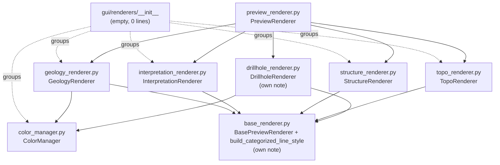

---
tags:
  - secinterp
  - code-walkthrough
  - gui
  - renderers
aliases:
  - gui/renderers/
  - ColorManager
  - GeologyRenderer
  - InterpretationRenderer
  - StructureRenderer
  - TopoRenderer
cssclass: secinterp-note
---

# `gui/renderers/` — Preview renderer family (Present side)

> [!abstract] One-line summary
> Package `gui/renderers/` (6 files): an empty namespace (`__init__.py`, 0 lines) plus five Present-side pieces — `ColorManager` (stable color per unit), `GeologyRenderer`, `InterpretationRenderer`, `StructureRenderer` and `TopoRenderer` — applying QGIS symbology to already-extracted layers; `base_renderer` and `drillhole_renderer` have their own notes and are linked as family.

**Path**: `gui/renderers/` (6 grouped files, 170 lines total)
**Main symbols**: `ColorManager`, `GeologyRenderer`, `InterpretationRenderer`, `StructureRenderer`, `TopoRenderer`
**Layer**: GUI · Present (symbology over `QgsVectorLayer` only; no geological computation)
**Tags**: #secinterp #gui #renderers

---

## 🎯 Why does this package exist?

After the Extract phase (see [[gui_adapters]]) and core computation, the
preview needs memory layers with style: each geological unit in its color,
relief with a hypsometric ramp, structures in red, interpreted polygons
semi-transparent. Without a renderer family, that styling would sprawl across
`preview_renderer.py`:

| Problem | Solution |
|---------|----------|
| Each layer's style mixed with layer creation | One renderer per domain with a single `apply_style(layer, **kwargs)` method |
| Inconsistent colors across preview, legend and sessions | `ColorManager`: same unit name → same `QColor`, always |
| Shared logic (unit-categorized styling) duplicated | `build_categorized_line_style` in [[base_renderer]], reused by geology and drillholes |

> [!important] Architectural note
> **Present** side of Extract-then-Compute. Renderers receive an already
> populated `QgsVectorLayer` and only mutate its symbology (`setRenderer`,
> `setLabeling`). They read no settings, compute no intersections, and launch
> no tasks: the last link before the canvas.

---

## 🧬 Relationship diagram



> [!tip] How to read
> Solid arrow = imports/inherits; dashed = namespace grouping or delegation
> (`PreviewRenderer` picks a renderer per layer). `ColorManager` is the only
> module without a rendering QGIS dependency: just `QColor`.

---

## 📦 Imports — architectural reading

```python
# gui/renderers/__init__.py (complete: empty file, 0 lines)
```

```python
# gui/renderers/color_manager.py
from __future__ import annotations

from typing import ClassVar

from qgis.PyQt.QtGui import QColor
```

```python
# gui/renderers/geology_renderer.py
from __future__ import annotations

from qgis.core import QgsVectorLayer

from sec_interp.gui.renderers.base_renderer import (
    BasePreviewRenderer,
    build_categorized_line_style,
)
from sec_interp.gui.renderers.color_manager import ColorManager
```

```python
# gui/renderers/interpretation_renderer.py
from __future__ import annotations

from qgis.core import (
    QgsCategorizedSymbolRenderer,
    QgsFillSymbol,
    QgsRendererCategory,
    QgsVectorLayer,
)
from qgis.PyQt.QtGui import QColor

from sec_interp.gui.renderers.base_renderer import BasePreviewRenderer
```

```python
# gui/renderers/structure_renderer.py
from __future__ import annotations

from qgis.core import QgsLineSymbol, QgsSingleSymbolRenderer, QgsVectorLayer

from sec_interp.gui.renderers.base_renderer import BasePreviewRenderer
```

```python
# gui/renderers/topo_renderer.py
from __future__ import annotations

from qgis.core import (
    QgsClassificationFixedInterval,
    QgsGraduatedSymbolRenderer,
    QgsLineSymbol,
    QgsStyle,
    QgsVectorLayer,
)

from sec_interp.gui.renderers.base_renderer import BasePreviewRenderer
```

| # | Observation |
|---|-------------|
| ① | Empty `__init__.py` (0 lines): a pure namespace without even a docstring; the package exists only to group. |
| ② | All five modules inherit `BasePreviewRenderer` and implement `apply_style(layer, **kwargs)`: the family contract lives in [[base_renderer]]. |
| ③ | Only `geology_renderer` imports `ColorManager` + `build_categorized_line_style` together: categorized by unit name with stable color. |
| ④ | `interpretation_renderer` alone uses **fill** symbols (`QgsFillSymbol`): it works on polygons, the rest on lines. |
| ⑤ | `topo_renderer` alone touches `QgsStyle.defaultStyle()` (system ramps): it depends on the QGIS profile providing `Spectral` or `RdYlGn`. |
| ⑥ | `structure_renderer` has the smallest import: one plain symbol, no categories or ramps. Complexity proportional to need. |
| ⑦ | `color_manager` imports `QColor` from `qgis.PyQt` (agnostic path), never `PyQt5` directly. |

---

## 🏗️ Structure inventory

**Classes (one per module, plus the sibling's shared helper):**

- `class ColorManager` — 16 fixed colors + `_active_units` cache, 2 methods
- `class GeologyRenderer(BasePreviewRenderer)` — 1 public method + constructor taking `ColorManager`
- `class InterpretationRenderer(BasePreviewRenderer)` — 1 public method, stateless
- `class StructureRenderer(BasePreviewRenderer)` — 1 public method, stateless
- `class TopoRenderer(BasePreviewRenderer)` — 1 public method, stateless
- Full family in [[base_renderer]] (`BasePreviewRenderer`, `build_categorized_line_style`) and [[drillhole_renderer]] (`DrillholeRenderer`, trace/interval roles + labels)

---

## 📁 Files in the package

| File | Lines | Role |
|---|--:|---|
| [[#__init__\|__init__.py]] | 0 | Empty namespace: groups with no code or docstring |
| [[#ColorManager\|color_manager.py]] | 48 | `ColorManager`: palette of 16 + stable color per unit name |
| [[#GeologyRenderer\|geology_renderer.py]] | 29 | Categorized by unit via `ColorManager` |
| [[#InterpretationRenderer\|interpretation_renderer.py]] | 43 | Semi-transparent fill per interpreted polygon |
| [[#StructureRenderer\|structure_renderer.py]] | 18 | Plain red line for dips |
| [[#TopoRenderer\|topo_renderer.py]] | 32 | 8-class hypsometric graduation over `elev` |

> [!note] Siblings with their own notes
> `base_renderer.py` (60 lines: `BasePreviewRenderer` contract +
> `build_categorized_line_style` helper) → [[base_renderer]];
> `drillhole_renderer.py` (71 lines: traces + intervals + labels) →
> [[drillhole_renderer]]. This note honestly covers the 6 grouped files; of
> the siblings it only summarizes the contract they use.

---

## 📖 Module-by-module walkthrough

### `__init__`

An empty file, 0 lines. No imports, no `__all__`, no docstring. It exists
because Python needs the marker to treat `renderers/` as a regular package. A
conscious decision versus the alternative (a namespace without `__init__`):
the repo keeps regular packages across the GUI layer.

### `ColorManager`

```python
class ColorManager:
    """Manages consistent color assignment for geological units."""

    GEOLOGY_COLORS: ClassVar[list[QColor]] = [
        QColor(231, 76, 60),  # Red
        QColor(52, 152, 219),  # Blue
        QColor(46, 204, 113),  # Green
        ...  # 16 entries total
    ]

    def __init__(self) -> None:
        """Initialize the color manager."""
        self._active_units: dict[str, QColor] = {}
```

```python
def get_color(self, name: str) -> QColor:
    """Get a consistent color for a geological unit."""
    if not name:
        return QColor(100, 100, 100)

    if name in self._active_units:
        return self._active_units[name]

    hash_val = sum(ord(c) for c in str(name))
    index = hash_val % len(self.GEOLOGY_COLORS)
    color = self.GEOLOGY_COLORS[index]
    self._active_units[name] = color
    return color
```

| Aspect | Detail |
|--------|--------|
| Palette | 16 fixed `QColor` (red, blue, green, purple, yellow, orange, turquoise, …) declared as `ClassVar`: shared, not per instance |
| Stability | Deterministic hash `sum(ord(c)) % 16`: a unit always lands on the same index, in any session |
| Cache | `_active_units` memoizes assignments: the second call is O(1) and returns the **same** object |
| Guard | Empty name → neutral grey `QColor(100, 100, 100)` without touching the cache |

> [!warning] Collisions by design
> With 16 colors and more than 16 units, two units share a color (same
> `hash % 16`). Fine for preview/legend but not for final cartography: the
> [[drillhole_renderer]] note documents the same trade-off for intervals.

### `GeologyRenderer`

```python
class GeologyRenderer(BasePreviewRenderer):
    """Renderer for geological units in section."""

    def __init__(self, color_manager: ColorManager) -> None:
        self.color_manager = color_manager

    def apply_style(self, layer: QgsVectorLayer, **kwargs) -> None:
        """Apply categorized styling based on unit names."""
        unique_units = kwargs.get("unique_units", set())
        layer.setRenderer(build_categorized_line_style(self.color_manager, unique_units))
```

The thinnest renderer: it delegates everything to
`build_categorized_line_style` (see [[base_renderer]]), which builds a
`QgsCategorizedSymbolRenderer` over the `unit` field with 0.7 round-capped
lines. The `ColorManager` is injected by constructor (not created inside):
tests and `PreviewRenderer` can share one instance and keep colors consistent
across layers.

### `InterpretationRenderer`

```python
def apply_style(self, layer: QgsVectorLayer, **kwargs) -> None:
    interp_data = kwargs.get("interp_data", [])
    categories = []

    for interp in interp_data:
        hex_color = interp.color if interp.color else "#FF0000"
        color = QColor(hex_color)

        fill_color = QColor(hex_color)
        fill_color.setAlpha(180)

        symbol = QgsFillSymbol.createSimple(
            {
                "color": hex_color,
                "alpha": "0.7",  # 70% opacity
                "outline_color": f"{color.darker(160).red()},{color.darker(160).green()},{color.darker(160).blue()}",
                "outline_width": "0.5",
            }
        )
        categories.append(QgsRendererCategory(interp.id, symbol, interp.name))

    layer.setRenderer(QgsCategorizedSymbolRenderer("id", categories))
```

| Aspect | Detail |
|--------|--------|
| Input | `interp_data`: objects with `.id`, `.name`, `.color` (domain interpretation polygons) |
| Color | Each interpretation's own color is honoured (`interp.color`); `#FF0000` fallback |
| Fill | `alpha 0.7` + `setAlpha(180)`: semi-transparent so underlying geology shows through |
| Outline | Same hue darkened (`darker(160)`), 0.5 pt: polygons stand out without covering |
| Key | Categorized by the `id` field, labelled `interp.name` |

### `StructureRenderer`

```python
def apply_style(self, layer: QgsVectorLayer, **kwargs) -> None:
    """Apply a simple red line style for structural dips."""
    symbol = QgsLineSymbol.createSimple(
        {"color": "204,0,0", "width": "0.5", "capstyle": "round"}
    )
    layer.setRenderer(QgsSingleSymbolRenderer(symbol))
```

The smallest module (18 lines): a single red symbol (`204,0,0`), 0.5 pt,
round caps, applied to the whole layer (`QgsSingleSymbolRenderer`, no
categories). Dips are told apart by geometry (projection strokes), not color:
the style needs to know nothing about the data.

### `TopoRenderer`

```python
def apply_style(self, layer: QgsVectorLayer, **kwargs) -> None:
    """Apply polychromatic elevation styling."""
    renderer = QgsGraduatedSymbolRenderer("elev")
    renderer.setSourceSymbol(QgsLineSymbol.createSimple({"width": "0.8", "capstyle": "round"}))

    style = QgsStyle.defaultStyle()
    color_ramp = style.colorRamp("Spectral") or style.colorRamp("RdYlGn")
    if color_ramp:
        renderer.updateColorRamp(color_ramp)

    renderer.setClassificationMethod(QgsClassificationFixedInterval())
    renderer.updateClasses(layer, 8)
    layer.setRenderer(renderer)
```

| Aspect | Detail |
|--------|--------|
| Field | Graduated over `elev`: the profile layer must expose that column |
| Ramp | `Spectral`, falling back to `RdYlGn`; when neither exists the source symbol stays (`if color_ramp` guard) |
| Classes | 8 fixed intervals (`QgsClassificationFixedInterval` + `updateClasses(layer, 8)`): readable hypsometry with no tuning |
| Stroke | 0.8 pt line, slightly heavier than geology (0.7) and structures (0.5): visual hierarchy |

---

## 🧩 Family contract (with the siblings)

All renderers honour `BasePreviewRenderer.apply_style(layer, **kwargs)`:

| Renderer | `kwargs` it reads | QGIS strategy | Note |
|----------|-------------------|---------------|------|
| `GeologyRenderer` | `unique_units: set` | Categorized by `unit` | This note |
| `DrillholeRenderer` | `role`, `unique_units` | Single (trace) / categorized (interval) + labels | [[drillhole_renderer]] |
| `InterpretationRenderer` | `interp_data: list` | Categorized by `id` with fill | This note |
| `StructureRenderer` | none | Single symbol | This note |
| `TopoRenderer` | none | Graduated by `elev` | This note |

---

## 🔄 Data flow

| Phase | Input | Transformation | Output |
|-------|-------|----------------|--------|
| Selection | Memory layer + domain type | `PreviewRenderer` picks a renderer | Concrete renderer |
| Styling | `QgsVectorLayer` + `kwargs` (`unique_units`, `interp_data`) | `apply_style` builds symbols | `layer.setRenderer(...)` |
| Color | Unit name | `ColorManager.get_color` (hash + cache) | Stable `QColor` |
| Canvas | Layers with renderer | Preview refresh | Colored section + legend |

---

## 🏛️ Design patterns present

| Pattern | Where | Purpose |
|---------|-------|---------|
| **Template Method** | `BasePreviewRenderer.apply_style` (abstract) | Fix the family's extension point |
| **Strategy** | One renderer per domain | `PreviewRenderer` delegates with no chained style `if`s |
| **Flyweight / cache** | `ColorManager._active_units` | One `QColor` per unit, shared across layers |
| **Dependency Injection** | `GeologyRenderer(color_manager)` | Consistent, testable color |
| **Guard with fallback** | `Spectral or RdYlGn`, `"#FF0000"`, grey `100,100,100` | Graceful degradation on missing resources |

---

## 🧾 API summary

| Symbol | Signature / Inherits | Typical use |
|--------|----------------------|-------------|
| `ColorManager` | `get_color(name: str) -> QColor` | Instance shared across renderers and legend |
| `ColorManager.GEOLOGY_COLORS` | `ClassVar[list[QColor]]` (16) | Fixed plugin palette |
| `GeologyRenderer(color_manager)` | `BasePreviewRenderer` | `apply_style(layer, unique_units={...})` |
| `InterpretationRenderer()` | `BasePreviewRenderer` | `apply_style(layer, interp_data=[...])` |
| `StructureRenderer()` | `BasePreviewRenderer` | `apply_style(layer)` |
| `TopoRenderer()` | `BasePreviewRenderer` | `apply_style(layer)` over a layer with an `elev` field |

---

## 🛡️ Error handling

Renderers **neither raise nor catch**: they style on a best-effort basis.

| Situation | Behaviour |
|-----------|-----------|
| Empty/missing `unique_units` | Empty categorized renderer: layer valid but uncategorized |
| Empty `interp_data` | `QgsCategorizedSymbolRenderer("id", [])`: no categories, no failure |
| No `Spectral` or `RdYlGn` ramp | Source symbol kept (`if color_ramp`); profile renders single-color |
| Missing `interp.color` | `#FF0000` fallback |
| Empty unit name | Grey `100,100,100` from `ColorManager` |

---

## 🧪 Associated tests

Real coverage in `tests/gui/renderers/test_renderers.py` (Mock-first, no QGIS):

- `TestDrillholeRenderer.test_apply_trace_style` — verifies `setRenderer` + `setLabeling` + `setLabelsEnabled(True)` with a mocked layer.
- `TestDrillholeRenderer.test_apply_interval_style` — verifies `setRenderer` and one `get_color` call per unit (`{"LithA", "LithB"}` → 2 calls).
- `TestTopoRenderer.test_apply_style` — verifies `setRenderer` with a mocked layer.

| Module in this note | Coverage | Evidence |
|---------------------|----------|----------|
| `TopoRenderer` | Direct | `TestTopoRenderer` in `test_renderers.py` |
| `ColorManager` | Indirect (double with `spec`) | `MagicMock(spec=ColorManager)` pins the interface used by `DrillholeRenderer` |
| `GeologyRenderer` | Via shared helper | Uses `build_categorized_line_style`, the same path the interval test exercises |
| `InterpretationRenderer` | No dedicated test | Risk recorded below |
| `StructureRenderer` | No dedicated test | Static single symbol; low regression cost |

---

## 🌐 i18n and migration notes

- No renderer holds user-visible strings: legend labels come from data
  (`interp.name`, unit name). Nothing to translate here.
- All Qt imports go through `qgis.PyQt` (`QColor`) or `qgis.core`:
  Qt5/Qt6- and QGIS 4.x-agnostic.
- `QgsStyle.defaultStyle()` depends on the user's QGIS profile: if a custom
  profile drops both `Spectral` and `RdYlGn`, topo falls back to the source
  symbol (degraded but valid behaviour).

---

## 👀 Observations and notes

> [!success] Strengths
> - One method per renderer: the simplest possible family honouring the base contract.
> - Deterministic + cached `ColorManager`: same color in preview, legend, and sessions.
> - Fallbacks on every optional input: no renderer breaks on empty data.
> - Minimal imports per module: each renderer only knows the QGIS classes it uses.

> [!warning] Points of attention
> - `InterpretationRenderer` and `StructureRenderer` have no dedicated test: a QGIS signature change would break them silently until manual testing.
> - Color collision past 16 units (hash modulo 16): documented, but the user gets no warning.
> - `updateClasses(layer, 8)` on an empty layer may yield 0 classes: topo appears unstyled until data exists.
> - Docstring-less `__init__.py`: the only GUI package without a documented contract (contrast [[gui_adapters]] and [[gui_services]]).

> [!question] Open questions
> - Add `apply_style` tests for geology/interpretation/structures following the `test_renderers.py` pattern?
> - Expose the `ColorManager` palette in settings for cartography beyond 16 units?

---

## 🔗 Related notes

- [[Index]] — vault index
- [[base_renderer]] — `BasePreviewRenderer` contract + `build_categorized_line_style`
- [[drillhole_renderer]] — traces, intervals and labels (sibling with own note)
- [[preview_renderer]] — `PreviewRenderer`, which picks each renderer
- [[preview_legend_renderer]] — legend reusing the same colors
- [[gui]] — root-package facade re-exporting `PreviewRenderer`
- [[gui_adapters]] — Extract phase producing the layers to style
- [[controller]] — orchestrator whose output is presented here

---

*Note of the SecInterp Code Walkthrough v2 vault — v3.8.0*
