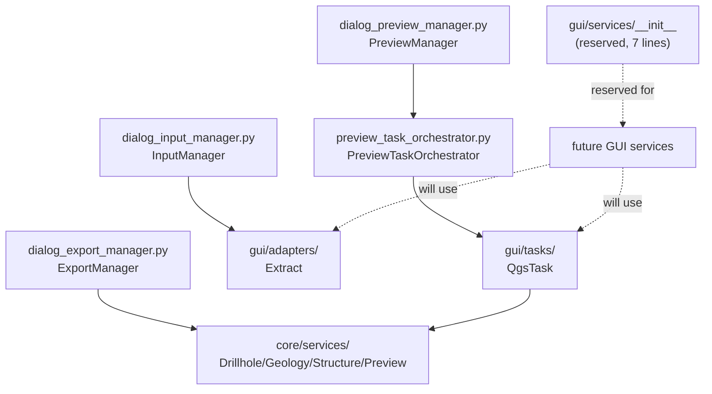

---
tags:
  - secinterp
  - code-walkthrough
  - gui
  - services
aliases:
  - gui/services/
cssclass: secinterp-note
---

# `gui/services/` — Namespace reserved for GUI services

> [!abstract] One-line summary
> Package `gui/services/` (1 file): a currently empty namespace whose 7-line `__init__.py` states the package intent (GUI services with UI components, e.g. parallel processing with QThreads) while real orchestration lives today in the `dialog_*_manager` modules, the `PreviewTaskOrchestrator` and `core/services`; this note documents the role, the conventions, and the contract any future service must honour.

**Path**: `gui/services/` (namespace; 1 grouped file, 7 lines, zero symbols)
**Main symbols**: none (package with no executable code)
**Layer**: GUI · Services (reserved; effective orchestration in managers + `core/`)
**Tags**: #secinterp #gui #services

---

## 🎯 Why does this package exist?

The plugin distinguishes three kinds of GUI-side logic: dialog managers,
extractors, and **services** (stateful orchestration, parallelism, UI caches).
The directory reserves the home of that third kind before any code needs it:

| Problem | Solution |
|---------|----------|
| Stateful orchestration (preview, export, tasks) needs a home apart from dialog managers | `gui/services/` reserved as a namespace with documented intent |
| A future service should not rediscover GUI-layer rules | `__init__.py` states the scope: "services interacting with UI components, such as parallel processing using QThreads" |
| Creating the directory on demand would break imports and packaging | It already exists as an importable regular package (albeit empty) |

> [!important] Architectural note
> A **reserved namespace, not a facade**: it re-exports nothing because there
> is nothing to export. Its value today is documentary (intent + conventions)
> and structural (the `sec_interp.gui.services` path is already importable).
> Real GUI orchestration is mapped below at its true locations.

---

## 🧬 Relationship diagram



> [!tip] How to read
> Solid arrow = real delegation today; dashed = reserved intent. The namespace
> takes part in no current flow: the diagram shows where effective
> orchestration lives so a future service reuses it.

---

## 📦 Imports — architectural reading

```python
# gui/services/__init__.py (complete: 7 lines)
from __future__ import annotations

"""GUI-specific services for SecInterp.

This package contains services that interact with UI components,
such as parallel processing using QThreads.
"""
```

| # | Observation |
|---|-------------|
| ① | `from __future__ import annotations` as the first statement: repo-wide convention, even in files without annotations (uniformity for `ruff`). |
| ② | The documentation literal comes **after** the `__future__` import (syntactically mandatory), so technically it is not the package `__doc__` but an effect-free literal expression; its value for the reader is documentary all the same. |
| ③ | Zero imports of `qgis`, Qt, or `core`: the namespace loads nothing and cannot create import cycles. |
| ④ | The "parallel processing using QThreads" mention sets the expectation: services in this package will orchestrate UI-side concurrency, not geological computation (which lives in `core/services/`). |
| ⑤ | No `__all__`, no symbols, no side effects: importing `sec_interp.gui.services` is harmless in any context, including tests with mocked QGIS. |

---

## 🏗️ Structure inventory

**File grouped in this note:**

- `__init__.py` — 7 lines: `__future__` import + intent literal, no symbols

**Where GUI orchestration lives today (with its own note):**

| Responsibility | Real location | Note |
|----------------|---------------|------|
| Dialog input reading and validation | `gui/dialog_input_manager.py` (`InputManager`) | [[dialog_input_manager]] |
| Preview, canvas and reports | `gui/dialog_preview_manager.py` (`PreviewManager`) + `preview_reporter.py` | [[dialog_preview_manager]] |
| Export (DXF, shapefile, 3D) | `gui/dialog_export_manager.py` (`ExportManager`) | [[dialog_export_manager]] |
| Background `QgsTask` launching | `gui/preview_task_orchestrator.py` (`PreviewTaskOrchestrator`) | [[preview_task_orchestrator]] |
| Reusable pure computation | `core/services/*.py` | [[drillhole_service]], [[geology_service]] |

---

## 📁 Files in the package

| File | Lines | Role |
|---|--:|---|
| [[#__init__\|__init__.py]] | 7 | Reserved namespace: states the intent (GUI services + QThreads), no symbols |

---

## 📖 Walkthrough: the namespace and its intent

### `__init__`

```python
from __future__ import annotations

"""GUI-specific services for SecInterp.

This package contains services that interact with UI components,
such as parallel processing using QThreads.
"""
```

The whole file is these 7 lines. Its honest reading has three levels:

**Level 1 — what it says.** The package will hold GUI services: stateful or
lifecycle objects interacting with UI components (unlike stateless
extractors, and unlike purely presentational renderers). The canonical example
is parallel processing with QThreads.

**Level 2 — what it implies.** "Interact with UI components" draws the
boundary with `core/services/`: a service in this package **may** know
widgets, canvas and `QgsTask`; a core service **never** may. Mentioning
QThreads (not `QgsTask`) suggests fine-grained Qt threads for UI work,
complementing the heavy tasks [[preview_task_orchestrator]] already manages.

**Level 3 — what is missing.** There is no criterion for when to promote a
manager to a service (size? reuse across dialogs? own state?). That gap is
covered below in "Contract for future services" so the first real service is
born with rules instead of improvising them.

| Verified property | Evidence |
|-------------------|----------|
| Importable, empty package | `__init__.py` exists; no module imports it today (search across `gui/`, `core/`, `tests/`, `exporters/` finds no `gui.services` references) |
| No QGIS load | Zero imports beyond `__future__` |
| No public surface | No `__all__`, no classes/functions |

---

## 🧩 Where GUI orchestration lives today

Until the namespace is populated, these are the pieces a future service must
reuse instead of reimplementing:

| Piece | What it orchestrates | Why it is not a "service" yet |
|-------|----------------------|-------------------------------|
| `InputManager` | Reads pages (`Pages`), validates, produces parameters | Tied to the dialog lifecycle |
| `PreviewManager` | Canvas, memory layers, legend, reports | Delegates style to [[gui_renderers]] and background to the orchestrator |
| `ExportManager` | DXF/shapefile/3D pipelines into `exporters/` | One-shot per-format orchestration, no own state |
| `PreviewTaskOrchestrator` | `DrillholeGenerationTask` + `GeologyGenerationTask` | Owns the launch → progress → `finished()` cycle |
| `core/services/*` | Thread-safe pure computation | Forbidden from touching UI: cannot move up to this layer |

> [!note] Natural migration candidates
> If `PreviewTaskOrchestrator` grows (retries, queues, priorities) or Qt-thread
> parallel processing materializes, that code belongs in `gui/services/` with
> its own note, and this note graduates from "reserved" to "package index".

---

## 🔬 X-ray of the current orchestrator (what a service will reuse)

`gui/preview_task_orchestrator.py` is today's closest thing to a GUI service.
Its verified header shows the wiring any future service should imitate:

```python
# gui/preview_task_orchestrator.py (verified header)
"""Orchestrator for background preview generation tasks."""

from __future__ import annotations

from typing import TYPE_CHECKING, Any

from qgis.core import QgsApplication

from sec_interp.gui.adapters.layer_resolver import resolve_layer
from sec_interp.logger_config import get_logger

logger = get_logger(__name__)

from .tasks.drillhole_task import DrillholeGenerationTask  # noqa: E402
from .tasks.geology_task import GeologyGenerationTask  # noqa: E402

if TYPE_CHECKING:
    from .dialog_preview_manager import PreviewManager


class PreviewTaskOrchestrator:
    """Manages asynchronous geology and drillhole generation tasks."""

    def __init__(self, manager: PreviewManager) -> None:
        ...
```

| # | Observation |
|---|-------------|
| ① | Imports the Extract (`resolve_layer`) and the tasks (`tasks.*`), but **not** core services directly: it respects the layers. |
| ② | `PreviewManager` only under `TYPE_CHECKING`: the orchestrator receives the manager with no runtime coupling (the same trick as `Pages` with `Any`). |
| ③ | Per-module logger (`get_logger(__name__)`): a convention any new service inherits. |
| ④ | Task imports placed after the logger with `noqa: E402`: documented pragmatic ordering, not sloppiness. |

| Orchestrator decision | Lesson for `gui/services/` |
|-----------------------|----------------------------|
| Receives the manager, never looks it up | Constructor injection, like `Pages` |
| Knows tasks + extractors, not widgets | A service orchestrates data; managers touch the UI |
| One class, one responsibility (launch and track tasks) | Reference size: past ~200 lines, split the service |

---

## 🔁 Proposed lifecycle of a future service

| Phase | What happens | Present-day analogue |
|-------|--------------|----------------------|
| Construction | The composition-root (`main_dialog.py`) creates it with `Pages`/managers | `pages = Pages(...)` in [[gui]] |
| Injection | Receives collaborators by constructor, never via the global `QgsProject` except `LayerResolver` | `PreviewTaskOrchestrator(manager)`, `DrillholeExtractor(data_fetcher)` |
| Execution | Delegates computation to `core/` with DTOs; background via `QgsTask`/QThread | [[gui_tasks]] with `feedback=self` |
| Result | Emits Qt signals or returns DTOs; the manager presents | `finished_with_results` in today's tasks |
| Cleanup | Disconnects signals and frees threads when the dialog closes | `disconnect_signals()` required by `gui/AGENTS.md` |

---

## 🧭 Compass: which logic goes where (GUI side)

| Logic | Correct home | Why not in `services/` (today) / why yes (future) |
|-------|--------------|-----------------------------------------------------|
| Read widgets and validate inputs | `dialog_input_manager.py` | Dialog-coupled; promote to a service only if another dialog reuses it |
| Create memory layers and axes | `preview_layer_factory.py`, `preview_axes_manager.py` | Stateless factories: need no service lifecycle |
| Read QGIS layers → DTOs | `adapters/` | Stateless and UI-free: adapters, not services |
| Paint layers | `renderers/` + `preview_renderer.py` | Pure single-method presentation |
| Launch and track `QgsTask` | `preview_task_orchestrator.py` | Enough as an orchestrator today; moves here with queues/retries |
| Fine-grained UI QThreads | `gui/services/` (future) | The package docstring's literal use case |
| Preview cache with keys | Future service over `preview_param_hasher.py` | State + invalidation: calls for a lifecycle service |
| Dialog lifecycle (open/close, signals) | `dialog_lifecycle_mixin.py`, `dialog_signal_manager.py` | Mixin-scoped by design; a service takes over only with cross-dialog state |

---

## 📏 Contract for future services

Rules any new module under `gui/services/` must honour:

| Rule | Rationale |
|------|-----------|
| May import `qgis.*`, `qgis.PyQt` and widgets; never a `core/` that imports GUI | The Core/GUI boundary is one-way (see `test_architecture_boundary.py`) |
| Takes DTOs/primitives from `adapters/`, never live layers in threads | Live QGIS objects in background = crash (see `gui/AGENTS.md` and [[gui_tasks]]) |
| Operations over 100 ms go to `QgsTask`/QThread with progress and cancellation | GUI-layer norm; the service orchestrates, the thread executes |
| Domain errors as `SecInterpError` exceptions; user messages only via managers | `iface.messageBar()` forbidden outside `gui/`, and only in message mixins |
| Visible strings with `QCoreApplication.translate` | Layer i18n convention (see [[gui_adapters]]) |
| Own vault note + link from this note's table | Vault traceability (this note is its index) |
| Review checklist | Each rule must be ticked with the line or test honouring it, like extractors in [[gui_adapters]] |

---

## 🔄 Data flow

| Phase | Input | Transformation | Output |
|-------|-------|----------------|--------|
| Reserve (today) | — | The namespace exists without joining any flow | Importable path |
| Orchestration (today) | Validated parameters | Managers → extractors → `core/` → renderers | Preview / export |
| Background (today) | Extracted DTOs | `QgsTask` + pure services | Results via signals |
| Future service | UI state + DTOs | Lifecycle logic under this namespace | Signals toward managers |

---

## 🏛️ Design patterns present

| Pattern | Where | Purpose |
|---------|-------|---------|
| **Reserved namespace** | `__init__.py` | State architectural intent before code |
| **Composition Root** (in dialog today) | `main_dialog.py` + `Pages` | Future services inject the same way (see [[gui]]) |
| **Orchestrator** (migration candidate) | `PreviewTaskOrchestrator` | Background-task lifecycle |
| **Manager** (thinning candidates) | `InputManager`, `PreviewManager`, `ExportManager` | Logic that could outgrow the dialog |

---

## 🧾 API summary

| Symbol | Signature / Inherits | Typical use |
|--------|----------------------|-------------|
| *(none)* | — | The package exposes no API; the table documents that absence honestly |
| `InputManager` | dialog manager | Input reading (see [[dialog_input_manager]]) |
| `PreviewManager` | dialog manager | Preview and reports (see [[dialog_preview_manager]]) |
| `ExportManager` | dialog manager | Exports (see [[dialog_export_manager]]) |
| `PreviewTaskOrchestrator` | `QgsTask` orchestrator | Background with DTOs (see [[preview_task_orchestrator]]) |

---

## 🛡️ Error handling

The namespace runs no code: it handles no errors. Rules for future services
derive from the layer:

- Propagate domain exceptions (`SecInterpError` and subtypes) instead of
  converting them into return codes; managers translate them into messages.
- Cooperative cancellation via `isCanceled()` in threads, never control-flow
  exceptions (the [[gui_tasks]] pattern and core `feedback`).
- No per-service `QgsMessageLog`: use `logger_config.get_logger(__name__)`
  like the rest of the GUI layer.

---

## 🧪 Associated tests

No code means no package tests; effective orchestration is covered in
`tests/gui/`:

- `tests/gui/test_preview_task_orchestrator.py` — the orchestrator consumes a
  mocked extractor (`extract_context`) and launches tasks: today's closest
  GUI-side equivalent of a "service" test.
- `tests/gui/test_dialog_input_manager.py` — `InputManager` with mocked
  `Pages` (input orchestration without the real dialog).
- `tests/gui/test_dialog_preview_manager.py` — preview with mocked
  dependencies.
- `tests/gui/test_dialog_export_manager.py` — export pipelines.

| Test in `tests/gui/` | Orchestration covered | Pattern reusable by future services |
|----------------------|-----------------------|-------------------------------------|
| `test_preview_task_orchestrator.py` | Mocked extractor → tasks | Mock the Extract (`extract_context`), verify wiring |
| `test_dialog_input_manager.py` | Mocked `Pages` → parameters | Inject narrow dependencies instead of the dialog |
| `test_dialog_preview_manager.py` | Preview with doubles | Isolate canvas and layers with mocks |
| `test_dialog_export_manager.py` | Export per format | One test per output pipeline |

| Expectation | Status |
|-------------|--------|
| Test for `gui/services/__init__.py` | Unneeded: no symbols to exercise |
| Tests for future services | Must follow the `tests/gui/` Mock-first pattern (see qa-docker skill) |

---

## 🌐 i18n and migration notes

- The namespace holds no strings: nothing to translate today.
- Any future service with visible text must use
  `QCoreApplication.translate` (convention verified in [[gui_adapters]]).
- Future imports from `qgis.PyQt` (agnostic), never `PyQt5` directly: a
  QGIS 4.x requirement (see qgis-migration-4x skill).
- Thread progress messages (`setProgress`, `%`) are visible strings too: they
  must go through `translate` like errors.

---

## 👀 Observations and notes

> [!success] Strengths
> - Explicit reserve with documented intent: better than a surprise directory or orphaned logic in managers.
> - Zero cost: no imports, no cycles, no QGIS load on import.
> - The QThreads mention steers future design (fine-grained UI threads vs. heavy `QgsTask`).

> [!warning] Points of attention
> - Ghost-package risk: if nothing populates it for several phases, re-evaluate whether orchestration in managers is enough.
> - A periodic review (one line in each phase-close note) is enough to catch the ghost-package drift early.
> - The literal after the `__future__` import is not a formal `__doc__`: tools reading `package.__doc__` see `None`.
> - No manager → service extraction criterion: the first refactor may happen in the wrong place.

> [!question] Open questions
> - Migrate `PreviewTaskOrchestrator` to `gui/services/` once it needs retries or queues?
> - Would a preview-cache service (keyed at `preview_param_hasher.py`) be the first natural inhabitant?
> - Should the reservation carry an expiry (e.g. re-evaluate at Phase 3 close) so it never becomes permanent scaffolding?

---

## 🔗 Related notes

- [[Index]] — vault index
- [[gui]] — root package and composition with `Pages`
- [[main_dialog]] — dialog composing managers and orchestrator today
- [[dialog_input_manager]] — input orchestration (service candidate)
- [[dialog_preview_manager]] — preview orchestration
- [[dialog_export_manager]] — export orchestration
- [[preview_task_orchestrator]] — background orchestrator (migration candidate here)
- [[preview_renderer]] — native rendering consumed by managers
- [[controller]] — domain orchestrator in the core
- [[drillhole_service]] / [[geology_service]] — pure computation callable from future services
- [[gui_adapters]] — Extract feeding future services
- [[gui_tasks]] — tasks future services will orchestrate

---

*Note of the SecInterp Code Walkthrough v2 vault — v3.9.0*
