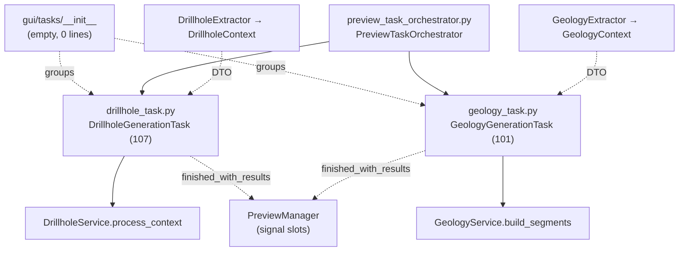

---
tags:
  - secinterp
  - code-walkthrough
  - gui
  - tasks
aliases:
  - gui/tasks/
  - DrillholeGenerationTask
  - GeologyGenerationTask
cssclass: secinterp-note
---

# `gui/tasks/` — Background `QgsTask` tasks (DTOs, never live QGIS)

> [!abstract] One-line summary
> Package `gui/tasks/` (1 file): an empty namespace (`__init__.py`, 0 lines) whose role is grouping the two background tasks with their own notes — `DrillholeGenerationTask` and `GeologyGenerationTask` — which run the core's pure services on `QgsTask` threads taking only detached DTOs and returning results via Qt signals; this note documents the namespace, the shared contract of both tasks, and their thread safety.

**Path**: `gui/tasks/` (namespace; 1 grouped file, 0 lines + 2 sibling tasks: 107 + 101 lines)
**Main symbols**: none in `__init__`; `DrillholeGenerationTask`, `GeologyGenerationTask` in the siblings
**Layer**: GUI · Background (cancelable `QgsTask`; computation delegated to `core/`)
**Tags**: #secinterp #gui #tasks

---

## 🎯 Why does this package exist?

Interpolating a section (geological intersections, drillhole projection)
exceeds the 100 ms threshold `gui/AGENTS.md` sets: doing it on the main thread
would freeze QGIS. But Qt threads must not touch live QGIS objects. The
package resolves both tensions at once:

| Problem | Solution |
|---------|----------|
| Heavy computation blocks the UI | Two cancelable `QgsTask` (`drillhole_task.py`, `geology_task.py`) run in the background |
| `QgsTask.run()` with live layers/features = crash | Tasks take **only DTOs** (`DrillholeContext`, `GeologyContext`) produced by [[gui_adapters]] |
| The core must not know Qt or threads | The service receives the task as `feedback` (`isCanceled`/`setProgress` by duck typing) |
| Results must return to the main thread | `finished_with_results` / `error_occurred` / `progress_changed` signals + `finished()` with deferred emission |

> [!important] Architectural note
> Tasks are the **only code allowed to live on a thread** and, at the same
> time, the code with the **most restrictions**: `run()` talks only to the
> pure service; `finished()` talks only to the UI. Everything visual and
> everything live-QGIS happens before (Extract) or after (Present) the task,
> never inside it.

---

## 🧬 Relationship diagram



> [!tip] How to read
> Solid arrow = creates/invokes; dashed = delivers DTOs or emits signals. Core
> services never know a thread calls them: they only see a `feedback` with
> `isCanceled` and `setProgress`.

---

## 📦 Imports — architectural reading

```python
# gui/tasks/__init__.py (complete: empty file, 0 lines)
```

```python
# gui/tasks/drillhole_task.py (header)
from __future__ import annotations

from typing import TYPE_CHECKING, Any

from qgis.core import Qgis, QgsMessageLog, QgsTask
from qgis.PyQt.QtCore import QTimer, pyqtSignal

from sec_interp.core.domain import DrillholeContext
from sec_interp.logger_config import get_logger

if TYPE_CHECKING:
    from sec_interp.core.services.drillhole_service import DrillholeService
```

```python
# gui/tasks/geology_task.py (header)
from __future__ import annotations

from typing import TYPE_CHECKING, Any

from qgis.core import Qgis, QgsMessageLog, QgsTask
from qgis.PyQt.QtCore import QTimer, pyqtSignal

from sec_interp.core.domain import GeologyContext, GeologyData
from sec_interp.logger_config import get_logger

if TYPE_CHECKING:
    from sec_interp.core.services.geology_service import GeologyService
```

| # | Observation |
|---|-------------|
| ① | Empty `__init__.py` as in [[gui_renderers]]: the package groups, it does not publish API (tasks are imported by path: `from .tasks.drillhole_task import …`, verified in the orchestrator). |
| ② | Both headers are **identical except the domain** (`DrillholeContext` vs `GeologyContext`/`GeologyData`): the tasks are twins by design, not by accidental copying. |
| ③ | The service is imported only under `TYPE_CHECKING` and typed in the constructor: at runtime the task accepts any object with `process_context`/`build_segments` (mockable without importing the core). |
| ④ | `QTimer` + `pyqtSignal` are the only Qt imports: signals and event-loop deferral, no widgets. |
| ⑤ | `Qgis` + `QgsMessageLog` are used only in the `finished()` error branch: the happy path logs via `logger_config`. |
| ⑥ | `QgsTask.Flag.CanCancel` (verified in both `__init__`s): cancellation is part of the contract, not an add-on. |

---

## 🏗️ Structure inventory

**File grouped in this note:**

- `__init__.py` — 0 lines: empty namespace with no symbols

**Sibling tasks (with their own notes; shared contract summarized here):**

| Module | Lines | Class | Service invoked | Result |
|--------|------:|-------|-----------------|--------|
| `drillhole_task.py` | 107 | `DrillholeGenerationTask` | `DrillholeService.process_context` | `(geol_data, drillhole_data)` tuple |
| `geology_task.py` | 101 | `GeologyGenerationTask` | `GeologyService.build_segments` | `GeologyData` (segment list) |

---

## 📁 Files in the package

| File | Lines | Role |
|---|--:|---|
| [[#__init__\|__init__.py]] | 0 | Empty namespace: groups both tasks with no code or docstring |

> [!note] Siblings with their own notes
> [[drillhole_task]] (`DrillholeGenerationTask`, 107 lines) and
> [[geology_task]] (`GeologyGenerationTask`, 101 lines). This note honestly
> covers the single grouped file and summarizes the **shared contract** of
> both tasks without duplicating their notes.

---

## 📖 Walkthrough: the namespace and the shared contract

### `__init__`

An empty file, 0 lines: no imports, no `__all__`, no docstring. Like the
[[gui_renderers]] namespace and unlike [[gui_adapters]] (which documents its
contract) and [[gui_services]] (which states intent): here the contract lives
in the twin tasks themselves, and the `__init__` is a pure regular-package
marker.

### Shared contract: signals

Both tasks declare exactly the same three class signals:

```python
# Identical signals in DrillholeGenerationTask and GeologyGenerationTask
finished_with_results = pyqtSignal(object)
error_occurred = pyqtSignal(str)
progress_changed = pyqtSignal(float)
```

| Signal | When emitted | Who listens |
|--------|--------------|-------------|
| `finished_with_results` | `finished()` on success, deferred via `QTimer.singleShot(0, …)` | `PreviewManager` slots via [[preview_task_orchestrator]] |
| `error_occurred` | `finished()` with `self.exception` set | Error UI (`show_user_message`) |
| `progress_changed` | `setProgress()` called by the service via `feedback` | Dialog progress bar |

### Shared contract: constructor

```python
def __init__(
    self,
    description: str,
    context,      # DrillholeContext | GeologyContext (detached DTO)
    service,      # DrillholeService | GeologyService (TYPE_CHECKING only)
    params: Any,  # original params (backward compatibility)
) -> None:
    super().__init__(description, QgsTask.Flag.CanCancel)
    self.service = service
    self.context = context
    self.params = params
    self.result = None       # (geol, holes) | GeologyData, per task
    self.exception: Exception | None = None
```

| Parameter | Role |
|-----------|------|
| `description` | Name visible in the QGIS task manager |
| `context` | The already-extracted DTO: the only thing crossing into the thread |
| `service` | Stateless pure logic; mockable by duck typing |
| `params` | Original context for compatibility (unused in `run()`) |

### Shared contract: `run()` (background thread)

```python
# drillhole_task.py
self.result = self.service.process_context(self.context, feedback=self)
# geology_task.py
self.result = self.service.build_segments(self.context, feedback=self)
```

- `run()` makes **one single call** into the service, passing itself as
  `feedback`: the core reports progress (`setProgress`) and polls
  cancellation (`isCanceled`) without importing Qt (see [[controller]] and services).
- Success → `return True`; any exception → stored in `self.exception`,
  logged with `exc_info=True`, `return False`.
- The drillhole task logs `len(self.result[1])` (hole count); the geology
  one logs `len(self.result)` (segment count).

### Shared contract: `finished()` (main thread)

```python
def finished(self, is_successful: bool) -> None:
    if is_successful:
        if self.result is None:
            self.result = ([], [])   # drillholes | [] geology
        QTimer.singleShot(0, lambda: self.finished_with_results.emit(self.result))
    elif self.exception:
        QgsMessageLog.logMessage(f"... Task Failed: {error_msg}",  # no-i18n: developer log tag
                                 "SecInterp", Qgis.MessageLevel.Critical)
        self.error_occurred.emit(error_msg)
```

| Detail | Purpose |
|--------|---------|
| Normalize `None` → `([], [])` / `[]` | Slots always receive an iterable structure, never `None` |
| `QTimer.singleShot(0, …)` | Deferred emission to the next event-loop cycle: avoids races with the geology render (comment verified in the source) |
| `QgsMessageLog` + `no-i18n` tag | Failure logging is for developers (untranslatable); user text is composed by the slot |
| `try/except` around everything | `finished()` must never raise: an error here would be silent in the task manager |

### Shared contract: `setProgress()`

```python
def setProgress(self, progress: float) -> None:
    super().setProgress(progress)
    self.progress_changed.emit(progress)
```

Bridge between the core `feedback` and the progress bar: the service calls
`feedback.setProgress(x)` on the background thread and the UI receives
`progress_changed` on the main one.

---

## 🧵 Thread safety (rules verified in the source)

| Rule | Evidence |
|------|----------|
| `run()` touches no widgets or `iface` | Only `self.service.*`, `logger`, and own attributes |
| `run()` touches no layers/features | Only the constructor-provided `context` DTO |
| UI touched only in `finished()` | Signal emission; rendering happens in slots |
| Cooperative cancellation | `QgsTask.Flag.CanCancel` + `feedback` with `isCanceled` |
| No shared mutable state | `result`/`exception` written by `run()`, read by `finished()` (framework handoff, no concurrent access) |

> [!warning] What would break the model
> Passing a `QgsVectorLayer` inside `params` and reading it from `run()`:
> it compiles and sometimes works, but it is a crash in waiting. `params`
> travels with the task, yet `run()` must not dereference any QGIS from it.

---

## 🔄 Data flow

| Phase | Input | Transformation | Output |
|-------|-------|----------------|--------|
| Extract | QGIS layers | Extractors → DTOs | `DrillholeContext`, `GeologyContext` |
| Launch | DTO + service | `PreviewTaskOrchestrator` creates the task and queues it on `QgsApplication.taskManager()` | Cancelable queued task |
| Background | `context`, `service` | `run()`: pure service with `feedback=self` | `result` / `exception` + `True`/`False` |
| Return | `is_successful` | `finished()`: normalizes, logs, emits deferred | Signals to the main thread |
| Present | Result via signal | Slots → memory layers + [[gui_renderers]] | Updated preview |

---

## 🏛️ Design patterns present

| Pattern | Where | Purpose |
|---------|-------|---------|
| **Active Object / Task** | `QgsTask` + `run()`/`finished()` | Separate background execution from UI finalization |
| **Feedback (duck typing)** | `feedback=self` | Progress/cancellation without coupling the core to Qt |
| **Qt signals** | `finished_with_results`, `error_occurred`, `progress_changed` | Thread-safe return to the main thread |
| **Deferred emission** | `QTimer.singleShot(0, …)` | Avoid render races |
| **Twins by design** | Both tasks | Same lifecycle; only domain + service change |

---

## 🧾 API summary

| Symbol | Signature / Inherits | Typical use |
|--------|----------------------|-------------|
| `DrillholeGenerationTask` | `QgsTask`; `(description, context: DrillholeContext, service, params)` | Drillhole background (see [[drillhole_task]]) |
| `GeologyGenerationTask` | `QgsTask`; `(description, context: GeologyContext, service, params)` | Geological background (see [[geology_task]]) |
| `run()` | `-> bool` (background thread) | One service call with `feedback=self` |
| `finished(is_successful)` | `-> None` (main thread) | Normalizes + emits deferred or reports error |
| `setProgress(progress)` | `-> None` | `feedback` → `progress_changed` bridge |
| `result` / `exception` | attributes | Background → main handoff |

---

## 🛡️ Error handling

| Level | Mechanism |
|-------|-----------|
| Service (background) | Exception → caught in `run()`, `self.exception = e`, `return False` |
| Task (main) | `finished()` → critical `QgsMessageLog` + `error_occurred.emit(str)` |
| UI | Slot turns `error_occurred` into a user message |
| Broken `finished()` | `try/except` + `logger.exception`: never propagates |

---

## 🧪 Associated tests

With no symbols in `__init__`, coverage is the siblings', Mock-first:

- `tests/gui/tasks/test_drillhole_task.py` — `TestDrillholeGenerationTask`:
  initialization (`result`/`exception` as `None`), successful `run`
  (`process_context` called with `feedback=self.task`), error `run`
  (`ValueError` → `False` + stored `exception`), successful `finished`.
- `tests/gui/tasks/test_geology_task.py` — `TestGeologyGenerationTask`:
  initialization, successful `run` (`build_segments` with `feedback=self.task`).
- `tests/gui/test_geology_task.py` — variant with `MagicMock(spec=GeologyContext)`
  context and `QCoreApplication` patching: verifies the
  `build_segments(mock_input, feedback=task)` handoff.
- `tests/gui/test_preview_task_orchestrator.py` — wiring: the orchestrator
  launches tasks with a mocked extractor (`extract_context`).

| Contract aspect | Test pinning it |
|-----------------|-----------------|
| `feedback=self` in `run()` | `test_run_success` (both tasks) |
| Stored `exception` + `False` | `test_run_error` (drillhole) |
| Deferred signal in `finished()` | `test_finished_success` (drillhole) |

---

## 🌐 i18n and migration notes

- Log tags carry `# no-i18n: developer log tag`: `QgsMessageLog` messages are
  for developers and are not translated; user text is composed by the slot
  with `translate` (see [[gui_adapters]]).
- The task `description` shows in the QGIS task manager: if it ever becomes
  user-facing, translate it in the orchestrator, not in the task.
- `tuple | list` in `isinstance` requires Python ≥ 3.10: consistent with the
  repo's `.python-version`; do not use older syntax for compatibility.
- No widgets, no `qgis.gui`: tasks are immune to the Qt5→Qt6 migration except
  for `QgsTask` API changes in QGIS 4.x.

---

## 👀 Observations and notes

> [!success] Strengths
> - Disciplined twins: same lifecycle, signals, and error handling; learning one means learning both.
> - `feedback=self` keeps the core Qt-agnostic without losing progress or cancellation.
> - Render-race-proof deferred emission, captured in a source comment.
> - `finished()` never raises: the framework's quietest link is the most protected.

> [!warning] Points of attention
> - `params` travels to the thread but `run()` ignores it: compatibility baggage inviting accidental QGIS dereference.
> - Untyped `result` (implicit `Any`): every reader must infer the shape from the invoked service.
> - Docstring-less `__init__.py`: the only namespace besides renderers without a documented contract.
> - The `singleShot` `lambda` captures `self`: if the dialog is destroyed before the cycle, emission hits a dead object (mitigated because the task manager retains the task).

> [!question] Open questions
> - Extract a `BaseGenerationTask` with signals + `finished()` + `setProgress()` to remove the duplication (~40 identical lines)?
> - Type `result` with generics (domain-parameterized `QgsTask`) instead of `Any`?

---

## 🔗 Related notes

- [[Index]] — vault index
- [[drillhole_task]] — `DrillholeGenerationTask` in detail
- [[geology_task]] — `GeologyGenerationTask` in detail
- [[preview_task_orchestrator]] — creates, queues, and wires both tasks
- [[gui_adapters]] — Extract producing the input DTOs
- [[drillhole_service]] / [[geology_service]] — pure services invoked in `run()`
- [[controller]] — domain orchestration and the `feedback` convention
- [[dialog_preview_manager]] — owner of the result slots
- [[gui]] — GUI-layer root package

---

*Note of the SecInterp Code Walkthrough v2 vault — v3.9.1*
