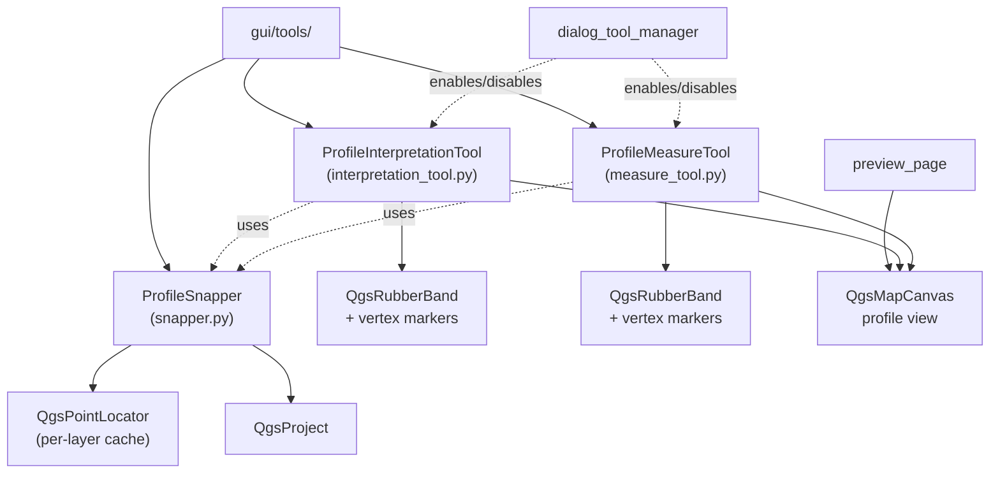

---
tags:
  - secinterp
  - code-walkthrough
  - gui
  - tools
aliases:
  - gui/tools/
  - ProfileInterpretationTool
  - ProfileMeasureTool
  - ProfileSnapper
cssclass: secinterp-note
---

# `gui/tools/` — Profile-view map tools

> [!abstract] One-line summary
> Package `gui/tools/` (4 files): interactive `QgsMapTool` tools for the profile view — interpretation-polygon drawing, distance measurement and the shared snapping helper — with no geological logic, only canvas interaction.

**Path**: `gui/tools/` (4 files, ~714 lines)
**Main classes**: `ProfileInterpretationTool`, `ProfileMeasureTool`, `ProfileSnapper`
**Layer**: GUI (QGIS · map tools)
**Tags**: #secinterp #gui #tools

---

## 🎯 Why does this package exist?

The profile preview needs direct canvas interaction: drawing interpretations and
measuring distances over the projected section. These tools encapsulate canvas
events so the dialog never handles pixels:

| Problem | Solution |
|---------|----------|
| Draw interpretation polygons over the profile | `ProfileInterpretationTool` with rubber band and vertex markers |
| Measure distance, elevation difference and slope on the section | `ProfileMeasureTool` with explicit measurement finalization |
| Both tools need vertex "magnetism" on layers | Shared `ProfileSnapper` with per-layer `QgsPointLocator` cache |
| Enable/disable tools without signal leaks | `activate` / `deactivate` / `disconnect_signals` protocol on each tool |

> [!important] Architectural note
> Pure GUI package: it freely imports `qgis.core` and `qgis.gui` (allowed outside
> `/core`). It computes no geology; it only captures geometry later consumed by the
> dialog managers. Lifecycle is orchestrated by [[dialog_tool_manager]].

---

## 🧬 Relationship diagram



> [!tip] How to read
> Solid arrow = imports/delegates; dashed = uses/injected or manages lifecycle.
> `ProfileSnapper` is the only coupling between both tools.

---

## 📦 Imports — architectural reading

```python
# gui/tools/__init__.py (complete, 3 lines)
from __future__ import annotations

"""Map tools for user interaction and data measurement."""
```

```python
# gui/tools/interpretation_tool.py (header)
import contextlib
import datetime
import random
import uuid
from qgis.core import QgsPointXY, QgsWkbTypes
from qgis.gui import QgsMapCanvas, ...

# gui/tools/measure_tool.py (header)
import contextlib
from qgis.core import QgsPointXY, QgsWkbTypes
from qgis.gui import QgsMapCanvas, QgsMapToolEmitPoint, QgsMapToolPan, ...

# gui/tools/snapper.py (header)
from qgis.core import QgsMapLayer, QgsPointLocator, QgsPointXY, QgsProject, QgsVectorLayer
from qgis.gui import QgsMapCanvas
from qgis.PyQt.QtCore import QPoint
```

| # | Observation |
|---|-------------|
| ① | `__init__.py` only declares a docstring: the package is a **namespace**, with no re-exports. |
| ② | `QgsWkbTypes` in both tools: they discriminate point/line/polygon geometry of the click. |
| ③ | `QgsMapToolEmitPoint` / `QgsMapToolPan` (measure only): the tool extends the QGIS point-emission contract. |
| ④ | `snapper.py` imports `QgsProject` + `QgsPointLocator`: it resolves layers and builds cached locators. |
| ⑤ | `contextlib` in both tools: `suppress` when disconnecting already-disconnected signals. |
| ⑥ | `datetime` + `uuid` + `random` (interpretation only): they identify each drawn polygon. |

> [!note] No `core` imports
> No module imports `sec_interp.core`: the tools neither validate nor compute, they
> only capture canvas points. The Extract-then-Compute boundary starts upstream.

---

## 🏗️ Structure inventory

**Classes:**

- `class ProfileInterpretationTool` — interpretation-polygon drawing (269 lines)
- `class ProfileMeasureTool` — distance/elevation/slope measurement (330 lines)
- `class ProfileSnapper` — shared snapping with locator cache (112 lines)

**Module functions:**

- `_points_to_xy(...)` — (`measure_tool.py`) point-to-`QgsPointXY` conversion

**Methods (shared lifecycle contract):**

- `activate()`, `deactivate()`, `disconnect_signals()`, `reset()` — present in both tools
- Canvas handlers: `canvasReleaseEvent`, `canvasMoveEvent`, `canvasDoubleClickEvent`, `keyPressEvent`

---

## 📁 Files in the package

| File | Lines | Role |
|---|--:|---|
| `__init__.py` | 3 | Package docstring; no re-exports |
| [[#ProfileInterpretationTool\|interpretation_tool.py]] | 269 | Interpretation-polygon drawing over the profile |
| [[#ProfileMeasureTool\|measure_tool.py]] | 330 | Distance, elevation-difference and slope measurement |
| [[#ProfileSnapper\|snapper.py]] | 112 | Shared snapping with `QgsPointLocator` cache |

---

## 📖 Class-by-class walkthrough

### ProfileInterpretationTool

```python
class ProfileInterpretationTool(...):
    def __init__(self, ...): ...
    def activate(self): ...
    def deactivate(self): ...
    def disconnect_signals(self): ...
    def reset(self): ...
    def canvasReleaseEvent(self, event): ...
    def canvasMoveEvent(self, event): ...
    def canvasDoubleClickEvent(self, event): ...
    def keyPressEvent(self, event): ...
    def _add_point(self, point): ...
    def _remove_last_point(self): ...
    def _add_vertex_marker(self, point): ...
    def _ensure_rubber_band(self): ...
    def _update_rubber_band(self): ...
```

Drawing tool for interpretation polygons over the profile view. Each click adds a
vertex (`_add_point` + `_add_vertex_marker`); double-click closes the polygon and
the backspace key removes the last vertex (`_remove_last_point`).
`_ensure_rubber_band` creates the rubber band on demand and `_update_rubber_band`
refreshes it on every mouse move (`canvasMoveEvent`).

> [!tip] Identity of each polygon
> The `datetime` + `uuid` (+ `random`) imports generate an identifier and timestamp
> per polygon, so the drawn interpretation can be persisted and inherited
> (see [[interpretation_page]] and [[dialog_interpretation_manager]]).

| Method | Trigger | Effect |
|--------|---------|--------|
| `canvasReleaseEvent` | click | Adds a vertex (with snapping via `ProfileSnapper`) |
| `canvasMoveEvent` | movement | Previews the rubber band |
| `canvasDoubleClickEvent` | double-click | Closes the polygon and emits the result |
| `keyPressEvent` | keyboard | Undoes a vertex or cancels the drawing |
| `reset` | manager | Clears vertices, band and markers |

### ProfileMeasureTool

```python
def _points_to_xy(points) -> list[QgsPointXY]: ...

class ProfileMeasureTool(QgsMapToolEmitPoint):
    def __init__(self, ...): ...
    def activate(self): ...
    def deactivate(self): ...
    def disconnect_signals(self): ...
    def cleanup_finalized(self): ...
    def reset(self): ...
    def canvasReleaseEvent(self, event): ...
    def canvasMoveEvent(self, event): ...
    def keyPressEvent(self, event): ...
    def _add_point(self, point): ...
    def finalize_measurement(self): ...
    def _add_vertex_marker(self, point): ...
    def _ensure_rubber_band(self): ...
```

Measurement tool over the profile: it accumulates points and, on finalization
(`finalize_measurement`), reports distance, elevation difference and slope. It
inherits `QgsMapToolEmitPoint` (point-emission contract) and knows `QgsMapToolPan`
to coexist with panning. `cleanup_finalized` removes the consolidated measurement
without touching the in-progress edit; `reset` clears everything.

| Method | Role |
|--------|-----|
| `_points_to_xy` | Normalizes heterogeneous points to `list[QgsPointXY]` |
| `finalize_measurement` | Consolidates the measurement, computing distance/height/slope |
| `cleanup_finalized` | Removes only the consolidated measurement |
| `reset` | Clears in-progress + consolidated measurement + markers |

> [!note] Measurement vs interpretation
> Both tools share the skeleton (rubber band, markers, snapping, lifecycle) but
> differ on close: the interpretation produces a persistable **polygon**; the
> measurement produces an ephemeral distance/height **report**.

### ProfileSnapper

```python
class ProfileSnapper:
    def __init__(self, canvas): ...
    def snap(self, point: QPoint) -> QgsPointXY: ...
    def _find_best_match_in_locator(self, locator, point): ...
    def _cleanup_locators(self): ...
    def _is_snappable(self, layer) -> bool: ...
    def _get_locator(self, layer) -> QgsPointLocator: ...
```

Shared snapping helper: given a screen position (`QPoint`), it returns the
`QgsPointXY` "snapped" to the nearest vertex of visible layers. `_get_locator`
builds (and caches) one `QgsPointLocator` per layer; `_is_snappable` filters out
unsuitable non-vector layers; `_cleanup_locators` frees the cache when layers
change; `_find_best_match_in_locator` picks the best candidate inside a locator.

| Method | Role |
|--------|-----|
| `snap` | Entry point: screen → snapped point |
| `_get_locator` | Cached locator per layer |
| `_is_snappable` | Filter of snappable layers |
| `_find_best_match_in_locator` | Best candidate inside one locator |
| `_cleanup_locators` | Invalidates the cache on layer changes |

> [!important] The locator cache is the performance detail
> Building a `QgsPointLocator` on every mouse move would be prohibitive; caching it
> per layer (`_get_locator`) and clearing it on changes (`_cleanup_locators`) keeps
> snapping fluid during `canvasMoveEvent`.

---

## 🔄 Data flow

| Phase | Input | Transformation | Output |
|-------|-------|----------------|--------|
| Activation | `dialog_tool_manager` enables the tool | `activate()` registers the tool on the canvas | Tool responsive to events |
| Capture | Canvas event (`QMouseEvent`) | `canvasReleaseEvent` + `snap()` | `QgsPointXY` (snapped) |
| Preview | Mouse movement | `_update_rubber_band` | Rubber band + markers |
| Close (interpretation) | Double-click | Polygon build + `uuid` | Persistable polygon |
| Close (measurement) | `finalize_measurement` | Distance/height/slope computation | Measurement report |
| Deactivation | Mode switch | `deactivate()` + `disconnect_signals()` | Clean canvas, no dangling signals |

---

## 🏛️ Design patterns present

| Pattern | Where | Purpose |
|---------|-------|---------|
| **Strategy (MapTool)** | Both tools over `QgsMapTool` | Swap canvas behaviour without touching the dialog |
| **Shared helper** | `ProfileSnapper` | One snapping engine for N tools |
| **Lazy init** | `_ensure_rubber_band`, `_get_locator` | Create expensive objects only when needed |
| **Cache-aside** | `QgsPointLocator` cache | Avoid rebuilding locators per event |
| **Defensive disconnect** | `disconnect_signals` + `contextlib.suppress` | Disconnect safely even if already disconnected |

---

## 🧾 API summary

| Symbol | Signature / Inherits | Typical use |
|--------|----------------------|-------------|
| `ProfileInterpretationTool` | `QgsMapTool` (drawing) | `tool = ProfileInterpretationTool(canvas)`; enable from the manager |
| `ProfileMeasureTool` | `QgsMapToolEmitPoint` | Measure over the profile; `finalize_measurement()` consolidates |
| `ProfileSnapper` | `(canvas)` | `snapper.snap(qpoint) -> QgsPointXY` |
| `_points_to_xy` | `(points) -> list[QgsPointXY]` | Normalize points before measuring |
| `activate` / `deactivate` | `() -> None` | Lifecycle managed by [[dialog_tool_manager]] |
| `disconnect_signals` | `() -> None` | Anti-leak cleanup on mode switch |

---

## 🛡️ Error handling

The tools are interactive: the typical failure is an event with no valid geometry
or a layer disappearing mid-drawing.

- **Defensive disconnection**: `disconnect_signals` uses `contextlib.suppress` so
  it never raises if the signal was already disconnected (double-deactivation safe).
- **`_is_snappable` as a guard**: filters non-vector layers before requesting a
  locator, avoiding unexpected `None` in `snap()`.
- **No domain exceptions**: they never raise `SecInterpError`; on an invalid point
  they simply ignore the event and keep the previous state.

---

## 🧩 Ownership and lifecycle

No tool manages itself: the owner is `dialog_tool_manager`, which creates them once
and switches between them according to the active mode (draw, measure, pan).

| Moment | Who | What |
|--------|-----|------|
| Dialog opens | `dialog_tool_manager` | Instantiates `ProfileSnapper(canvas)` + both tools |
| "Interpret" click | manager | `measure.deactivate()` → `interpret.activate()` |
| "Measure" click | manager | `interpret.deactivate()` → `measure.activate()` |
| Dialog closes | manager | `disconnect_signals()` on each tool + `reset()` |
| Layers change | canvas / project | `snapper._cleanup_locators()` invalidates the cache |

> [!warning] One active tool at a time
> The QGIS canvas supports a single active `QgsMapTool`. Enabling the second
> without disabling the first leaves orphan events: hence the manager always
> disables before enabling, and `disconnect_signals` is idempotent by design.

---

## 🧪 Associated tests

Real coverage under `tests/gui/` (see with `ls tests/gui`):

- `tests/gui/test_interpretation_tool.py` — `ProfileInterpretationTool` lifecycle
  and drawing (enable, add vertices, close polygon, reset).
- `tests/gui/test_measure_tool.py` — `ProfileMeasureTool` (point accumulation,
  `finalize_measurement`, `cleanup_finalized`, `reset`).
- `tests/gui/test_main_dialog_tools.py` — wiring of the `dialog_tool_manager` that
  enables/disables these tools from the main dialog.

```bash
PYTHONPATH=.. uv run python3 -m unittest tests.gui.test_interpretation_tool -v
PYTHONPATH=.. uv run python3 -m unittest tests.gui.test_measure_tool -v
```

> [!tip] Mock-first
> Tests inject mocked canvases and layers (`tests/base_test.py`): they verify the
> event protocol without needing a real open QGIS window.

---

## 🌐 i18n and user messages

- The tools show almost no text of their own (the measurement report is presented
  from the manager/dialog), so they define no local `tr()`: translatability lives
  in the pages (`self.tr()`), not in point capture.
- Any future label must go through `QCoreApplication.translate`, following the
  [[collar_tab]] / [[advanced_tab]] pattern.

---

## 👀 Observations and notes

> [!success] Strengths
> - Uniform lifecycle contract (`activate`/`deactivate`/`disconnect_signals`/`reset`).
> - `ProfileSnapper` avoids duplicating magnet logic in each tool.
> - Locator cache with explicit invalidation: fluid snapping.

> [!warning] Points of attention
> - `__init__.py` re-exports nothing: consumers import the submodule
>   (`from sec_interp.gui.tools.measure_tool import ...`); documented but fragile if it grows.
> - Duplicated skeleton across both tools (rubber band, markers, lifecycle):
>   candidate for a shared base if a third tool appears.

> [!question] Open questions
> - Extract a `ProfileBaseTool` with shared rubber band + markers + snapping?
> - Re-export the three classes in `__init__.py` for a stable entry point?

---

## 🔗 Related notes

- [[Index]] — vault index
- [[interpretation_tool]] — individual note for `ProfileInterpretationTool`
- [[measure_tool]] — individual note for `ProfileMeasureTool`
- [[snapper]] — individual note for `ProfileSnapper`
- [[dialog_tool_manager]] — orchestrates enabling/disabling these tools
- [[main_dialog]] — dialog hosting the profile view
- [[preview_page]] — page containing the profile canvas
- [[gui]] — parent `gui/` package note

---

*Note of the SecInterp Code Walkthrough v2 vault — v3.9.1*
