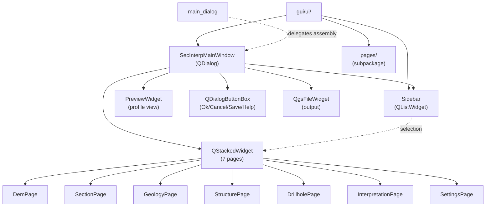

---
tags:
  - secinterp
  - code-walkthrough
  - gui
  - ui
aliases:
  - gui/ui/
  - SecInterpMainWindow
  - Sidebar
cssclass: secinterp-note
---

# `gui/ui/` — Main window and side navigation

> [!abstract] One-line summary
> Package `gui/ui/` (3 files + `pages/` subpackage): programmatic assembly of the main window — `SecInterpMainWindow` (dialog with `QSplitter` + `QStackedWidget`) and `Sidebar` (list navigation) — over the `pages/` pages.

**Path**: `gui/ui/` (3 files, ~228 lines + `pages/` subpackage)
**Main classes**: `SecInterpMainWindow`, `Sidebar`
**Layer**: GUI (QGIS · programmatic Qt, no compiled `.ui`)
**Tags**: #secinterp #gui #ui

---

## 🎯 Why does this package exist?

The plugin builds its interface in code (no Qt Designer): this package is the
"shell" hosting the configuration pages and the profile preview.

| Problem | Solution |
|---------|----------|
| Seven configuration pages must coexist in one dialog | `SecInterpMainWindow`: `QSplitter` [sidebar \| pages \| preview] + `QStackedWidget` |
| Navigate between pages without top tabs | `Sidebar`: `QListWidget` with 32px icons and fixed 140px width |
| The module must read as a namespace | 7-line `__init__.py` with docstring (no re-exports) |
| Pages live in a subpackage with their own protocol | `pages/` + `BasePage` documented in [[gui_ui_pages]] |

> [!important] Architectural note
> 100% programmatic UI: `QDialog` + layouts + `QSplitter` + `QStackedWidget`, no
> `.ui` files. The pattern is **Shell + pages**: this package is the shell, each
> `BasePage` is swappable content (see [[base_page]]).

---

## 🧬 Relationship diagram



> [!tip] How to read
> Solid arrow = imports/instantiates; dashed = selects or delegates. The `Sidebar`
> knows nothing about pages: it only emits the selected row and the window switches
> the stack.

---

## 📦 Imports — architectural reading

```python
# gui/ui/__init__.py (complete, 7 lines)
from __future__ import annotations

"""
UI module for SecInterp plugin.

Contains compiled UI files.
"""
```

```python
# gui/ui/main_window.py (header)
import contextlib
from typing import Any
from qgis.gui import QgsFileWidget
from qgis.PyQt.QtCore import Qt
from qgis.PyQt.QtWidgets import (
    QDialog, QDialogButtonBox, QHBoxLayout, QLabel,
    QSplitter, QStackedWidget, QVBoxLayout, QWidget,
)
from .pages.dem_page import DemPage
from .pages.drillhole_page import DrillholePage
from .pages.geology_page import GeologyPage
from .pages.interpretation_page import InterpretationPage
from .pages.preview_page import PreviewWidget
from .pages.section_page import SectionPage
from .pages.settings_page import SettingsPage
from .pages.structure_page import StructurePage
from .sidebar import Sidebar

# gui/ui/sidebar.py (header)
from qgis.core import QgsApplication
from qgis.PyQt.QtCore import QSize, Qt
from qgis.PyQt.QtWidgets import QListWidget, QListWidgetItem
```

| # | Observation |
|---|-------------|
| ① | The `__init__` docstring mentions "compiled UI files" but the UI is programmatic: a historical leftover, the source rules. |
| ② | `main_window.py` imports all **8 pages/widgets** by name: assembly coupling, unavoidable in a shell. |
| ③ | Horizontal `QSplitter` + `QStackedWidget`: resizable layout with switchable pages. |
| ④ | `QgsFileWidget` (output selector) and `PreviewWidget` live in the shell, not in a page. |
| ⑤ | `sidebar.py` imports `QgsApplication` (QGIS theme icons) — pure `QListWidget`, no pages. |
| ⑥ | `contextlib` in the window: defensive signal disconnection on close. |

---

## 🏗️ Structure inventory

**Classes:**

- `class SecInterpMainWindow(QDialog)` — programmatic main window (158 lines)
- `class Sidebar(QListWidget)` — icon side navigation (63 lines)

**`SecInterpMainWindow` methods:**

- `__init__(iface=None, parent=None)` — `self.tr("Sec Interp")` title, 1200×700 size
- `_setup_ui()` — splitter, stack, preview, file widget, button box
- `_connect_signals()` / `disconnect_signals()` — wiring and cleanup

**`Sidebar` methods:**

- `__init__(parent=None)` — 32px icons, fixed 140px width
- `add_item(...)` — registration of navigation entries

---

## 📁 Files in the package

| File | Lines | Role |
|---|--:|---|
| `__init__.py` | 7 | Package docstring; no re-exports |
| [[#SecInterpMainWindow\|main_window.py]] | 158 | Main dialog: splitter + 7-page stack + preview |
| [[#Sidebar\|sidebar.py]] | 63 | Side navigation (`QListWidget` with icons) |
| [[#Subpackage-pages\|pages/]] | — | Pages subpackage (see [[gui_ui_pages]]) |

---

## 📖 Class-by-class walkthrough

### SecInterpMainWindow

```python
class SecInterpMainWindow(QDialog):
    def __init__(self, iface: Any | None = None, parent: QWidget | None = None) -> None:
        super().__init__(parent)
        self.setWindowTitle(self.tr("Sec Interp"))
        self.resize(1200, 700)
        self.sidebar = Sidebar()
        self.stacked_widget = QStackedWidget()
        self.preview_widget = PreviewWidget()
        self.output_widget = QgsFileWidget()
        flags = QDialogButtonBox.StandardButton.Ok | QDialogButtonBox.StandardButton.Cancel
        flags |= QDialogButtonBox.StandardButton.Save | QDialogButtonBox.StandardButton.Help
        self.button_box = QDialogButtonBox(flags)
        self.page_dem = DemPage(iface)
        ...
        self._setup_ui()
        self._connect_signals()
```

The dialog creates **all** its components in `__init__` (sidebar, stack, preview,
output selector, Ok/Cancel/Save/Help button box and the 7 pages) and then assembles
(`_setup_ui`) and wires (`_connect_signals`). Only `DemPage` receives `iface`; the
remaining pages are built with no direct QGIS dependencies in their constructors.

| Attribute | Widget | Role |
|-----------|--------|------|
| `sidebar` | `Sidebar` | Navigation between pages |
| `stacked_widget` | `QStackedWidget` | Switchable container of the 7 pages |
| `preview_widget` | `PreviewWidget` | Profile preview (third panel) |
| `output_widget` | `QgsFileWidget` | Output-path selector |
| `button_box` | `QDialogButtonBox` | Ok / Cancel / Save / Help |
| `page_dem` … `page_settings` | `BasePage` | One instance per configuration page |

> [!tip] Three panels, one splitter
> `_setup_ui` mounts a `QSplitter(Qt.Orientation.Horizontal)` with
> `[Sidebar | pages | Preview]`, a 6px handle and collapsible children: the user
> resizes each zone with no extra modal dialogs.

### Sidebar

```python
class Sidebar(QListWidget):
    def __init__(self, parent: Any = None) -> None:
        super().__init__(parent)
        self.setIconSize(QSize(32, 32))
        self.setFixedWidth(140)

    def add_item(self, ...): ...
```

Minimal navigation list: it inherits `QListWidget`, pins 32×32 icons and 140px
width so text fits, and exposes `add_item` to register entries (theme icon via
`QgsApplication` + translatable label). It imports no page: the window connects
the selection signal to the `QStackedWidget` index.

| Decision | Value | Reason |
|----------|-------|--------|
| Icons | 32×32 | Readable on HiDPI screens without stealing width |
| Fixed width | 140px | 7 entries of text without ellipsis |
| No page references | — | Shell ↔ content decoupling |

### Subpackage pages

```python
# gui/ui/pages/ — swappable shell content
from .settings_page import SettingsPage  # (in __init__.py)

__all__ = ["BasePage", "SettingsPage"]
```

The `pages/` subpackage provides the 7 pages (`DemPage`, `SectionPage`,
`GeologyPage`, `StructurePage`, `DrillholePage`, `InterpretationPage`,
`SettingsPage`) plus `PreviewWidget`, all under the `BasePage` protocol
(`get_data` / `dump` / `load` / `reset` / `validate` / signals). Honest detail:
`__all__` advertises `BasePage` but the `__init__` only imports `SettingsPage`,
so `BasePage` is effectively **not** re-exported.

> [!note] The real page registry is the window
> There is no factory or auto-discovery: `SecInterpMainWindow.__init__` instantiates
> each page explicitly. Adding a page = import it + instantiate it + stack it + add
> its `Sidebar` entry.

---

## 🔍 Map of stacked pages

Stacked `QStackedWidget` content, in `__init__` instantiation order:

| Page | Module | Note | Responsibility |
|------|--------|------|----------------|
| DEM | `pages/dem_page.py` | [[dem_page]] | Elevation raster and base layer |
| Section | `pages/section_page.py` | [[section_page]] | Section line and cut parameters |
| Geology | `pages/geology_page.py` | [[geology_page]] | Geological layers and fields |
| Structure | `pages/structure_page.py` | [[structure_page]] | Structural measurements |
| Drillhole | `pages/drillhole_page.py` | [[drillhole_page]] | Drillholes (coordinates 3 tabs) |
| Interpretation | `pages/interpretation_page.py` | [[interpretation_page]] | Polygons drawn on the profile |
| Settings | `pages/settings_page.py` | [[settings_page]] | Export, 3D and information |
| Preview (fixed) | `pages/preview_page.py` | [[preview_page]] | Profile view (outside the stack) |

> [!note] The preview does not rotate
> `PreviewWidget` lives in the third splitter panel, always visible: switching
> pages never hides the section. Only the 7 configuration pages rotate.

---

## 🧩 Adding a page to the shell (guide)

Adding an eighth page, step by step, without touching the existing ones:

| Step | File | Action |
|------|------|--------|
| 1 | `gui/ui/pages/my_page.py` | Create `MyPage(BasePage)` with `get_data` + `_setup_ui` (see [[base_page]]) |
| 2 | `gui/ui/main_window.py` (imports) | `from .pages.my_page import MyPage` |
| 3 | `SecInterpMainWindow.__init__` | `self.page_my = MyPage()` next to the rest |
| 4 | `_setup_ui` | `stacked_widget.addWidget(self.page_my)` |
| 5 | `Sidebar` | `add_item(icon, self.tr("My page"))` at the desired position |
| 6 | `_connect_signals` | Connect `dataChanged` if the page emits it |

> [!tip] Sidebar ↔ stack order
> `Sidebar` row N must match `QStackedWidget` index N: wiring is positional, not
> by name. Inserting in the middle requires moving both.

---

## 🔄 Data flow

| Phase | Input | Transformation | Output |
|-------|-------|----------------|--------|
| Construction | `iface` (`DemPage` only) | Instantiation of the 7 pages + shell | 1200×700 dialog, hidden |
| Assembly | Loose components | `_setup_ui`: splitter + stack + preview | Three resizable panels |
| Navigation | `Sidebar` click | Index → `stacked_widget.setCurrentIndex` | Visible page switched |
| Collection | User presses Ok/Save | `page.get_data()` per page | Aggregated dicts towards the core |
| Close | Cancel / close | Defensive `disconnect_signals()` | No dangling signals or leaks |

---

## 🏛️ Design patterns present

| Pattern | Where | Purpose |
|---------|-------|---------|
| **Shell + pages** | Window vs `pages/` | The shell knows no geology; pages know no navigation |
| **Stacked navigation** | `QStackedWidget` + `Sidebar` | N pages, one visible, index switching |
| **Programmatic UI** | Whole package | No `.ui`: code-created layouts and widgets |
| **Defensive disconnect** | `disconnect_signals` + `contextlib` | Clean close even with missing connections |
| **Partial facade** | Ok/Cancel/Save/Help button box | One decision point for the dialog flow |

---

## 🧾 API summary

| Symbol | Signature / Inherits | Typical use |
|--------|----------------------|-------------|
| `SecInterpMainWindow` | `QDialog` | `win = SecInterpMainWindow(iface)`; `win.exec()` |
| `Sidebar` | `QListWidget` | `sidebar.add_item(icon, label)` per page |
| `_setup_ui` | `() -> None` | Assembles splitter + stack + preview (internal) |
| `_connect_signals` | `() -> None` | Sidebar→stack, button box→accept/cancel |
| `disconnect_signals` | `() -> None` | Cleanup on close |
| `pages/` | subpackage | Stack content (see [[gui_ui_pages]]) |

---

## 🛡️ Error handling

- **Full construction in `__init__`**: if a page fails to build, the dialog never
  shows; the error propagates to `main_dialog`/entry point, which logs it.
- **Defensive disconnection**: `disconnect_signals` tolerates already-disconnected
  signals (double close is safe).
- **No validation here**: `validate()` lives in each `BasePage`; the shell only
  aggregates results (see [[base_page]] and [[main_dialog]]).

---

## 🧪 Associated tests

No dedicated unit test for `SecInterpMainWindow` or `Sidebar` (they are thin Qt
shells); coverage arrives indirectly from `tests/gui/`:

- `tests/gui/test_main_dialog_core.py` — construction and basic lifecycle of the
  main dialog hosting this window.
- `tests/gui/test_dem_page.py` / `test_drillhole_page.py` / `test_settings_page.py`
  — pages the stack instantiates (if a page breaks its constructor, the window falls).
- `tests/gui/test_main_dialog_tools.py` — tool wiring over the window.

```bash
PYTHONPATH=.. uv run python3 -m unittest tests.gui.test_main_dialog_core -v
PYTHONPATH=.. uv run python3 -m unittest tests.gui.test_settings_page -v
```

> [!tip] Why the splitter is not tested
> Layout geometry and icons are verified by inspection; tests cover the fragile
> parts (page construction and wiring), not the declarative ones.

---

## 🌐 i18n and user messages

- Title via `self.tr("Sec Interp")`: translatable through
  `QCoreApplication.translate` with the class context.
- `Sidebar` labels and each page go through `self.tr()` in their module; the shell
  never re-labels (see [[base_page]] for the `tr` protocol).
- Fixed 140px width: room for long translations without ellipsis in most locales
  (revisit in `/i18n-maintenance` if a locale overflows).

---

## 👀 Observations and notes

> [!success] Strengths
> - Minimal, predictable shell: assemble, wire, clean up.
> - `Sidebar` decoupled from pages (indices only).
> - Programmatic UI: no `.ui` to compile or desynchronize.

> [!warning] Points of attention
> - `__init__.py` says "compiled UI files" while the UI is programmatic: stale docstring.
> - `pages/` `__all__` advertises `BasePage` without importing it: effectively broken re-export.
> - Only `DemPage` receives `iface`: asymmetry to document if another page needs it.

> [!question] Open questions
> - Register pages in a declarative list (class + label + icon) instead of 7 imperative blocks?
> - Fix the `__init__` docstring and the `pages/` `__all__`?

---

## 🔗 Related notes

- [[Index]] — vault index
- [[main_window]] — individual note for `SecInterpMainWindow`
- [[sidebar]] — individual note for `Sidebar`
- [[gui_ui_pages]] — `pages/` subpackage note
- [[base_page]] — `BasePage` protocol of all pages
- [[main_dialog]] — dialog/managers using this window
- [[dem_page]] / [[drillhole_page]] / [[settings_page]] — stacked pages
- [[gui]] — parent `gui/` package note

---

*Note of the SecInterp Code Walkthrough v2 vault — v3.9.1*
