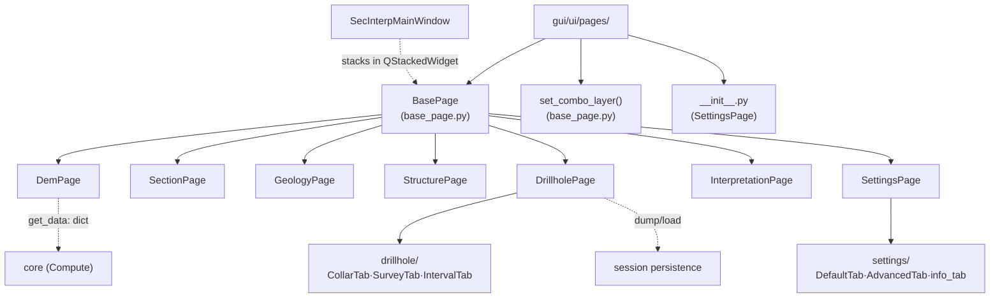

---
tags:
  - secinterp
  - code-walkthrough
  - gui
  - pages
aliases:
  - gui/ui/pages/
  - BasePage
  - SettingsPage
  - set_combo_layer
cssclass: secinterp-note
---

# `gui/ui/pages/` — Page registry and `BasePage` protocol

> [!abstract] One-line summary
> Package `gui/ui/pages/` (10 files + `drillhole/` and `settings/` subpackages): namespace-registry of the programmatic configuration pages and home of the shared `BasePage` protocol (`get_data` / `dump` / `load` / `reset` / `validate` + signals) implemented by every page.

**Path**: `gui/ui/pages/` (10 files, ~1346 lines + 2 subpackages)
**Main classes**: `BasePage`, `set_combo_layer`, `DemPage`, `DrillholePage`, `SettingsPage`
**Layer**: GUI (QGIS · programmatic Qt, Extract pattern in `get_data`)
**Tags**: #secinterp #gui #pages

---

## 🎯 Why does this package exist?

Each plugin configuration screen (DEM, section, geology, structures, drillholes,
interpretation, settings, preview) is a swappable "page" inside the
[[main_window]] `QStackedWidget`. The package solves two needs:

| Problem | Solution |
|---------|----------|
| Nine pages must expose the same contract to the dialog | `BasePage(QWidget)` with `get_data`/`dump`/`load`/`reset`/`validate`/signals |
| Pin a combo to a layer without firing its signals | `set_combo_layer()` (blocks signals during `setLayer`) |
| Gather the pages under one importable namespace | `__init__.py` with `SettingsPage` and a declared `__all__` |
| Complex forms (drillholes, settings) with sub-tabs | `drillhole/` and `settings/` subpackages with thin coordinators |

> [!important] Architectural note
> This package is the **Extract** side of Extract-then-Compute: each `get_data()`
> turns QGIS widgets into primitive dicts the core consumes without touching Qt.
> `dump`/`load` sustain session persistence.

---

## 🧬 Relationship diagram



> [!tip] How to read
> Solid arrow = inherits/imports; dashed = consumes the protocol (`get_data`,
> persistence) or stacks in the window. `PreviewWidget` also lives here although it
> does not rotate in the stack (fixed splitter panel).

---

## 📦 Imports — architectural reading

```python
# gui/ui/pages/__init__.py (complete, 7 lines)
"""UI Configuration Pages."""

from __future__ import annotations

from .settings_page import SettingsPage

__all__ = ["BasePage", "SettingsPage"]
```

```python
# gui/ui/pages/base_page.py (header)
"""Base class for configuration pages."""

from __future__ import annotations

from typing import Any

from qgis.PyQt.QtWidgets import QGroupBox, QVBoxLayout, QWidget
```

```python
# Typical page headers (drillhole_page.py / settings_page.py)
import contextlib
from typing import Any
from qgis.PyQt.QtCore import QCoreApplication, pyqtSignal
from qgis.PyQt.QtWidgets import QTabWidget, QVBoxLayout, QWidget
from sec_interp.core.validation.project_validator import ProjectValidator, ValidationParams
from sec_interp.gui.adapters.validation_extractor import resolve_layer_metadata
from .base_page import BasePage
from .drillhole import CollarTab, IntervalTab, SurveyTab
```

| # | Observation |
|---|-------------|
| ① | `__init__.py` imports **only** `SettingsPage` yet `__all__` also advertises `BasePage`: incomplete re-export (see observations). |
| ② | `base_page.py` only depends on basic `QtWidgets`: the protocol drags no `qgis.core`. |
| ③ | Pages import core validators (`ProjectValidator`) and adapters (`resolve_layer_metadata`): Extract with local validation. |
| ④ | `QCoreApplication` + `pyqtSignal` in every page: per-class `tr()` and i18n context. |
| ⑤ | `contextlib`: defensive signal disconnection in `disconnect_signals`. |
| ⑥ | Coordinators (`DrillholePage`, `SettingsPage`) import their tabs from the subpackage, never the reverse. |

---

## 🏗️ Structure inventory

**`base_page.py` symbols (105 lines):**

- `def set_combo_layer(combo, layer)` — pins a layer without emitting signals
- `class BasePage(QWidget)` — `__init__(title, parent)`, `_setup_ui`, `get_data` (abstract),
  `dump`, `load`, `reset`, `validate`, `connect_signals`, `disconnect_signals`

**Pages (one class per module, all inherit `BasePage` except `PreviewWidget`):**

- `DemPage` (271 lines) — elevation raster and base layer
- `SectionPage` (117 lines) — section line and cut parameters
- `GeologyPage` (120 lines) — geological layers and fields
- `StructurePage` (166 lines) — structural measurements
- `DrillholePage` (130 lines) — coordinates `CollarTab` + `SurveyTab` + `IntervalTab`
- `InterpretationPage` (230 lines) — polygons drawn over the profile
- `SettingsPage` (124 lines) — coordinates `DefaultTab` + `AdvancedTab` + `build_info_tab`
- `PreviewWidget` (`preview_page.py`, 262 lines) — profile view, fixed panel

---

## 📁 Files in the package

| File | Lines | Role |
|---|--:|---|
| `__init__.py` | 7 | Namespace; imports `SettingsPage` (see note on `__all__`) |
| [[#BasePage\|base_page.py]] | 105 | `BasePage` protocol + `set_combo_layer` helper |
| [[#DemPage\|dem_page.py]] | 271 | DEM and elevation-layer page |
| [[#SectionPage\|section_page.py]] | 117 | Section-line page |
| [[#GeologyPage\|geology_page.py]] | 120 | Geological-layers page |
| [[#StructurePage\|structure_page.py]] | 166 | Structures page |
| [[#DrillholePage\|drillhole_page.py]] | 130 | Thin coordinator of the 3 drillhole tabs |
| [[#InterpretationPage\|interpretation_page.py]] | 230 | Drawn-interpretations page |
| [[#SettingsPage\|settings_page.py]] | 124 | Thin coordinator of the 3 settings tabs |
| [[#PreviewWidget\|preview_page.py]] | 262 | Profile preview (fixed panel) |
| [[#Subpackage-drillhole\|drillhole/]] | — | Collar/survey/interval tabs (see [[gui_ui_pages_drillhole]]) |
| [[#Subpackage-settings\|settings/]] | — | Default/advanced/info tabs (see [[gui_ui_pages_settings]]) |

---

## 📖 Symbol-by-symbol walkthrough

### BasePage

```python
class BasePage(QWidget):
    def __init__(self, title: str, parent: QWidget | None = None) -> None:
        super().__init__(parent)
        self.title = title
        self._setup_ui()

    def _setup_ui(self) -> None:
        self.main_layout = QVBoxLayout(self)
        self.main_layout.setContentsMargins(0, 0, 0, 0)
        self.group_box = QGroupBox(self.title)
        self.group_layout = None  # To be set by subclasses
        self.main_layout.addWidget(self.group_box)
        self.main_layout.addStretch()

    def get_data(self) -> dict[str, Any]:
        raise NotImplementedError("Subclasses must implement get_data()")

    def dump(self) -> dict[str, Any]: return {}
    def load(self, data: dict[str, Any]) -> None: pass
    def reset(self) -> None: pass
    def validate(self) -> tuple[bool, str]: return True, ""
    def connect_signals(self) -> None: pass
    def disconnect_signals(self) -> None: pass
```

The contract every page honours. `get_data` is the **only truly abstract** method
(raises `NotImplementedError`); the rest offer no-op defaults so a simple page only
implements what it needs. `_setup_ui` builds the shared skeleton: margin-less
layout + titled `QGroupBox` + bottom stretch pushing content upward. Subclasses fill
`group_box` (or its layout) with their widgets.

| Member | Required | Protocol role |
|--------|----------|---------------|
| `get_data` | Yes | **Extract**: widgets → primitive dict for the core |
| `validate` | Recommended | `(is_valid, error)`; default `True, ""` |
| `dump` / `load` | If persistent | Serializable state (layers as resolved objects) |
| `reset` | If configurable | Default values |
| `connect/disconnect_signals` | If it connects | Internal wiring + anti-leak cleanup |
| `group_box` | Structural | Titled container shared by all pages |

### set_combo_layer

```python
def set_combo_layer(combo: Any, layer: Any) -> None:
    combo.blockSignals(True)
    combo.setLayer(layer)
    combo.blockSignals(False)
```

Pins a layer on a `QgsMapLayerComboBox` (or compatible mock) without emitting
intermediate signals. Essential in `load()` and `reset()`: restoring state must not
trigger validations or `dataChanged` cascades. The drillhole tabs (`CollarTab`,
`IntervalTab`, `SurveyTab`) import it from here.

> [!tip] Accepts `None`
> Passing `layer=None` clears the selection: the same path serves "no layer",
> avoiding special branches in callers.

### DemPage

Elevation-model page (271 lines, the largest in the package): DEM raster selector,
elevation layer and sampling parameters. Its `get_data` delivers the topographic
context the core uses to drape the section over the relief. See [[dem_page]].

### SectionPage

Section-line page (117 lines): cut-line layer/identifier and geometric parameters
(tolerance, resolution). It defines *where* the profile is cut, which everything
else projects onto. See [[section_page]].

### GeologyPage

Geology page (120 lines): geology layer and field mapping (lithology, contacts).
Its `get_data` feeds the core `GeologyContext`. See [[geology_page]].

### StructurePage

Structure page (166 lines): measurement layer and strike/dip fields for
stereographic projection onto the section. See [[structure_page]].

### DrillholePage

```python
class DrillholePage(BasePage):
    dataChanged = pyqtSignal()
    layer_keys = frozenset({"dh_collar_layer", "dh_survey_layer", "dh_interval_layer"})

    def _setup_ui(self): ...   # QTabWidget with CollarTab + SurveyTab + IntervalTab
    def get_data(self): ...    # merges the 3 tab dicts
    def dump / load / reset: ...  # delegate to each tab
    def is_complete(self): ... # ProjectValidator.is_drillhole_complete(params)
    def connect_signals / disconnect_signals: ...  # re-emits dataChanged
```

Thin coordinator: owns the `QTabWidget`, delegates forms to `drillhole/` and merges
results. `is_complete` builds `ValidationParams` (resolving layers with
`resolve_layer_metadata`) and delegates to `ProjectValidator`. `layer_keys`
identifies its layers to the notification manager. See [[drillhole_page]] and
[[gui_ui_pages_drillhole]].

### InterpretationPage

Interpretations page (230 lines): lists and manages polygons drawn with
`ProfileInterpretationTool`, including attribute inheritance across sessions.
See [[interpretation_page]] and [[gui_tools]].

### SettingsPage

```python
class SettingsPage(BasePage):
    def _setup_ui(self): ...          # QTabWidget: DefaultTab + AdvancedTab + build_info_tab(self.tr)
    def _expose_tab_widgets(self): ...# chk_exp_*/chk_3d_* aliases for compatibility
    def _load_settings(self): ...     # load_settings(self.settings, default_tab, advanced_tab)
    def _on_settings_changed(self): ...# save_settings(config_service, default_tab, advanced_tab)
    def get_data(self): ...           # merges default + advanced
```

Settings thin coordinator: three tabs (export, 3D, information) plus persistence
via `settings_persistence.py`. `_expose_tab_widgets` re-exposes checkboxes as its
own attributes to avoid breaking legacy consumers. See [[settings_page]] and
[[gui_ui_pages_settings]].

### PreviewWidget

Profile preview widget (`preview_page.py`, 262 lines): hosts the profile
`QgsMapCanvas` where the [[gui_tools]] tools act and the result renders. It does
not rotate in the stack: it is the fixed third splitter panel. See [[preview_page]].

### Subpackage drillhole

`CollarTab`, `SurveyTab`, `IntervalTab` tabs (see [[gui_ui_pages_drillhole]]):
collar forms (identifier, X/Y or geometry, depth), survey (azimuth, inclination,
depth) and intervals (from/to, lithology). Each tab exposes the same mini-protocol
(`get_data`/`dump`/`load`/`reset`/signals) that `DrillholePage` aggregates.

### Subpackage settings

`DefaultTab`, `AdvancedTab` tabs and `build_info_tab` function (see
[[gui_ui_pages_settings]]): export selection, 3D toggles and a read-only
information tab built with `read_plugin_metadata()`.

---

## 🔄 Data flow

| Phase | Input | Transformation | Output |
|-------|-------|----------------|--------|
| Construction | `__init__(title)` | `_setup_ui` mounts `group_box` | Empty titled page |
| Editing | User interaction | Widgets + signals (`dataChanged`/`changed`) | Internal Qt state |
| Extract | `get_data()` | Widgets → primitives (`resolve_layer_metadata` for layers) | `dict` to core/managers |
| Validation | `validate()` / `is_complete()` | `ProjectValidator` + `ValidationParams` | `(bool, message)` |
| Persistence | `dump()` / `load(dict)` | State ↔ dict (layers as resolved objects) | Restorable session |
| Cleanup | Dialog close | Defensive `disconnect_signals()` | No dangling connections |

---

## 🏛️ Design patterns present

| Pattern | Where | Purpose |
|---------|-------|---------|
| **Template Method** | `BasePage._setup_ui` + overrides | Shared skeleton, per-subclass content |
| **Thin coordinator** | `DrillholePage`, `SettingsPage` | Own the `QTabWidget`, delegate forms |
| **Extract Adapter** | `get_data` on each page | QGIS → primitives for the core |
| **Partial memento** | `dump` / `load` | Persistable state without exposing widgets |
| **Signal re-emit** | `DrillholePage.dataChanged` | Aggregates 3 tabs' `dataChanged` into one signal |
| **Signal guard** | `set_combo_layer` | Mutate combos without side effects |

---

## 🧾 API summary

| Symbol | Signature / Inherits | Typical use |
|--------|----------------------|-------------|
| `BasePage` | `QWidget` | Inherit; implement `get_data` at minimum |
| `set_combo_layer` | `(combo, layer) -> None` | `set_combo_layer(self.cmb, layer)` in `load`/`reset` |
| `get_data` | `() -> dict[str, Any]` | Extract towards core or managers |
| `dump` / `load` | `() -> dict` / `(dict) -> None` | Session persistence |
| `validate` | `() -> tuple[bool, str]` | Gate before computing/exporting |
| `DrillholePage.is_complete` | `() -> bool` | Minimally valid drillhole per `ProjectValidator` |
| `SettingsPage.get_data` | `() -> dict` | Default + advanced merge |

---

## 🛡️ Error handling

- **`get_data` never validates**: it extracts; validation is `validate()` /
  `is_complete()`, so a half-filled form never raises on collection.
- **`resolve_layer_metadata`** turns layers into safe metadata before building
  `ValidationParams` (deleted layers → null metadata, not a crash).
- **`set_combo_layer` with `None`**: clearing a selection is a normal path, not an
  exception.
- **Defensive disconnection** with `contextlib.suppress(TypeError, RuntimeError)` in
  coordinators: double close never raises.

---

## 🧪 Associated tests

Real coverage under `tests/gui/`:

- `tests/gui/test_drillhole_page.py` — `get_data`/`dump`/`load`/`reset` and
  `is_complete` of the drillhole coordinator.
- `tests/gui/test_dem_page.py` — Extract and validation of the DEM page.
- `tests/gui/test_settings_page.py` — default+advanced merge and persistence.
- `tests/gui/test_dialog_settings_persistence.py` — `load_settings`/`save_settings`
  used by `SettingsPage`.
- `tests/gui/test_multi_session_persistence.py` — `dump`/`load` across sessions.

```bash
PYTHONPATH=.. uv run python3 -m unittest tests.gui.test_drillhole_page -v
PYTHONPATH=.. uv run python3 -m unittest tests.gui.test_settings_page -v
```

---

## 🌐 i18n and user messages

- Each page defines `tr()` with `QCoreApplication.translate("<Class>", message)`:
  the context is the class name (e.g. `"CollarTab"`, `"AdvancedTab"`).
- `BasePage` receives an already-translated `title` from the caller
  (`QCoreApplication.translate("DrillholePage", "Drillhole Data")` in
  `DrillholePage.__init__`): the title travels translated, never translated inside.
- `SettingsPage` injects `self.tr` into `build_info_tab(self.tr)`: the functional
  tab translates with the host page context.
- Honest exception: `build_info_tab` translates the plugin **name** read from
  `metadata.txt` (`translate(f"{name} v{version}")`), a data value rather than a
  `pylupdate`-extractable literal (see [[gui_ui_pages_settings]]).

---

## 👀 Observations and notes

> [!success] Strengths
> - One protocol for 9 screens: the dialog treats them all alike.
> - `get_data` systematically separates Extract from the core Compute.
> - `set_combo_layer` removes a whole class of cascading-signal bugs.

> [!warning] Points of attention
> - `__all__` advertises `BasePage` without importing it: `from .pages import BasePage`
>   fails today; import from `.base_page` until fixed.
> - `PreviewWidget` does not inherit `BasePage`: the stack treats it as a special case.
> - `SettingsPage._expose_tab_widgets` duplicates references (compatibility): debt to
>   remove once legacy consumers migrate.

> [!question] Open questions
> - Import `BasePage` in `__init__.py` to honour `__all__`?
> - Unify `changed`/`dataChanged` into a single base-protocol signal?

---

## 🔗 Related notes

- [[Index]] — vault index
- [[base_page]] — individual note for `BasePage` + `set_combo_layer`
- [[dem_page]] / [[section_page]] / [[geology_page]] / [[structure_page]] — simple pages
- [[drillhole_page]] — drillhole coordinator
- [[interpretation_page]] — drawn interpretations
- [[settings_page]] — settings coordinator
- [[preview_page]] — profile preview
- [[gui_ui_pages_drillhole]] / [[gui_ui_pages_settings]] — tab subpackages
- [[main_window]] — shell stacking these pages
- [[gui]] — parent `gui/` package note

---

*Note of the SecInterp Code Walkthrough v2 vault — v3.9.0*
