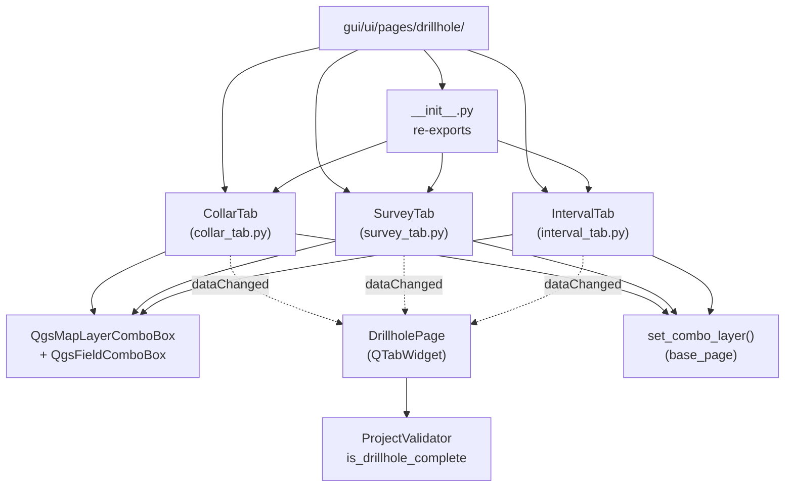

---
tags:
  - secinterp
  - code-walkthrough
  - gui
  - pages
aliases:
  - gui/ui/pages/drillhole/
  - CollarTab
  - IntervalTab
  - SurveyTab
cssclass: secinterp-note
---

# `gui/ui/pages/drillhole/` — Drillhole tabs (collar, survey, intervals)

> [!abstract] One-line summary
> Package `gui/ui/pages/drillhole/` (4 files): namespace of the three drillhole forms — `CollarTab` (collar), `SurveyTab` (deviations) and `IntervalTab` (lithological intervals) — with a shared mini-protocol (`get_data`/`dump`/`load`/`reset` + `dataChanged`) aggregated by `DrillholePage` in a `QTabWidget`.

**Path**: `gui/ui/pages/drillhole/` (4 files, ~477 lines)
**Main classes**: `CollarTab`, `SurveyTab`, `IntervalTab`
**Layer**: GUI (QGIS · forms with `QgsMapLayerComboBox` + `QgsFieldComboBox`)
**Tags**: #secinterp #gui #pages

---

## 🎯 Why does this package exist?

Configuring drillholes requires three distinct yet coherent forms: where the hole
starts (collar), how it deviates with depth (survey) and which lithology it
crosses (intervals). The package isolates them so the coordinator knows no widgets:

| Problem | Solution |
|---------|----------|
| Three forms with the same cycle (extract/persist/reset) | Shared mini-protocol on each tab + `dataChanged` signal |
| Pick a layer and then its fields without inconsistencies | Layer→field cascade: `layerChanged` → `field.setLayer(...)` |
| The collar may use geometry or X/Y columns | `chk_use_geom` + `_toggle_xy_fields` enable/disable X/Y |
| `DrillholePage` should not import 3 loose modules | `__init__.py` re-exports the 3 classes with explicit `__all__` |

> [!important] Architectural note
> **Tab-hosting** pattern: the package provides the tabs (content), `DrillholePage`
> provides the `QTabWidget` (container) and merges the dicts. No tab imports the
> page: the dependency always points inward to the package.

---

## 🧬 Relationship diagram



> [!tip] How to read
> Solid arrow = imports/inherits; dashed = emits a signal or delegates validation.
> The three tabs share QGIS widgets and the `set_combo_layer` helper but never
> import each other.

---

## 📦 Imports — architectural reading

```python
# gui/ui/pages/drillhole/__init__.py (complete, 9 lines)
"""Drillhole page sub-widgets (collar, survey, interval tabs)."""

from __future__ import annotations

from .collar_tab import CollarTab
from .interval_tab import IntervalTab
from .survey_tab import SurveyTab

__all__ = ["CollarTab", "IntervalTab", "SurveyTab"]
```

```python
# Shared header of the three tabs (collar_tab.py / survey_tab.py / interval_tab.py)
from __future__ import annotations

import contextlib
from typing import Any

from qgis.core import Qgis
from qgis.gui import QgsFieldComboBox, QgsMapLayerComboBox
from qgis.PyQt.QtCore import QCoreApplication, pyqtSignal
from qgis.PyQt.QtWidgets import QCheckBox, QGridLayout, QLabel, QWidget

from sec_interp.gui.ui.pages.base_page import set_combo_layer
from sec_interp.logger_config import get_logger
```

| # | Observation |
|---|-------------|
| ① | The `__init__` **does** re-export (unlike `pages/__init__.py`): `__all__` honoured. |
| ② | Tabs inherit `QWidget` directly, **not** `BasePage`: the protocol is conventional (duck typing), not inherited. |
| ③ | `QgsMapLayerComboBox` + `QgsFieldComboBox` in all three: layer selector + field mapping, the Extract pair. |
| ④ | `Qgis` (collar/survey/interval with proxy): filters the combo to vector layers. |
| ⑤ | `set_combo_layer` imported from the parent module: silent restore in `load`/`reset`. |
| ⑥ | `QCoreApplication` + `pyqtSignal`: per-tab `tr()` and own `dataChanged` signal. |

> [!note] Tabs without `BasePage`
> Deliberate choice: the tabs are too light for the `BasePage` `group_box` skeleton
> (the host page already provides the frame). The contract holds by shape: same
> methods, same signal, same dicts.

---

## 🏗️ Structure inventory

**Classes (one per module, all `QWidget` with a `dataChanged` signal):**

- `class CollarTab(QWidget)` — layer, identifier, X/Y/Z or geometry, depth (180 lines)
- `class SurveyTab(QWidget)` — layer, identifier, depth, azimuth, inclination (144 lines)
- `class IntervalTab(QWidget)` — layer, identifier, from/to, lithology (144 lines)

**Methods (identical across the three tabs):**

- `__init__(parent=None)` → `_setup_ui()`
- `tr(message)` — `QCoreApplication.translate("<Tab>", message)`
- `_setup_ui()` — `QGridLayout` of labels + combos
- `get_data()` / `dump()` / `load(data)` / `reset()`
- `connect_signals()` / `disconnect_signals()`
- Collar only: `_toggle_xy_fields(checked)` — switches X/Y fields per `chk_use_geom`

---

## 📁 Files in the package

| File | Lines | Role |
|---|--:|---|
| `__init__.py` | 9 | Re-exports `CollarTab`, `IntervalTab`, `SurveyTab` |
| [[#CollarTab\|collar_tab.py]] | 180 | Collar: layer, id, X/Y/Z or geometry, depth |
| [[#SurveyTab\|survey_tab.py]] | 144 | Deviations: id, depth, azimuth, inclination |
| [[#IntervalTab\|interval_tab.py]] | 144 | Intervals: id, from/to, lithology |

---

## 📖 Tab-by-tab walkthrough

### CollarTab

```python
class CollarTab(QWidget):
    dataChanged = pyqtSignal()

    # Widgets (c_ prefix):
    # c_layer: QgsMapLayerComboBox — collar layer
    # c_id:    QgsFieldComboBox — hole identifier
    # c_x, c_y, c_z: QgsFieldComboBox — coordinates (unless geometry is used)
    # c_depth: QgsFieldComboBox — total depth / EOH
    # chk_use_geom: QCheckBox — use point geometry instead of X/Y

    def _toggle_xy_fields(self, checked: bool): ...
    def get_data(self): ...  # collar_layer, collar_id, use_geometry, collar_x/y/z...
    def dump / load / reset: ...
```

The collar tab. `chk_use_geom.toggled` → `_toggle_xy_fields`: if the user picks
point geometry, the `c_x`/`c_y` combos disable (mapping columns makes no sense);
with columns, they enable. When `c_layer` changes, every field combo re-anchors
with `setLayer` to list only that layer's fields.

| Widget | Type | Extracted data |
|--------|------|----------------|
| `c_layer` | `QgsMapLayerComboBox` | Collar layer |
| `c_id` | `QgsFieldComboBox` | Hole identifier |
| `c_x` / `c_y` | `QgsFieldComboBox` | Easting / Northing (`use_geometry` false only) |
| `c_z` | `QgsFieldComboBox` | Collar elevation |
| `c_depth` | `QgsFieldComboBox` | Hole end depth |
| `chk_use_geom` | `QCheckBox` | Point geometry vs X/Y columns |

### SurveyTab

```python
class SurveyTab(QWidget):
    dataChanged = pyqtSignal()

    # Widgets (s_ prefix):
    # s_layer: QgsMapLayerComboBox — survey layer
    # s_id:    QgsFieldComboBox — hole identifier (join with collar)
    # s_depth: QgsFieldComboBox — measurement depth
    # s_azim:  QgsFieldComboBox — azimuth
    # s_incl:  QgsFieldComboBox — inclination
```

The directional-survey tab. No toggles: five combos in a layer→field cascade.
`s_id` is the join key with the collar `c_id`; `s_azim`/`s_incl` feed the core
trajectory engine (`trajectory_engine`) with already-decoupled `get_data` data.

| Widget | Type | Extracted data |
|--------|------|----------------|
| `s_layer` | `QgsMapLayerComboBox` | Survey layer |
| `s_id` | `QgsFieldComboBox` | Hole id (join with collar) |
| `s_depth` | `QgsFieldComboBox` | Measured depth |
| `s_azim` | `QgsFieldComboBox` | Leg azimuth |
| `s_incl` | `QgsFieldComboBox` | Leg inclination |

### IntervalTab

```python
class IntervalTab(QWidget):
    dataChanged = pyqtSignal()

    # Widgets (i_ prefix):
    # i_layer: QgsMapLayerComboBox — interval layer
    # i_id:    QgsFieldComboBox — hole identifier (join with collar)
    # i_from:  QgsFieldComboBox — interval start
    # i_to:    QgsFieldComboBox — interval end
    # i_lith:  QgsFieldComboBox — lithology code
```

The lithological-interval tab. Same layer→field cascade; `i_from`/`i_to` bound
the depth interval and `i_lith` the code the core crosses with section geology.
See [[interval_tab]] for the field-by-field detail.

| Widget | Type | Extracted data |
|--------|------|----------------|
| `i_layer` | `QgsMapLayerComboBox` | Interval layer |
| `i_id` | `QgsFieldComboBox` | Hole id (join with collar) |
| `i_from` / `i_to` | `QgsFieldComboBox` | Interval top / bottom |
| `i_lith` | `QgsFieldComboBox` | Interval lithology |

### Layer → field cascade pattern

All three tabs repeat the same wiring in `connect_signals`:

```python
# Schema (names per tab: c_* / s_* / i_*)
self.<x>_layer.layerChanged.connect(self.<x>_id.setLayer)
self.<x>_layer.layerChanged.connect(self.<x>_depth.setLayer)
# ... one connect per field combo ...
self.<x>_layer.layerChanged.connect(self.dataChanged.emit)
```

Changing the layer re-anchors **every** field combo (showing the new layer's
fields) and emits `dataChanged` so `DrillholePage` re-emits to the dialog.
`disconnect_signals` reverts each connection with `contextlib.suppress` against
double closes.

---

## 🗝️ Merged dictionary (`get_data`)

`DrillholePage.get_data()` merges the three dicts with `dict.update` in collar →
survey → interval order. Real keys consumed by `is_complete` and the core:

| Key | Source | Meaning |
|-----|--------|---------|
| `collar_layer` | `CollarTab` | Collar layer (object, later resolved to metadata) |
| `collar_id` | `CollarTab` | Hole identifier field |
| `use_geometry` | `CollarTab` | `True` for geometry (`chk_use_geom`), `False` for columns |
| `collar_x` / `collar_y` | `CollarTab` | Easting/Northing fields (`use_geometry` false only) |
| `survey_layer` | `SurveyTab` | Survey layer |
| `survey_id` / `survey_depth` | `SurveyTab` | Join with collar + measured depth |
| `survey_azim` / `survey_incl` | `SurveyTab` | Leg azimuth / inclination |
| `interval_layer` | `IntervalTab` | Interval layer |
| `interval_id` | `IntervalTab` | Join with collar |
| `interval_from` / `interval_to` | `IntervalTab` | Interval top / bottom |
| `interval_lith` | `IntervalTab` | Lithology code |

> [!tip] Prefixes as namespaces
> `collar_*`, `survey_*`, `interval_*` prevent merge collisions: three tabs can each
> own their `layer`/`id` without overwriting. Keep the prefix when adding fields.

---

## 🔄 Data flow

| Phase | Input | Transformation | Output |
|-------|-------|----------------|--------|
| Layer pick | `layerChanged` on `*_layer` | `setLayer` re-anchor of each field combo | New layer's fields |
| Editing | Field change / toggle | `dataChanged.emit()` per tab | `DrillholePage` re-emits |
| Extract | `tab.get_data()` × 3 | Combos → field names + flags | Merged dict (`collar_*`, `survey_*`, `interval_*`) |
| Completeness | Merged dict | `resolve_layer_metadata` + `ValidationParams` | `ProjectValidator.is_drillhole_complete` |
| Persistence | `dump()` / `load(dict)` | Via silent `set_combo_layer` | Restorable session without cascades |
| Reset | `reset()` | Defaults + `set_combo_layer(None)` where applicable | Clean form |

---

## 🏛️ Design patterns present

| Pattern | Where | Purpose |
|---------|-------|---------|
| **Tab-hosting** | Tabs vs `DrillholePage` | Swappable content under one `QTabWidget` |
| **Layer→field cascade** | `layerChanged` → `setLayer` | Fields always consistent with the chosen layer |
| **Signal guard** | `set_combo_layer`, `blockSignals` | Restore state without side effects |
| **Signal re-emit** | `dataChanged` per tab → page | Any tab change invalidates the whole |
| **Convention over inheritance** | Mini-protocol without `BasePage` | Same methods by shape, no inherited skeleton |

---

## 🧾 API summary

| Symbol | Signature / Inherits | Typical use |
|--------|----------------------|-------------|
| `CollarTab` | `QWidget` + `dataChanged` | `CollarTab()`; `tab.get_data()["collar_id"]` |
| `SurveyTab` | `QWidget` + `dataChanged` | `SurveyTab()`; azimuth/inclination per hole |
| `IntervalTab` | `QWidget` + `dataChanged` | `IntervalTab()`; from/to intervals + lithology |
| `get_data` | `() -> dict[str, Any]` | Extract with `collar_*` / `survey_*` / `interval_*` keys |
| `dump` / `load` | `() -> dict` / `(dict) -> None` | Silent persistence via `set_combo_layer` |
| `reset` | `() -> None` | Clears combos and toggles |
| `_toggle_xy_fields` | `(checked: bool) -> None` | Collar only: X/Y vs geometry |

---

## 🛡️ Error handling

- **Deleted layer**: if the referenced layer leaves the project, the combo goes
  empty and `get_data` returns `None`/empty string; the gate is
  `DrillholePage.is_complete()`, not a tab exception.
- **`load` with missing keys**: `load(data)` falls back to defaults on partial
  dicts (old sessions) without raising `KeyError`.
- **Defensive disconnection**: `disconnect_signals` tolerates already-removed
  connections.
- **No `SecInterpError` here**: tabs report state; the page/coordinator decides
  (see [[drillhole_page]]).

---

## 🧪 Associated tests

Real coverage under `tests/gui/`:

- `tests/gui/test_drillhole_page.py` — aggregates the 3 tabs: merged `get_data`,
  `dump`/`load`/`reset` and `is_complete` with mocked layers.
- `tests/gui/test_main_dialog_validation_manager.py` — drillhole completeness as a
  dialog validation gate.
- `tests/gui/test_multi_session_persistence.py` — `dump`/`load` of drillholes across
  sessions (tabs restore via `set_combo_layer`).

```bash
PYTHONPATH=.. uv run python3 -m unittest tests.gui.test_drillhole_page -v
PYTHONPATH=.. uv run python3 -m unittest tests.gui.test_multi_session_persistence -v
```

> [!tip] No per-tab tests
> There is no isolated `test_collar_tab.py`: tabs are tested through the
> coordinator, their only real consumer (Mock-first, `tests/base_test.py`).

---

## 🌐 i18n and user messages

- Each tab defines `tr()` with its own context (`"CollarTab"`, `"SurveyTab"`,
  `"IntervalTab"`): `QCoreApplication.translate("CollarTab", "Collars")`.
- `QGridLayout` labels (`QLabel`) + toggles go through `self.tr()` in `_setup_ui`:
  all visible text is `pylupdate`-extractable.
- Layer/field names come from the project (data, not literals): never translated,
  only displayed.

---

## 👀 Observations and notes

> [!success] Strengths
> - `__init__.py` honours `__all__`: one stable entry point.
> - `c_`/`s_`/`i_` prefixes prevent collisions when merging dicts.
> - Layer→field cascade + `set_combo_layer`: a field from another layer is impossible.

> [!warning] Points of attention
> - Tabs do not inherit `BasePage`: the contract is conventional; no linter checks it.
> - `_toggle_xy_fields` logic lives only in collar: another tab needing toggles
>   would duplicate the pattern.
> - Hand-built `QGridLayout` in 3 files: style changes repeat 3 times.

> [!question] Open questions
> - A `DrillholeTabBase(QWidget)` with `dataChanged` + generic layer→field cascade?
> - Move key prefixes (`collar_*`, …) to constants shared with the core?

---

## 🔗 Related notes

- [[Index]] — vault index
- [[collar_tab]] — individual note for `CollarTab`
- [[survey_tab]] — individual note for `SurveyTab`
- [[interval_tab]] — individual note for `IntervalTab`
- [[drillhole_page]] — coordinator hosting these tabs
- [[base_page]] — `set_combo_layer` and `BasePage` protocol
- [[gui_ui_pages]] — parent `pages/` package note
- [[trajectory_engine]] — core consumer of survey (hole trajectory)
- [[gui]] — GUI tree root note

---

*Note of the SecInterp Code Walkthrough v2 vault — v3.8.0*
