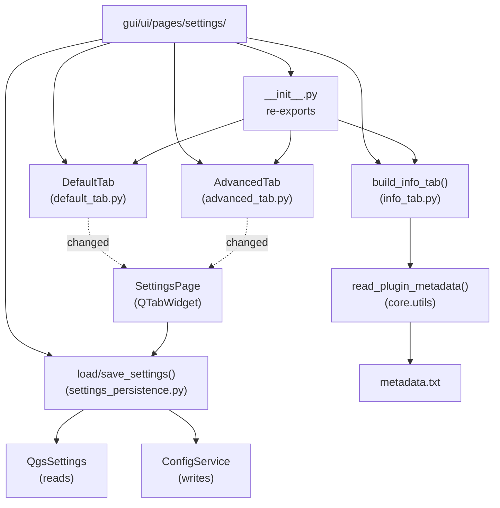

---
tags:
  - secinterp
  - code-walkthrough
  - gui
  - pages
aliases:
  - gui/ui/pages/settings/
  - AdvancedTab
  - DefaultTab
  - build_info_tab
  - load_settings
  - save_settings
cssclass: secinterp-note
---

# `gui/ui/pages/settings/` — Settings tabs (default, advanced, info)

> [!abstract] One-line summary
> Package `gui/ui/pages/settings/` (5 files): settings namespace — `DefaultTab` (what gets exported), `AdvancedTab` (3D toggles), `build_info_tab` (read-only metadata via `read_plugin_metadata`) and `settings_persistence` (`load_settings`/`save_settings`) — aggregated by `SettingsPage` in a `QTabWidget`.

**Path**: `gui/ui/pages/settings/` (5 files, ~416 lines)
**Main symbols**: `DefaultTab`, `AdvancedTab`, `build_info_tab`, `load_settings`, `save_settings`
**Layer**: GUI (QGIS · forms + persistence on `QgsSettings`/`ConfigService`)
**Tags**: #secinterp #gui #pages

---

## 🎯 Why does this package exist?

Plugin settings mix three distinct concerns: export selection, restricted 3D
features and plugin information. The package splits them into independent tabs
with decoupled persistence:

| Problem | Solution |
|---------|----------|
| Choose which layers to export + format + naming template | `DefaultTab`: 5 checkboxes + `combo_format` + `txt_naming` + reset |
| Enable 3D / drillhole-trace features without mixing with exports | `AdvancedTab`: `chk_enable_3d` + four `chk_3d_*` toggles |
| Show version, author and docs without allowing edits | `build_info_tab()`: function building a read-only `QWidget` |
| Read/write settings without coupling tabs to the store | `settings_persistence`: functional `load_settings` / `save_settings` |
| `SettingsPage` should not import 4 loose modules | `__init__.py` re-exports the 3 pieces with explicit `__all__` |

> [!important] Architectural note
> Same **tab-hosting** pattern as `drillhole/`: the package provides content,
> `SettingsPage` provides the `QTabWidget` and merges. Persistence lives in pure
> functions receiving the tabs as parameters (injection, not import).

---

## 🧬 Relationship diagram



> [!tip] How to read
> Solid arrow = imports/defines; dashed = emits a signal or reads. `info_tab` is a
> **function**, not a class: it emits no signals and persists nothing.

---

## 📦 Imports — architectural reading

```python
# gui/ui/pages/settings/__init__.py (complete, 9 lines)
"""Settings page sub-widgets (default, advanced, info tabs)."""

from __future__ import annotations

from .advanced_tab import AdvancedTab
from .default_tab import DefaultTab
from .info_tab import build_info_tab

__all__ = ["AdvancedTab", "DefaultTab", "build_info_tab"]
```

```python
# default_tab.py / advanced_tab.py (shared header)
from __future__ import annotations

import contextlib
from typing import Any

from qgis.PyQt.QtCore import QCoreApplication, pyqtSignal
from qgis.PyQt.QtWidgets import QCheckBox, QLabel, QVBoxLayout, QWidget, ...

# info_tab.py (complete header)
"""Plugin information (read-only) settings tab."""

from __future__ import annotations

from collections.abc import Callable

from qgis.PyQt.QtWidgets import QLabel, QVBoxLayout, QWidget

from sec_interp.core.utils.metadata_reader import read_plugin_metadata
from sec_interp.logger_config import get_logger

# settings_persistence.py (complete header)
"""Persistence helpers for the settings page tabs."""

from __future__ import annotations

from typing import Any

from sec_interp.logger_config import get_logger
```

| # | Observation |
|---|-------------|
| ① | The `__init__` re-exports classes **and** a function (`build_info_tab`): the info tab needs no class. |
| ② | `info_tab.py` is the only one importing from the core (`read_plugin_metadata`): cached `metadata.txt` reading. |
| ③ | `settings_persistence.py` imports **neither** `QgsSettings` **nor** `ConfigService`: it receives them as `Any` (dependency inversion). |
| ④ | `collections.abc.Callable` in `info_tab`: the translator is injected (`translate: Callable[[str], str]`). |
| ⑤ | `contextlib` in default/advanced: defensive teardown of checkboxes and format. |
| ⑥ | `_EXPORT_CHECKBOXES` (tuple in `default_tab.py`): the 5 checkbox names as data, not repeated. |

---

## 🏗️ Structure inventory

**Classes:**

- `class DefaultTab(QWidget)` — five `chk_exp_*` + `combo_format` + `txt_naming` + `btn_reset_export` (178 lines)
- `class AdvancedTab(QWidget)` — `chk_enable_3d` + four `chk_3d_*` (106 lines)

**Functions:**

- `def build_info_tab(translate, parent=None) -> QWidget` — read-only info tab (48 lines)
- `def load_settings(settings, default_tab, advanced_tab)` — `QgsSettings` → widgets (75 lines, half)
- `def save_settings(config_service, default_tab, advanced_tab)` — widgets → `ConfigService`

**Signals and helpers:**

- `changed = pyqtSignal()` on `DefaultTab` and `AdvancedTab` (the info tab emits none)
- `_EXPORT_CHECKBOXES` — tuple with the 5 export-checkbox names
- `_disconnect_checkboxes` / `_disconnect_format_settings` — fine-grained cleanup in `DefaultTab`

---

## 📁 Files in the package

| File | Lines | Role |
|---|--:|---|
| `__init__.py` | 9 | Re-exports `AdvancedTab`, `DefaultTab`, `build_info_tab` |
| [[#DefaultTab\|default_tab.py]] | 178 | Export selection + format + naming template |
| [[#AdvancedTab\|advanced_tab.py]] | 106 | 3D and drillhole-trace toggles |
| [[#build_info_tab\|info_tab.py]] | 48 | Function building the read-only info tab |
| [[#Persistence\|settings_persistence.py]] | 75 | Functional `load_settings` / `save_settings` |

---

## 📖 Symbol-by-symbol walkthrough

### DefaultTab

```python
_EXPORT_CHECKBOXES = (
    "chk_exp_topo",
    "chk_exp_geol",
    "chk_exp_struct",
    "chk_exp_drill",
    "chk_exp_interp",
)

class DefaultTab(QWidget):
    changed = pyqtSignal()

    # chk_exp_topo/geol/struct/drill/interp: QCheckBox — what gets exported
    # combo_format: QComboBox — file format (e.g. Shapefile)
    # txt_naming: QLineEdit — template (e.g. "{filename}_{profile}")
    # btn_reset_export: QPushButton — restore default values

    def get_data(self): ...
    def reset_to_defaults(self): ...
    def connect_signals / disconnect_signals: ...
    def _disconnect_checkboxes(self): ...
    def _disconnect_format_settings(self): ...
```

The default-export tab. The 5 checkboxes decide which layers the export generates
(`topo`, `geol`, `struct`, `drill`, `interp`); `combo_format` the file format;
`txt_naming` the naming template; `btn_reset_export` restores defaults via
`reset_to_defaults`. Every change emits `changed` so
`SettingsPage._on_settings_changed` persists immediately.

| Widget | Role |
|--------|------|
| `chk_exp_topo` / `chk_exp_geol` / `chk_exp_struct` | Export topo / geology / structures |
| `chk_exp_drill` / `chk_exp_interp` | Export drillholes / interpretations |
| `combo_format` | Output file format |
| `txt_naming` | Output filename template |
| `btn_reset_export` | Restores default values |

### AdvancedTab

```python
class AdvancedTab(QWidget):
    changed = pyqtSignal()

    # chk_enable_3d:    QCheckBox — master 3D feature switch
    # chk_3d_traces:    QCheckBox — 3D drillhole traces
    # chk_3d_intervals: QCheckBox — 3D intervals
    # chk_3d_original:  QCheckBox — original geometry
    # chk_3d_projected: QCheckBox — projected geometry

    def get_data(self): ...
    def reset_to_defaults(self): ...
    def connect_signals / disconnect_signals: ...
```

The advanced/3D features tab. `chk_enable_3d` is the master switch; the four
`chk_3d_*` refine what gets generated in 3D (traces, intervals, original,
projected). Note `chk_3d_projected` persists with a `False` default while the rest
default to `True` (see persistence): projected geometry is opt-in.

### build_info_tab

Honest walkthrough of the complete source (`info_tab.py`, 48 lines):

```python
def build_info_tab(translate: Callable[[str], str], parent: QWidget | None = None) -> QWidget:
    widget = QWidget(parent)
    layout = QVBoxLayout(widget)

    try:
        metadata = read_plugin_metadata()
        layout.addWidget(QLabel(translate("<b>Plugin Information</b>")))
        layout.addWidget(QLabel(translate(f"{metadata['name']} v{metadata['version']}")))
        layout.addWidget(QLabel(translate(f"Developed by {metadata['author']}")))
        layout.addWidget(QLabel(translate(f"Contact: {metadata['email']}")))

        if metadata.get("homepage"):
            doc_label = QLabel(f"<a href='{metadata['homepage']}'>{translate('Documentation')}</a>")
            doc_label.setOpenExternalLinks(True)
            layout.addWidget(doc_label)

    except (FileNotFoundError, ValueError) as e:
        logger.warning(f"Metadata read error: {e}")
        layout.addWidget(QLabel(translate("<b>Plugin Information</b>")))
        layout.addWidget(QLabel(translate("Sec Interp (version unavailable)")))
        layout.addWidget(QLabel(translate("Metadata missing")))

    layout.addStretch()
    return widget
```

| Aspect | Faithful to source |
|--------|--------------------|
| Signature | Injected `translate` + optional `parent`; returns the mounted `QWidget` |
| Happy path | 4 `QLabel`s: bold title, `name vversion`, author, contact |
| Link | Only with `homepage`: `QLabel` with HTML anchor + `setOpenExternalLinks(True)` |
| Failure path | Catches `FileNotFoundError`/`ValueError` (raised by `read_plugin_metadata`), `logger.warning`, 3 degradation labels |
| Closing | `addStretch()` pushes content up, as in `BasePage` |

> [!note] Function, not class
> The info tab has no state or signals: building it is a pure function of
> `(translate, parent)`. `SettingsPage` calls it as `build_info_tab(self.tr)`, so
> it translates with the page context.

### Persistence

```python
def load_settings(settings: Any, default_tab: Any, advanced_tab: Any) -> None:
    enabled_3d = settings.value("SecInterp/enable_3d", True, type=bool)
    advanced_tab.chk_enable_3d.setChecked(enabled_3d)
    default_tab.chk_exp_topo.setChecked(settings.value("SecInterp/exp_topo", True, type=bool))
    # ... exp_geol / exp_struct / exp_drill / exp_interp (default True) ...
    default_fmt = settings.value("SecInterp/export_format", "Shapefile", type=str)
    # ... combo_format.setCurrentIndex(findText(default_fmt)) ...
    default_tab.txt_naming.setText(
        settings.value("SecInterp/export_naming", "{filename}_{profile}", type=str))
    advanced_tab.chk_3d_traces.setChecked(settings.value("SecInterp/drill_3d_traces", True, type=bool))
    advanced_tab.chk_3d_intervals.setChecked(settings.value("SecInterp/drill_3d_intervals", True, type=bool))
    advanced_tab.chk_3d_original.setChecked(settings.value("SecInterp/drill_3d_original", True, type=bool))
    advanced_tab.chk_3d_projected.setChecked(settings.value("SecInterp/drill_3d_projected", False, type=bool))

def save_settings(config_service: Any, default_tab: Any, advanced_tab: Any) -> None:
    config_service.set("enable_3d", advanced_tab.chk_enable_3d.isChecked())
    config_service.set("exp_topo", default_tab.chk_exp_topo.isChecked())
    # ... remaining flags + format + naming ...
```

Deliberate asymmetry: it **reads** from `QgsSettings` (`SecInterp/*` keys with
defaults) and **writes** via `ConfigService` (`config_service.set(...)`). Tabs know
no store: they receive already-built widgets and mutate/read them. `SettingsPage`
orchestrates: `_load_settings` at build time, `_on_settings_changed` on `changed`.

| Key | Widget | Default |
|-----|--------|---------|
| `SecInterp/enable_3d` | `chk_enable_3d` | `True` |
| `SecInterp/exp_topo` / `exp_geol` / `exp_struct` | `chk_exp_*` | `True` |
| `SecInterp/exp_drill` / `exp_interp` | `chk_exp_*` | `True` |
| `SecInterp/export_format` | `combo_format` | `"Shapefile"` |
| `SecInterp/export_naming` | `txt_naming` | `"{filename}_{profile}"` |
| `SecInterp/drill_3d_traces` / `intervals` / `original` | `chk_3d_*` | `True` |
| `SecInterp/drill_3d_projected` | `chk_3d_projected` | `False` (opt-in) |

---

## 🔄 Data flow

| Phase | Input | Transformation | Output |
|-------|-------|----------------|--------|
| Construction | `SettingsPage._setup_ui` | `DefaultTab()` + `AdvancedTab()` + `build_info_tab(self.tr)` | 3 tabs in the `QTabWidget` |
| Load | `_load_settings` | `load_settings(QgsSettings, default_tab, advanced_tab)` | Widgets with persisted values |
| Editing | Toggle / text / format | `changed.emit()` per tab | `_on_settings_changed` → `save_settings` |
| Extract | `get_data()` | default + advanced merged | Settings dict towards export/core |
| Reset | `btn_reset_export` | `reset_to_defaults()` on both tabs | Factory values (and persisted) |
| Info | `read_plugin_metadata()` | `metadata.txt` (cached) → `QLabel`s | Read-only or degraded tab |

---

## 🏛️ Design patterns present

| Pattern | Where | Purpose |
|---------|-------|---------|
| **Tab-hosting** | Tabs vs `SettingsPage` | Swappable content under one `QTabWidget` |
| **Functional builder** | `build_info_tab` | Build a stateless tab as a pure function |
| **Translator injection** | `translate: Callable[[str], str]` | i18n without inheriting `QWidget` or coupling context |
| **Functional persistence** | `load/save_settings` with tabs as params | Swappable stores (`QgsSettings`, `ConfigService`, mocks) |
| **Graceful degradation** | `except (FileNotFoundError, ValueError)` | No `metadata.txt` still yields an info tab, not a crash |

---

## 🧾 API summary

| Symbol | Signature / Inherits | Typical use |
|--------|----------------------|-------------|
| `DefaultTab` | `QWidget` + `changed` | `DefaultTab()`; `get_data()` → `exp_*` flags + format |
| `AdvancedTab` | `QWidget` + `changed` | `AdvancedTab()`; `get_data()` → `enable_3d` + `3d_*` flags |
| `build_info_tab` | `(translate, parent=None) -> QWidget` | `build_info_tab(self.tr)` in `SettingsPage` |
| `load_settings` | `(settings, default_tab, advanced_tab) -> None` | Restore from `QgsSettings` |
| `save_settings` | `(config_service, default_tab, advanced_tab) -> None` | Persist via `ConfigService` |
| `reset_to_defaults` | `() -> None` | Both tabs; invoked by `btn_reset_export` |

---

## 🛡️ Error handling

- **Missing `metadata.txt`**: `read_plugin_metadata` raises `FileNotFoundError`;
  `build_info_tab` catches it alongside `ValueError` (missing required fields) and
  shows degradation labels + `logger.warning`. The tab is never empty.
- **Unknown format**: if the persisted `export_format` is absent from the combo,
  `findText` returns `-1` and the index stays untouched (`index >= 0` guard).
- **Missing `homepage`**: the documentation link is simply not added (falsy
  `metadata.get("homepage")` → skipped).
- **Defensive disconnection**: `_disconnect_checkboxes` / `_disconnect_format_settings`
  tolerate already-removed connections.

---

## 🧪 Associated tests

Real coverage under `tests/gui/`:

- `tests/gui/test_settings_page.py` — default+advanced merge, `get_data` and the
  `SettingsPage` cycle over these tabs.
- `tests/gui/test_dialog_settings_persistence.py` — `load_settings`/`save_settings`
  with mocked stores (`SecInterp/*` keys, defaults, `projected` opt-in).
- `tests/gui/test_main_dialog_settings.py` — settings as part of the main dialog.
- `tests/gui/test_multi_session_persistence.py` — values surviving across sessions.

```bash
PYTHONPATH=.. uv run python3 -m unittest tests.gui.test_settings_page -v
PYTHONPATH=.. uv run python3 -m unittest tests.gui.test_dialog_settings_persistence -v
```

---

## 🌐 i18n and user messages

- `DefaultTab.tr` / `AdvancedTab.tr`: `QCoreApplication.translate("<Class>", msg)`.
- `build_info_tab` has no `tr` of its own: it uses the injected `translate`, so its
  strings belong to the `SettingsPage` context.
- Documented nuance: `translate(f"{metadata['name']} v{metadata['version']}")`
  translates a data value (name/version from `metadata.txt`), not a code literal:
  `pylupdate` does not extract it as a source string. Extractable literals are
  `"Plugin Information"`, `"Documentation"`, `"Metadata missing"`, and the like.
- `"Documentation"` link with HTML anchor: visible text translates, the URL does not.

---

## 👀 Observations and notes

> [!success] Strengths
> - Decoupled persistence: tabs import no store.
> - Functional, degradable `build_info_tab`: 48 lines with no state or signals.
> - `_EXPORT_CHECKBOXES` as a tuple: iteration instead of 5 repeated blocks.

> [!warning] Points of attention
> - `QgsSettings` (reads) vs `ConfigService` (writes) asymmetry: two namespaces to
>   keep synchronized by hand.
> - `chk_3d_projected` defaults `False` against `True` for the rest: an easy-to-miss
>   exception when adding toggles.
> - Translating `f"{name} v{version}"` (data) suggests i18n coverage `pylupdate`
>   does not provide.

> [!question] Open questions
> - Unify reads and writes on `ConfigService` for a single namespace?
> - Turn `build_info_tab` into a class if the info tab ever needs state?

---

## 🔗 Related notes

- [[Index]] — vault index
- [[advanced_tab]] — individual note for `AdvancedTab`
- [[default_tab]] — individual note for `DefaultTab`
- [[settings_persistence]] — individual note for `load/save_settings`
- [[settings_page]] — coordinator hosting these tabs
- [[metadata_reader]] — `read_plugin_metadata` used by the info tab
- [[gui_ui_pages]] — parent `pages/` package note
- [[dialog_settings_persistence]] — dialog-level persistence
- [[gui]] — GUI tree root note

---

*Note of the SecInterp Code Walkthrough v2 vault — v3.8.0*
