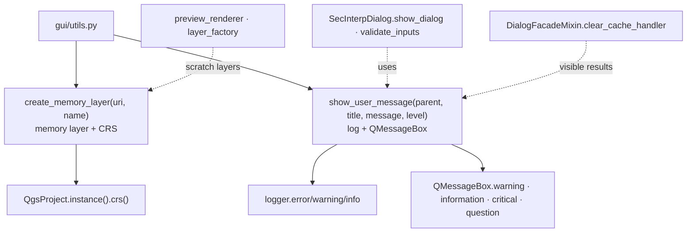

---
tags:
  - secinterp
  - code-walkthrough
  - gui
  - utils
aliases:
  - utils.py
  - create_memory_layer
  - show_user_message
cssclass: secinterp-note
---

# `gui/utils.py`

> [!abstract] One-line summary
> Two cross-cutting GUI helpers: `create_memory_layer` (scratch layers with the project CRS) and `show_user_message` (`QMessageBox` with automatic per-level logging).

**Path**: `gui/utils.py` (76 lines)
**Main functions**: `create_memory_layer(uri, name)`, `show_user_message(parent, title, message, level="warning")`
**Layer**: GUI (Present utilities · QGIS-dependent, `core/`-agnostic)
**Tags**: #secinterp #gui #utils

---

## 🎯 Why does this file exist?

Creating scratch layers and showing warnings are the plugin's two most repeated GUI operations. Without this module, every manager would reinvent `QgsVectorLayer("memory")` and `QMessageBox` with its own logging:

| Problem | Solution |
|---------|----------|
| Memory layers with no CRS or no validation | `create_memory_layer` assigns the project CRS, returns `None` on failure |
| Warnings that never reach the log | `show_user_message` logs every message before showing it |
| A different `QMessageBox` in each manager | One per-`level` dispatch with consistent styling |
| Yes/no questions with ad-hoc buttons | `"question"` level with `Yes\|No` and the pressed button returned |

> [!important] Architectural note
> A module of pure presentation functions: it imports no managers, pages, or anything from `core/`. It is a leaf of the dependency graph — [[main_dialog]] and the managers call it; it calls nobody in the plugin except `logger_config`.

---

## 🧬 Relationship diagram



> [!tip] How to read
> Solid arrow = defines/calls; dashed = consumers (dialog, managers, renderers). The module never knows its callers.

---

## 📦 Imports — architectural reading

```python
# gui/utils.py
from __future__ import annotations

from typing import Any

from qgis.core import QgsProject, QgsVectorLayer
from qgis.PyQt.QtWidgets import QMessageBox

from sec_interp.logger_config import get_logger
```

| # | Observation |
|---|-------------|
| ① | `QgsVectorLayer` + `QgsProject`: the minimum to manufacture memory layers with a real CRS. |
| ② | `QMessageBox` is the only widget imported: the module shows, never builds complex dialogs. |
| ③ | Module-level `logger = get_logger(__name__)`: logging is part of the contract, not an afterthought. |
| ④ | `Any` on `parent` and return: accepts any parent widget, returns a button or `None` per level. |

---

## 🏗️ Structure inventory

**Functions (2, both module-level, no classes):**

| Function | Signature | Return |
|---|---|---|
| `create_memory_layer` | `(uri: str, name: str)` | `QgsVectorLayer \| None` |
| `show_user_message` | `(parent: Any, title: str, message: str, level: str = "warning")` | `Any` (button on `"question"`, `None` otherwise) |

No classes, no state, no `__init__`: the most functional module in `gui/`.

---

## 📁 Where it lives inside `gui/`

| Neighbor | Relationship with this module |
|---|---|
| [[main_dialog]] | `show_dialog` and `validate_inputs` delegate to `show_user_message` |
| [[dialog_message_mixin]] | `handle_error` uses `show_dialog` (modal, unlike the dual `push_message`) |
| [[preview_layer_factory]] | Builds preview layers; same manufacturing family as `create_memory_layer` |
| [[preview_renderer]] | Registers scratch layers in the project (which the lifecycle cleans) |
| [[main_dialog_utils]] | The other helpers module, but for entities; this one is for presentation |

---

## 📖 Function-by-function walkthrough

### `create_memory_layer` — memory with CRS

```python
def create_memory_layer(uri: str, name: str) -> QgsVectorLayer | None:
    """Create a memory layer and assign the current project CRS.

    Args:
        uri: Memory provider URI (e.g. "LineString" or "Point?field=...").
        name: Display name for the layer.

    Returns:
        The created layer, or None if creation failed.

    """
    layer = QgsVectorLayer(uri, name, "memory")
    if not layer.isValid():
        logger.error(f"Failed to create memory layer: {name}")
        return None

    project_crs = QgsProject.instance().crs()
    if project_crs.isValid():
        layer.setCrs(project_crs)

    return layer
```

| Step | Detail |
|---|---|
| Build | `QgsVectorLayer(uri, name, "memory")`: the `uri` describes geometry and fields (`"Point?field=id:int"`) |
| Validate | `isValid()` + `logger.error` + `None`: the caller decides (retry, warn, abort) |
| CRS | Assigned only if the project CRS is valid: with no project, the layer keeps a null CRS instead of failing |

> [!note] `None` as contract, not exception
> Returning `None` instead of raising forces the caller to check, but stops a scratch-layer failure (operational, recoverable) from becoming a crash. Tests mock `layer.isValid()` to `True` for the happy path (see the `tests/base_test.py` convention).

### `show_user_message` — warning with a log

```python
def show_user_message(parent: Any, title: str, message: str, level: str = "warning") -> Any:
    # Log the message
    if level in {"error", "critical"}:
        logger.error(f"{title}: {message}")
    elif level == "warning":
        logger.warning(f"{title}: {message}")
    else:
        logger.info(f"{title}: {message}")

    # Show message box
    if level == "warning":
        return QMessageBox.warning(parent, title, message)
    elif level == "info":
        return QMessageBox.information(parent, title, message)
    elif level in {"error", "critical"}:
        return QMessageBox.critical(parent, title, message)
    elif level == "question":
        return QMessageBox.question(
            parent,
            title,
            message,
            QMessageBox.StandardButton.Yes | QMessageBox.StandardButton.No,
        )
    return None
```

Deliberate double dispatch: log severity first, box kind second. Unknown levels fall into `logger.info` + `return None` (no box): silent degradation documented by the trailing `return None`.

| `level` | Log | Box | Return |
|---|---|---|---|
| `"warning"` (default) | `warning` | `QMessageBox.warning` | box value |
| `"info"` | `info` | `QMessageBox.information` | box value |
| `"error"` / `"critical"` | `error` | `QMessageBox.critical` | box value |
| `"question"` | `info` | `Yes \| No` | pressed `StandardButton` |
| other | `info` | none | `None` |

> [!warning] Two different defaults
> `show_user_message` defaults to `level="warning"`; `SecInterpDialog.show_dialog` wraps it with `level="info"`. Calling the helper directly yields a warning; going through the dialog yields an informational. Not a bug, but every call site needs its signature read.

---

## ⚖️ `show_user_message` vs `push_message`

| Aspect | `show_user_message` (this module) | `push_message` ([[dialog_message_mixin]]) |
|---|---|---|
| Modality | Modal (`QMessageBox` blocks) | Non-modal (bar + panel) |
| Targets | One box + log | QGIS message bar + `results_text` |
| Levels | `warning/info/error/critical/question` (`str`) | `Qgis.MessageLevel` (enum) |
| Useful return | Pressed button on `"question"` | Always `None` |
| Without `iface` | Works (only needs `parent`) | Degrades to `_NoOpMessageBar` + panel |
| Typical use | `validate_inputs`, `handle_error` | Progress, non-blocking notices |

## 🧪 Test example (mock-first)

```python
# tests/gui/test_gui_utils.py — shape of the real tests
def test_unknown_level_returns_none_without_box(self):
    with patch("sec_interp.gui.utils.QMessageBox") as box:
        assert show_user_message(None, "T", "M", level="nope") is None
        box.warning.assert_not_called()
```

Unknown level: no box, no exception, with a log. The test freezes that contract so nobody "fixes" it by showing a default box.

---

## 🔄 Data flow

| Phase | Input | Transformation | Output |
|---|---|---|---|
| Scratch layer | `uri` + `name` | `QgsVectorLayer("memory")` + project CRS | Valid layer or logged `None` |
| Notice | `(parent, title, message, level)` | Severity log + per-level `QMessageBox` | Pressed button or `None` |
| Question | `level="question"` | `Yes\|No` box | `StandardButton` for branching |
| Odd level | Unknown `level` | Log only, no box | Silent `None` |

---

## 🏛️ Design patterns present

| Pattern | Where | Purpose |
|---|---|---|
| **Helper module (pure functions)** | Whole module | Reuse with no state or inheritance |
| **Null return** | `create_memory_layer` | Recoverable failure without exceptions |
| **Level dispatch** | `show_user_message` | One entry point for 4 boxes + log |
| **Log-then-show** | Internal order | Every visible warning lands in the log |

---

## 🧾 API summary

| Symbol | Signature | Typical use |
|---|---|---|
| `create_memory_layer` | `(uri: str, name: str) -> QgsVectorLayer \| None` | `create_memory_layer("LineString", self.tr("Section"))` |
| `show_user_message` | `(parent, title, message, level="warning") -> Any` | `show_user_message(self, t, m, level="critical")` |

---

## 🛡️ Error handling

`create_memory_layer` validates and returns `None` with `logger.error`; it never raises. `show_user_message` never validates `parent` (Qt fails loudly if invalid) and tolerates unknown levels with `None`. House rule: operational, recoverable failures (scratch layer) are signaled with `None`; user decisions (question) branch on the returned button.

---

## 🧪 Associated tests

Real, direct coverage in `tests/gui/test_gui_utils.py`:

- Valid layer creation (mock with `isValid() → True`) and project-CRS assignment.
- Creation failure (`isValid() → False`) → `None` plus `logger.error`.
- `show_user_message` dispatch per level: `warning`/`information`/`critical`/`question`.
- Unknown level → `None` with no box.

The only one of the seven modules with its own dedicated test: proof that 76 pure lines test fine without real QGIS.

---

## 👀 Observations and notes

> [!success] Strengths
> - Two functions, zero state, zero plugin dependencies: the most testable module in `gui/`.
> - Log-then-show guarantees traceability of every visible warning.
> - `None` on layers avoids crashes over scratch resources.
> - Dedicated test (`test_gui_utils.py`), rare in the GUI layer.

> [!warning] Points of attention
> - Divergent level defaults between helper (`"warning"`) and `show_dialog` (`"info"`): a reading trap.
> - Silent unknown level (`None`, no box): a typo in `level=` makes the warning vanish.
> - `f"{title}: {message}"` in logs without lazy `%s`: formatting cost even when the level is off.
> - No `parent=None` default: every call must pass an explicit parent.

> [!question] Open questions
> - Unify the default to `"warning"` in `show_dialog` too, or document the difference?
> - Validate `level` with `Literal["warning","info","error","critical","question"]` to catch typos in typing?

---

## 🔗 Related notes

- [[Index]] — vault index
- [[main_dialog]] — `show_dialog` and `validate_inputs` over this helper
- [[dialog_message_mixin]] — `handle_error` via `show_dialog`; `push_message` as the non-modal alternative
- [[dialog_facade_mixin]] — `clear_cache_handler` and visible results
- [[preview_layer_factory]] — preview-layer manufacturing (same family)
- [[preview_renderer]] — scratch layers registered in the project
- [[dialog_lifecycle_mixin]] — cleanup of those layers (scratch-layer fix)
- [[main_dialog_utils]] — the other helpers module (entities vs presentation)
- [[core_utils___init___py]] — core utilities facade (contrast with GUI utilities)

---

*Note of the SecInterp Code Walkthrough v2 vault — v3.8.0*
