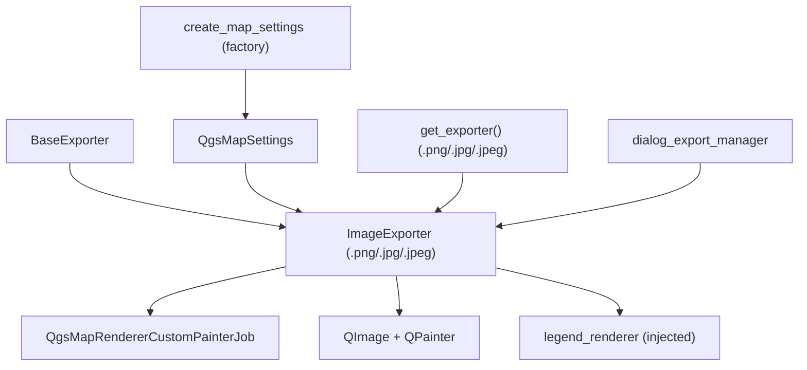

---
tags:
  - secinterp
  - code-walkthrough
  - exporters
  - raster
aliases:
  - image_exporter.py
  - ImageExporter
cssclass: secinterp-note
---

# `exporters/image_exporter.py`

> [!abstract] One-line summary
> Raster image exporter (PNG/JPG): renders a `QgsMapSettings` with `QgsMapRendererCustomPainterJob` onto a `QImage` with antialiasing, draws the optional legend, and saves via `QImage.save()`.

**Path**: `exporters/image_exporter.py` (72 lines)
**Main class**: `ImageExporter(BaseExporter)`
**Layer**: Exporters (coupled to `qgis.core` + `QtGui`: real map rendering)
**Tags**: #secinterp #exporters #raster

---

## 🎯 Why does this file exist?

The profile preview lives on the QGIS canvas. Reports, presentations and smoke tests
need that view **frozen** into a raster file:

| Problem | Solution |
|---------|----------|
| Freeze the canvas render into a file | `QgsMapRendererCustomPainterJob` over a `QImage` |
| PNG for quality, JPG for weight | `get_supported_extensions` + `QImage.save()` by extension |
| Jagged profile lines | `Antialiasing` + `SmoothPixmapTransform` |
| Legend orphaned from the map | `legend_renderer.draw_legend()` injected via settings |
| Qt5 vs Qt6 (`QImage.Format` moved) | `getattr(QImage, "Format", QImage).Format_ARGB32` shim |

> [!important] Architectural note
> Member of the **render** family (`image`/`pdf`/`svg`): its `data` is not DTOs but an
> already-configured `QgsMapSettings` (layers, extent, DPI), built upstream by
> `create_map_settings` (see [[orchestrator]]) or the `dialog_export_manager`.

---

## 🧬 Relationship diagram



> [!tip] How to read
> The `QgsMapSettings` arrives fully cooked (layers + extent + background).
> `ImageExporter` only paints: map render, optional legend, `save()`. The legend
> arrives injected, never built here.

---

## 📦 Imports — architectural reading

```python
# exporters/image_exporter.py
from __future__ import annotations

from pathlib import Path

from qgis.core import QgsMapRendererCustomPainterJob, QgsMapSettings
from qgis.PyQt.QtCore import QRectF, QSize
from qgis.PyQt.QtGui import QColor, QImage, QPainter

from sec_interp.logger_config import get_logger

from .base_exporter import BaseExporter
```

| # | Observation |
|---|-------------|
| ① | `QgsMapRendererCustomPainterJob`: **synchronous** render (`start()` + `waitForFinished()`) onto an owned painter, not the canvas. |
| ② | `QtGui` (`QColor`, `QImage`, `QPainter`): the only data exporter that paints pixels; the rest write geometries or text. |
| ③ | No `typing.Any`: signatures use real Qt/QGIS types (`QgsMapSettings`, `Path`). |
| ④ | `QRectF`/`QSize` size the image and the legend box with the same `(width, height)`. |
| ⑤ | `get_logger`: any render exception is logged and returns `False`. |

---

## 🏗️ Structure inventory

**Classes:** `class ImageExporter(BaseExporter)` — 1 class, 2 methods.

**Methods:**

- `get_supported_extensions() -> list[str]` — `[".png", ".jpg", ".jpeg"]`
- `export(output_path: Path, map_settings: QgsMapSettings) -> bool` — render + legend + `save()`

**Consumed settings:**

| Key | Default | Role |
|-----|---------|------|
| `width` | `800` | Width in pixels |
| `height` | `600` | Height in pixels |
| `background_color` | `QColor(255, 255, 255)` | Background before painting |
| `show_legend` | `True` | Legend switch |
| `legend_renderer` | `None` | Object with `draw_legend(painter, rect)` |

---

## 📁 Files in the package

| File | Lines | Role |
|---|--:|---|
| `__init__.py` | 81 | `get_exporter()`: `.png`/`.jpg`/`.jpeg` → `ImageExporter` |
| `base_exporter.py` | 137 | Inherited contract (see [[base_exporter]]) |
| `image_exporter.py` | 72 | `ImageExporter` (this note) |
| `pdf_exporter.py` | 79 | Print twin (same render+legend sequence) |
| `svg_exporter.py` | 85 | Scalable twin (same render+legend sequence) |
| `vector_exporter.py` | 122 | Geospatial data (the image keeps no georeference) |
| `csv_exporter.py` | 58 | Exact tabular data behind the image |

> [!note] Render triptych
> `image`/`pdf`/`svg` share the **same choreography**: size settings → painter +
> `QgsMapRendererCustomPainterJob` → optional legend → save. Only the device changes
> (QImage, QPdfWriter, QSvgGenerator).

---

## 📖 Method-by-method walkthrough

### `get_supported_extensions`

```python
def get_supported_extensions(self) -> list[str]:
    """Get supported image extensions."""
    return [".png", ".jpg", ".jpeg"]
```

The final format is decided by the `output_path` extension in `QImage.save()`: `.png`
lossless (recommended for thin profile lines), `.jpg`/`.jpeg` compressed for weight.
The inherited `validate_path()` accepts uppercase (`.PNG`).

### `export` — full render

```python
def export(self, output_path: Path, map_settings: QgsMapSettings) -> bool:
    """Export map to raster image.

    Args:
        output_path: Output file path
        map_settings: QgsMapSettings instance configured for rendering

    Returns:
        True if export successful, False otherwise

    """
    try:
        width = self.get_setting("width", 800)
        height = self.get_setting("height", 600)
        background_color = self.get_setting("background_color", QColor(255, 255, 255))

        # Create image (Qt5/Qt6 compatibility for enum)
        img_format = getattr(QImage, "Format", QImage).Format_ARGB32
        image = QImage(QSize(width, height), img_format)
        image.fill(background_color)

        # Setup painter
        painter = QPainter(image)
        painter.setRenderHint(QPainter.RenderHint.Antialiasing)
        painter.setRenderHint(QPainter.RenderHint.SmoothPixmapTransform)

        # Render map
        job = QgsMapRendererCustomPainterJob(map_settings, painter)
        job.start()
        job.waitForFinished()

        # Draw legend if available
        show_legend = self.get_setting("show_legend", True)
        legend_renderer = self.get_setting("legend_renderer")
        if legend_renderer and show_legend:
            legend_renderer.draw_legend(painter, QRectF(0, 0, width, height))

        painter.end()

        # Save image

        return image.save(str(output_path))

    except Exception:
        logger.exception(f"Image export failed for {output_path}")
        return False
```

| Step | Detail |
|------|--------|
| Size and background | `width`/`height`/`background_color` from settings; the background is filled **before** painting to avoid memory garbage |
| Qt5/Qt6 format | `getattr(QImage, "Format", QImage)` resolves the enum on both Qt versions (see migration note) |
| Hints | `Antialiasing` smooths profile lines; `SmoothPixmapTransform` smooths rescaled rasters |
| Render | `job.start()` + `waitForFinished()`: blocks until done (called from a `QgsTask`, never the GUI thread) |
| Legend | Only with a renderer **and** `show_legend`: `draw_legend(painter, QRectF(0, 0, width, height))` |
| Save | `image.save(str(path))` returns `bool`: that is the return value (codec failure → `False`) |
| Failure | Any exception → traceback log + `False` |

> [!important] Synchronous render in background
> `waitForFinished()` blocks the calling thread. That is correct because the GUI
> invokes it inside a `QgsTask` (see [[dialog_export_manager]]); calling it from the
> GUI thread would freeze the interface.

> [!note] Qt5/Qt6 compatibility
> On Qt5 the enum lives at `QImage.Format_ARGB32`; on Qt6 at
> `QImage.Format.Format_ARGB32`. The `getattr` with the `QImage` default covers both
> (see the QGIS 4.x migration skill).

---

## 🔄 Data flow

| Phase | Input | Transformation | Output |
|-------|-------|----------------|--------|
| Settings | `width`, `height`, `background_color` | `QImage(w, h, ARGB32)` + `fill()` | blank canvas |
| Render | `QgsMapSettings` (layers + extent) | synchronous `QgsMapRendererCustomPainterJob` | painted map |
| Legend | injected `legend_renderer` | `draw_legend(painter, rect)` | legend overlay |
| Save | complete `QImage` | `save(str(path))` per extension | `.png`/`.jpg` + `bool` |

---

## 🧩 PNG vs JPG: when to use each

| Format | Advantage | Cost | Recommended use |
|--------|-----------|------|-----------------|
| `.png` | Lossless: crisp thin lines and text | Larger file | Reports and archive |
| `.jpg` | Small weight | Edge and text artefacts | Quick view / email |

> [!warning] The image is not geospatial
> A PNG/JPG stores no CRS or georeference: it is for **viewing**, not measuring.
> Measurable data travels in the sibling SHP/GPKG + CSV.

---

## 🏛️ Design patterns present

| Pattern | Where | Purpose |
|---------|-------|---------|
| **Template Method** | `export()` over [[base_exporter]] | Render with `bool` return |
| **Dependency Injection** | `map_settings` + `legend_renderer` via parameters/settings | The exporter builds neither scene nor legend |
| **Strategy (device)** | `QImage` vs `QPdfWriter` vs `QSvgGenerator` | Same choreography, three outputs |
| **Compat shim** | `getattr(QImage, "Format", QImage)` | Support Qt5 and Qt6 without branching |

---

## 🧾 API summary

| Symbol | Signature / Inherits | Typical use |
|--------|----------------------|-------------|
| `ImageExporter` | `(BaseExporter)` | `ImageExporter({"width": 1920, "height": 1080})` |
| `export` | `(output_path: Path, map_settings: QgsMapSettings) -> bool` | `export(path, map_settings)` |
| `get_supported_extensions` | `() -> list[str]` | `[".png", ".jpg", ".jpeg"]` |

---

## 🛡️ Error handling

| Situation | Behaviour |
|-----------|-----------|
| `map_settings` with no layers or bad extent | The job renders empty; `save()` may still return `True` (blank image) |
| Codec unavailable | `image.save()` returns `False` with no exception |
| Exception during render/save | `logger.exception` + `False` |
| `painter.end()` skipped by an exception | The `QPainter` dies with the stack; Qt deactivates it (no explicit `finally` here, unlike pdf/svg) |

---

## 🧪 Associated tests

Mock-first in `tests/exporters/test_image_exporter.py` (painter, job and `save` mocked):

- `test_get_supported_extensions` — the three raster extensions.
- `test_export_success` — job + `save() == True` → `True`.
- `test_export_with_custom_settings` — custom `width`/`height`/`background_color`.
- `test_export_exception_handling` — job failure → `False`.

Integration:

- `tests/exporters/test_exporters.py` — `BaseExporter` contract.
- `tests/integration/test_export_workflow.py` — full run with raster outputs.
- `tests/integration/test_qgis_smoke.py` — smoke with real QGIS (render available).

---

## 👀 Observations and notes

> [!success] Strengths
> - Coherent triptych with pdf/svg: learning one means learning all three.
> - Injected, switchable legend: no coupling to its construction.
> - Explicit Qt5/Qt6 compatibility in one line.
> - `save()` as the return: success is decided by the codec, not assumed.

> [!warning] Points of attention
> - No `try/finally` for `painter.end()`: if the job raises, the painter gets no explicit `end()` (Qt tolerates it, but pdf/svg do guard).
> - A blank image (empty settings) can return `True`: write success, not content success.
> - Huge `width`/`height` → enormous in-memory `QImage` with no prior validation.
> - No georeference: never a substitute for the vector file when measuring.

> [!question] Open questions
> - Add `finally: painter.end()` for symmetry with pdf/svg?
> - Validate a maximum size (e.g. 8000 px) before allocating the `QImage`?
> - Check `image.isNull()` after creation to fail fast?

---

## 🔗 Related notes

- [[Index]] — vault index
- [[base_exporter]] — inherited contract
- [[pdf_exporter]] / [[svg_exporter]] — render twins (same choreography)
- [[exporters]] — package layer note
- [[orchestrator]] — `get_map_settings` / `create_map_settings` cooking the `QgsMapSettings`
- [[dialog_export_manager]] — GUI configuring size and legend
- [[preview_renderer]] — preview render being frozen
- [[dtos]] — `PreviewResult` whose data is displayed
- [[exceptions]] — upstream `ExportError`

---

*Note of the SecInterp Code Walkthrough v2 vault — v3.8.0*
