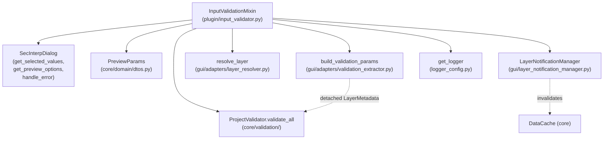

---
tags:
  - secinterp
  - code-walkthrough
  - plugin
aliases:
  - input_validator.py
  - InputValidationMixin
cssclass: secinterp-note
---

# `plugin/input_validator.py`

> [!abstract] One-line summary
> Boundary mixin of the plugin that extracts dialog values, builds and validates a `PreviewParams`, submits it to the core `ProjectValidator`, and arms layer-change notifications.

**Path**: `plugin/input_validator.py` (106 lines)
**Main class**: `InputValidationMixin`
**Layer**: Plugin / GUI (depends on QGIS via `QgsMapLayer` in type annotations only)
**Tags**: #secinterp #plugin

---

## 🎯 Why does this file exist?

The plugin needs a single point where dialog widgets become validated parameters
before any computation runs. Without this boundary, every preview call would repeat
extraction and validate only halfway:

| Problem | Solution |
|---------|----------|
| The dialog exposes widgets, not typed parameters | `_get_and_validate_inputs` reads `get_selected_values()` + `get_preview_options()` and builds a `PreviewParams` |
| Validation mixes primitives (band, buffer) with project state (layers) | Two levels: `params.validate()` for primitives and `ProjectValidator.validate_all()` for layers via detached `LayerMetadata` |
| An input error must not take the plugin down | Four `except` clauses turning each error family into `handle_error` + `None` |
| The cache must be invalidated if a layer changes after validation | On successful validation the `layer_notification_manager` is connected with the active layers |

> [!important] Architectural note
> It is a **boundary Adapter (Extract + Guard)**: it lives in the plugin/GUI layer
> because it reads QGIS widgets, but every decision is delegated to the core
> (`PreviewParams.validate` and `ProjectValidator`). The core never sees the dialog;
> it only receives the already-validated DTO.

---

## 🧬 Relationship diagram



> [!tip] How to read
> Solid arrow = imports/delegates; dashed = decoupled data crossing the GUI → core
> boundary (`ValidationParams` with `LayerMetadata`, cache invalidation).

---

## 📦 Imports — architectural reading

```python
# plugin/input_validator.py
from __future__ import annotations

import contextlib

from qgis.core import QgsMapLayer

from sec_interp.core.domain import PreviewParams
from sec_interp.core.exceptions import SecInterpError
from sec_interp.gui.adapters.layer_resolver import resolve_layer
from sec_interp.logger_config import get_logger
```

| # | Observation |
|---|-------------|
| ① | `contextlib` is only used in `disconnect_layer_notifications` to swallow disconnection errors. Cost-free stdlib import. |
| ② | `QgsMapLayer` appears **only as a return annotation** in `_collect_active_layers`; no QGIS logic lives here. Real resolution sits in `resolve_layer`. |
| ③ | `PreviewParams` is the domain DTO: the mixin builds it but never processes it. Clean Extract boundary. |
| ④ | `SecInterpError` is the only domain exception caught specifically: it separates "invalid configuration" from programming errors. |
| ⑤ | `resolve_layer` (GUI adapter) turns layer ids into live `QgsMapLayer` objects for monitoring, not for computation. |
| ⑥ | `get_logger(__name__)` follows the project standard: one logger per module. |
| ⑦ | `ProjectValidator` and `build_validation_params` are imported **inside the method** (lines 60-61), not at the top: deferred import avoiding cycles between plugin, core.validation and gui.adapters. |

> [!note] Intentional deferred import
> `from sec_interp.core.validation.project_validator import ProjectValidator` and
> `from sec_interp.gui.adapters.validation_extractor import build_validation_params`
> live inside `_get_and_validate_inputs` so the plugin layer has no import-time
> dependency on adapters.

---

## 🏗️ Structure inventory

**Classes:** `class InputValidationMixin` — 3 methods, no `__init__`, no own state.

**Functions/Methods:**

- `_get_and_validate_inputs(self) -> PreviewParams | None` — extraction + double validation + notification arming.
- `disconnect_layer_notifications(self) -> None` — defensive disconnection of the layer monitor.
- `_collect_active_layers(self, params: PreviewParams) -> dict[str, QgsMapLayer]` — bucket → layer map for monitoring.

> [!tip] Stateless mixin
> The class declares no attributes: it operates on `self.dlg` and
> `self.layer_notification_manager`, provided by the host class `SecInterp`
> (see [[sec_interp_plugin]]). Composition through inheritance, documented in [[plugin]].

---

## 📁 Files in the package

This module is one of the three mixins documented in the [[plugin]] group note.
See the package file table there; here only this file's walkthrough.

---

## 📖 Method-by-method walkthrough

### `_get_and_validate_inputs` — extraction and double validation

```python
def _get_and_validate_inputs(self) -> PreviewParams | None:
    """Retrieve and validate dialog inputs, then arm layer notifications."""
    values = self.dlg.get_selected_values()
    preview_options = self.dlg.get_preview_options()
```

Reading happens in two dialog calls (see [[main_dialog]] and the
`DialogFacadeMixin` facade):

| Call | Source | Content |
|------|--------|---------|
| `self.dlg.get_selected_values()` | dialog pages (DEM, section, geology, structures, drillholes) | layer ids, fields, band, buffer, scale factor |
| `self.dlg.get_preview_options()` | preview page | `max_points`, `auto_lod` and visibility flags |

```python
    try:
        params = PreviewParams(
            raster_layer=values.get("raster_layer"),
            line_layer=values.get("crossline_layer"),
            band_num=values.get("selected_band", 1),
            buffer_dist=values.get("buffer_distance", 100.0),
            outcrop_layer=values.get("outcrop_layer"),
            outcrop_name_field=values.get("outcrop_name_field"),
            struct_layer=values.get("structural_layer"),
            dip_field=values.get("dip_field"),
            strike_field=values.get("strike_field"),
            dip_scale_factor=values.get("dip_scale_factor", 1.0),
            collar_layer=values.get("collar_layer_obj"),
            collar_id_field=values.get("collar_id_field"),
            collar_use_geometry=values.get("collar_use_geometry", True),
            collar_x_field=values.get("collar_x_field"),
            collar_y_field=values.get("collar_y_field"),
            collar_z_field=values.get("collar_z_field"),
            collar_depth_field=values.get("collar_depth_field"),
            survey_layer=values.get("survey_layer_obj"),
            survey_id_field=values.get("survey_id_field"),
            survey_depth_field=values.get("survey_depth_field"),
            survey_azim_field=values.get("survey_azim_field"),
            survey_incl_field=values.get("survey_incl_field"),
            interval_layer=values.get("interval_layer_obj"),
            interval_id_field=values.get("interval_id_field"),
            interval_from_field=values.get("interval_from_field"),
            interval_to_field=values.get("interval_to_field"),
            interval_lith_field=values.get("interval_lith_field"),
            max_points=preview_options.get("max_points", 1000),
            auto_lod=preview_options.get("auto_lod", True),
            canvas_width=self.dlg.preview_widget.canvas.width(),
        )
        params.validate()
```

Three design decisions visible in this block:

1. **Defensive defaults**: `selected_band → 1`, `buffer_distance → 100.0`,
   `dip_scale_factor → 1.0`, `max_points → 1000`, `auto_lod → True`. If a page has
   not published its value yet, the DTO is born with an operative value instead
   of `None`.
2. **Key names as implicit contract**: `crossline_layer`, `structural_layer`,
   `collar_layer_obj` are the keys produced by `get_selected_values()`; renaming
   one there silently breaks this constructor. The most fragile coupling in the
   module.
3. **`canvas_width` comes from the live canvas** (`self.dlg.preview_widget.canvas.width()`):
   it feeds automatic LOD of the preview (see [[preview_task_orchestrator]]).

```python
        from sec_interp.core.validation.project_validator import ProjectValidator
        from sec_interp.gui.adapters.validation_extractor import build_validation_params

        ProjectValidator.validate_all(build_validation_params(params))
```

Second validation level: `build_validation_params(params)` turns each layer
reference in the `PreviewParams` into detached `LayerMetadata` (see
[[validation_extractor]]), and `ProjectValidator.validate_all()` runs the validator
pipeline (section, DEM, geology, structures, drillholes, output). See
[[project_validator]]. The core validates **metadata**, never widgets or live layers.

```python
    except SecInterpError as e:
        self.dlg.handle_error(e, self.tr("Configuration Error"))
        return None
    except (ValueError, TypeError, KeyError, AttributeError) as e:
        self.dlg.handle_error(e, self.tr("Input Processing Error"))
        return None
    except (MemoryError, SystemError, KeyboardInterrupt):
        raise
    except Exception as e:
        logger.exception("Unexpected error during input processing")
        self.dlg.handle_error(e, self.tr("Unexpected Error"))
        return None

    self.layer_notification_manager.connect(self._collect_active_layers(params))
    return params
```

> [!important] Exception ladder
> The order is deliberate: first the expected domain error (`SecInterpError`,
> including `ValidationError`), then programming/contract errors (`ValueError`,
> `TypeError`, `KeyError`, `AttributeError`), then fatals that are **always
> re-raised** (`MemoryError`, `SystemError`, `KeyboardInterrupt`), and finally the
> `Exception` umbrella with `logger.exception` (full traceback). Only if everything
> passes is layer monitoring armed and `params` returned; any failure returns
> `None`, which callers read as "no preview".

### `disconnect_layer_notifications` — defensive disconnection

```python
def disconnect_layer_notifications(self) -> None:
    """Disconnect the layer-change notification manager."""
    if getattr(self, "layer_notification_manager", None):
        with contextlib.suppress(Exception):
            self.layer_notification_manager.disconnect()
```

Double defense: `getattr(..., None)` covers a partially initialized host (the
manager is built with `SafeLoader.lazy_load` in `SecInterp.__init__` and could be
missing), and `contextlib.suppress(Exception)` covers already-disconnected signals
or deleted layers. It is called from the shutdown path (see [[lifecycle]],
`disconnect_signals`), so it must never raise.

### `_collect_active_layers` — bucket → layer map

```python
def _collect_active_layers(self, params: PreviewParams) -> dict[str, QgsMapLayer]:
    """Collect all active layer objects from parameter IDs for monitoring."""
    mapping = {
        "topo": params.raster_layer,
        "section": params.line_layer,
        "geol": params.outcrop_layer,
        "struct": params.struct_layer,
        "drill_collar": params.collar_layer,
        "drill_survey": params.survey_layer,
        "drill_interval": params.interval_layer,
    }

    active_layers = {}
    for bucket, lid in mapping.items():
        if not lid:
            continue
        lyr = resolve_layer(lid)
        if lyr:
            active_layers[bucket] = lyr

    return active_layers
```

| Detail | Reason |
|--------|--------|
| Buckets `topo`, `section`, `geol`, `struct`, `drill_collar/survey/interval` | Mirror the core cache namespaces; `LayerNotificationManager` maps the three drillhole ones to the `drill` bucket |
| `if not lid: continue` | Optional layers (geology, structures, drillholes) are simply not monitored |
| `resolve_layer(lid)` + `if lyr` | An orphaned id (layer removed from the project) is ignored instead of failing |
| Returns an empty dict when no layers | `connect({})` after its internal `disconnect()` leaves the manager clean |

---

## 🔄 Data flow

| Phase | Input | Transformation | Output |
|-------|-------|----------------|--------|
| Extract | dialog widgets | `get_selected_values()` + `get_preview_options()` | `values`, `preview_options` (dicts) |
| Build | dicts + canvas width | `PreviewParams(...)` constructor with defaults | unvalidated DTO |
| Guard 1 (primitives) | DTO | `params.validate()` (buffer ≥ 0, band ≥ 1) | raises `ValueError` on failure |
| Adapt | DTO with layer refs | `build_validation_params(params)` | `ValidationParams` with `LayerMetadata` |
| Guard 2 (project) | metadata | `ProjectValidator.validate_all(...)` | raises `SecInterpError` on failure |
| Arm | valid `PreviewParams` | `_collect_active_layers` + `connect` | monitoring active, returns `params` |
| Failure | any exception | `handle_error` + `return None` | caller aborts the preview |

---

## 🏛️ Design patterns present

| Pattern | Where | Purpose |
|---------|-------|---------|
| **Guard / Boundary validation** | `_get_and_validate_inputs` | Nothing unvalidated crosses into computation |
| **Adapter (Extract)** | `build_validation_params` + `resolve_layer` | Turn the QGIS world into core types |
| **Mixin** | stateless class over `SecInterp` | Compose behaviour without deep inheritance |
| **Fail-soft (`None`)** | every `except` with `return None` | A bad input cancels the operation, not the plugin |
| **Observer (arming)** | `layer_notification_manager.connect` | Invalidate cache when a layer changes |

---

## 🧾 API summary

| Symbol | Signature | Typical use |
|--------|-----------|-------------|
| `InputValidationMixin` | mixin without `__init__` | inherited by `SecInterp` |
| `_get_and_validate_inputs` | `(self) -> PreviewParams \| None` | before every preview or computation |
| `disconnect_layer_notifications` | `(self) -> None` | in `unload` / `disconnect_signals` |
| `_collect_active_layers` | `(params) -> dict[str, QgsMapLayer]` | build the monitoring map |

---

## 🛡️ Error handling

| Exception | Shown title | Typical source |
|-----------|-------------|----------------|
| `SecInterpError` (incl. `ValidationError`) | "Configuration Error" | `ProjectValidator` (see note below) |
| `ValueError`, `TypeError`, `KeyError`, `AttributeError` | "Input Processing Error" | `params.validate()` (`ValueError`), missing keys, null canvas |
| `MemoryError`, `SystemError`, `KeyboardInterrupt` | — (re-raised) | fatals: never swallowed |
| `Exception` | "Unexpected Error" + log traceback | any other failure |

> [!warning] `ValueError` overlap between levels
> `PreviewParams.validate()` (see [[dtos]]) raises `ValueError`, not
> `ValidationError`, so a negative buffer lands in "Input Processing Error" rather
> than "Configuration Error". Behaviour is correct (both return `None`), but the
> shown title differs depending on which level fails.

---

## 🧪 Associated tests

There is no dedicated `tests/plugin/test_input_validator.py`; coverage is indirect
through the collaborators:

- `tests/core/test_project_validator.py` — the validator this mixin invokes.
- `tests/core/test_validation.py` and `tests/core/validation/test_validators.py` — per-domain validators (DEM, section, geology, structures, drillholes).
- `tests/gui/test_dialog_input_manager.py` — dialog value reading (`get_selected_values`).
- `tests/gui/test_main_dialog_validation_manager.py` — validation wiring in the dialog.
- `tests/gui/test_dialog_preview_manager.py` — the consumer that aborts when validation returns `None`.

> [!note] Honest coverage gap
> The bucket → layer mapping (`_collect_active_layers`) and the `except` ladder
> have no direct tests. A test with `unittest.mock` for the dialog and the manager
> would be cheap to write because the mixin touches no QGIS beyond types.

---

## 👀 Observations and notes

> [!success] Strengths
> - Clean boundary: the core only receives DTOs and detached metadata.
> - Well-ordered exception ladder with fatal re-raise.
> - Shutdown-safe disconnection (`unload` never fails through here).
> - Monitoring buckets aligned with cache namespaces.

> [!warning] Points of attention
> - The `values` keys (`crossline_layer`, `structural_layer`, `*_obj`) are an implicit contract with the dialog facade; a silent rename breaks construction.
> - `canvas_width` assumes `self.dlg.preview_widget.canvas` is alive; if the dialog was never shown, `AttributeError` lands in "Input Processing Error".
> - Level-1 `ValueError` and level-2 `ValidationError` are reported under different titles although both mean "invalid input".

> [!question] Open questions
> - Type the `values` keys with a `TypedDict` to make the facade contract explicit?
> - Unify `params.validate()` onto `ValidationError` for a single configuration-error title?

---

## 🔗 Related notes

- [[Index]] — vault index
- [[plugin]] — `plugin/` group note
- [[sec_interp_plugin]] — host class `SecInterp` inheriting this mixin
- [[lifecycle]] — `init → dialog → cleanup` cycle using the disconnection
- [[render_pipeline]] — the next step after validating: drawing the preview
- [[main_dialog]] — `get_selected_values`, `get_preview_options`, `handle_error`
- [[controller]] — `ProfileController.generate_profile_data`, consumer of the `PreviewParams`
- [[project_validator]] — `ProjectValidator.validate_all` (level 2)
- [[validation_extractor]] — `build_validation_params` and `LayerMetadata`
- [[layer_resolver]] — `resolve_layer`
- [[layer_notification_manager]] — monitoring and cache invalidation
- [[preview_task_orchestrator]] — LOD and `max_points`/`canvas_width`
- [[dtos]] — `PreviewParams.validate()`
- [[logger_config]] — `get_logger`

---

*Note of the SecInterp Code Walkthrough v2 vault — v3.9.0*
