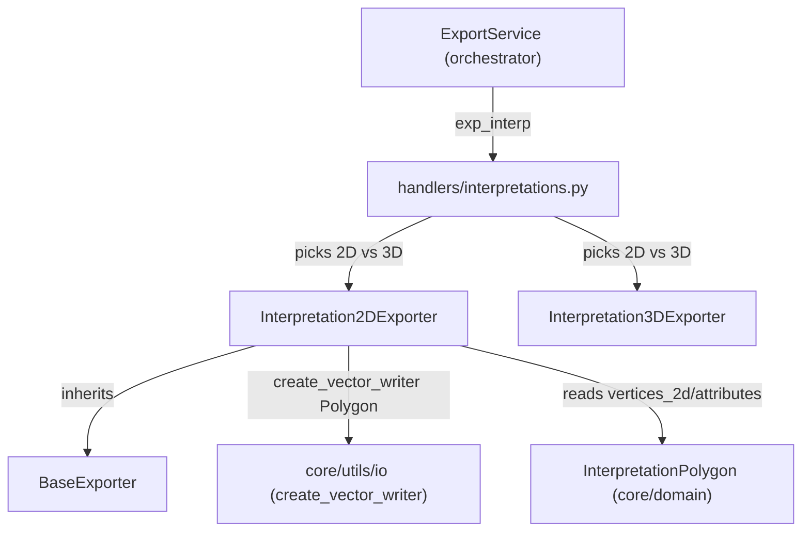

---
tags:
  - secinterp
  - code-walkthrough
  - exporters
  - interpretations
aliases:
  - interpretation_exporters.py
  - Interpretation2DExporter
cssclass: secinterp-note
---

# `exporters/interpretation_exporters.py`

> [!abstract] One-line summary
> Exports interpretation polygons in 2D profile coordinates (`distance, elevation`) as `Polygon` with 5 fixed fields plus one column per custom attribute.

**Path**: `exporters/interpretation_exporters.py` (146 lines)
**Main class**: `Interpretation2DExporter(BaseExporter)`
**Layer**: Exporters (GUI · QGIS-dependent, inherits `BaseExporter`)
**Tags**: #secinterp #exporters #interpretations

---

## 🎯 Why does this file exist?

Interpretations are digitised over the profile (see [[interpretation_tool]] and the
interpretation page [[interpretation_page]]). The 2D product is the SHP that overlays
topography, geology and structures exactly, because it shares their `(dist, elev)` system:

| Problem | Solution |
|---------|----------|
| Persist the polygons drawn over the section | `export`: one `Polygon` feature per `InterpretationPolygon` |
| Custom attributes vary per polygon | `_prepare_fields`: sorted key union → `QString(255)` columns |
| Unclosed rings break the SHP polygon | `_create_feature` appends the first point if missing |
| Reuse the exporter inside a GPKG | `layer_name` parameter propagated to the writer |

> [!important] Architectural note — deliberately simple 2D twin
> Against [[interpretation_3d_exporter]] (465 lines, azimuthal projection + QML), this
> module transforms nothing: it writes `vertices_2d` as-is. It is the default path of
> `exp_interp` when the handler picks 2D (see [[interpretations]] and [[orchestrator]]).

---

## 🧬 Relationship diagram



> [!tip] How to read
> The `interpretations` handler (see [[interpretations]]) instantiates this exporter or
> the 3D one depending on options. Both share the field schema: 2D and 3D SHPs join by
> attribute.

---

## 📦 Imports — architectural reading

```python
# exporters/interpretation_exporters.py
from __future__ import annotations

from pathlib import Path  # noqa: E402
from typing import Any  # noqa: E402

from qgis.core import (  # noqa: E402
    QgsFeature,
    QgsField,
    QgsFields,
    QgsGeometry,
    QgsPointXY,
    QgsVectorFileWriter,
    QgsWkbTypes,
)
from qgis.PyQt.QtCore import QMetaType  # noqa: E402

import sec_interp.core.utils.io as scu_io  # noqa: E402
from sec_interp.exporters.base_exporter import BaseExporter  # noqa: E402
from sec_interp.logger_config import get_logger  # noqa: E402
```

| # | Observation |
|---|-------------|
| ① | Double module docstring (lines 1 and 5–8): facade + description; the `# noqa: E402` markers reveal imports once stood after code. |
| ② | `QgsVectorFileWriter` imported **only** to compare `WriterError.NoError` (the real writer is built by `scu_io`). |
| ③ | Explicit `QgsWkbTypes.Type.Polygon` (flat 2D) vs the 3D twin's `PolygonZ`. |
| ④ | No `QCoreApplication`, no `QColor`, no `math`: no projection and no styling here. |
| ⑤ | `Path` types `output_path` (stricter than the `Any`/`str` of other exporters). |

---

## 🏗️ Structure inventory

**Class:** `Interpretation2DExporter(BaseExporter)` — 4 methods + constructor.

**Methods:**
- `__init__(settings: dict[str, Any]) -> None` — delegates to `BaseExporter.__init__`
- `export(output_path: Path, data: dict[str, Any], layer_name: str | None = None) -> bool`
- `_prepare_fields(interpretations: list[Any]) -> tuple[QgsFields, list[str]]`
- `_create_feature(interp: Any, fields: QgsFields, sorted_keys: list[str]) -> QgsFeature`
- `get_supported_extensions() -> list[str]`

> [!note] No validation constants
> This is the only exporter in the phase defining no module constants: ring closure is
> checked inline (`points[0] != points[-1]`) and there is no minimum-vertex threshold
> (a 2-point polygon produces a degenerate `Polygon` instead of being skipped).

---

## 📁 Files in the package `exporters/`

| File | Role relative to this note |
|---|---|
| `interpretation_exporters.py` | This note: 2D profile `Polygon` |
| [[interpretation_3d_exporter]] | 3D twin: `PolygonZ` + azimuthal projection + QML |
| [[drillhole_exporters]] | Sibling pattern: 2D traces/intervals with `fromPolylineXY` |
| [[base_exporter]] | `BaseExporter`: `settings`, `validate_path`, `get_setting` |
| [[exporters]] | Package facade + `get_exporter()` by extension |

---

## 📖 Method-by-method walkthrough

### `__init__`

```python
def __init__(self, settings: dict[str, Any]) -> None:
    """Initialize with settings.

    Args:
        settings: Dictionary of configuration settings.

    """
    super().__init__(settings)
```

Passthrough constructor: stores `settings` via the base. Most exporters in the package
do not even declare it (they inherit `BaseExporter`'s); here it is explicit with a
Google-style docstring.

### `export` — direct write, no transform

```python
def export(
    self,
    output_path: Path,
    data: dict[str, Any],
    layer_name: str | None = None,
) -> bool:
    interpretations = data.get("interpretations", [])
    if not interpretations:
        logger.warning("No interpretations to export.")
        return False

    try:
        crs = data.get("crs")

        fields, sorted_keys = self._prepare_fields(interpretations)
        writer = scu_io.create_vector_writer(
            str(output_path),
            crs,
            fields,
            geometry_type=QgsWkbTypes.Type.Polygon,
            layer_name=layer_name,
        )

        if writer.hasError() != QgsVectorFileWriter.WriterError.NoError:
            logger.error(f"Failed to create writer for {output_path}: {writer.errorMessage()}")
            return False

        for interp in interpretations:
            feat = self._create_feature(interp, fields, sorted_keys)
            if feat:
                writer.addFeature(feat)

        del writer  # Flushes and closes the file
        logger.info(f"Successfully exported to {output_path}")
        return True

    except Exception:
        logger.exception(f"Failed to export interpretations to {output_path}")
        return False
```

| Step | Behaviour |
|------|-----------|
| 1. Guard | Empty list → `warning` + `False` |
| 2. Writer | Note `geometry_type=` as a **keyword** (drillhole exporters pass it positionally or omit it) |
| 3. Check | `hasError()` here returns `False` with `logger.error` — contrasts with 3D, which **raises** `ExportError` |
| 4. Loop | Each feature goes through a defensive `if feat:` although `_create_feature` never returns `None` today |
| 5. Close | `del writer` + success `info`; exception → `exception` + `False` |

> [!tip] `crs` may be `None`
> Unlike the drillhole exporters (which require `crs`), there is no `not crs` guard
> here: the writer receives whatever exists. If the handler always passes a CRS, the
> SHP is georeferenced; otherwise the writer decides the default.

### `_prepare_fields` — fixed schema + sorted custom

```python
def _prepare_fields(self, interpretations: list[Any]) -> tuple[QgsFields, list[str]]:
    """Identify custom attributes and create fields."""
    all_attr_keys = set()
    for interp in interpretations:
        if interp.attributes:
            all_attr_keys.update(interp.attributes.keys())

    sorted_keys = sorted(all_attr_keys)
    fields = QgsFields()
    fields.append(QgsField("id", QMetaType.Type.QString, len=50))
    fields.append(QgsField("name", QMetaType.Type.QString, len=100))
    fields.append(QgsField("type", QMetaType.Type.QString, len=50))
    fields.append(QgsField("color", QMetaType.Type.QString, len=10))
    fields.append(QgsField("created_at", QMetaType.Type.QString, len=30))

    for key in sorted_keys:
        fields.append(QgsField(key, QMetaType.Type.QString, len=255))
    return fields, sorted_keys
```

Identical to the 3D exporter's `_prepare_fields` except the container (`QgsFields`
directly here, list + `_make_fields_obj` there): 5 fixed with SHP lengths + sorted
custom `QString(255)`. Polygons without `attributes` (`None` or `{}`) simply contribute
no keys.

### `_create_feature` — ring, closure and positional attributes

```python
def _create_feature(self, interp: Any, fields: QgsFields, sorted_keys: list[str]) -> QgsFeature:
    """Create a QgsFeature with geometry and attributes."""
    # Create polygon geometry from 2D vertices
    points = [QgsPointXY(x, y) for x, y in interp.vertices_2d]

    # Ensure polygon is closed
    if points and points[0] != points[-1]:
        points.append(points[0])

    geom = QgsGeometry.fromPolygonXY([points])

    feature = QgsFeature(fields)
    feature.setGeometry(geom)

    # Set attributes
    attrs = [
        interp.id,
        interp.name,
        interp.type,
        interp.color,
        interp.created_at,
    ]

    for key in sorted_keys:
        val = interp.attributes.get(key, "")
        attrs.append(str(val))

    feature.setAttributes(attrs)
    return feature
```

Three things to note: (1) closure compares `QgsPointXY` with `!=` (exact equality, no
tolerance); (2) attributes are set **positionally** with `setAttributes` (order = field
creation order: 5 fixed first, then custom in `sorted_keys`); (3) custom values are
normalised with `str(val)` and default `""`, so a numeric value or `None` never breaks
the `QString`.

> [!warning] Positional coupling
> `setAttributes(attrs)` requires `attrs` order to match `fields` exactly. Reordering
> `_prepare_fields` without touching `_create_feature` would silently land values in
> wrong columns. The 3D twin avoids this with per-name `setAttribute("name", ...)`.

### `get_supported_extensions`

```python
def get_supported_extensions(self) -> list[str]:
    """Get supported file extensions."""
    return [".shp", ".gpkg", ".dxf"]
```

Closes the `BaseExporter` contract. The three vector outputs, like every writer in
the phase.

---

## 🔄 Data flow

| Phase | Input | Transformation | Output |
|-------|-------|----------------|--------|
| Guard | `data["interpretations"]` | empty → `warning` + `False` | Nothing |
| Fields | `attributes` of each polygon | sorted union | `QgsFields` + `sorted_keys` |
| Writer | `output_path`, `crs`, `Polygon` | `create_vector_writer` + `hasError` | Writer or `False` |
| Features | `vertices_2d` per polygon | closure + `fromPolygonXY` + `setAttributes` | 1 `Polygon` per interpretation |
| Close | writer with features | `del writer` | `True` + `info` |

---

## 🏛️ Design patterns present

| Pattern | Where | Purpose |
|---------|-------|---------|
| **Template Method** | `BaseExporter` → `export` | Shared phase contract |
| **Schema union** | `_prepare_fields` | Columns = union of custom keys |
| **Defensive copy (closure)** | `_create_feature` | `points.append(points[0])` on a local list, not on `vertices_2d` |
| **String normalization** | `str(val)` + `""` | Every custom fits a `QString` |
| **Boolean status** | `export -> bool` | The handler picks the message without exceptions |

---

## 🧾 API summary

| Symbol | Signature / Inherits | Typical use |
|--------|----------------------|-------------|
| `Interpretation2DExporter` | `(BaseExporter)` | Section polygons → `Polygon` SHP |
| `__init__` | `(settings: dict[str, Any]) -> None` | Passthrough to `BaseExporter` |
| `export` | `(output_path: Path, data, layer_name=None) -> bool` | `data = {"interpretations": [...], "crs": ...}` |
| `_prepare_fields` | `(interpretations) -> tuple[QgsFields, list[str]]` | 5 fixed + sorted custom |
| `_create_feature` | `(interp, fields, sorted_keys) -> QgsFeature` | Closure + `fromPolygonXY` + `setAttributes` |
| `get_supported_extensions` | `() -> list[str]` | `[".shp", ".gpkg", ".dxf"]` |

---

## 🛡️ Error handling

| Situation | Behaviour |
|-----------|-----------|
| Empty `interpretations` | `warning` + `False` |
| Broken writer (`hasError`) | `logger.error` with `errorMessage()` + `False` (no raise) |
| Exception in `export` | `logger.exception` + `False` |
| Unclosed ring | Closed automatically |
| Custom missing on a polygon | `""` (empty cell, not NULL) |
| `crs = None` | Propagated to the writer (no guard of its own) |

> [!note] Severity contrast with the 3D twin
> Same condition (broken writer), different answer: 2D → `False` + log; 3D →
> `ExportError`. The reason is historical: the 2D path is the legacy one and its
> handlers already treat `False` as a reportable failure (see [[orchestrator]] and
> [[exceptions]]).

---

## 🧪 Associated tests

**Unit (mock-first)** in `tests/exporters/test_interpretation_exporters.py`:

- `test_get_supported_extensions` — the three vector extensions.
- `test_export_empty_data` — empty list → `False`.
- `test_export_success` — features written with a mocked writer (`mock_writer_factory`).
- `test_export_writer_error` — simulated `hasError()` → `False`.
- `test_export_exception` — write exception → `False`.

**Integration** in `tests/integration/test_export_service_e2e.py`:

- `test_export_interpretations_creates_2d_shp` — end-to-end real 2D SHP.
- `test_export_interpretations_skips_when_empty` — benign skip without data.
- `test_export_nothing_when_all_options_disabled` — option guard.

**Workflow** in `tests/integration/test_interpretation_workflow.py` — interpretation
lifecycle (digitising → data → export).

---

## 👀 Observations and notes

> [!success] Strengths
> - Simplest module in the phase: 146 lines, no trigonometry or styling.
> - Field schema identical to 3D: 2D and 3D SHPs combinable by attribute.
> - `str(val)` + `""` makes a type failure in custom columns impossible.
> - Full unit coverage of branches (`empty/success/writer_error/exception`).

> [!warning] Points of attention
> - Positional `setAttributes`: fragile against `_prepare_fields` reorderings.
> - No minimum-vertex threshold: a degenerate polygon is written anyway.
> - `crs=None` not validated here (drillhole exporters do require it).
> - Defensive `if feat:` though `_create_feature` never returns `None` (partly dead code).
> - Double module docstring + blanket `noqa: E402`: import hygiene could improve.

> [!question] Open questions
> - Migrate to per-name `setAttribute` like the 3D twin to break positional coupling?
> - Add a `not crs → False` guard for symmetry with the drillhole exporters?
> - Skip polygons with < 3 unique vertices like 3D does (`MIN_VALID_POLYGON_VERTICES`)?

---

## 🔗 Related notes

- [[Index]] — vault index
- [[exporters]] — `exporters/` package facade
- [[base_exporter]] — `BaseExporter`, base class
- [[interpretation_3d_exporter]] — 3D twin (`PolygonZ`, azimuth, QML)
- [[interpretations]] — `exp_interp` handler (2D/3D dispatch)
- [[orchestrator]] — `ExportService`, general orchestration
- [[domain]] — `InterpretationPolygon` (`vertices_2d`, `attributes`, `color`)
- [[interpretation_tool]] — digitising of the polygons written here
- [[dialog_export_manager]] — GUI starting the export

---

*Note of the SecInterp Code Walkthrough v2 vault — v3.9.0*
