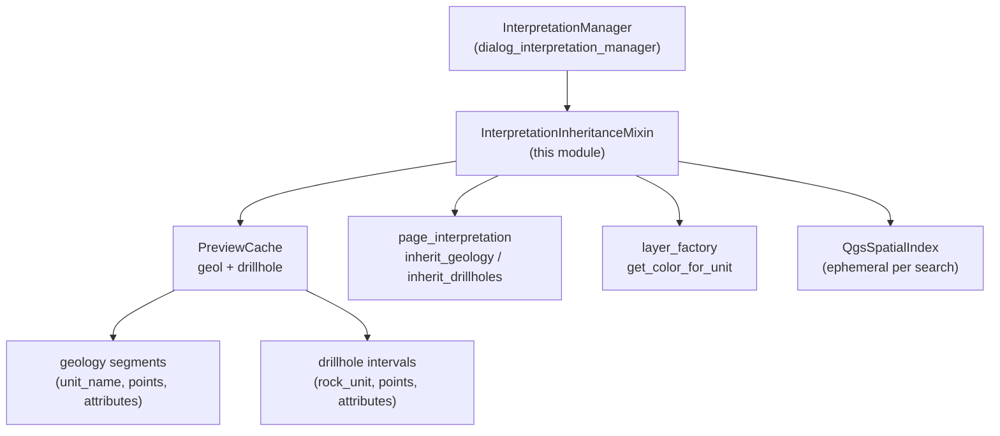

---
tags:
  - secinterp
  - code-walkthrough
  - gui
  - mixins
aliases:
  - interpretation_inheritance_mixin.py
  - InterpretationInheritanceMixin
cssclass: secinterp-note
---

# `gui/interpretation_inheritance_mixin.py`

> [!abstract] One-line summary
> Mixin inheriting attributes onto a freshly digitized interpretation polygon from the geometrically nearest geology segment or drillhole interval, using `QgsSpatialIndex` over the shared preview cache.

**Path**: `gui/interpretation_inheritance_mixin.py` (190 lines)
**Main class**: `InterpretationInheritanceMixin`
**Layer**: GUI (presentation mixin · QGIS geometry over Extract cache)
**Tags**: #secinterp #gui #mixins

---

## 🎯 Why does this file exist?

When the user digitizes an interpretation on the profile, it should inherit the
name of the geology unit or drillhole interval underneath instead of forcing
manual typing. Naively searching "the nearest" is O(n) per vertex and mixes two
different data shapes:

| Problem | Solution |
|---------|----------|
| The polygon is born without name/type/attributes, and always asking breaks the digitizing flow | `apply_attribute_inheritance` fills `name`, `type`, `attributes` and `color` from the nearest neighbour |
| Comparing distances against every segment/interval does not scale | `QgsSpatialIndex` per search (`nearestNeighbor(ref_point, 1)`) on each axis |
| Drillholes and geology have different shapes (legacy tuples, objects with `intervals`, `rock_unit` vs `unit_name` fields) | `_extract_intervals_from_dh_data` normalizes the formats; `_check_*` unifies the result as a `best_match` dict |

> [!important] Architectural note
> **Extract done, spatial compute in GUI**: the mixin reads no layers — it consumes
> `self._preview_cache.get("geol")` / `.get("drillhole")`, i.e. data already
> extracted by the preview. Its only QGIS dependency is in-memory geometry
> (`QgsGeometry`, `QgsSpatialIndex`), never `QgsVectorLayer`.

---

## 🧬 Relationship diagram



> [!tip] How to read
> The spatial index is ephemeral (built per search, then discarded); the cache is
> persistent and shared with the preview. Arrow = "reads from".

---

## 📦 Imports — architectural reading

```python
# gui/interpretation_inheritance_mixin.py
from __future__ import annotations
from collections.abc import Iterator
from typing import Any
from qgis.core import QgsGeometry, QgsPointXY
from sec_interp.core.domain import InterpretationPolygon
from sec_interp.logger_config import get_logger

logger = get_logger(__name__)
```

| # | Observation |
|---|-------------|
| ① | `QgsGeometry`/`QgsPointXY` at module level (not lazy): in-memory geometry is the mixin's core; no import cycle forbids it. |
| ② | `QgsFeature`, `QgsSpatialIndex` imported **inside** `_check_*` (lazy): only paid when inheritance is active and data exists. |
| ③ | `Iterator` from `collections.abc` for `_iter_drillhole_interval_geoms`: a lazy generator feeding the index with no intermediate lists. |
| ④ | `InterpretationPolygon` (domain DTO) as input type: the mixin mutates the DTO (`name`, `type`, `attributes`, `color`) before it is persisted. |
| ⑤ | A single `logger.info` on the happy path ("Inherited attributes from …"); with an empty cache there is total silence (not an error). |

---

## 🏗️ Structure inventory

**Classes:** 1 — `InterpretationInheritanceMixin` (1 public method + 4 private ones).

| Method | Role |
|--------|-----|
| `apply_attribute_inheritance(interpretation, config)` | Orchestrator: centroid → geology-vs-drillholes race → apply winner |
| `_check_geology_inheritance(ref_point, min_dist, best_match)` | Index over `geol` segments; returns `(best_match, min_dist)` |
| `_check_drillhole_inheritance(ref_point, min_dist, best_match)` | Index over drillhole intervals; same return contract |
| `_iter_drillhole_interval_geoms(dh_data)` | `(interval, QgsGeometry)` generator per interval with points |
| `_extract_intervals_from_dh_data(dh)` | Normalizes legacy tuples (5 or ≥3 items) or objects with `.intervals` |

---

## 📁 Files in the package

| File | Role towards this mixin |
|---|---|
| `gui/dialog_interpretation_manager.py` | `InterpretationManager` inherits the mixin; calls `apply_attribute_inheritance` only when a flag is on |
| `gui/interpretation_persistence_mixin.py` | Sibling base: persists the already-enriched polygon |
| `gui/preview_state.py` | `PreviewCache.get("geol"/"drillhole")` — candidate source |
| `gui/preview_layer_factory.py` | `layer_factory.get_color_for_unit(name).name()` — legend-consistent colour |
| `core/domain/` | `InterpretationPolygon`, segments (`unit_name`, `points`), intervals (`rock_unit`, `points`) |

---

## 📖 Method-by-method walkthrough

### `apply_attribute_inheritance`

```python
def apply_attribute_inheritance(self, interpretation, config):
    ring = [QgsPointXY(x, y) for x, y in interpretation.vertices_2d]
    poly_geom = QgsGeometry.fromPolygonXY([ring])
    ref_point = poly_geom.centroid().asPoint()
    best_match, min_dist = None, float("inf")
    if config.get("inherit_geology"):
        best_match, min_dist = self._check_geology_inheritance(ref_point, min_dist, best_match)
    if config.get("inherit_drillholes"):
        best_match, min_dist = self._check_drillhole_inheritance(ref_point, min_dist, best_match)
    if best_match:
        interpretation.name = best_match["name"]
        interpretation.type = best_match["type"]
        if best_match["attrs"]:
            interpretation.attributes.update(best_match["attrs"])
        interpretation.color = self.dialog.layer_factory.get_color_for_unit(best_match["name"]).name()
```

The reference point is the polygon **centroid** (not the first vertex): it
represents "where" the interpretation is. The race between axes shares
`min_dist`, so the globally nearest neighbour wins, geology or drillhole alike.
The colour is unified with the legend via `layer_factory`, so the inherited
interpretation paints like its source unit. With no winner (empty cache or flags
off), the polygon is left intact.

### `_check_geology_inheritance`

```python
def _check_geology_inheritance(self, ref_point, min_dist, best_match):
    geol_data = self._preview_cache.get("geol")
    if not geol_data:
        return best_match, min_dist
    from qgis.core import QgsFeature, QgsGeometry, QgsPointXY, QgsSpatialIndex
    index = QgsSpatialIndex()
    feature_dict = {}
    for i, segment in enumerate(geol_data):
        if not segment.points:
            continue
        feat = QgsFeature(i)
        pts = [QgsPointXY(x, y) for x, y in segment.points]
        geom = QgsGeometry.fromPointXY(pts[0]) if len(pts) == 1 else QgsGeometry.fromPolylineXY(pts)
        feat.setGeometry(geom)
        index.addFeature(feat)
        feature_dict[i] = (segment, geom)
    nearest_ids = index.nearestNeighbor(ref_point, 1)
    if nearest_ids:
        segment, geom = feature_dict[nearest_ids[0]]
        d = geom.distance(QgsGeometry.fromPointXY(ref_point))
        if d < min_dist:
            best_match = {"name": segment.unit_name, "type": "geology", "attrs": segment.attributes}
            min_dist = d
    return best_match, min_dist
```

Ephemeral index over cached segments: single-point ones become points, the rest
polylines; point-less segments are skipped. After `nearestNeighbor(ref_point,
1)` the exact distance is measured with `geom.distance` (the index gives bbox
proximity, not true distance) and accepted only when it improves `min_dist`. The
winning dict normalizes the shape: `name/type/attrs`.

### `_check_drillhole_inheritance`

```python
def _check_drillhole_inheritance(self, ref_point, min_dist, best_match):
    dh_data = self._preview_cache.get("drillhole")
    if not dh_data:
        return best_match, min_dist
    from qgis.core import QgsFeature, QgsSpatialIndex
    index = QgsSpatialIndex()
    feature_dict = {}
    for feat_id, (interval, geom) in enumerate(self._iter_drillhole_interval_geoms(dh_data)):
        feat = QgsFeature(feat_id)
        feat.setGeometry(geom)
        index.addFeature(feat)
        feature_dict[feat_id] = (interval, geom)
    nearest_ids = index.nearestNeighbor(ref_point, 1)
    if nearest_ids:
        interval, geom = feature_dict[nearest_ids[0]]
        d = geom.distance(QgsGeometry.fromPointXY(ref_point))
        if d < min_dist:
            best_match = {"name": getattr(interval, "rock_unit",
                getattr(interval, "unit_name", "Unknown")),
                "type": "drillhole", "attrs": interval.attributes}
            min_dist = d
    return best_match, min_dist
```

Mirrors the geology check but iterates the interval generator. The name tolerates
two field schemes (modern `rock_unit`, legacy `unit_name`) with an `"Unknown"`
fallback; `attrs` is `interval.attributes` directly.

### `_iter_drillhole_interval_geoms`

```python
def _iter_drillhole_interval_geoms(self, dh_data):
    for dh in dh_data:
        for interval in self._extract_intervals_from_dh_data(dh):
            points = getattr(interval, "points", None)
            if not points:
                continue
            pts = [QgsPointXY(x, y) for x, y in points]
            geom = QgsGeometry.fromPointXY(pts[0]) if len(pts) == 1 else QgsGeometry.fromPolylineXY(pts)
            yield interval, geom
```

Lazy generator: converts each interval with points to a QGIS geometry on the
fly, materializing no lists. Intervals without `points` are skipped (a tramo
without projection cannot neighbour anything).

### `_extract_intervals_from_dh_data`

```python
def _extract_intervals_from_dh_data(self, dh):
    if isinstance(dh, tuple):
        LEGACY_HOLE_SIZE = 5
        INTERVALS_INDEX_LEGACY = 4
        if len(dh) == LEGACY_HOLE_SIZE:
            return dh[INTERVALS_INDEX_LEGACY]
        MIN_COMPONENTS = 3
        if len(dh) >= MIN_COMPONENTS:
            return dh[2]
    return getattr(dh, "intervals", [])
```

Normalizes three historic formats: 5-tuples (intervals at index 4), ≥3-tuples
(intervals at index 2), and objects with `.intervals`. The named local constants
(`LEGACY_HOLE_SIZE`, `INTERVALS_INDEX_LEGACY`, `MIN_COMPONENTS`) document the
format archaeology. An unknown `dh` yields `[]` (no inheritance, no error).

---

## 🔄 Data flow

| Phase | Input | Transformation | Output |
|-------|-------|----------------|--------|
| Reference | polygon `vertices_2d` | `fromPolygonXY` → `centroid()` | reference `QgsPointXY` |
| Race | point + config flags | geology and/or drillhole index + exact distance | winning `best_match` (`name/type/attrs`) or `None` |
| Apply | winner | `name`, `type`, `attributes.update`, `color` from `layer_factory` | enriched polygon ready for the properties dialog |
| No data | empty cache / flags off | early return | intact polygon, no error log |

---

## 🏛️ Design patterns present

| Pattern | Where | Purpose |
|---------|-------|---------|
| **Mixin** | the class | Inheritance capability composed into the manager |
| **Strategy (spatial index)** | `_check_*` | Nearest-neighbour search without manual O(n) |
| **Normalizer** | `_extract_intervals_from_dh_data` | Unify historic drillhole formats |
| **Accumulator** | `(best_match, min_dist)` | Cross-axis race with minimal state |
| **Lazy import** | `QgsSpatialIndex` in `_check_*` | Pay the import only when there is work |

---

## 🧾 API summary

| Symbol | Signature | Typical use |
|--------|-----------|-------------|
| `InterpretationInheritanceMixin` | `class …:` (no bases) | second base of `InterpretationManager` |
| `apply_attribute_inheritance` | `(interpretation, config: dict) -> None` | mutates the polygon in place |
| `_check_geology_inheritance` | `(ref_point, min_dist, best_match) -> tuple` | cached `geol` candidates |
| `_check_drillhole_inheritance` | `(ref_point, min_dist, best_match) -> tuple` | cached drillhole intervals |
| `_iter_drillhole_interval_geoms` | `(dh_data) -> Iterator[(interval, geom)]` | lazily feeds the index |
| `_extract_intervals_from_dh_data` | `(dh) -> list` | normalizes tuple/object |
| `best_match` | `{"name", "type", "attrs"}` | internal contract between `_check_*` and the applier |

---

## 🛡️ Error handling

- **No data is not an error**: empty cache → unchanged `(best_match, min_dist)` return, no log; the polygon is edited manually.
- **Point-less segments/intervals**: skipped (`continue`), never null geometries in the index.
- **Unknown formats**: `_extract_*` returns `[]`; inheritance degrades to no-op instead of `TypeError`.
- **No `try/except`**: operations are in-memory geometry over preview-validated data; a failure would be a bug, not a runtime case.

---

## 🧪 Associated tests

- `tests/gui/test_dialog_interpretation_manager.py` — `TestDialogInterpretationManager`:
  - `test_apply_attribute_inheritance_geology` / `..._drillholes` — per-axis winner with mocked cache.
  - `test_inheritance_no_cached_data` — no inheritance without data (intact return).
- `tests/gui/test_main_dialog_interpretation.py` — `TestInterpretationManager::test_apply_attribute_inheritance_geology`.
- `tests/gui/test_attribute_inheritance.py` — `TestAttributeInheritance::test_inheritance_midpoint_bias` (reference-point bias).
- No dedicated tests for `_extract_intervals_from_dh_data` with 5/≥3 tuples (honest gap: legacy formats are only covered indirectly).

---

## 📐 Documented geometry decisions

| Decision | Discarded alternative | Why |
|----------|----------------------|-----|
| Centroid as reference | First vertex / closing point | The centroid represents "where" the polygon is, robust to elongated shapes |
| `nearestNeighbor(k=1)` + exact `distance` | Index bbox only | The index approximates by rectangles; true distance settles close ties |
| Ephemeral per-call index | Manager-persistent index | The cache changes on every preview; a cached index would desynchronize |
| Point vs polyline by point count | Always polyline | `fromPolylineXY` with 1 point is degenerate geometry; points avoid NaN distances |
| `attributes.update` (merge) | Replace | Keeps preset polygon attributes (e.g. defaults) and adds inherited ones |

---

## 🧪 Illustrative walkthrough (example)

Digitized polygon with `vertices_2d = [(0, 0), (10, 0), (10, 5), (0, 5)]`,
config `{"inherit_geology": True, "inherit_drillholes": True}`, and a cache holding
a `granite` segment at distance 2 plus a `sandstone` interval at distance 7:

| Step | What happens | State |
|------|------------|--------|
| 1. Centroid | `fromPolygonXY` → centroid `(5, 2.5)` | `ref_point = (5, 2.5)` |
| 2. Geology | index over `geol`; `nearestNeighbor` → `granite` segment, `distance = 2` | `best_match = {granite/geology}`, `min_dist = 2` |
| 3. Drillholes | index over intervals; `sandstone` neighbour, `distance = 7` | `7 < 2` false → `granite` kept |
| 4. Apply | `name/type/attributes/color` from `granite` | `granite` polygon coloured by `layer_factory` |
| 5. Next | the properties dialog shows `granite` prefilled | the user only confirms or adjusts |

> [!tip] Why geology wins here
> Both axes share `min_dist`: there is no axis priority, only true distance.
> Had the interval been at 1, the drillhole would win even though geology is
> evaluated first.

---

## 🌐 Mixin i18n

The mixin translates nothing: it shows no UI. Unit names (`unit_name`,
`rock_unit`) and attributes travel in the data language, as is correct —
translating data would be a bug. The only text is the `"Inherited attributes
from {type}: {name}"` log, in English per log convention.

---

## 📐 Attribute contract (what the host must provide)

The mixin defines no `__init__`; `InterpretationManager` provides everything via `self`:

| Attribute | Provider | Consumed by |
|----------|-----------|---------------|
| `self.dialog` | `InterpretationManager.__init__` | `page_interpretation` no (read by the manager), `layer_factory` in `apply_*` |
| `self.dialog.layer_factory` | `SecInterpDialog._init_managers` | inherited colour via `get_color_for_unit` |
| `self._preview_cache` | `InterpretationManager.__init__` (injected by the dialog) | `_check_geology/drillhole_inheritance` |
| `self.interpretations` | `InterpretationManager` | untouched by this mixin (persistence only) |

> [!note] Honest coupling
> `self.dialog.layer_factory` is the only way out to the dialog in this mixin;
> the rest are cache reads. A unit test can mount the mixin with a stub `dialog`
> exposing only `layer_factory` plus a real `_preview_cache`.

---

## 👀 Observations and notes

> [!success] Strengths
> - Cross-axis race with a minimal accumulator: the global winner is genuinely the nearest.
> - Historic-format normalization isolated in one testable method.
> - No layer reads: works on the Extract cache, honouring the GUI/core boundary.

> [!warning] Points of attention
> - Rebuilding the index per polygon is O(n) construction; with thousands of segments and heavy digitizing it may show (measure before optimizing).
> - `attributes.update` can overwrite polygon keys on collision with inherited ones; no prefix or warning.
> - `"Unknown"` as fallback name travels into the properties dialog and may persist if the user does not fix it.

> [!question] Open questions
> - Should the index be cached per cache version (`PreviewCache` + counter) for heavy digitizing?
> - Should inherited attributes be prefixed (`src_geology_*`) to avoid silent collisions?

---

## 🔗 Related notes

- [[Index]] — vault index
- [[dialog_interpretation_manager]] — orchestrator calling `apply_attribute_inheritance`
- [[interpretation_persistence_mixin]] — sibling base (persists the inherited result)
- [[dialog_facade_mixin]] — `on_interpretation_finished`, flow entry
- [[interpretation_properties_dialog]] — post-inheritance editing
- [[interpretation_page]] — `inherit_geology`/`inherit_drillholes` flags
- [[preview_state]] — `PreviewCache` candidate source
- [[preview_layer_factory]] — `get_color_for_unit` for the inherited colour
- [[geology_service]] / [[drillhole_service]] — producers of the cached data
- [[domain]] — DTOs (`InterpretationPolygon`, segments, intervals)

---

*Note of the SecInterp Code Walkthrough v2 vault — v3.9.0*
