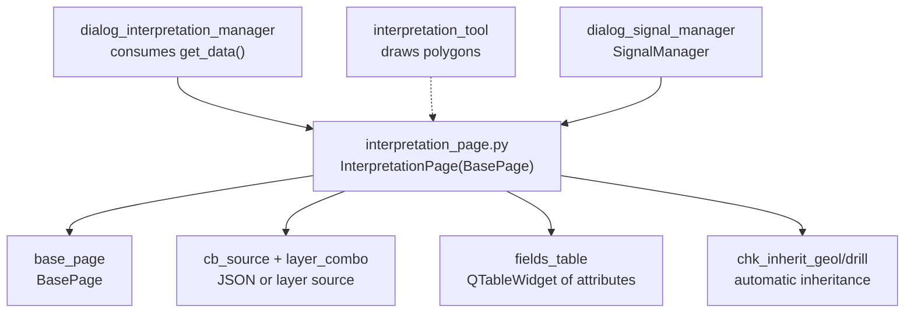

---
tags:
  - secinterp
  - code-walkthrough
  - gui
  - pages
aliases:
  - interpretation_page.py
  - InterpretationPage
cssclass: secinterp-note
---

# `gui/ui/pages/interpretation_page.py`

> [!abstract] One-line summary
> Interpretation settings page: storage source (internal JSON or vector layer), editable custom-attribute table, and automatic inheritance from geology and drillholes.

**Path**: `gui/ui/pages/interpretation_page.py` (230 lines)
**Main class**: `InterpretationPage(BasePage)`
**Layer**: GUI (programmatic presentation · no core validation)
**Tags**: #secinterp #gui #pages

---

## 🎯 Why does this file exist?

Interpretation (user-drawn polygons over the preview) needs somewhere to live, which
custom attributes it carries, and whether it inherits data from the input layers. This
page gathers those three decisions.

| Problem | Solution |
|---------|----------|
| Users must choose whether interpretation lives in the project (JSON) or in a layer | `cb_source` switches the layer combo and auto-sync |
| Each project needs its own attributes (interpreted lithology, confidence, author…) | Editable `QTableWidget` of fields (name, type, default) |
| Filling attributes by hand per polygon is slow and error-prone | Automatic inheritance from geology and drillholes via two checkboxes |

> [!important] Architectural note
> The only page with empty `layer_keys`: it persists no layers (`get_data`'s
> `target_layer_id` never enters `dump`). Interpretation is stored through other
> channels (persistence mixins and `interpretation_tool`); the page only configures how.

---

## 🧬 Relationship diagram



> [!tip] How to read
> Solid arrow = imports/contains; dashed = the drawing tool produces the polygons
> configured here.

---

## 📦 Imports — architectural reading

```python
# gui/ui/pages/interpretation_page.py
from __future__ import annotations

import contextlib
from typing import Any

from qgis.PyQt.QtCore import QCoreApplication
from qgis.PyQt.QtWidgets import (
    QCheckBox, QComboBox, QHBoxLayout, QHeaderView, QLabel,
    QPushButton, QTableWidget, QTableWidgetItem, QVBoxLayout, QWidget,
)

from .base_page import BasePage
```

| # | Observation |
|---|-------------|
| ① | Only `qgis.PyQt` (pure Qt) is imported: no header-level `qgis.core` or `qgis.gui`. Layer combos are lazily imported inside `_setup_ui`. |
| ② | Zero `sec_interp` imports: alongside the base, it is a graph leaf (nothing in the core knows it; only GUI managers consume it). |
| ③ | `QTableWidget` + `QHeaderView` + `QTableWidgetItem` for the attribute table; `QComboBox` for both the source and the per-row type. |
| ④ | `contextlib` for three separately shielded disconnects. |
| ⑤ | No `ProjectValidator` or `ValidationParams`: there is no `is_complete`; the page is always "complete" and `validate` only looks at duplicates. |

---

## 🏗️ Structure inventory

**`InterpretationPage(BasePage)` class** — `layer_keys = frozenset()` (empty):

Construction:

- `__init__(self, parent: QWidget | None = None) -> None`
- `_setup_ui(self) -> None` — 3 blocks: source, attributes, inheritance

UI logic:

- `_on_source_changed(self, index: int) -> None`
- `_add_field_row(self) -> None`
- `_remove_field_row(self) -> None`

`BasePage` protocol:

- `get_data`, `dump`, `load`, `reset`, `validate`, `connect_signals`, `disconnect_signals` (no `is_complete`)

**Widgets (3 blocks):**

| Block | Widgets | Role |
|-------|---------|------|
| Source | `cb_source`, `layer_combo`, `chk_auto_sync` | internal JSON vs polygon layer + auto-sync |
| Attributes | `fields_table` (0×3), `btn_add_field`, `btn_remove_field` | name/type/default table + buttons |
| Inheritance | `chk_inherit_geol` (✓), `chk_inherit_drill` (✓) | copy attributes from geology and drillholes |

---

## 📖 Method-by-method walkthrough

### `__init__` — interpretation title

```python
def __init__(self, parent: QWidget | None = None) -> None:
    super().__init__(
        QCoreApplication.translate("InterpretationPage", "Interpretation Settings"),
        parent,
    )
```

No own state, no `iface`. All state lives in widgets built by `_setup_ui`.

### `_setup_ui` — three blocks in a vertical layout

```python
def _setup_ui(self) -> None:
    super()._setup_ui()

    self.group_layout = QVBoxLayout()
    self.group_box.setLayout(self.group_layout)

    # 1. Source Selection
    self.group_layout.addWidget(QLabel("<b>" + self.tr("Interpretation Storage") + "</b>"))
    source_layout = QHBoxLayout()
    self.cb_source = QComboBox()
    self.cb_source.addItems(
        [self.tr("Project (Internal JSON)"), self.tr("Vector Layer (External)")]
    )
    # ... polygon layer (lazy import) + chk_auto_sync, both disabled ...
    # 2. Custom Fields Section: 0x3 table + Add/Remove buttons
    # 3. Inheritance Options: chk_inherit_geol + chk_inherit_drill (checked)
```

Note the explicit `self.group_box.setLayout(...)` (sibling pages pass `group_box` to
the layout constructor, which installs itself). The `QgsMapLayerProxyModel` and
`QgsMapLayerComboBox` imports happen **inside** the method (lazy import): the page
loads without `qgis.gui` until its UI is built. The layer combo uses the classic
`PolygonLayer` filter and starts disabled, like `chk_auto_sync`; `_on_source_changed`
governs both.

### `_on_source_changed` — JSON/layer switch

```python
def _on_source_changed(self, index: int) -> None:
    is_layer = index == 1
    self.layer_combo.setEnabled(is_layer)
    self.chk_auto_sync.setEnabled(is_layer)
```

Index 0 (JSON) → layer and auto-sync disabled; index 1 (layer) → enabled.
Auto-sync ("listen for target-layer edits and update the preview") only makes sense
with an external layer. Same toggle language as `_on_auto_ve_toggled` in [[dem_page]]
and `_toggle_lod_spin` in [[preview_page]].

### `_add_field_row` / `_remove_field_row` — attribute rows

```python
def _add_field_row(self) -> None:
    row = self.fields_table.rowCount()
    self.fields_table.insertRow(row)

    # Type combo
    type_combo = QComboBox()
    type_combo.addItems(["String", "Integer", "Double"])
    self.fields_table.setCellWidget(row, 1, type_combo)

    # Default name
    self.fields_table.setItem(row, 0, QTableWidgetItem(f"field_{row + 1}"))
    self.fields_table.setItem(row, 2, QTableWidgetItem(""))

def _remove_field_row(self) -> None:
    current_row = self.fields_table.currentRow()
    if current_row >= 0:
        self.fields_table.removeRow(current_row)
```

Adding creates the row with a type combo (`String/Integer/Double`, note untranslated:
type names, not UI text) and a default `field_{n}` name; removing only acts with a
selection (`currentRow() >= 0`), asking no confirmation. Headers use
`setSectionResizeMode(QHeaderView.ResizeMode.Stretch)` and the table is 150 px tall
minimum.

### `get_data` — full interpretation configuration

```python
def get_data(self) -> dict[str, Any]:
    fields = []
    for i in range(self.fields_table.rowCount()):
        name_item = self.fields_table.item(i, 0)
        type_widget = self.fields_table.cellWidget(i, 1)
        default_item = self.fields_table.item(i, 2)

        if name_item and name_item.text():
            fields.append(
                {
                    "name": name_item.text(),
                    "type": type_widget.currentText() if type_widget else "String",
                    "default": default_item.text() if default_item else "",
                }
            )

    return {
        "source_type": "layer" if self.cb_source.currentIndex() == 1 else "json",
        "target_layer_id": (
            self.layer_combo.currentLayer().id() if self.layer_combo.currentLayer() else None
        ),
        "auto_sync": self.chk_auto_sync.isChecked(),
        "custom_fields": fields,
        "inherit_geology": self.chk_inherit_geol.isChecked(),
        "inherit_drillholes": self.chk_inherit_drill.isChecked(),
    }
```

Skips nameless rows (defence against half-edited rows). `target_layer_id` stores the
layer **id**, not the live layer: the only page persisting an id reference on read
(the interpretation manager resolves it later). `type_widget` may be `None` under
mock-based tests, hence the `"String"` fallback.

### `dump` / `load` — inheritance and fields only

```python
def dump(self) -> dict[str, Any]:
    return {
        "interp_inherit_geol": self.chk_inherit_geol.isChecked(),
        "interp_inherit_drill": self.chk_inherit_drill.isChecked(),
        "interp_custom_fields": self.get_data()["custom_fields"],
    }

def load(self, data: dict[str, Any]) -> None:
    inherit_geol = data.get("interp_inherit_geol")
    if inherit_geol is not None:
        self.chk_inherit_geol.setChecked(bool(inherit_geol))
    # ... same for interp_inherit_drill ...

    fields = data.get("interp_custom_fields")
    if isinstance(fields, list):
        self.fields_table.setRowCount(0)
        for f in fields:
            self._add_field_row()
            row = self.fields_table.rowCount() - 1
            self.fields_table.item(row, 0).setText(f.get("name", ""))
            self.fields_table.cellWidget(row, 1).setCurrentText(f.get("type", "String"))
            self.fields_table.item(row, 2).setText(f.get("default", ""))
```

`dump` deliberately excludes `source_type/target_layer_id/auto_sync`: the storage
source does not travel in the page session (interpretation persistence owns it).
`load` rebuilds the table from scratch (`setRowCount(0)` + re-add) reusing
`_add_field_row`, with per-field `.get()` defaults: old-session lists with odd
fields never break.

### `reset` — empty table, active inheritances

```python
def reset(self) -> None:
    self.fields_table.setRowCount(0)
    self.chk_inherit_geol.setChecked(True)
    self.chk_inherit_drill.setChecked(True)
```

Empties attributes and re-enables both inheritances. Never touches `cb_source` or
the layer: the storage source survives reset (deliberate: accidentally switching
source would lose the destination of drawn polygons).

### `validate` — non-empty, unique names

```python
def validate(self) -> tuple[bool, str]:
    # Check for duplicate names
    names = []
    for i in range(self.fields_table.rowCount()):
        item = self.fields_table.item(i, 0)
        if item:
            name = item.text().strip()
            if not name:
                return False, self.tr("Field name cannot be empty")
            if name in names:
                return False, self.tr("Duplicate field name: {}").format(name)
            names.append(name)
    return True, ""
```

The only loop-based Level-1 validation in the page vault: rejects empty
(post-`strip()`) and duplicate names with translated messages (the second with
`.format(name)`). Ghost rows without a `QTableWidgetItem` are skipped (`if item`).

### `connect_signals` / `disconnect_signals` — three pure-Qt connections

```python
def connect_signals(self) -> None:
    self.btn_add_field.clicked.connect(self._add_field_row)
    self.btn_remove_field.clicked.connect(self._remove_field_row)
    self.cb_source.currentIndexChanged.connect(self._on_source_changed)
# disconnect_signals reverts each under its own contextlib.suppress.
```

No QGIS signals (`layerChanged`, `fieldChanged`): all pure Qt (`clicked`,
`currentIndexChanged`). Each disconnect gets its own `suppress`, the recommended
style versus the global `try` in [[dem_page]].

---

## 🗂️ Read keys vs session keys

| Source | Keys |
|--------|------|
| `get_data` | `source_type, target_layer_id, auto_sync, custom_fields, inherit_geology, inherit_drillholes` |
| `dump` / `load` | `interp_inherit_geol, interp_inherit_drill, interp_custom_fields` |
| Not persisted in session | `source_type, target_layer_id, auto_sync` (owned by interpretation persistence) |
| `layer_keys` | empty: the page declares no persistable layers |

---

## 🧩 Dialog lifecycle

| Moment | Who | What it does with the page |
|--------|-----|----------------------------|
| Construction | [[main_window]] / dialog | `InterpretationPage()` in the `QStackedWidget`, "Interpretation" entry in [[sidebar]] |
| Wiring | `SignalManager` | `connect_signals()` (no `dataChanged`: the dialog does not revalidate on these changes) |
| Drawing | `interpretation_tool` | creates polygons with the live `custom_fields` and inheritances |
| Reading | `dialog_interpretation_manager` | `get_data()` supplies source, target layer and fields |
| Session | persistence | `dump()` stores inheritances + fields; `load()` rebuilds the table |
| Teardown | `SignalManager` | per-connection `disconnect_signals()` |

---

## 🔄 Data flow

| Phase | Input | Transformation | Output |
|-------|-------|----------------|--------|
| Source | `cb_source` index | `_on_source_changed` | layer + auto-sync enabled or not |
| Attributes | Add/Remove buttons | `_add_field_row/_remove_field_row` | `{name, type, default}` rows |
| Inheritance | checkboxes | direct read | `inherit_geology/inherit_drillholes` |
| Reading | widgets + table | `get_data()` (skips nameless rows) | 6-key dict with `target_layer_id` |
| Validation | row names | `validate()` (empty/duplicate) | `(bool, message)` |
| Persistence | checkboxes + table | `dump()` (no source) | 3 `interp_*` keys |
| Restoration | `interp_custom_fields` list | `setRowCount(0)` + re-add | rebuilt table |

---

## 🏛️ Design patterns present

| Pattern | Where | Purpose |
|---------|-------|---------|
| **Block builder** | `_setup_ui` in 3 sections | Source, attributes and inheritance separated |
| **Row factory** | `_add_field_row` reused by UI and `load` | Single way to build valid rows |
| **Feature toggle** | `_on_source_changed` | JSON or layer source without forking the page |
| **Defensive read** | `get_data` skips nameless rows | Half-edited rows never corrupt |

---

## 🧾 API summary

| Symbol | Signature / Inherits | Typical use |
|--------|----------------------|-------------|
| `InterpretationPage` | `(BasePage)` | "Interpretation" tab of the `QStackedWidget` |
| `layer_keys` | empty `frozenset()` | no persistable layers |
| `get_data` | 6 keys with `target_layer_id` | interpretation manager |
| `dump` | 3 `interp_*` keys | session (no source) |
| `validate` | empty/duplicate | field-save gate |
| No `is_complete` | always complete | no preview gate of its own |

---

## 🛡️ Error handling

- Nameless rows: `get_data` ignores them; `validate` rejects them with a message (double net: tolerant read, strict save).
- `load` with a non-list `interp_custom_fields`: `isinstance` ignores it without breaking the live table.
- Removing with no selection (`currentRow() == -1`): silent no-op.
- Missing `cellWidget` (mocks): `"String"` fallback on read and `.get("type", "String")` on load.
- Three independent `suppress` blocks in `disconnect_signals`: one failure never blocks the rest.

---

## 🧪 Associated tests

No dedicated `tests/gui/test_interpretation_page.py` exists; coverage is indirect:

- `tests/gui/test_interpretation_export.py` — export with custom attributes and inheritance.
- `tests/gui/test_main_dialog_interpretation.py` — the page inside the dialog (source, fields, inheritances).
- `tests/gui/test_interpretation_tool.py` — the tool consuming `custom_fields` while drawing.
- `tests/gui/test_multi_session_persistence.py` — round-trip with `interp_*` keys.
- `tests/gui/test_attribute_inheritance.py` — geology/drillhole inheritance end to end.

| Aspect to test | Status |
|----------------|--------|
| `validate` duplicates/empties | no dedicated test; pure logic, easy to cover |
| `_on_source_changed` enables layer | no dedicated test |
| Table `dump/load` round-trip | covered via dialog persistence |
| `target_layer_id` by id (not live layer) | covered via interpretation manager |

---

## 🌐 i18n and migration notes

- All visible text uses `self.tr(...)` except row types (`"String/Integer/Double"`, universal type names) and the `"InterpretationPage"`-context title.
- `self.tr("Duplicate field name: {}").format(name)`: the placeholder survives translation; translators reorder `{}` freely.
- HTML labels (`"<b>" + … + "</b>"`) for block headers: in-house style, no external sheets.
- Pure Qt plus a lazy `qgis.gui` import: no expected 4.x migration friction.

---

## 👀 Observations and notes

> [!success] Strengths
> - `_add_field_row` as the single factory for UI and `load`: restoring can never rebuild an invalid row.
> - `dump` deliberately excludes the source: restoring a session never changes where drawn polygons are stored.
> - `target_layer_id` by id instead of live layer: the only read retaining no QGIS objects.

> [!warning] Points of attention
> - No `dataChanged` or `is_complete`: the dialog does not react to changes here (e.g. live duplicate validation).
> - `reset()` leaves `cb_source` alone: coherent (never lose the destination), but asymmetric with pages resetting everything.
> - Row removal without confirmation: a stray click loses the field (unless `dump` has not stored it yet — small comfort).
> - Lazy import inside `_setup_ui`: pragmatic, but hides the `qgis.gui` dependency from header readers.

> [!question] Open questions
> - Emit `dataChanged` when editing the table for live duplicate validation?
> - Confirm row removal or add undo?
> - Persist `source_type/target_layer_id` in the page session too, or keep it with interpretation persistence?

---

## 🔗 Related notes

- [[Index]] — vault index
- [[base_page]] — protocol (this page skips `is_complete`)
- [[gui_ui_pages]] — pages package
- [[main_window]] — "Interpretation" tab of the `QStackedWidget`
- [[sidebar]] — "Interpretation" entry (`mActionEdit.svg`)
- [[dialog_interpretation_manager]] — consumes `get_data()` (source and fields)
- [[interpretation_tool]] — draws the polygons configured here
- [[interpretations]] — interpretation domain in the core
- [[dialog_settings_persistence]] — persistence owning the source
- [[dem_page]] / [[preview_page]] — toggles with the same visual language

---

*Note of the SecInterp Code Walkthrough v2 vault — v3.9.1*
