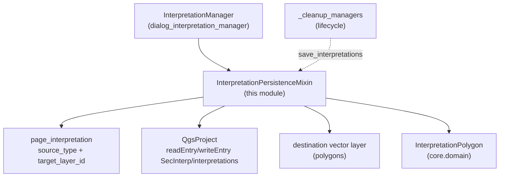

---
tags:
  - secinterp
  - code-walkthrough
  - gui
  - mixins
aliases:
  - interpretation_persistence_mixin.py
  - InterpretationPersistenceMixin
cssclass: secinterp-note
---

# `gui/interpretation_persistence_mixin.py`

> [!abstract] One-line summary
> Mixin persisting interpretation polygons to two mutually exclusive destinations — QGIS project JSON or an external vector layer — with extent-filtered sync, a `QVariant`-tolerant serializer, and name-based field descriptors.

**Path**: `gui/interpretation_persistence_mixin.py` (177 lines)
**Main class**: `InterpretationPersistenceMixin`
**Layer**: GUI (presentation mixin · I/O against project and layers)
**Tags**: #secinterp #gui #mixins

---

## 🎯 Why does this file exist?

Interpretations are user work that must survive closing: left in memory only, a
lost session wipes hours of digitizing. But "saving" means two different things
per workflow (lightweight project vs interoperable GIS layer), and reading
features from a layer requires QGIS geometry and fields:

| Problem | Solution |
|---------|----------|
| Losing interpretations when the dialog or QGIS closes | `save_interpretations` on every add, clear, and close (via `_cleanup_managers`) |
| Some users want them as an editable project layer, not a JSON blob | Dual destination: `source_type == "layer"` writes/reads a polygon layer; otherwise JSON in `project.writeEntry` |
| QGIS attributes (`QVariant`, nulls) break `json.dumps` | `json_serial` maps null `QVariant` → `None`, the rest → `.value()` or `str()` |
| Layer schemas may vary (missing fields) | `get_field_val`/`set_field` resolve by name with `indexOf` and defaults; never by position |

> [!important] Architectural note
> **Source election**: `page_interpretation.get_data()` decides (`source_type`,
> `target_layer_id`) and all four methods branch the same way. The dialog never
> picks a destination directly; the interpretation page is the sole source of
> that decision.

---

## 🧬 Relationship diagram



> [!tip] How to read
> Solid arrow = reads/writes; dashed = the lifecycle invokes the save on close.
> The QGIS imports (`QgsProject`, `QgsFeature…`) are all lazy inside the methods.

---

## 📦 Imports — architectural reading

```python
# gui/interpretation_persistence_mixin.py
from __future__ import annotations
import json
from typing import Any
from sec_interp.core.domain import InterpretationPolygon
from sec_interp.logger_config import get_logger

logger = get_logger(__name__)
```

| # | Observation |
|---|-------------|
| ① | **Zero module-level QGIS imports**: `QgsProject`, `QgsFeature`, `QgsGeometry`, `QgsPointXY`, `QgsFeatureRequest`, `QgsWkbTypes` are imported inside each method. The module imports without QGIS (collection-safe tests). |
| ② | `json` is the primary-destination format (project); the layer is secondary. |
| ③ | `Any` for layers, features, and field values: the mixin does not type QGIS objects (explicit GUI boundary, documented dynamic typing). |
| ④ | `InterpretationPolygon` is the only strong type: everything entering or leaving converts to this DTO at the mixin edge. |
| ⑤ | Three log levels: `info` on load/sync (interpretation count), `debug` on JSON save, `exception` on corrupt JSON. |

---

## 🏗️ Structure inventory

**Classes:** 1 — `InterpretationPersistenceMixin` (4 public methods + 2 nested closures).

| Method | Destination | Role |
|--------|-------------|-----|
| `load_interpretations()` | layer or JSON | Rehydrates `self.interpretations` at startup |
| `save_interpretations()` | layer or JSON | Persists the live list after every mutation |
| `sync_from_layer(layer)` | layer → memory | Rebuilds DTOs from polygon features with an extent-filtered request |
| `save_to_layer(layer)` | memory → layer | Rewrites the layer (delete + add) in an edit session |

**Nested closures:** `json_serial` (in `save_interpretations`), `get_field_val` (in `sync_from_layer`), `set_field` (in `save_to_layer`).

---

## 📁 Files in the package

| File | Role towards this mixin |
|---|---|
| `gui/dialog_interpretation_manager.py` | `InterpretationManager` inherits the mixin; `clear_interpretations` and the add flow call `save_interpretations` |
| `gui/interpretation_inheritance_mixin.py` | Sibling base: enriches before persisting |
| `gui/dialog_lifecycle_mixin.py` | `_cleanup_managers` saves on close (last chance) |
| `gui/dialog_facade_mixin.py` | `_load/_save_interpretations` re-expose these methods |
| `gui/ui/pages/interpretation_page.py` | `get_data()`: `source_type`, `target_layer_id` (destination elector) |
| `core/domain/` | `InterpretationPolygon(id, name, type, vertices_2d, attributes, color, created_at)` |

---

## 📖 Method-by-method walkthrough

### `load_interpretations`

```python
def load_interpretations(self) -> None:
    interp_config = self.dialog.page_interpretation.get_data()
    if interp_config.get("source_type") == "layer":
        target_layer_id = interp_config.get("target_layer_id")
        if target_layer_id:
            from qgis.core import QgsProject
            target_layer = QgsProject.instance().mapLayer(target_layer_id)
            if target_layer and target_layer.isValid():
                self.sync_from_layer(target_layer)
                return
    if not self.dialog.project:
        return
    json_data, ok = self.dialog.project.readEntry("SecInterp", "interpretations", "[]")
    if not ok or not json_data:
        return
    try:
        data = json.loads(json_data)
        self.interpretations = []
        for item in data:
            interp = InterpretationPolygon(id=item.get("id", ""), ...,
                vertices_2d=[tuple(v) for v in item.get("vertices_2d", [])], ...)
            self.interpretations.append(interp)
        logger.info(f"Loaded {len(self.interpretations)} interpretations from project")
    except Exception:
        logger.exception("Failed to load interpretations")
```

4-exit cascade: (1) valid layer → `sync_from_layer` and `return`; (2) no project
→ silent `return` (orphan tests); (3) missing entry → `return`; (4) corrupt JSON
→ `logger.exception` with the previous list intact (it is not emptied before a
successful parse: `self.interpretations = []` runs inside the `try`, so broken
JSON keeps whatever was there). Vertices rebuild as `tuple(v)` because JSON only
knows lists.

### `save_interpretations` + `json_serial`

```python
def save_interpretations(self) -> None:
    interp_config = self.dialog.page_interpretation.get_data()
    if interp_config.get("source_type") == "layer":
        ... # valid layer → self.save_to_layer(target_layer); return
    if not self.dialog.project:
        return
    data = [{"id": i.id, "name": i.name, "type": i.type, "vertices_2d": i.vertices_2d,
             "attributes": i.attributes, "color": i.color, "created_at": i.created_at}
            for i in self.interpretations]
    def json_serial(obj):
        if hasattr(obj, "isNull"):      # QVariant (qgis.PyQt/PyQGIS)
            return None if obj.isNull() else obj.value()
        return str(obj)
    json_data = json.dumps(data, default=json_serial)
    self.dialog.project.writeEntry("SecInterp", "interpretations", json_data)
```

Mirror of loading: layer → delegate; no project → no-op. The 7-key JSON schema is
the cross-version compatibility contract (see dedicated section). `json_serial`
exists because `attributes` may hold `QVariant`s arriving from the layer: null →
`None`, valued → `.value()`, other exotics → `str()`.

### `sync_from_layer` + `get_field_val`

```python
def sync_from_layer(self, layer: Any) -> None:
    from qgis.core import QgsFeatureRequest, QgsWkbTypes
    self.interpretations = []
    request = QgsFeatureRequest().setFilterRect(layer.extent())
    for feature in layer.getFeatures(request):
        geom = feature.geometry()
        if geom.isNull() or geom.type() != QgsWkbTypes.GeometryType.PolygonGeometry:
            continue
        vertices = [(pt.x(), pt.y()) for pt in (geom.asPolygon()[0] if geom.asPolygon() else [])]
        ...
        def get_field_val(name, default="", _attrs=attrs, _fields=fields):
            idx = _fields.indexOf(name)
            return _attrs[idx] if idx != -1 and not isinstance(_attrs[idx], type(None)) else default
        interp = InterpretationPolygon(id=str(get_field_val("id", feature.id())), ...,
            attributes={}, color=str(get_field_val("color", "#FF0000")), ...)
    logger.info(f"Synchronized {len(self.interpretations)} interpretations from layer {layer.name()}")
```

Three decisions: (1) `setFilterRect(layer.extent())` serves the request through
the spatial index instead of an unfiltered scan (a test pins this:
`test_sync_from_layer_uses_filtered_request`); (2) polygons only
(`PolygonGeometry`, exterior ring `[0]`); nulls and other types are skipped;
(3) fields by name with defaults (`id` falls back to `feature.id()`, `name` to
`Interp_<id>`). `attributes` syncs as empty `{}` — the `# Add custom attribute
sync here if wanted` comment marks the pending extension without breaking the
current schema.

### `save_to_layer` + `set_field`

```python
def save_to_layer(self, layer: Any) -> None:
    from qgis.core import QgsFeature, QgsGeometry, QgsPointXY
    if not layer.isEditable():
        layer.startEditing()
    layer.deleteFeatures([f.id() for f in layer.getFeatures()])
    features_to_add = []
    fields = layer.fields()
    for interp in self.interpretations:
        feat = QgsFeature(fields)
        ring = [QgsPointXY(x, y) for x, y in interp.vertices_2d]
        feat.setGeometry(QgsGeometry.fromPolygonXY([ring]))
        def set_field(name, value, _feat=feat, _fields=fields):
            idx = _fields.indexOf(name)
            if idx != -1:
                _feat.setAttribute(idx, value)
        set_field("id", interp.id); set_field("name", interp.name); ...
    layer.addFeatures(features_to_add)
    layer.commitChanges()
```

Full rewrite: opens editing when needed, deletes every feature, and adds one per
interpretation with `QgsFeature(fields)` (schema defaults) plus the 5 known
fields. `set_field` ignores missing fields (`idx == -1` → no-op), so
partial-schema layers do not break. Note what it does **not** do: no `attributes`
or vertex fields (they travel in the geometry), and `commitChanges` always
closes — no partial rollback.

---

## 🔄 Data flow

| Phase | Input | Transformation | Output |
|-------|-------|----------------|--------|
| Load (layer) | `target_layer_id` + valid layer | `sync_from_layer` (extent + polygons only + named fields) | rehydrated `self.interpretations` |
| Load (JSON) | `readEntry("SecInterp", "interpretations")` | `json.loads` + `tuple(v)` per vertex | DTO list, or previous list intact when corrupt |
| Save (layer) | live list | delete all + add features + `commitChanges` | layer mirroring memory |
| Save (JSON) | live list | 7 keys + `json_serial` (QVariant) | `writeEntry` with the JSON |

---

## 🏛️ Design patterns present

| Pattern | Where | Purpose |
|---------|-------|---------|
| **Mixin** | the class | Persistence composed into the manager |
| **Source election** | `source_type` in all 4 methods | One page flag picks JSON or layer |
| **DTO boundary** | `InterpretationPolygon` on both edges | Layers/JSON never leak into the rest of the dialog |
| **Name-based fields** | `get_field_val`/`set_field` | Tolerance for partial schemas |
| **Serializer fallback** | `json_serial` | `QVariant` and exotics without breaking `json.dumps` |

---

## 🧾 API summary

| Symbol | Signature | Typical use |
|--------|-----------|-------------|
| `InterpretationPersistenceMixin` | `class …:` (no bases) | first base of `InterpretationManager` |
| `load_interpretations` | `() -> None` | startup (`_init_managers`) and reopen |
| `save_interpretations` | `() -> None` | after add, clear, Accept, and close |
| `sync_from_layer` | `(layer: Any) -> None` | layer → memory (extent-filtered) |
| `save_to_layer` | `(layer: Any) -> None` | memory → layer (rewrite + commit) |
| `json_serial` | `(obj) -> Any` | `default=` for `json.dumps` |
| JSON schema | 7 keys (`id/name/type/vertices_2d/attributes/color/created_at`) | cross-version contract |

---

## 🛡️ Error handling

- **Invalid or missing layer**: ignored, falls through to JSON; never raises on a stale `target_layer_id`.
- **Corrupt JSON**: `except Exception` + `logger.exception`; the previous list survives because emptying happens inside the `try` after parsing.
- **No project**: silent no-op in both directions (orphan dialogs in tests).
- **Missing layer fields**: name-based defaults; explicit `None` also falls to the default (`isinstance(..., type(None))`).
- **Honest risk**: `save_to_layer` deletes before adding; a midway `addFeatures` failure leaves the layer half-written (no transaction).

---

## 🧪 Associated tests

- `tests/gui/test_dialog_interpretation_manager.py` — `TestDialogInterpretationManager`:
  - `test_load_interpretations_success` / `test_load_interpretations_fail` — valid and corrupt JSON.
  - `test_save_interpretations` — JSON write.
  - `test_json_serial_special` — null/valued `QVariant` and exotic objects.
  - `test_no_project_guards` — no-op without project.
  - `test_sync_from_layer_uses_filtered_request` — extent-filtered request.
- `tests/gui/test_main_dialog_interpretation.py` — `TestInterpretationManager::test_load_interpretations_empty/valid`, `test_save_interpretations`.
- `tests/gui/test_interpretation_export.py` — `TestInterpretationExport::test_interpretation_layer_included_in_render` (the destination layer also renders).

---

## 📐 JSON schema — cross-version contract

```json
{
  "id": "uuid…",
  "name": "Granite",
  "type": "geology",
  "vertices_2d": [[0.0, 0.0], [10.0, 0.0], [10.0, 5.0]],
  "attributes": {"source": "inherited"},
  "color": "#FF0000",
  "created_at": "2026-…"
}
```

| Rule | Detail |
|-------|---------|
| 7 fixed keys | Adding a key requires a load-time default (`.get`) for old projects |
| `vertices_2d` as lists | JSON has no tuples; `load` converts back with `tuple(v)` |
| Free-form `attributes` | User dict; `json_serial` makes it `QVariant`-tolerant |
| Project key | `("SecInterp", "interpretations")`, default `"[]"` |

---

## 🧪 Round-trip example (JSON → memory → layer)

A 4-vertex `Granite` polygon, first in JSON mode, then switching the page to
`source_type = "layer"`:

| Step | Operation | Resulting state |
|------|-----------|-------------------|
| 1. Add | `handle_interpretation_finished` → `save_interpretations` (JSON) | `writeEntry("SecInterp", "interpretations", '[{…Granite…}]')` |
| 2. Restart | `load_interpretations` reads the entry | `self.interpretations == [Granite]` (`tuple(v)` per vertex) |
| 3. Switch to layer | user picks layer `interp_2026` in `page_interpretation` | `source_type = "layer"`, `target_layer_id = <id>` |
| 4. Save | `save_interpretations` → `save_to_layer` | layer with 1 polygon feature (`id/name/type/color/created_at`) |
| 5. Re-read | `load_interpretations` → `sync_from_layer` | `Granite` rebuilt; `attributes == {}` (documented loss) |
| 6. Close | `_cleanup_managers` saves again | layer and memory identical |

> [!tip] Where information is lost
> Only in step 5: the layer has no free-attribute column, so `sync_from_layer`
> pins `attributes = {}`. The JSON path (steps 1–2) is lossless.

---

## 📐 Attribute contract (what the host must provide)

| Attribute | Provider | Consumed by |
|----------|-----------|---------------|
| `self.dialog` | `InterpretationManager.__init__` | `page_interpretation.get_data()` in `load/save` |
| `self.dialog.page_interpretation` | `SecInterpMainWindow` | `source_type`/`target_layer_id` elector |
| `self.dialog.project` | `main_dialog.__init__` (`QgsProject.instance()`) | JSON `readEntry`/`writeEntry` |
| `self.interpretations` | `InterpretationManager` | live list read and reassigned here |

> [!note] No global `QgsProject`
> The layer branch uses `QgsProject.instance().mapLayer(...)` (lazy) because the
> target id may point at a reloaded project; the JSON branch uses
> `self.dialog.project` because it is the project the dialog already resolved.

---

## 👀 Observations and notes

> [!success] Strengths
> - 100% lazy QGIS imports: the module imports without QGIS.
> - Dual destination behind one page flag; loading degrades gracefully (layer → JSON → empty).
> - Named fields with defaults: robust to partial-schema layers.

> [!warning] Points of attention
> - `save_to_layer` is not transactional: deletes first, adds after; a midway failure leaves the layer half-done.
> - `sync_from_layer` drops `attributes` (`{}`): a layer→memory→layer round-trip loses custom attributes.
> - Broad `except Exception` in `load`: in practice only parse failures, but it is wide.

> [!question] Open questions
> - Should `attributes` be stored in a JSON layer field for a lossless round-trip?
> - Should `deleteFeatures + addFeatures + commitChanges` be wrapped in an edit session with rollback when `addFeatures` fails?

---

## 🔗 Related notes

- [[Index]] — vault index
- [[dialog_interpretation_manager]] — orchestrator (`clear_interpretations`, add flow)
- [[interpretation_inheritance_mixin]] — sibling base (enriches before persisting)
- [[dialog_facade_mixin]] — `_load/_save_interpretations` and `accept_handler`
- [[dialog_lifecycle_mixin]] — `_cleanup_managers` saves on close
- [[interpretation_properties_dialog]] — edits what is persisted here
- [[interpretation_page]] — `source_type`/`target_layer_id` (elector)
- [[interpretations]] — `InterpretationPolygon` DTO and schema
- [[preview_state]] — cache (not persistence; do not confuse)
- [[dialog_settings_persistence]] — dialog settings (project vs this interpretation JSON)

---

*Note of the SecInterp Code Walkthrough v2 vault — v3.9.0*
