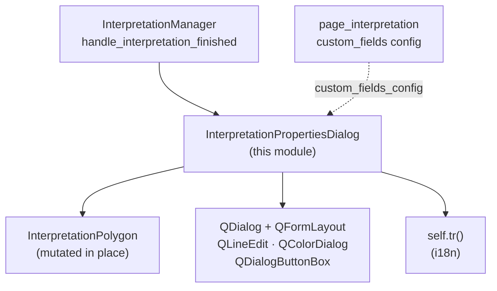

---
tags:
  - secinterp
  - code-walkthrough
  - gui
  - dialogs
aliases:
  - interpretation_properties_dialog.py
  - InterpretationPropertiesDialog
cssclass: secinterp-note
---

# `gui/dialogs/interpretation_properties_dialog.py`

> [!abstract] One-line summary
> Programmatic modal dialog (no `.ui`) editing the name, type, colour, and custom attributes of a freshly digitized interpretation, mutating the DTO in place and disconnecting its signals on close to avoid leaks.

**Path**: `gui/dialogs/interpretation_properties_dialog.py` (149 lines)
**Main class**: `InterpretationPropertiesDialog`
**Layer**: GUI (modal dialog · programmatic `QDialog`)
**Tags**: #secinterp #gui #dialogs

---

## 🎯 Why does this file exist?

After digitizing a polygon (with optional inheritance already applied), the user
must confirm its properties before it is persisted. Without this dialog, the
inherited name would be final and there would be no way to add custom attributes:

| Problem | Solution |
|---------|----------|
| The freshly created polygon needs confirmation/editing before persisting | Modal `QDialog` with `exec()`; `Accepted (1)` saves, anything else discards |
| Custom fields are defined by the interpretation page, not the dialog | `custom_fields_config: list[dict]` generates dynamic `QLineEdit`s in the `QFormLayout` |
| Ephemeral dialogs accumulate connections unless disconnected | `disconnect_signals()` in `accept()` and `reject()` with `suppress`/try-except |

> [!important] Architectural note
> **100% programmatic UI**: no `.ui` nor `uic`; `_setup_ui` builds
> `QVBoxLayout → QFormLayout + QDialogButtonBox` in code, following the plugin's
> own UI framework. In-place DTO mutation: the dialog returns no values, it edits
> `self.interpretation` directly.

---

## 🧬 Relationship diagram



> [!tip] How to read
> Solid arrow = creates/mutates; dashed = the custom-field config enters via the
> constructor (injected by the manager from `page_interpretation`).

---

## 📦 Imports — architectural reading

```python
# gui/dialogs/interpretation_properties_dialog.py
from __future__ import annotations
import contextlib
from typing import TYPE_CHECKING, Any
from qgis.PyQt.QtGui import QColor
from qgis.PyQt.QtWidgets import (QColorDialog, QDialog, QDialogButtonBox, QFormLayout,
    QHBoxLayout, QLabel, QLineEdit, QPushButton, QVBoxLayout, QWidget)

if TYPE_CHECKING:
    from sec_interp.core.domain import InterpretationPolygon
```

| # | Observation |
|---|-------------|
| ① | `qgis.PyQt` (not `PyQt5` directly): agnostic import ready for QGIS 4.x — the dialog already follows the migration guide. |
| ② | `InterpretationPolygon` only under `TYPE_CHECKING`: at runtime the DTO is opaque; the dialog mutates it by duck typing (`name`, `type`, `color`, `attributes`). |
| ③ | Nine Qt widgets imported by name: the dialog hand-builds its entire UI; no `.ui` loader. |
| ④ | `contextlib` for `suppress(TypeError, RuntimeError)` in `disconnect_signals`: disconnecting twice or with destroyed objects must not raise. |
| ⑤ | No `get_logger`: the dialog logs nothing; the manager logs accept/cancel. The right call (modals do not diagnose). |

---

## 🏗️ Structure inventory

**Classes:** 1 — `InterpretationPropertiesDialog(QDialog)` (constructor + 5 methods).

| Method | Role |
|--------|-----|
| `__init__(interpretation, custom_fields_config, parent=None)` | i18n title, 400×300 size, `_setup_ui()` |
| `_setup_ui()` | Builds the form: standard (name/type/colour) + separator + custom + buttons |
| `_set_preview_color(hex_color)` | `setStyleSheet` of the colour swatch (`background + border`) |
| `_pick_color()` | `QColorDialog.getColor`; when valid, mutates `interpretation.color` and repaints the swatch |
| `reject()` | `disconnect_signals()` + `super().reject()` (cancel without saving) |
| `disconnect_signals()` | Disconnects `btn_change_color` and `button_box`, tolerant to double calls |
| `accept()` | Dumps widgets into the DTO (`name`, `type`, `attributes`), disconnects, `super().accept()` |

**Built widgets:** `name_edit`, `type_edit` (`QLineEdit`); `color_preview` (`QLabel` 30×20), `btn_change_color`; `field_widgets: dict[str, QLineEdit]`; `button_box` (Ok/Cancel).

---

## 📁 Files in the package

| File | Role towards this dialog |
|---|---|
| `gui/dialog_interpretation_manager.py` | Sole instantiator: `InterpretationPropertiesDialog(interpretation, custom_fields, dialog)` + `exec()`; accept → append, cancel → discard |
| `gui/ui/pages/interpretation_page.py` | `get_data()["custom_fields"]`: `[{"name":…, "default":…}]` generating dynamic rows |
| `gui/interpretation_inheritance_mixin.py` | Pre-fills `name/type/attributes/color` before the dialog opens |
| `gui/interpretation_persistence_mixin.py` | Persists the mutated DTO after `Accepted` |
| `gui/dialogs/` | Modal-dialog package (this is the interpretation property editor) |

---

## 📖 Method-by-method walkthrough

### `__init__`

```python
def __init__(self, interpretation, custom_fields_config, parent=None):
    super().__init__(parent)
    self.interpretation = interpretation
    self.custom_fields_config = custom_fields_config
    self.setWindowTitle(self.tr("Interpretation Properties"))
    self.resize(400, 300)
    self.field_widgets: dict[str, QLineEdit] = {}
    self._setup_ui()
```

Live reference to the DTO (no copy): everything the user edits is reflected on
accept with no return-value plumbing. `parent = self.dialog` (the main dialog)
gives correct modality and centering. The title is born translated with `self.tr()`.

### `_setup_ui` — standard fields and colour

```python
def _setup_ui(self) -> None:
    layout = QVBoxLayout(self)
    form_layout = QFormLayout()
    self.name_edit = QLineEdit(self.interpretation.name)
    form_layout.addRow(self.tr("Name:"), self.name_edit)
    self.type_edit = QLineEdit(self.interpretation.type)
    form_layout.addRow(self.tr("Type:"), self.type_edit)
    color_layout = QHBoxLayout()
    self.color_preview = QLabel()
    self.color_preview.setFixedSize(30, 20)
    self._set_preview_color(self.interpretation.color)
    self.btn_change_color = QPushButton(self.tr("Change..."))
    self.btn_change_color.clicked.connect(self._pick_color)
    ...
    form_layout.addRow(self.tr("Color:"), color_layout)
    form_layout.addRow(QLabel("<hr>"))
```

Pre-filled with inherited values (`name`, `type`, `color`): when inheritance got
it right, the user only confirms. The colour picker is swatch + button
(`QHBoxLayout` with `addStretch`); the `<hr>` separates standard from custom
fields. Every visible label uses `self.tr()`.

### `_setup_ui` — custom fields and buttons

```python
    if self.custom_fields_config:
        form_layout.addRow(QLabel("<b>" + self.tr("Custom Attributes") + "</b>"))
        for field in self.custom_fields_config:
            name, default = field["name"], field["default"]
            edit = QLineEdit(str(default))
            self.field_widgets[name] = edit
            form_layout.addRow(f"{name}:", edit)
    layout.addLayout(form_layout)
    layout.addStretch()
    self.button_box = QDialogButtonBox(Ok | Cancel)
    self.button_box.accepted.connect(self.accept)
    self.button_box.rejected.connect(self.reject)
    layout.addWidget(self.button_box)
```

Custom fields generate from config (`name`/`default` per dict) and index into
`field_widgets` for the `accept()` dump. Note: the field **name**
(`f"{name}:"`) is not translated — it is page/user configuration, not plugin UI;
only the `"Custom Attributes"` header carries `tr()`. The `button_box` wires
`accepted → self.accept` (overridden, not the default Qt slot) and
`rejected → self.reject`.

### `_set_preview_color` / `_pick_color`

```python
def _set_preview_color(self, hex_color: str) -> None:
    self.color_preview.setStyleSheet(
        f"background-color: {hex_color}; border: 1px solid black;")

def _pick_color(self) -> None:
    color = QColor(self.interpretation.color)
    new_color = QColorDialog.getColor(color, self, self.tr("Select Color"))
    if new_color.isValid():
        self.interpretation.color = new_color.name()
        self._set_preview_color(self.interpretation.color)
```

Colour is written **live** into the DTO on pick (`interpretation.color =
new_color.name()`), not on accept: cancelling after a colour change keeps the new
colour on the DTO even though the polygon is discarded (a subtle detail —
discarding makes the mutation moot, since the object never joins the list).
`isValid()` covers closing the picker without choosing.

### `reject` / `disconnect_signals`

```python
def reject(self) -> None:
    self.disconnect_signals()
    super().reject()

def disconnect_signals(self) -> None:
    with contextlib.suppress(TypeError, RuntimeError):
        self.btn_change_color.clicked.disconnect(self._pick_color)
    try:
        self.button_box.accepted.disconnect(self.accept)
        self.button_box.rejected.disconnect(self.reject)
    except (TypeError, RuntimeError):
        pass
```

Defensive disconnection in two styles (showcasing both project idioms):
`suppress` for the colour button, try/except for the `button_box`. Covers double
`disconnect` (`TypeError`: not connected) and destroyed Qt objects
(`RuntimeError`). `reject` leaves the DTO untouched: cancelling preserves
name/type (modulo the live-colour nuance).

### `accept`

```python
def accept(self) -> None:
    self.interpretation.name = self.name_edit.text()
    self.interpretation.type = self.type_edit.text()
    for name, widget in self.field_widgets.items():
        self.interpretation.attributes[name] = widget.text()
    self.disconnect_signals()
    super().accept()
```

Widget → DTO dump: name, type, and every custom field (always strings —
`widget.text()`). Then disconnect and `super().accept()`, closing with
`QDialog.Accepted (1)`, the value the manager compares in `dlg.exec() != 1`.

---

## 🔄 Data flow

| Phase | Input | Transformation | Output |
|-------|-------|----------------|--------|
| Open | DTO (inherited) + `custom_fields` + parent | `_setup_ui` pre-fills | visible modal |
| Edit | text, colour, custom fields | widgets + live DTO colour mutation | pending state in widgets/DTO |
| Accept | OK click | dump + `disconnect` + `super().accept()` → `exec() == 1` | mutated DTO; manager appends and persists |
| Cancel | Cancel click / Esc | `disconnect` + `super().reject()` → `exec() != 1` | DTO discarded with the list |

---

## 🏛️ Design patterns present

| Pattern | Where | Purpose |
|---------|-------|---------|
| **Modal dialog** | `exec()` + `Accepted/Rejected` | Blocking confirmation with safe discard |
| **In-place mutation** | `self.interpretation` | No return values or result signals |
| **Dynamic form** | `custom_fields_config → field_widgets` | Schema owned by the page, not the dialog |
| **Defensive disconnect** | `disconnect_signals` | No dangling connections in ephemeral dialogs |
| **Programmatic UI** | `_setup_ui` | No `.ui`; code-built layout |

---

## 🧾 API summary

| Symbol | Signature | Typical use |
|--------|-----------|-------------|
| `InterpretationPropertiesDialog` | `(QDialog)` | `InterpretationPropertiesDialog(interp, custom_fields, parent)` |
| `__init__` | `(interpretation, custom_fields_config: list[dict], parent=None)` | only the manager calls it |
| `field_widgets` | `dict[str, QLineEdit]` | custom-field index for `accept()` |
| `_pick_color` | `() -> None` | `btn_change_color` slot |
| `accept` / `reject` | `() -> None` | `button_box`; `accept` dumps, `reject` discards |
| `disconnect_signals` | `() -> None` | idempotent, tolerant to destroyed Qt |

---

## 🛡️ Error handling

- **No content validation**: empty names or arbitrary types are accepted; domain validation lives in upper layers (the dialog edits, it does not validate).
- **`custom_fields_config = None`**: the `if` treats it as "no custom fields"; a list with dicts missing `"name"` would raise `KeyError` (contract: the page guarantees the schema).
- **Invalid colour**: `QColor(hex)` with broken text yields an invalid colour but never raises; the swatch renders the stylesheet verbatim.
- **Double close**: idempotent `disconnect_signals`; `accept`/`reject` after partial destruction are covered by `suppress`/try-except.

---

## 🧪 Associated tests

No dedicated file (`test_interpretation_properties_dialog.py` does not exist);
honest coverage through the manager with the dialog mocked:

- `tests/gui/test_dialog_interpretation_manager.py` — `TestDialogInterpretationManager`:
  - `test_handle_interpretation_finished_accepted` — `exec() == 1` branch (accepted mock).
  - `test_handle_interpretation_finished_rejected` — `exec() != 1` branch (cancelled mock).
- `tests/gui/test_main_dialog_interpretation.py` — flow from the main dialog.
- Documented gap: `_pick_color` (needs the native `QColorDialog`), idempotent `disconnect_signals`, and the `field_widgets` dump have no direct test; all are testable with `pytest-qt`/`offscreen` and no refactor.

---

## 🌐 Dialog i18n

| String (`self.tr`) | Where |
|--------------------|-------|
| `"Interpretation Properties"` | window title |
| `"Name:"`, `"Type:"`, `"Color:"` | standard rows |
| `"Change..."` | colour button |
| `"Custom Attributes"` | custom-field header (only when present) |
| `"Select Color"` | `QColorDialog` title |

Custom field names (`f"{name}:"`) are deliberately untranslated: they are
user/page configuration, not plugin UI. All `tr()` calls use `self.tr`
(dialog `QObject` context), extractable by `update-strings.sh`.

> [!note] `self.tr` versus static `tr()`
> Since `QDialog` is a `QObject`, `self.tr()` resolves the translation context to
> the class name (`InterpretationPropertiesDialog`), so `"Name:"` here never
> collides with other `"Name:"` strings in the plugin's `.ts` files.

---

## 🧪 Full session example

Polygon digitized over `granite` with `custom_fields = [{"name": "detail_lithology", "default": ""}]`:

| Step | Actor | What happens |
|------|-------|------------|
| 1. Inheritance | manager | `name = "Granite"`, `type = "geology"`, `color = "#FF5733"` prefilled |
| 2. Open | manager | `InterpretationPropertiesDialog(interp, custom_fields, dialog).exec()` blocks |
| 3. Initial UI | dialog | `name_edit = "Granite"`, `type_edit = "geology"`, `#FF5733` swatch, `detail_lithology: ""` row |
| 4. Edit | user | changes colour to `#00AA00` (live mutation), types `detail_lithology = "altered"` |
| 5. Accept | user | `name/type/attributes` dumped; `exec()` returns `1` |
| 6. Add | manager | `append` + `save_interpretations` + HTML summary + preview refresh |

If at step 5 the user presses Cancel or Esc, `exec()` returns `0`, the polygon
(including its live colour) is discarded, and `btn_interpret` is unchecked with
nothing persisted.

---

## 📐 Modal vs modeless — why it blocks

| Alternative | Problem the modal avoids |
|-------------|------------------------------|
| Modeless side panel | The user could digitize another polygon mid-edit: two half-edited DTOs |
| Direct on-canvas editing | No place for dynamic `custom_fields` or a colour picker |
| Implicit accept (no dialog) | No confirmation of the inherited name; inheritance mistakes fossilize |

The modal cost (canvas blocked) is acceptable because editing lasts seconds and
discarding is cheap. The `parent` (main dialog) keeps the modal centered and
always on top.

---

## 👀 Observations and notes

> [!success] Strengths
> - Agnostic `qgis.PyQt`: ready for QGIS 4.x unchanged.
> - In-place mutation removes a bug class (no return-value ↔ DTO sync).
> - Defensive disconnection: ephemeral modals leak no connections.

> [!warning] Points of attention
> - Colour mutates live in `_pick_color`: cancelling after a colour change leaves the DTO tinted (moot on discard, but surprising when reading the code).
> - No validation: an empty name persists verbatim; if non-empty is required, it belongs here or in the manager.
> - `field["name"]`/`field["default"]` without `.get`: malformed config → `KeyError` at build time.

> [!question] Open questions
> - Should the colour write move to `accept()` so cancel is 100% side-effect free?
> - Should empty names be validated with a `QValidator` or a warning before `super().accept()`?

---

## 🔗 Related notes

- [[Index]] — vault index
- [[dialog_interpretation_manager]] — sole instantiator (`exec()`, accept/cancel branches)
- [[interpretation_inheritance_mixin]] — pre-fill before opening
- [[interpretation_persistence_mixin]] — persists the mutated DTO
- [[interpretation_page]] — `custom_fields` generating dynamic rows
- [[dialog_facade_mixin]] — `on_interpretation_finished`, flow entry
- [[main_window]] — `SecInterpMainWindow`, dialog parent
- [[interpretations]] — `InterpretationPolygon` DTO mutated here
- [[gui_ui_pages_settings]] — i18n guide with `self.tr()`

---

*Note of the SecInterp Code Walkthrough v2 vault — v3.9.1*
