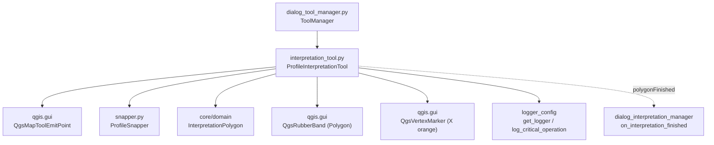

---
tags:
  - secinterp
  - code-walkthrough
  - gui
  - tools
aliases:
  - interpretation_tool.py
  - ProfileInterpretationTool
cssclass: secinterp-note
---

# `gui/tools/interpretation_tool.py`

> [!abstract] One-line summary
> Interactive map tool (`QgsMapToolEmitPoint`) for digitizing interpretation polygons on the profile canvas: snapped vertices, preview rubber band, and emission of a domain `InterpretationPolygon` on finalize.

**Path**: `gui/tools/interpretation_tool.py` (269 lines)
**Main class**: `ProfileInterpretationTool(QgsMapToolEmitPoint)`
**Layer**: GUI · Tools (canvas events + visual feedback; output leaves as a core DTO)
**Tags**: #secinterp #gui #tools

---

## 🎯 Why does this file exist?

The profile preview is read-only until the user interprets: they need to draw polygons (lithology, faults, alteration) directly on the view, with snapping assistance and safe cancellation.

| Problem | Solution |
|---------|----------|
| Digitize polygons on the profile canvas with live feedback | `ProfileInterpretationTool`: click adds a vertex, movement updates the rubber band |
| Vertices must land on existing geometry, not in mid-air | All snapping delegated to `ProfileSnapper` (vertex + edge, 12 px tolerance) |
| The sketch must be editable before commit (drop last, cancel) | Right-click drops the last vertex; `Escape` resets; `Enter`/double-click finalizes (minimum 3 points) |
| The result must enter the domain without coupling GUI to core | `finalize_polygon()` builds an `InterpretationPolygon` (DTO) and emits it via `polygonFinished` |

> [!important] Architectural note
> An **Extract/Present**-side tool: it lives in `qgis.gui`, draws with `QgsRubberBand`/`QgsVertexMarker`, but its product is a QGIS-agnostic DTO (`InterpretationPolygon` with `vertices_2d: list[tuple[float, float]]`). Lifecycle (activation, `reset()`, `disconnect_signals()`) is orchestrated by `ToolManager` in [[dialog_tool_manager]].

---

## 🧬 Relationship diagram



> [!tip] How to read
> Solid arrow = imports/delegates; dashed = emitted signal. `ToolManager` owns the instance and connects `polygonFinished` to the dialog's interpretation handler.

---

## 📦 Imports — architectural reading

```python
# gui/tools/interpretation_tool.py
from __future__ import annotations

import contextlib
import datetime
import random
import uuid
from typing import Any

from qgis.core import (
    QgsPointXY,
    QgsWkbTypes,
)
from qgis.gui import (
    QgsMapCanvas,
    QgsMapToolEmitPoint,
    QgsRubberBand,
    QgsVertexMarker,
)
from qgis.PyQt.QtCore import QCoreApplication, Qt, pyqtSignal
from qgis.PyQt.QtGui import QColor

from sec_interp.core.domain import InterpretationPolygon
from sec_interp.gui.tools.snapper import ProfileSnapper
from sec_interp.logger_config import get_logger, log_critical_operation
```

| # | Observation |
|---|-------------|
| ① | Editing-support stdlib: `contextlib.suppress` (cleanup that must never fail), `datetime` (`created_at` stamp), `random` + `uuid` (polygon color and id). |
| ② | `QgsWkbTypes` is only used for the rubber band's `PolygonGeometry` type; `QgsPointXY` is each vertex's type. |
| ③ | Inherits `QgsMapToolEmitPoint` and uses `QgsRubberBand` + `QgsVertexMarker`: a canvas-native tool with its own graphic overlay. |
| ④ | `QCoreApplication.translate("ProfileInterpretationTool", "New Interpretation")` — the default name is translatable (i18n). |
| ⑤ | Single core import: the `InterpretationPolygon` DTO. The Extract boundary is intact: no core service appears here. |
| ⑥ | `ProfileSnapper` composed in `__init__`, not inherited: snapping is likewise reusable by `ProfileMeasureTool`. |
| ⑦ | `log_critical_operation` marks `activate`/`deactivate`/`reset`/`finalize_polygon` as audited log operations. |

---

## 🏗️ Structure inventory

**Classes (1):** `ProfileInterpretationTool(QgsMapToolEmitPoint)` — 1 signal + 15 methods.

**Signal:**

| Signal | Payload | Who connects |
|-------|---------|---------------|
| `polygonFinished` | `InterpretationPolygon` | `ToolManager.connect_signals()` → `on_interpretation_finished` |

**Internal state:**

| Attribute | Type | Role |
|----------|------|-----|
| `points` | `list[QgsPointXY]` | Confirmed vertices of the polygon in progress |
| `rubber_band` | `QgsRubberBand \| None` | Polygon preview (semi-transparent red fill) |
| `vertex_markers` | `list[QgsVertexMarker]` | Orange X markers, one per vertex |
| `snapper` | `ProfileSnapper` | Snapping to canvas layers |
| `cursor` | `Qt.CursorShape.CrossCursor` | Crosshair cursor while active |
| `is_drawing` | `bool` (dynamic, set in `reset()`) | In-progress drawing flag |

**Methods:**

| Method | Signature | Role |
|--------|-------|------|
| `__init__` | `(canvas: QgsMapCanvas) -> None` | Initializes state + snapper |
| `activate` | `() -> None` | Activates base, sets cross cursor, audits |
| `deactivate` | `() -> None` | `reset()` + base deactivation |
| `disconnect_signals` | `() -> None` | Disconnects `polygonFinished` (leak prevention) |
| `reset` | `() -> None` | Total deterministic cleanup |
| `canvasReleaseEvent` | `(event: Any) -> None` | Left click adds (snapped); right click drops last |
| `canvasMoveEvent` | `(event: Any) -> None` | Updates rubber band with snapped point |
| `canvasDoubleClickEvent` | `(event: Any) -> None` | Finalizes with ≥ 3 points |
| `keyPressEvent` | `(event: Any) -> None` | `Enter` finalizes, `Escape` cancels |
| `_add_point` | `(point: QgsPointXY) -> None` | Adds a vertex (1e-6 anti-duplicate guard) |
| `_remove_last_point` | `() -> None` | Drops the last vertex and rebuilds the band |
| `_add_vertex_marker` | `(point: QgsPointXY) -> None` | Orange X marker, size 10, width 2 |
| `_ensure_rubber_band` | `() -> None` | Lazily creates the red polygon band |
| `_update_rubber_band` | `(current_point: QgsPointXY) -> None` | Redraws fixed points + cursor |
| `finalize_polygon` | `() -> None` | Builds the DTO, emits the signal, does not reset |

---

## 📁 Files in the package

| File | Lines | Role |
|---|--:|---|
| `interpretation_tool.py` | 269 | This note: polygon digitizing |
| `measure_tool.py` | 330 | Sibling: multi-point measurement with `measurementChanged/Cleared/Finished` |
| `snapper.py` | 112 | `ProfileSnapper` shared by both tools |
| `__init__.py` | — | Package marker |

---

## 📖 Method-by-method walkthrough

### `__init__`

```python
def __init__(self, canvas: QgsMapCanvas) -> None:
    super().__init__(canvas)
    self.canvas = canvas
    self.points: list[QgsPointXY] = []
    self.rubber_band: QgsRubberBand | None = None
    self.vertex_markers: list[QgsVertexMarker] = []
    self.snapper = ProfileSnapper(canvas)
    self.cursor = Qt.CursorShape.CrossCursor
```

Keeps the canvas, starts with empty state, and composes the snapper over the same canvas. The crosshair cursor signals "draw mode" as soon as the tool activates.

### `activate` / `deactivate`

```python
def activate(self) -> None:
    log_critical_operation(logger, "activate_interpretation_tool")
    super().activate()
    self.canvas.setCursor(self.cursor)

def deactivate(self) -> None:
    log_critical_operation(logger, "deactivate_interpretation_tool")
    self.reset()
    super().deactivate()
```

Strict symmetry: activating only changes the cursor; deactivating **always** resets first, so leaving the tool never leaves orphan bands or markers behind. Both are audited with `log_critical_operation`.

### `disconnect_signals`

```python
def disconnect_signals(self) -> None:
    with contextlib.suppress(TypeError):
        self.polygonFinished.disconnect()
```

Bare `polygonFinished.disconnect()` drops every slot. The `suppress(TypeError)` covers the "nothing connected" case. `ToolManager.disconnect_signals()` complements it from outside with `suppress(TypeError, RuntimeError)`. Without this, each dialog reopening would duplicate the handler and one polygon would register N times.

### `reset`

```python
def reset(self) -> None:
    self.points = []
    if self.rubber_band:
        with contextlib.suppress(Exception):
            self.rubber_band.reset(QgsWkbTypes.GeometryType.PolygonGeometry)
            self.canvas.scene().removeItem(self.rubber_band)
        self.rubber_band = None
    for marker in self.vertex_markers:
        with contextlib.suppress(Exception):
            self.canvas.scene().removeItem(marker)
    self.vertex_markers = []
    self.is_drawing = False
    if self.canvas:
        self.canvas.refresh()
```

Three-stage deterministic cleanup: empties points, removes the band from the scene (`reset()` + `removeItem`, each step guarded because C++ objects may be dead), removes every marker, and refreshes the canvas. Each `removeItem` sits in `suppress(Exception)` so dialog teardown never breaks on an already-destroyed object. This is what `deactivate()` and `Escape` invoke.

### `canvasReleaseEvent` / `canvasMoveEvent`

```python
def canvasReleaseEvent(self, event: Any) -> None:
    if event.button() == Qt.MouseButton.RightButton:
        if self.points:
            self._remove_last_point()
        return
    snapped_point = self.snapper.snap(event.pos())
    self._add_point(snapped_point)

def canvasMoveEvent(self, event: Any) -> None:
    if not self.points:
        return
    current_point = self.snapper.snap(event.pos())
    self._update_rubber_band(current_point)
```

Left click: converts the pixel to coordinates with snapping and adds the vertex. Right click: undoes the last vertex (it does not cancel everything, unlike `ProfileMeasureTool` where right-click resets). Mouse movement only acts once vertices exist, and also goes through the snapper, so the preview "snaps" exactly like the final click.

### `canvasDoubleClickEvent` / `keyPressEvent`

```python
MIN_POLYGON_POINTS = 3
if len(self.points) >= MIN_POLYGON_POINTS:
    self.finalize_polygon()
```

Double-click and `Enter`/`Return` finalize under the same 3-point threshold; `Escape` invokes `reset()` and consumes the event (`event.accept()`). Other keys fall through to `super().keyPressEvent(event)`.

| Input | Condition | Effect |
|---------|-----------|--------|
| Double-click | ≥ 3 points | `finalize_polygon()` |
| `Enter` / `Return` | ≥ 3 points | `finalize_polygon()` + `event.accept()` |
| `Enter` with < 3 points | — | nothing (no `accept`, no emission) |
| `Escape` | always | `reset()` + `event.accept()` |

### `_add_point` / `_remove_last_point`

```python
def _add_point(self, point: QgsPointXY) -> None:
    if self.points and self.points[-1].compare(point, 1e-6):
        return
    self.points.append(point)
    self._ensure_rubber_band()
    self.rubber_band.addPoint(point, True)
    self._add_vertex_marker(point)
```

The anti-duplicate guard (`compare` with 1e-6 tolerance) drops double vertices from slow clicks producing two releases on the same pixel. `_remove_last_point()` walks back: `pop()` of points and markers; with no points left it destroys the band, otherwise it rebuilds it vertex by vertex with `addPoint(p, False)`.

### `_ensure_rubber_band` / `_add_vertex_marker` / `_update_rubber_band`

Lazily created semi-transparent red polygon band (`QColor(255, 0, 0, 100)`, width 2); orange X markers (`255, 165, 0`, size 10, width 2), one per vertex. `_update_rubber_band` resets and re-adds all fixed points plus the cursor as the "moving" point (`addPoint(current, True)`), which produces the rubber-band effect.

### `finalize_polygon`

```python
vertices_2d = [(p.x(), p.y()) for p in self.points]
hue = random.randint(0, 359)   # nosec B311
sat = random.randint(200, 255)  # nosec B311
val = random.randint(150, 255)  # nosec B311
rand_color = QColor.fromHsv(hue, sat, val)
color_hex = rand_color.name()

interp = InterpretationPolygon(
    id=str(uuid.uuid4()),
    name=QCoreApplication.translate("ProfileInterpretationTool", "New Interpretation"),
    type="lithology",
    vertices_2d=vertices_2d,
    attributes={},
    color=color_hex,
    created_at=datetime.datetime.now().isoformat(),
)
self.polygonFinished.emit(interp)
```

Converts vertices to plain `(dist, elev)` tuples (the DTO never sees `QgsPointXY`), picks a vivid random HSV color (high saturation/value so each interpretation stands out) serialized to `#RRGGBB`, and emits the DTO. It deliberately does **not** call `reset()`: the source comment forbids it; the dialog handler deactivates the tool and `deactivate()` cleans up. Under 3 points it logs a `warning` and aborts without emitting.

---

## 🔄 Data flow

| Phase | Input | Transformation | Output |
|-------|-------|----------------|--------|
| Activation | `ToolManager.toggle_interpretation_tool(True)` | `reset()` + `setMapTool` + cross cursor | tool ready |
| Digitizing | mouse clicks (pixels) | `ProfileSnapper.snap()` → `QgsPointXY` | `points` + band + markers |
| Editing | right-click / `Escape` | `pop()` + band rebuild / `reset()` | corrected or empty state |
| Finalization | ≥ 3 vertices + `Enter`/double-click | `(x, y)` tuples + `uuid` + HSV color + `translate` | emitted `InterpretationPolygon` |
| Teardown | manager `deactivate()` | `reset()` + `super().deactivate()` | clean scene, normal cursor |

---

## 🏛️ Design patterns present

| Pattern | Where | Purpose |
|---------|-------|---------|
| **Map Tool (QGIS)** | `QgsMapToolEmitPoint` inheritance | Plug into the canvas with standard events |
| **Observer (signal)** | `polygonFinished.emit(interp)` | Decouple sketching from dialog registration |
| **Composition** | `self.snapper = ProfileSnapper(canvas)` | Reuse snapping without inheriting |
| **Output DTO** | `InterpretationPolygon` | Cross the GUI→domain boundary without QGIS types |
| **Deterministic cleanup** | `reset()` / `deactivate()` / `disconnect_signals()` | Zero orphan bands, markers, or connections |
| **Audit logging** | `log_critical_operation(...)` | Trace activation, reset, and finalization |

---

## 🧾 API summary

| Symbol | Signature / Inherits | Typical use |
|--------|----------------------|-------------|
| `ProfileInterpretationTool` | `QgsMapToolEmitPoint` | `ProfileInterpretationTool(canvas)` (created by `ToolManager`) |
| `polygonFinished` | `pyqtSignal(InterpretationPolygon)` | Connect to `on_interpretation_finished` |
| `activate` / `deactivate` | `() -> None` | Via `ToolManager.toggle_interpretation_tool()` |
| `reset` | `() -> None` | Cancel the sketch in progress |
| `finalize_polygon` | `() -> None` | Confirm from a button or shortcut (≥ 3 points) |
| `disconnect_signals` | `() -> None` | On dialog close |

---

## 🛡️ Error handling

| Situation | Behavior |
|-----------|----------|
| Finalize with < 3 points | Log `warning`, silent return, no emission |
| Duplicate consecutive point (slow click) | Ignored via `compare(point, 1e-6)` |
| Already-destroyed C++ objects in `reset()` | Per-item `suppress(Exception)`; cleanup continues |
| `polygonFinished` with no connections on disconnect | `suppress(TypeError)` |
| Snapper hitting a bad layer | The snapper catches and continues; the tool gets the raw point |

The module raises no domain exceptions: invalid polygons or persistence failures are handled by the downstream interpretation handler.

---

## 🧪 Associated tests

Real coverage in `tests/gui/test_interpretation_tool.py` (`TestInterpretationTool`, mocked canvas with identity `toMapCoordinates`):

- `test_snapper_skips_and_continues` — raster layers are skipped (`_is_snappable`) and invalid locators do not break `snap()`.
- Cases with patched `QgsPointLocator`: valid/invalid `nearestVertex`/`nearestEdge`, `_get_locator` raising or returning `None`.
- Tool tests: adding/finalizing polygons, `reset()`, `disconnect_signals()`, double-click, and keyboard handling.

Related: `tests/gui/test_main_dialog_tools.py` (lifecycle via `ToolManager`), `tests/gui/test_main_dialog_interpretation.py` and `tests/gui/test_dialog_interpretation_manager.py` (`on_interpretation_finished` handler), `tests/gui/test_interpretation_export.py` (the persisted DTO). In `tests/core/`, the DTO is covered indirectly through interpretation/exporter tests, not this tool.

---

## 👀 Observations and notes

> [!success] Strengths
> - Domain-DTO output: the tool drags no QGIS types downstream.
> - Editable sketch (undo last, anti-duplicates, 3-point threshold).
> - Three-level cleanup (`reset`, `deactivate`, `disconnect_signals`) with no scene or signal leaks.
> - Translatable default name plus vivid random color: every interpretation starts distinguishable.

> [!warning] Points of attention
> - `is_drawing` is created dynamically in `reset()`, not in `__init__`: reading it before the first `reset()` raises `AttributeError`.
> - Unseeded `random`: non-reproducible colors across sessions (assumed, and annotated `nosec B311`).
> - `finalize_polygon()` does not reset by design: if the handler forgets to deactivate the tool, stale points stay in `points`.

> [!question] Open questions
> - Initialize `is_drawing = False` in `__init__` and toggle it in `_add_point`/`reset()`?
> - Feed the color back into the `ColorManager` palette so legend and polygon share the chromatic source?

---

## 🔗 Related notes

- [[Index]] — vault index
- [[gui_tools]] — family note for profile map tools
- [[dialog_tool_manager]] — `ToolManager`: owns the tool, connects `polygonFinished`, toggles with pan/measurement
- [[snapper]] — `ProfileSnapper`: vertex/edge snapping consumed by this tool
- [[measure_tool]] — sibling tool with the same snapper and different right-click semantics
- [[domain]] — `InterpretationPolygon`: shape of the emitted DTO
- [[main_dialog]] — dialog hosting the canvas and the interpretation handler
- [[preview_task_orchestrator]] — heavy compute stays in `QgsTask`; this tool only digitizes

---

*Note of the SecInterp Code Walkthrough v2 vault — v3.8.0*
