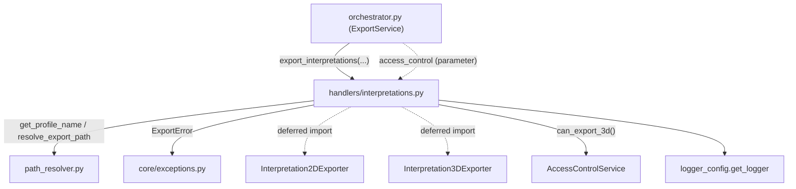

---
tags:
  - secinterp
  - code-walkthrough
  - core
  - export
  - handlers
aliases:
  - interpretations.py
  - export_interpretations
cssclass: secinterp-note
---

# `core/services/export/handlers/interpretations.py`

> [!abstract] One-line summary
> **Interpretations** export handler: exports polygons in 2D as mandatory and, if the access control allows it and the section line is valid, also exports them in 3D.

**Path**: `core/services/export/handlers/interpretations.py` (93 lines)
**Main function**: `export_interpretations`
**Layer**: Core (QGIS-agnostic, with duck-typed access to the section layer)
**Tags**: #secinterp #core #export #handlers

---

## 🎯 Why does this file exist?

Interpretations (digitized 2D polygons) have a **mandatory** 2D output and a
**conditional** 3D output: only if the user has permission (the "3D Export" feature) and
if the section line is valid to georeference the polygon in space.

| Problem | Solution |
|---------|----------|
| 2D always, 3D optional and permission-gated | `export_interpretations` + `can_export_3d()` gate |
| 3D needs the section-line geometry | `_export_interpretations_3d` extracts `line_layer.getFeatures()` |
| Restrict features per user | injected `access_control: AccessControlService` |

> [!important] Architectural note
> It is the **only** handler with access control. The section layer (`line_layer`) is a
> QGIS object typed `Any` and accessed by duck-typing (`isValid()`, `getFeatures()`,
> `.geometry()`) — the documented gray area of the core, without importing `qgis.core`.

---

## 🧬 Relationship diagram



> [!tip] How to read
> `access_control` is injected from the orchestrator; `Interpretation2DExporter`/`3D` are
> imported deferred. The dashed arrow to `AccessControlService` is the `can_export_3d()`
> gate call.

---

## 📦 Imports — architectural reading

```python
# core/services/export/handlers/interpretations.py
from __future__ import annotations

from pathlib import Path
from typing import Any

from sec_interp.core.exceptions import ExportError
from sec_interp.core.services.export.path_resolver import get_profile_name, resolve_export_path
from sec_interp.logger_config import get_logger
```

```python
# deferred imports (inside each function)
from sec_interp.exporters import Interpretation2DExporter
from sec_interp.exporters import Interpretation3DExporter
```

| # | Observation |
|---|-------------|
| ① | Imports only `ExportError` (not `DataMissingError`): does not treat empty data as an error. |
| ② | No `qgis.*` import; the section layer is accessed by duck-typing via `Any`. |
| ③ | Two exporters imported deferred, each in its own function. |
| ④ | `access_control: Any \| None` in the signature; the gate is optional (if `None`, no 3D). |

---

## 🏗️ Structure inventory

**Functions/Methods:**
- `export_interpretations(folder, data, line_layer, crs, msg, controller, settings, ext, access_control) -> None`
- `_export_interpretations_3d(folder, data, line_layer, crs, msg, controller, settings, ext) -> None` (private)

**Dependencies:**
- `Interpretation2DExporter`, `Interpretation3DExporter` (from `sec_interp.exporters`)
- `AccessControlService` (injected, method `can_export_3d()`)

One public function that orchestrates 2D + 3D and delegates the 3D to a private function.

---

## 📖 Method-by-method walkthrough

### `export_interpretations`

```python
def export_interpretations(
    folder: Path,
    data: list[Any] | None,
    line_layer: Any,
    crs: Any,
    msg: list[str],
    controller: Any | None,
    settings: Any | None,
    ext: str,
    access_control: Any | None,
) -> None:
    """Export interpretation data (2D mandatory, 3D gated)."""
    if not data:
        logger.info("No interpretations provided for export.")
        return

    from sec_interp.exporters import Interpretation2DExporter

    logger.info("✓ Saving interpretation data...")
```

**Guard with log**: unlike other handlers, the empty case is announced with
`logger.info` (not silent). Then the 2D exporter is imported.

```python
    try:
        profile_name = get_profile_name(controller)
        pattern = getattr(settings, "naming_pattern", None) if settings else None
        path, path_layer = resolve_export_path(
            folder, "interpretations", profile_name, pattern, ext
        )
        exporter = Interpretation2DExporter({})
        ok = exporter.export(path, {"interpretations": data, "crs": crs}, layer_name=path_layer)
        if ok:
            msg.append(f"  - {path.relative_to(folder)}")
        else:
            logger.warning(f"Failed to write 2D interpretations to {path}")
```

**Mandatory 2D**: exports the polygons with payload `{"interpretations", "crs"}`.

```python
        if access_control and access_control.can_export_3d():
            _export_interpretations_3d(
                folder, data, line_layer, crs, msg, controller, settings, ext
            )
        else:
            logger.info("3D Export features are restricted for this user.")
```

**3D gate**: if there is `access_control` **and** `can_export_3d()` returns `True`, it
delegates to the private function; otherwise it logs that the feature is restricted.

```python
    except Exception as e:
        logger.exception(f"Interpretation export failed: {e}")
        raise ExportError(f"Interpretation export failed: {e!s}") from e
```

**Single `except Exception`**: unlike the double-`except` pattern of the other handlers,
here there is one generic block translating to `ExportError`.

### `_export_interpretations_3d`

```python
def _export_interpretations_3d(
    folder: Path,
    data: list[Any],
    line_layer: Any,
    crs: Any,
    msg: list[str],
    controller: Any | None,
    settings: Any | None,
    ext: str,
) -> None:
    """Export interpretation polygons to 3D space."""
    from sec_interp.exporters import Interpretation3DExporter

    logger.info("✓ Saving 3D interpretation data...")
    if line_layer and line_layer.isValid():
        line_geom = next(line_layer.getFeatures()).geometry()

        profile_name = get_profile_name(controller)
        pattern = getattr(settings, "naming_pattern", None) if settings else None
        path, path_layer = resolve_export_path(
            folder, "interpretations_3d", profile_name, pattern, ext
        )
        exporter = Interpretation3DExporter({})

        ok = exporter.export(
            str(path),
            {"interpretations": data, "section_line": line_geom, "crs": crs},
            layer_name=path_layer,
        )
        if ok:
            msg.append(f"  - {path.relative_to(folder)} (3D)")
        else:
            logger.warning(f"Failed to write 3D interpretations to {path}")
    else:
        logger.warning("Invalid section line layer, skipping 3D export.")
```

**3D georeferencing**:

1. Validates `line_layer.isValid()` (duck-typing on the QGIS object typed `Any`).
2. Extracts the section geometry with `next(line_layer.getFeatures()).geometry()`.
3. Exports with payload `{"interpretations", "section_line", "crs"}` and `base_name`
   `"interpretations_3d"`.
4. Note: passes `str(path)` (not `Path`) to the 3D exporter — signature differs from 2D.
5. If the layer is invalid, skips the 3D export with a `warning`.

---

## 🔄 Data flow

| Phase | Input | Transformation | Output |
|-------|-------|----------------|--------|
| Guard | `data` (`None`/empty) | log + return | — |
| 2D | `data`, `crs` | `Interpretation2DExporter.export` | 2D layer + `msg` |
| Gate | `access_control` | `can_export_3d()` | yes/no decision |
| 3D | `data`, `line_layer`, `crs` | extract `line_geom` + `Interpretation3DExporter.export` | 3D layer + `msg` |

---

## 🏛️ Design patterns present

| Pattern | Where | Purpose |
|---------|-------|---------|
| **Guard clause** | `if not data` | early exit (with log) |
| **Facade** | `export_interpretations` | hide 2D + 3D gate behind one signature |
| **Private method / Template** | `_export_interpretations_3d` | extract the 3D phase |
| **Authorization gate** | `access_control.can_export_3d()` | restrict feature per user |
| **Lazy import (deferred)** | 2D/3D exporters | save loading without data |
| **Exception translation** | `except Exception → ExportError` | normalize failures |

---

## 🧾 API summary

| Symbol | Signature / Inherits | Typical use |
|--------|----------------------|-------------|
| `export_interpretations` | `(folder, data, line_layer, crs, msg, controller, settings, ext, access_control) -> None` | Export 2D + conditional 3D |
| `_export_interpretations_3d` | `(folder, data, line_layer, crs, msg, controller, settings, ext) -> None` | Export polygons to 3D space |
| `Interpretation2DExporter` | `BaseExporter` (deferred import) | Write 2D polygons |
| `Interpretation3DExporter` | `BaseExporter` (deferred import) | Write georeferenced 3D polygons |

---

## 🛡️ Error handling

| Case | Behaviour |
|------|-----------|
| `data` empty | `logger.info` + `return` (not an error) |
| `access_control` absent or no permission | `logger.info` "restricted"; no 3D |
| `line_layer` invalid | `logger.warning` + 3D skip |
| Exception in 2D/3D | `logger.exception` + `raise ExportError(...) from e` |

> [!warning] A single `except Exception`
> Unlike the other handlers (which separate `OSError/ValueError/TypeError/
> DataMissingError` from `Exception`), here there is a single `except Exception`. It is
> simpler, but does not distinguish expected from critical failures.

---

## 🧪 Associated tests

- `tests/core/test_export_service.py::test_export_interpretation_3d_invalid_line` —
  invalid section line → the 3D export is skipped.
- `tests/core/test_export_service.py::test_export_interpretation_error` — exporter
  failure → `ExportError`.
- `tests/core/test_export_service.py::test_export_data_3d_restricted` — access gate
  restricts 3D.
- `tests/exporters/test_interpretation_exporters.py` — logic of `Interpretation2DExporter`.
- `tests/exporters/test_interpretation_3d_exporter.py` — logic of `Interpretation3DExporter`.

---

## 👀 Observations and notes

> [!success] Strengths
> - Explicit access gate for the 3D feature (unique in the package).
> - Clear 2D (mandatory) vs 3D (conditional) separation across two functions.
> - Graceful degradation: invalid layer or no permission ⇒ skip with log, no exception.

> [!warning] Points of attention
> - `next(line_layer.getFeatures())` assumes at least one feature; an empty layer raises
>   `StopIteration`.
> - `str(path)` vs `Path` (2D) is a signature asymmetry between exporters.
> - `line_geom` extraction depends on `line_layer` (QGIS) typed `Any`: gray area.

> [!question] Open questions
> - Guard `next(...)` with a `try/except StopIteration` or an `is not None` check?
> - Unify the exporter signature to always receive `Path`?

---

## 🔗 Related notes

- [[Index]] — vault index
- [[core_services_export_handlers]] — `handlers/` package it belongs to
- [[orchestrator]] — delegates to `export_interpretations` under the `exp_interp` flag
- [[path_resolver]] — `get_profile_name` / `resolve_export_path`
- [[compat]] — `_export_interpretations` compatibility wrapper
- [[controller]] — source of `access_control` and the section logic
- [[entities]] — `InterpretationPolygon` / `InterpretationPolygon25D`

---

*Note of the SecInterp Code Walkthrough v2 vault — v3.8.0*
