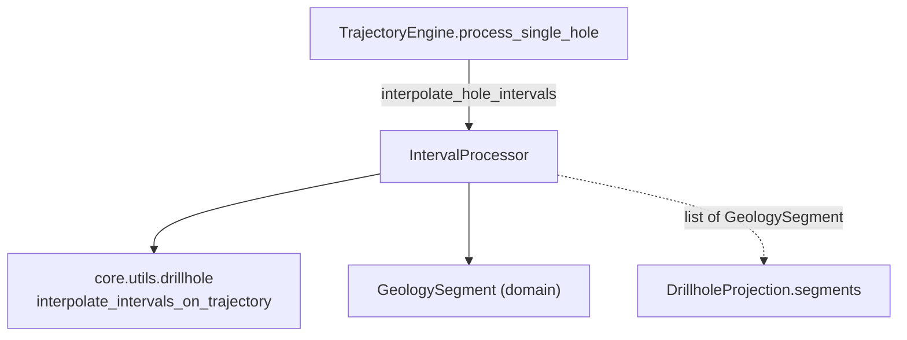

---
tags:
  - secinterp
  - code-walkthrough
  - core
  - processors
aliases:
  - interval_processor.py
  - IntervalProcessor
cssclass: secinterp-note
---

# `core/services/drillhole/interval_processor.py`

> [!abstract] One-line summary
> A **pure** processor that converts lithological intervals `(from, to, lithology)` into `GeologySegment` objects with their 2D, 3D and projected points, interpolating them along a trajectory already projected onto the section.

**Path**: `core/services/drillhole/interval_processor.py` (50 lines)
**Main class/function**: `IntervalProcessor`
**Layer**: Core (QGIS-agnostic)
**Tags**: #secinterp #core #processors

---

## 🎯 Why does this file exist?

The drillhole trajectory is already computed and projected (see [[drillhole]] and
[[trajectory_engine]]). What remains is the step that gives **geological meaning** to
that polyline: distribute the lithological intervals along it and package them into the
DTO the rest of the system knows how to draw.

| Problem | Solution |
|---------|----------|
| Intervals arrive as raw `(from, to, lith)` tuples | they are enriched into `{"unit", "from", "to"}` |
| The pure interpolation lives in `core/utils` | it is delegated to `scu.interpolate_intervals_on_trajectory` |
| The renderer expects `GeologySegment`, not tuples | a `GeologySegment` is built per interval |

> [!important] Architectural note
> **QGIS-agnostic** and a **thin adapter**: this module computes no geometry, it only
> adapts the output of `core.utils.drillhole` into the domain DTO. It is the final link
> of the `collar → trajectory → intervals` pipeline; its input and output are pure types
> (tuples and `GeologySegment`).

---

## 🧬 Relationship diagram



> [!tip] How to read
> Solid arrow = imports/delegates; dashed = the result is embedded into
> `DrillholeProjection.segments` (see [[trajectory_engine]]). `IntervalProcessor` is a
> **leaf** that only consumes the pure util and the DTO.

---

## 📦 Imports — architectural reading

```python
# interval_processor.py
from __future__ import annotations

from sec_interp.core import utils as scu
from sec_interp.core.domain import GeologySegment
```

| # | Observation |
|---|-------------|
| ① | `from sec_interp.core import utils as scu` — short alias for the pure utilities package; accesses `scu.interpolate_intervals_on_trajectory`. |
| ② | `GeologySegment` is the only imported DTO: the module's output. |
| ③ | **No** `typing`, **no** `math`, **no** `qgis.*`: minimal dependency, two internal imports. |

> [!note] The `scu` alias is package idiom
> `trajectory_engine.py` uses the same alias (`from sec_interp.core import utils as
> scu`). It reflects that both modules delegate trigonometry to `core/utils`, which
> re-exports `calculate_drillhole_trajectory`, `project_trajectory_to_section` and
> `interpolate_intervals_on_trajectory` (see [[drillhole]]).

---

## 🏗️ Structure inventory

**Classes:** `class IntervalProcessor` — 1 public method

**Functions/Methods:**
- `interpolate_hole_intervals(traj, intervals, buffer_width) -> list[GeologySegment]`

No constants and no private methods: the whole job is a single transformation.

---

## 📁 Files in the package

| File | Note |
|------|------|
| `interval_processor.py` | this note |
| `collar_processor.py` | [[collar_processor]] — collar projection |
| `trajectory_engine.py` | [[trajectory_engine]] — orchestrates and calls this module |
| `projection_engine.py` | [[core_services_drillhole]] — point-to-line projection |
| `survey_processor.py` | [[core_services_drillhole]] — final depth |

---

## 📖 Method-by-method walkthrough

### `interpolate_hole_intervals`

```python
def interpolate_hole_intervals(
    self,
    traj: list[tuple[float, float, float, float, float, float, float, float]],
    intervals: list[tuple[float, float, str]],
    buffer_width: float,
) -> list[GeologySegment]:
```

Single entry point. Full flow:

```python
if not intervals:
    return []

rich_intervals = [
    (fd, td, {"unit": lith, "from": fd, "to": td}) for fd, td, lith in intervals
]
# Scu returns (attr, points_2d, points_3d, points_3d_proj)
tuples = scu.interpolate_intervals_on_trajectory(traj, rich_intervals, buffer_width)

segments = []
for attr, points_2d, points_3d, points_3d_proj in tuples:
    segments.append(
        GeologySegment(
            unit_name=str(attr.get("unit", "Unknown")),
            geometry_wkt=None,
            attributes=attr,
            points=points_2d,
            points_3d=points_3d,
            points_3d_projected=points_3d_proj,
        )
    )
return segments
```

1. **Guard clause**: no intervals → `[]` (nothing to distribute).
2. **Enrichment**: each `(from, to, lith)` becomes `(fd, td, {"unit", "from", "to"})`.
   The third element stops being a `str` and becomes an attribute `dict`, which is what
   `scu.interpolate_intervals_on_trajectory` expects as `attr`.
3. **Delegation**: the actual interpolation (splitting points by depth, filtering by
   `offset ≤ buffer_width`) is done by `scu`. The result is a list of tuples
   `(attr, points_2d, points_3d, points_3d_proj)`.
4. **DTO construction**: for each tuple a `GeologySegment` is assembled, copying the
   full `attr` dict into `attributes` and distributing the three point sets.

> [!note] `geometry_wkt=None`
> The `GeologySegment` is created **without WKT geometry** (`geometry_wkt=None`). The
> segment is described by its point lists (`points`, `points_3d`, `points_3d_projected`),
> not by a WKT string. This is consistent with the domain pattern: coordinates travel as
> plain tuples.

### The `traj` schema (8-tuple)

The input `traj` arrives already projected from [[trajectory_engine]] (which in turn
obtained it from `scu.project_trajectory_to_section`):

| Index | 0 | 1 | 2 | 3 | 4 | 5 | 6 | 7 |
|:---:|---|---|---|---|---|---|---|---|
| Field | `depth` | `x` | `y` | `z` | `dist_along` | `offset` | `proj_x` | `proj_y` |

`IntervalProcessor` does **not reinterpret** these indices: it passes them opaquely to
`scu.interpolate_intervals_on_trajectory`. The positional coupling is encapsulated in
`core/utils/drillhole.py` (see [[drillhole]]), not here.

---

## 🔄 Data flow

| Phase | Input | Transformation | Output |
|-------|-------|----------------|--------|
| Guard | empty `intervals` | — | `[]` |
| Enrich | `(from, to, lith)` | `→ (fd, td, {"unit", "from", "to"})` | `rich_intervals` |
| Interpolate | `traj` + `rich_intervals` | `scu.interpolate_intervals_on_trajectory` | `(attr, p2d, p3d, p3dp)` |
| Package | tuples | `GeologySegment(...)` | `list[GeologySegment]` |

> [!tip] Canonical chain
> `TrajectoryEngine.process_single_hole` calls `interpolate_hole_intervals` with the
> **already filtered** trajectory (`p[5] <= buffer_width`) and the result is embedded
> into `DrillholeProjection.segments`. This module is the hinge between "trajectory
> math" and "drawable geological object".

---

## 🏛️ Design patterns present

| Pattern | Where | Purpose |
|---------|-------|---------|
| **Adapter / Mapper** | `GeologySegment` construction loop | Raw tuple → domain DTO |
| **Facade (delegation)** | `scu.interpolate_...` | Hide the interpolation mechanics |
| **Guard clause** | `if not intervals` | Early exit on empty data |
| **Data-enrichment** | `rich_intervals` | Add `unit`/`from`/`to` keys to the attribute |

---

## 🧾 API summary

| Symbol | Signature / Inherits | Typical use |
|--------|----------------------|-------------|
| `interpolate_hole_intervals` | `(traj: list[tuple[8 floats]], intervals: list[tuple[float,float,str]], buffer_width: float) -> list[GeologySegment]` | Distribute lithological intervals over the trajectory |

---

## 🛡️ Error handling

It does not raise exceptions; the only special case is the **empty** one:

| Case | Behavior |
|------|----------|
| `intervals` empty | `[]` (guard clause) |
| Interval outside `traj` depth range | `scu` omits it (0 segments for that interval) |
| Point with `offset > buffer_width` | filtered inside `scu`, not here |

> [!note] `attr` always carries `unit`
> `rich_intervals` guarantees the `"unit"` key; the `"Unknown"` fallback in
> `attr.get("unit", "Unknown")` is defensive (it should never trigger). If it ever did,
> the segment is labelled `"Unknown"` instead of breaking.

---

## 🔢 Numeric example — one interval

`traj = [(0,0,0,100,0,0,0,0), (10,10,0,90,10,0.5,10,0)]`,
`intervals = [(0, 5, "LithA")]`, `buffer_width = 2.0`:

1. `rich_intervals = [(0, 5, {"unit": "LithA", "from": 0, "to": 5})]`.
2. `scu` interpolates and returns a tuple `(attr, p2d, p3d, p3dp)` with the points in the
   depth range `[0, 5]`.
3. A `GeologySegment(unit_name="LithA", geometry_wkt=None,
   attributes={"unit": "LithA", "from": 0, "to": 5}, points=p2d, ...)` is built.

The equivalent test (`test_interpolate_hole_intervals_basic` in
`tests/core/services/drillhole/test_processors.py`) verifies `len(results) == 1` and
`results[0].unit_name == "LithA"`.

---

## 🧪 Associated tests

Mapping to the real tests under `tests/core/`:

- `tests/core/services/drillhole/test_processors.py::TestIntervalProcessor::test_interpolate_hole_intervals_empty` —
  no intervals → `[]`.
- `tests/core/services/drillhole/test_processors.py::TestIntervalProcessor::test_interpolate_hole_intervals_basic` —
  builds a `GeologySegment` with `unit_name` and `attributes["from"]`.
- `tests/core/test_drillhole_service.py::test_process_context_projects_collar` —
  indirectly verifies that `drillhole_data[0].segments` is non-empty.
- `tests/core/test_drillhole_utils.py::TestInterpolateIntervalsOnTrajectory` — covers the
  pure mechanics this module delegates to (point format, buffer, multiple intervals).

> [!note] Indirect coverage
> Being a thin adapter, most of the logic lives in `core/utils/drillhole.py` and is
> covered via `test_drillhole_utils.py`. Here the tests validate the **mapping** to
> `GeologySegment`, not the interpolation itself.

---

## 👀 Observations and notes

> [!success] Strengths
> - Minimal, focused module: a single responsibility (map to DTO).
> - 100 % QGIS-agnostic; two internal imports, no state.
> - Explicit and readable attribute enrichment.

> [!warning] Points of attention
> - `geometry_wkt=None` leaves the segment without WKT; a consumer that requires it
>   will fail silently.
> - The `"Unknown"` fallback can mask missing lithology data.
> - Positional coupling of `traj` (8-tuple) inherited from `core/utils/drillhole.py`.

> [!question] Open questions
> - Should this module also build the `geometry_wkt` for exporters?
> - Type `intervals` with an alias (`list[Interval]`) instead of anonymous tuples?

---

## 🔗 Related notes

- [[Index]] — vault index
- [[trajectory_engine]] — main consumer of `interpolate_hole_intervals`
- [[drillhole]] — `interpolate_intervals_on_trajectory` (the delegated mechanics)
- [[drillhole_service]] — orchestrates the full pipeline
- [[dtos]] / [[entities]] — `GeologySegment` and its fields
- [[core_services_drillhole]] — the rest of the package

---

*Note of the SecInterp Code Walkthrough v2 vault — v3.9.1*
