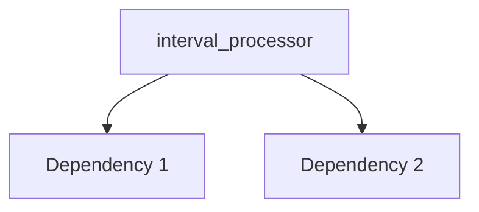

---
tags:
  - secinterp
  - code-walkthrough
  - core      # core | gui | exporters
  - processors     # services | managers | renderers | adapters | validation | etc.
aliases:
  - interval_processor.py  # e.g. path_resolver.py
  - interval_processor     # e.g. resolve_export_path
cssclass: secinterp-note
# note_lines: 700      # optional: ceiling > 500 for high-importance modules (max 700)
---

# `core/services/drillhole/interval_processor.py`

> [!abstract] One-line summary
> Processing logic for Drillhole Intervals. — what this module does in one sentence, without touching QGIS if it is core.

**Path**: `core/services/drillhole/interval_processor.py` (50 lines)
**Main class/function**: `interval_processor`
**Layer**: core (QGIS-agnostic / GUI · Type)
**Tags**: #secinterp #core #processors

---

## 🎯 Why does this file exist?

| Problem | Solution |
|---------|----------|
| (pending) | (pending) |
| (pending) | (pending) |

> [!important] Architectural note
> QGIS-agnóstico (e.g. "QGIS-agnostic", "Extract Adapter", "Factory").

---

## 🧬 Relationship diagram



> [!tip] How to read
> Solid arrow = imports/delegates; dashed = callback/injected.

---

## 📦 Imports — architectural reading

```python
# interval_processor.py
from __future__ import annotations
from sec_interp.core import utils as scu
from sec_interp.core.domain import GeologySegment
```

| # | Observation |
|---|-------------|
| ① | (pending) |
| ② | (pending) |

---

## 🏗️ Structure inventory

**Clases:** `class IntervalProcessor` — 1 métodos
**Funciones/Métodos:**
- `IntervalProcessor.interpolate_hole_intervals(def interpolate_hole_intervals(self, traj: list[tuple[float, float, float, float, float, float, float, float]], intervals: list[tuple[float, float, str]], buffer_width: float) -> list[GeologySegment]:)`

---

## 📁 Files in the package

- `interval_processor.py` — individual note for this file.

---

## 📖 Method-by-method walkthrough

### `method_1`

```python
# (enriquecer)
```

_(enriquecer leyendo el fuente)_

### `method_2`

```python
# (enriquecer)
```

_(enriquecer leyendo el fuente)_

<!-- Add one subsection per public method of the module -->

---

## 🔄 Data flow

| Phase | Input | Transformation | Output |
|-------|-------|----------------|--------|
| - | - | - | - |
| - | - | - | - |

---

## 🏛️ Design patterns present

| Pattern | Where | Purpose |
|---------|-------|---------|
| - | - | - |

---

## 🧾 API summary

| Symbol | Signature / Inherits | Typical use |
|--------|----------------------|-------------|
| (no symbols) | `-` | - |

---

## 🛡️ Error handling

_(pending)_

---

## 🧪 Associated tests

_(pending)_

---

## 👀 Observations and notes

> [!success] Strengths
> - (skeleton)

> [!warning] Points of attention
> - (skeleton)

> [!question] Open questions
> - (skeleton)

---

## 🔗 Related notes

- [[Index]] — vault index
- [[Index]] — index
- [[controller]] — orchestrator

---

*Note of the SecInterp Code Walkthrough v2 vault — v3.8.0*
