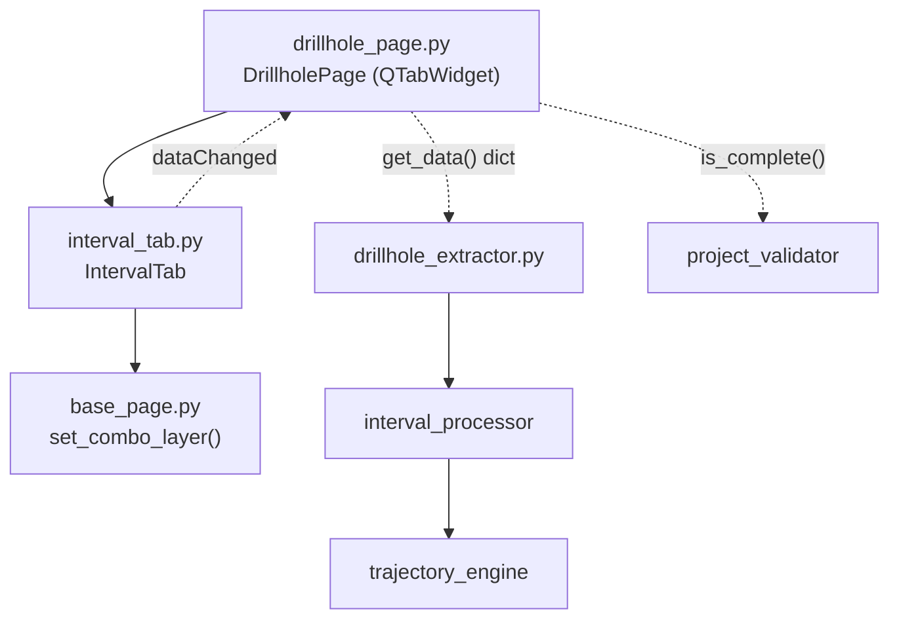

---
tags:
  - secinterp
  - code-walkthrough
  - gui
  - pages
aliases:
  - interval_tab.py
  - IntervalTab
cssclass: secinterp-note
---

# `gui/ui/pages/drillhole/interval_tab.py`

> [!abstract] One-line summary
> Drillhole interval configuration tab: tabular-layer selector (point or no-geometry) plus field mapping (ID, from, to, lithology), feeding the Extract-side `DrillholeContext`.

**Path**: `gui/ui/pages/drillhole/interval_tab.py` (144 lines)
**Main class**: `IntervalTab`
**Layer**: GUI (QGIS-dependent · sub-page / tab)
**Tags**: #secinterp #gui #pages

---

## 🎯 Why does this file exist?

Intervals (from-to segments with lithology) usually live in a geometry-less
table, not a point layer. This tab encapsulates that peculiarity: a dual layer
filter and four field mappings.

| Problem | Solution |
|---------|----------|
| The interval table may have no geometry | `PointLayer \| NoGeometry` filter |
| Four fields must follow the chosen layer | `layerChanged` wired to all four `setLayer` |
| The parent page aggregates three uniform forms | Same contract as `CollarTab`/`SurveyTab` |
| `Qgis.LayerFilters` is missing on older QGIS | `try/except` fallback to `QgsMapLayerProxyModel` |

> [!important] Architectural note
> **Extract**-phase tab: it exposes `interval_from`/`interval_to` as field
> names; the core ([[interval_processor]]) turns them into validated numeric
> segments (`from < to`, no overlaps).

---

## 🧬 Relationship diagram



> [!tip] How to read
> Solid arrow = imports/delegates; dashed = callback/data flow toward the parent
> or toward the core.

---

## 📦 Imports — architectural reading

```python
# gui/ui/pages/drillhole/interval_tab.py
from __future__ import annotations
import contextlib
from typing import Any
from qgis.core import Qgis, QgsMapLayerProxyModel
from qgis.gui import QgsFieldComboBox, QgsMapLayerComboBox
from qgis.PyQt.QtCore import QCoreApplication, pyqtSignal
from qgis.PyQt.QtWidgets import QGridLayout, QLabel, QWidget
from sec_interp.gui.ui.pages.base_page import set_combo_layer
from sec_interp.logger_config import get_logger
```

| # | Observation |
|---|-------------|
| ① | Also imports `QgsMapLayerProxyModel`: fallback for QGIS without `Qgis.LayerFilters`. |
| ② | No `QCheckBox`: this tab has no alternative modes (compare with `CollarTab`). |
| ③ | `QGridLayout` with an incrementing `row` counter instead of literal indices. |
| ④ | `set_combo_layer` and `get_logger` as in the sibling tabs. |
| ⑤ | Identical `dataChanged`: the parent wires all three tabs in a loop. |

---

## 🏗️ Structure inventory

**Class:** `IntervalTab(QWidget)` — 1 signal, 8 methods.

| Member | Type | Role |
|--------|------|------|
| `dataChanged` | `pyqtSignal()` | Notifies the parent that some field changed |
| `i_layer` | `QgsMapLayerComboBox` | Interval layer/table |
| `i_id` | `QgsFieldComboBox` | Hole ID field (link to collar) |
| `i_from` | `QgsFieldComboBox` | Segment start depth |
| `i_to` | `QgsFieldComboBox` | Segment end depth |
| `i_lith` | `QgsFieldComboBox` | Lithology or segment attribute |

**Methods:**

| Method | Signature | Purpose |
|--------|-----------|---------|
| `__init__` | `(parent=None) -> None` | Builds and calls `_setup_ui` |
| `tr` | `(message: str) -> str` | Translates with the `"IntervalTab"` context |
| `_setup_ui` | `() -> None` | 5-row grid + stretch |
| `get_data` | `() -> dict[str, Any]` | Live values for validation/extract |
| `dump` | `() -> dict[str, Any]` | Persistable state (`dh_interval_*` keys) |
| `load` | `(data: dict) -> None` | Applies persisted state |
| `reset` | `() -> None` | Clears the layer |
| `connect_signals` | `() -> None` | Wires layer and fields |
| `disconnect_signals` | `() -> None` | Unwires everything without raising |

---

## 📁 Files in the package

| File | Lines | Role |
|---|---|---|
| `drillhole/__init__.py` | 9 | Re-exports `CollarTab`, `IntervalTab`, `SurveyTab` |
| `collar_tab.py` | 180 | Collar form (see [[collar_tab]]) |
| `interval_tab.py` | 144 | This note: interval form |
| `survey_tab.py` | 144 | Deviation form (see [[survey_tab]]) |
| `../drillhole_page.py` | 130 | Parent with `QTabWidget` (see [[drillhole_page]]) |

---

## 📖 Method-by-method walkthrough

### `__init__` + `tr`

```python
def __init__(self, parent: QWidget | None = None) -> None:
    super().__init__(parent)
    self._setup_ui()

def tr(self, message: str) -> str:
    return QCoreApplication.translate("IntervalTab", message)
```

Same pattern as the siblings: delegated construction and its own translation
context (`"IntervalTab"`).

### `_setup_ui` — dual layer filter

```python
layout = QGridLayout(self)
row = 0

layout.addWidget(QLabel(self.tr("Interval Layer:")), row, 0)
self.i_layer = QgsMapLayerComboBox()
try:
    self.i_layer.setFilters(
        Qgis.LayerFilters(Qgis.LayerFilter.PointLayer | Qgis.LayerFilter.NoGeometry)
    )
except (AttributeError, TypeError):
    self.i_layer.setFilters(
        QgsMapLayerProxyModel.Filter.PointLayer | QgsMapLayerProxyModel.Filter.NoGeometry
    )
self.i_layer.setAllowEmptyLayer(True)
self.i_layer.setCurrentIndex(0)
```

| Row | Widgets | Detail |
|-----|---------|--------|
| 0 | Label + `i_layer` | `PointLayer \| NoGeometry` filter with fallback |
| 1 | Label + `i_id` | Hole ID to join with collar |
| 2 | Label + `i_from` | Start depth |
| 3 | Label + `i_to` | End depth |
| 4 | Label + `i_lith` | Lithology/attribute + `setRowStretch` |

> [!note] Compatibility fallback
> `Qgis.LayerFilters` (combined with `|`) only exists on recent QGIS; the
> `except (AttributeError, TypeError)` falls back to `QgsMapLayerProxyModel.Filter`,
> the classic API. `CollarTab` needs no such fallback (simple filter).

### `get_data` — live values

```python
def get_data(self) -> dict[str, Any]:
    return {
        "interval_layer": self.i_layer.currentLayer(),
        "interval_id": self.i_id.currentField(),
        "interval_from": self.i_from.currentField(),
        "interval_to": self.i_to.currentField(),
        "interval_lith": self.i_lith.currentField(),
    }
```

Five unprefixed keys that `DrillholePage.get_data()` merges with collar and
survey. `interval_from`/`interval_to` are field names, not numbers: conversion
happens in the core.

### `dump` — persistable state

```python
def dump(self) -> dict[str, Any]:
    return {
        "dh_interval_layer": self.i_layer.currentLayer(),
        "dh_interval_id": self.i_id.currentField(),
        "dh_interval_from": self.i_from.currentField(),
        "dh_interval_to": self.i_to.currentField(),
        "dh_interval_lith": self.i_lith.currentField(),
    }
```

`dh_interval_*` keys aligned with the core `DrillholeSettings`
(`interval_id_field`, `interval_from_field`, …) via `ConfigService`
(see [[config]] and [[settings_model]]).

### `load` — apply persisted state

```python
def load(self, data: dict[str, Any]) -> None:
    i_layer = data.get("dh_interval_layer")
    if i_layer is not None:
        set_combo_layer(self.i_layer, i_layer)
        for w in (self.i_id, self.i_from, self.i_to, self.i_lith):
            w.setLayer(i_layer)

    for key, combo in [
        ("dh_interval_id", self.i_id),
        ("dh_interval_from", self.i_from),
        ("dh_interval_to", self.i_to),
        ("dh_interval_lith", self.i_lith),
    ]:
        field = data.get(key)
        if field:
            combo.setField(field)
```

No checkbox to restore (unlike `CollarTab.load`): just layer plus four
fields. Order matters — `setLayer` first, then `setField`.

### `reset`

```python
def reset(self) -> None:
    self.i_layer.setLayer(None)
```

Minimalist: clearing the layer empties the field combos automatically.

### `connect_signals`

```python
def connect_signals(self) -> None:
    self.i_layer.layerChanged.connect(self.i_id.setLayer)
    self.i_layer.layerChanged.connect(self.i_from.setLayer)
    self.i_layer.layerChanged.connect(self.i_to.setLayer)
    self.i_layer.layerChanged.connect(self.i_lith.setLayer)
    self.i_layer.layerChanged.connect(self.dataChanged.emit)

    self.i_id.fieldChanged.connect(self.dataChanged.emit)
    self.i_from.fieldChanged.connect(self.dataChanged.emit)
    self.i_to.fieldChanged.connect(self.dataChanged.emit)
    self.i_lith.fieldChanged.connect(self.dataChanged.emit)
```

Four `setLayer` plus `dataChanged` re-emission on every layer or field
change. No intermediate `_toggle_*`: there are no conditional widgets.

### `disconnect_signals`

```python
def disconnect_signals(self) -> None:
    with contextlib.suppress(TypeError, RuntimeError):
        self.i_layer.layerChanged.disconnect(self.i_id.setLayer)
        ...  # 4 more
    with contextlib.suppress(TypeError, RuntimeError):
        self.i_id.fieldChanged.disconnect(self.dataChanged.emit)
    ...  # one block per combo
```

Five `suppress` blocks: one grouped for `layerChanged` and four individual
ones for each `fieldChanged`. Idempotent and safe against destroyed widgets.

---

## 🔄 Data flow

| Phase | Input | Transformation | Output |
|-------|-------|----------------|--------|
| Setup | `parent` | `_setup_ui` with dual filter | Widgets ready |
| Editing | User click | `layerChanged`/`fieldChanged` | `dataChanged` to parent |
| Extract | Widgets | `get_data()` reads layer + fields | `dict` with `interval_*` keys |
| Aggregation | Three tabs | `DrillholePage.get_data()` merges | Full drillhole `dict` |
| Validation | Merged `dict` | `resolve_layer_metadata` + `ProjectValidator.is_drillhole_complete` | `bool` in `is_complete()` |
| Compute | Context | [[interval_processor]] validates segments | Projected intervals |
| Persistence | Widgets | `dump()` with `dh_interval_*` keys | `QgsSettings` via `ConfigService` |
| Restore | `QgsSettings` | `load()` with `set_combo_layer` | Widgets restored |

---

## 🏛️ Design patterns present

| Pattern | Where | Purpose |
|---------|-------|---------|
| **Composite (tab)** | `DrillholePage` + 3 tabs | Uniform contract across siblings |
| **Observer** | `dataChanged` | Propagation tab → page → dialog |
| **Extract** | `get_data` | Field names only; core types and validates |
| **Memento** | `dump` / `load` | Persistable and restorable state |
| **Compatibility adapter** | Filter `try/except` | Supports QGIS with and without `Qgis.LayerFilters` |
| **Guarded disconnect** | `contextlib.suppress` | Idempotent unwiring |

---

## 🧾 API summary

| Symbol | Signature / Inherits | Typical use |
|--------|----------------------|-------------|
| `IntervalTab` | `QWidget` | `DrillholePage.tab_widget.addTab(IntervalTab(), ...)` |
| `dataChanged` | `pyqtSignal()` | `tab.dataChanged.connect(self.dataChanged.emit)` |
| `get_data()` | `-> dict[str, Any]` | Live read for validation/extract |
| `dump()` | `-> dict[str, Any]` | Persistence (`dh_interval_*` keys) |
| `load(data)` | `(dict) -> None` | Restore session |
| `reset()` | `-> None` | Clear form |
| `connect_signals()` | `-> None` | Wire when the page is shown |
| `disconnect_signals()` | `-> None` | Unwire on close |

---

## 🛡️ Error handling

Defensive strategy with no domain exceptions:

- `load` ignores missing keys and empty fields: partial state does not break.
- `set_combo_layer` blocks signals while restoring the layer.
- The filter `try/except (AttributeError, TypeError)` absorbs QGIS API
  differences instead of failing in `_setup_ui`.
- `disconnect_signals` suppresses `TypeError`/`RuntimeError`.

---

## 🧪 Associated tests

No dedicated `tests/gui/test_interval_tab.py`; coverage via the parent page
with QGIS mocks:

- `tests/gui/test_drillhole_page.py::TestDrillholePage::test_tabs_are_composed` — the interval tab exists.
- `test_get_data_contract` — `interval_*` keys present.
- `test_dump_contract` — `dh_interval_*` keys present.
- `test_load_reset_roundtrip` — `load` + `reset` raise nothing.
- `test_connect_disconnect_signals` — idempotent wiring.
- `test_is_complete_returns_bool` — completeness with resolved metadata.

---

## 🌐 i18n and migration notes

- Labels translated with the `"IntervalTab"` context: `"Interval Layer:"`,
  `"Hole ID:"`, `"From Depth:"`, `"To Depth:"`, `"Lithology/Attribute:"`.
- The `QgsMapLayerProxyModel.Filter` fallback keeps older QGIS supported.
- No conditional-visibility logic: fewer states to translate or test.

---

## 👀 Observations and notes

> [!success] Strengths
> - The dual filter accepts geometry-less tables, the most common real case.
> - Explicit compatibility fallback instead of requiring recent QGIS.
> - Contract identical to the siblings: zero special cases in the parent.

> [!warning] Points of attention
> - It does not validate `from != to` nor numeric types: that happens late, in the core.
> - `reset` does not clear `i_lith` explicitly; it relies on layer-clear emptying.
> - Four near-identical `suppress` blocks could be factored into a loop.

> [!question] Open questions
> - Early validation that from/to fields exist and differ?
> - Unify the filter fallback in a helper shared with `survey_tab`?

---

## 🔗 Related notes

- [[Index]] — vault index
- [[drillhole_page]] — parent page with the `QTabWidget`
- [[gui_ui_pages_drillhole]] — drillhole tab package
- [[collar_tab]] — sibling collar tab
- [[survey_tab]] — sibling deviation tab
- [[interval_processor]] — core segment validation
- [[trajectory_engine]] — positions intervals along the trajectory
- [[drillhole_extractor]] — Extract adapter toward `DrillholeContext`
- [[project_validator]] — `is_drillhole_complete` used by the parent
- [[settings_model]] — core `DrillholeSettings`

---

*Note of the SecInterp Code Walkthrough v2 vault — v3.9.0*
