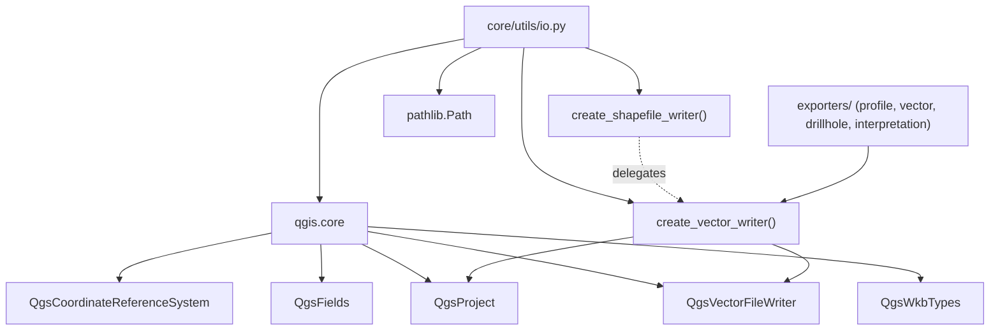

---
tags:
  - secinterp
  - code-walkthrough
  - core
  - utils
  - io
aliases:
  - io.py
  - create_vector_writer
  - create_shapefile_writer
cssclass: secinterp-note
---

# `core/utils/io.py`

> [!abstract] One-line summary
> A `QgsVectorFileWriter` factory that unifies vector file writing (Shapefile, GeoPackage, DXF) behind a single function, resolving the driver by extension and applying specific overwrite and encoding policies.

**Path**: `core/utils/io.py` (101 lines)
**Main function**: `create_vector_writer`
**Layer**: Core · Utilities (with QGIS coupling — see architectural note)
**Tags**: #secinterp #core #utils #io

---

## 🎯 Why does this file exist?

Writing a vector file in QGIS requires repeating a fragile sequence: pick the driver
by extension, build `SaveVectorOptions`, handle GeoPackage overwrite semantics and
check the writer's error state. Centralizing this avoids duplication across the many
exporters.

| Problem | Solution |
|---------|----------|
| Each exporter repeated the writer-creation logic | `create_vector_writer` centralizes driver, options and error check |
| The driver depends on the extension (`.shp`, `.gpkg`, `.dxf`) | `drivers` dict maps extension → GDAL/OGR driver name |
| GeoPackage needs a different overwrite policy | Branches for `CreateOrOverwriteLayer` vs `AppendToLayerAddFields` |
| DXF collides with reserved CAD attribute names | An empty `QgsFields()` is used for DXF unless CAD attributes are explicit |

> [!important] Architectural note — **honest** QGIS coupling
> Unlike the rest of `core/utils/`, this module **does import `qgis.core`** and calls
> `QgsProject.instance().transformContext()`. It is a deliberate exception to the
> "100% QGIS-agnostic core" rule: it is a **write-side utility** that lives next to the
> QGIS API by nature. The rest of the core (parsing, rendering, drilling) stays
> agnostic; `io.py` is the only writing boundary.

---

> [!note] One factory, many exporters
> `profile_exporters`, `vector_exporter`, `drillhole_exporters` and
> `interpretation_exporters` all consume this single entry point, so any change to
> writer creation is made in exactly one place.

---

## 🧬 Relationship diagram



> [!tip] How to read
> Solid arrow = imports/delegates; dashed = `create_shapefile_writer` is an obsolete
> *shim* that forwards to `create_vector_writer`. The `exporters/*` are the only real
> consumers.

---

## 📦 Imports — architectural reading

```python
# core/utils/io.py
from __future__ import annotations

from pathlib import Path

from qgis.core import (
    QgsCoordinateReferenceSystem,
    QgsFields,
    QgsProject,
    QgsVectorFileWriter,
    QgsWkbTypes,
)
```

| # | Observation |
|---|-------------|
| ① | `from __future__ import annotations` → lazy annotations, aligned with the project standard. |
| ② | `pathlib.Path` is the only stdlib dependency; `str \| Path` accepts both path forms. |
| ③ | The `qgis.core` block is the **only** one in `core/utils/` that imports QGIS ⇒ exception to the agnosticism rule. |
| ④ | `QgsProject` is used only for `QgsProject.instance().transformContext()` (the transform context when writing). |
| ⑤ | `QgsVectorFileWriter` provides both the class and the nested enums (`SymbologyExport`, `ActionOnExistingFile`, `WriterError`). |
| ⑥ | No `qgis.gui` nor `PyQt5`/`PyQt6` import ⇒ writes without touching the UI layer. |

---

## 🏗️ Structure inventory

**Functions (2):**

- `create_vector_writer(...) -> QgsVectorFileWriter` — main writer factory (96 lines).
- `create_shapefile_writer(*args, **kwargs) -> QgsVectorFileWriter` — obsolete shim that delegates.

**Inline constants/data:**

- `drivers` (dict): `.shp → "ESRI Shapefile"`, `.gpkg → "GPKG"`, `.dxf → "DXF"`.

**No classes or global state:** a module of functions over the QGIS API.

---

## 📁 Files in the package

`io.py` lives in `core/utils/`, the pure-utilities package:

| File | Lines | Role |
|---|--:|---|
| [[io]] | 101 | Vector writing (`create_vector_writer`) |
| [[metadata_reader]] | 129 | Reads `metadata.txt` (version, author) |
| [[parsing]] | 222 | Strike/dip parsing, cardinal azimuth, attributes |
| [[rendering]] | 129 | Bounds, coordinate transform, "nice" intervals |
| [[safe_loader]] | 79 | Safe/lazy import loading |
| [[drillhole]] | 298 | Drillhole trajectory and projection |
| `geology.py` | 40 | Apparent dip (`calculate_apparent_dip`) |
| `sampling.py` | 43 | Elevation interpolation |
| `spatial.py` | 30 | Line azimuth (`calculate_line_azimuth`) |

> [!note] `io.py` is the only member with QGIS coupling
> The other package modules are "pure math" or handle primitives/DTOs. See [[core_utils]].

---

## 📖 Method-by-method walkthrough

### `create_vector_writer`

```python
def create_vector_writer(
    output_path: str | Path,
    crs: QgsCoordinateReferenceSystem,
    fields: QgsFields,
    geometry_type: QgsWkbTypes.GeometryType = QgsWkbTypes.Type.LineString,
    layer_name: str | None = None,
    overwrite_layer: bool = True,
    symbology_export: QgsVectorFileWriter.SymbologyExport = (
        QgsVectorFileWriter.SymbologyExport.NoSymbology
    ),
) -> QgsVectorFileWriter:
    path = Path(output_path)
    ext = path.suffix.lower()

    drivers = {".shp": "ESRI Shapefile", ".gpkg": "GPKG", ".dxf": "DXF"}
    if ext not in drivers:
        raise ValueError(f"Unsupported vector extension: {ext}")

    options = QgsVectorFileWriter.SaveVectorOptions()
    options.driverName = drivers[ext]
    options.fileEncoding = "UTF-8"
    options.symbologyExport = symbology_export
    if layer_name:
        options.layerName = layer_name

    if ext == ".gpkg" and path.exists() and layer_name:
        options.actionOnExistingFile = (
            QgsVectorFileWriter.ActionOnExistingFile.CreateOrOverwriteLayer
            if overwrite_layer
            else QgsVectorFileWriter.ActionOnExistingFile.AppendToLayerAddFields
        )

    effective_fields = fields
    if ext == ".dxf":
        effective_fields = QgsFields()  # avoid reserved CAD names

    writer = QgsVectorFileWriter.create(
        str(path), effective_fields, geometry_type, crs,
        QgsProject.instance().transformContext(), options,
    )
    if writer.hasError() != QgsVectorFileWriter.WriterError.NoError:
        raise OSError(f"Error creating vector file {path}: {writer.errorMessage()}")
    return writer
```

The heart of the module. The flow is: **normalize path** → **resolve driver** →
**build options** → **GeoPackage overwrite policy** → **effective fields for DXF** →
**create writer** → **verify error**.

> [!tip] Driver resolution by extension
> `path.suffix.lower()` normalizes `.SHP`/`.Shp` to `.shp`. The `drivers` dict acts as
> a *strategy map*: adding a new format is just inserting an entry.

### `create_shapefile_writer`

```python
def create_shapefile_writer(*args, **kwargs) -> QgsVectorFileWriter:
    """Delegate to create_vector_writer (deprecated shim)."""
    return create_vector_writer(*args, **kwargs)
```

Backward compatibility: keeps the `*args, **kwargs` signature without coupling to
`create_vector_writer`'s signature. Adds no logic; it is a documented-as-deprecated
alias.

---

## 🔄 Data flow

| Phase | Input | Transformation | Output |
|-------|-------|----------------|--------|
| Format resolution | `output_path` (`.shp`/`.gpkg`/`.dxf`) | `path.suffix.lower()` + `drivers[ext]` | `driverName` |
| Configuration | `layer_name`, `symbology_export` | `SaveVectorOptions` | writer options |
| GeoPackage policy | `path.exists()`, `overwrite_layer` | conditional branch | `ActionOnExistingFile` |
| DXF fields | `fields` | discard to `QgsFields()` | effective fields |
| Writing | `crs`, `fields`, `geometry_type`, `transformContext` | `QgsVectorFileWriter.create` | `QgsVectorFileWriter` |
| Verification | `writer.hasError()` | compare with `NoError` | writer or `OSError` |

---

## 🏛️ Design patterns present

| Pattern | Where | Purpose |
|---------|-------|---------|
| **Factory Method** | `QgsVectorFileWriter.create(...)` | Create the writer without knowing the format |
| **Strategy map (dict)** | `drivers = {".shp": ...}` | Resolve driver by extension without an `if/elif` chain |
| **Facade** | `create_vector_writer` | Hide the complexity of `SaveVectorOptions` + create + verification |
| **Compatibility shim** | `create_shapefile_writer` | Keep the old API by delegating to the new one |
| **Guard clause** | `raise ValueError` / `raise OSError` | Fail early on unsupported extension or write error |

---

## 🧾 API summary

| Symbol | Signature / Inherits | Typical use |
|--------|----------------------|-------------|
| `create_vector_writer` | `(output_path, crs, fields, geometry_type=LineString, layer_name=None, overwrite_layer=True, symbology_export=NoSymbology) -> QgsVectorFileWriter` | Export a profile layer to shp/gpkg/dxf |
| `create_shapefile_writer` | `(*args, **kwargs) -> QgsVectorFileWriter` | Obsolete shim; delegates to the above |

---

## 🧭 Supported formats

| Extension | GDAL/OGR driver | Notes |
|-----------|-----------------|-------|
| `.shp` | `ESRI Shapefile` | One layer per file; `layerName` is effectively ignored |
| `.gpkg` | `GPKG` | Multi-layer container; requires `layer_name` to overwrite/append |
| `.dxf` | `DXF` | CAD format; attributes are emptied to avoid reserved names |

> [!note] Why only these three?
> They are the three formats consumed by the profile export flow (vector, geopackage
> and CAD). Adding, say, GeoJSON is a single line in `drivers`: `".geojson": "GeoJSON"`.

### Usage example from an exporter

```python
from sec_interp.core.utils.io import create_vector_writer
from qgis.core import QgsFields, QgsWkbTypes

writer = create_vector_writer(
    output_path="/tmp/profile.gpkg",
    crs=line_layer.crs(),
    fields=QgsFields(),
    geometry_type=QgsWkbTypes.Type.LineString,
    layer_name="topo",
    overwrite_layer=True,
)
# ... writer.addFeature(...) ...
del writer  # releases the file so it becomes available
```

> [!important] The caller must release the writer
> `create_vector_writer` returns an object that **keeps the file open**. The exporter
> is responsible for closing it (`del writer` or `writer = None`) so the file becomes
> available to other processes.

---

## ♻️ GeoPackage overwrite policy

The GeoPackage-specific branch only runs if `path.exists()` **and** there is a
`layer_name`:

| `overwrite_layer` | `ActionOnExistingFile` | Effect |
|:---:|---|---|
| `True` | `CreateOrOverwriteLayer` | Replaces the same-named layer inside the `.gpkg` |
| `False` | `AppendToLayerAddFields` | Appends features and adds any missing fields |

> [!warning] GeoPackage without `layer_name` skips the branch
> If no `layer_name` is passed, `ActionOnExistingFile` keeps its default value and the
> overwrite behavior is not controlled by this module. Exporters always pass
> `layer_name` for GeoPackages.

---

## 🧱 DXF and reserved CAD names

```python
effective_fields = fields
if ext == ".dxf":
    effective_fields = QgsFields()  # avoid reserved CAD names
```

QGIS's DXF driver can collide with reserved CAD-standard attributes (like `Layer`). To
avoid that, the module **discards the attributes** unless the caller explicitly wants
CAD attributes. A conservative, documented decision.

---

## 🛡️ Error handling

Two explicit exceptions, both with rich-context messages:

| Case | Exception | Message |
|------|-----------|---------|
| Unsupported extension | `ValueError` | `"Unsupported vector extension: {ext}"` |
| Writer error | `OSError` | `"Error creating vector file {path}: {errorMessage()}"` |

```python
# Early failure on unknown extension
if ext not in drivers:
    raise ValueError(f"Unsupported vector extension: {ext}")

# Post-creation verification
if writer.hasError() != QgsVectorFileWriter.WriterError.NoError:
    raise OSError(f"Error creating vector file {path}: {writer.errorMessage()}")
```

> [!warning] `ValueError`/`OSError`, not `SecInterpError`
> Unlike the rest of the core, stdlib exceptions are raised here, not from
> `core/exceptions.py`. It is consistent with its role as a write boundary, but breaks
> the custom-hierarchy convention (see [[exceptions]]). Possible future refactor.

> [!tip] `errorMessage()` is more useful than the enum
> The `WriterError` enum is used for comparison, but the readable message comes from
> `writer.errorMessage()`, which is propagated to the caller's log/UI.

---

## 🧪 Associated tests

There is no dedicated `test_io.py`: `create_vector_writer` is exercised **indirectly**
by *mocking* its output in exporter tests (Mock-first):

- `tests/core/test_profile_exporters.py` — `@patch(...scu_io.create_vector_writer)` for `ProfileLineVectorExporter`, `GeologyVectorExporter`, `StructureVectorExporter`, axes.
- `tests/exporters/test_vector_exporter.py` — simulates a writer that reports `NoError`.
- `tests/exporters/test_drillhole_export_objects.py`, `test_drillhole_3d_exporter.py`, `test_interpretation_exporters.py` — same patching pattern.

> [!note] Tests never touch the real driver
> `create_vector_writer` is replaced by a `MagicMock`; nobody writes a real `.shp` in
> the suite. Hence the driver/overwrite branches have no direct unit coverage.

---

## 👀 Observations and notes

> [!success] Strengths
> - Rich signature with sensible defaults (`LineString`, `NoSymbology`, `overwrite=True`).
> - `pathlib.Path` + `suffix.lower()` normalizes upper/lowercase extensions.
> - Correct, specific handling of GeoPackage (overwrite vs. append) and DXF (CAD).

> [!warning] Points of attention
> - **Breaks the agnosticism rule**: imports `qgis.core` and uses `QgsProject.instance()`.
> - Raises `ValueError`/`OSError` instead of `SecInterpError` (inconsistency with the core).
> - No direct unit test; only indirect coverage via mocks in exporters.

> [!question] Open questions
> - Should `io.py` migrate to the `SecInterpError` hierarchy (e.g. `ExportError`)?
> - Is it worth extracting driver resolution to a reusable constant/table?
> - Is it justified to move `io.py` out of `core/` given its QGIS dependency?

---

## 🔗 Related notes

- [[Index]] — vault index
- [[core_utils]] — the `core/utils/` package and its pure utilities
- [[rendering]] — bounds and transform used before exporting
- [[parsing]] — attribute extraction that feeds the exporters
- [[metadata_reader]] — reads `metadata.txt` (version/author) that accompanies writing
- [[controller]] — orchestrates the export flow
- [[exceptions]] — the error hierarchy that `io.py` does not yet adopt

---

*Note of the SecInterp Code Walkthrough v2 vault — v3.8.0*
