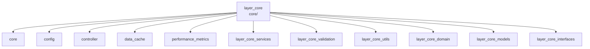

---
tags:
  - secinterp
  - code-walkthrough
  - layer
  - core
aliases:
  - layer_core
  - core/
cssclass: secinterp-note
---

# 🧭 `core/` Layer — QGIS-agnostic Nucleus

> [!abstract]
> Navigation hub for the `core/` package: SecInterp's QGIS-agnostic business
> layer. It gathers the central orchestrator (`controller`), configuration
> persistence (`config`), the in-memory cache (`data_cache`), performance
> telemetry (`performance_metrics`) and six sub-layers (services, validation,
> utilities, domain, models and interfaces) implementing the *Compute* side of
> the Extract-then-Compute pattern.

**Path**: `core/` (core root package)
**Layer**: Core (QGIS-agnostic, with documented gray areas in `config`)
**Tags**: #secinterp #code-walkthrough #layer #core

---

## 🎯 Why does this layer exist?

All geological computation lives here, isolated from the QGIS API so it stays
testable without QGIS, safe in threads (`QgsTask`) and reusable:

| Principle | How this layer applies it |
|-----------|---------------------------|
| Extract-then-Compute | The GUI extracts DTOs; `controller` and services only compute |
| Dependency inversion | Services are consumed through [[layer_core_interfaces]] ports |
| Typed boundary data | DTOs and entities live in [[layer_core_domain]] |
| Validated configuration | `config` returns the [[layer_core_models]] `PluginSettings` |
| Layered validation | The data entry gate is [[layer_core_validation]] |
| Observability | [[performance_metrics]] measures with no external dependencies |

> [!important] Layer rule
> No core module imports `qgis.gui`. The only punctual `qgis.core`
> dependencies (`QgsSettings`, `QCoreApplication.tr()`) are documented as gray
> areas in their notes. Types crossing the boundary are WKT, dicts,
> primitives and domain DTOs.

---

## 🧬 Mini-map

> [!tip] How to read
> The five direct members are the package root modules; each `layer_*`
> sub-hub groups a full subpackage with its own navigation notes.

---

## 📦 Members

| Note | Source | Role |
|------|--------|-----|
| [[core]] | `core/` (2 files, 20 lines) | Package root: layer docstring plus residual `algorithms.py` |
| [[config]] | `core/config.py` (253 lines) | `ConfigService`: persistence via `QgsSettings` and validated `PluginSettings` |
| [[controller]] | `core/controller.py` (425 lines) | `ProfileController`: orchestrates 4 domains with injected adapters, granular cache |
| [[data_cache]] | `core/data_cache.py` (169 lines) | `DataCache`: bucketed in-memory cache with TTL (`ICacheService`) |
| [[performance_metrics]] | `core/performance_metrics.py` (321 lines) | `MetricsCollector` and `@performance_monitor` on stdlib only |

### Sub-hubs of this layer

| Note | Package | Role |
|------|---------|-----|
| [[layer_core_services]] | `core/services/` | Per-domain computation (drillholes, geology, structures, preview, export) |
| [[layer_core_validation]] | `core/validation/` | 3-level validation: fields, layers/project, business rules |
| [[layer_core_utils]] | `core/utils/` | Reusable pure helpers (geometry, parsing, rendering, IO) |
| [[layer_core_domain]] | `core/domain/` + `core/exceptions.py` | DTOs, entities, enums and exception hierarchy |
| [[layer_core_models]] | `core/models/` | Validated configuration dataclasses (`PluginSettings`) |
| [[layer_core_interfaces]] | `core/interfaces/` | `I*Service` ports: contracts decoupling consumers |

---

## 📖 Member by member

### [[core]] — package root

**Source**: `core/` (2 files, 20 lines)
**Role**: Docstring declaring the QGIS-agnostic business layer plus an
`algorithms.py` module reserved for pure algorithms.
**Read when**: you need the conceptual entry point of the nucleus or want to
check what "QGIS-agnostic" means in this project.

### [[config]] — configuration persistence

**Source**: `core/config.py` (253 lines)
**Role**: `ConfigService` wraps `QgsSettings`, centralizes defaults, coerces
types (booleans stored as strings) and returns a validated `PluginSettings`
from the [[layer_core_models]] hub.
**Read when**: tracing where configuration values come from or how settings
are validated before use.

### [[controller]] — central orchestrator

**Source**: `core/controller.py` (425 lines)
**Role**: `ProfileController` coordinates topography, geology, structures and
drillholes with injected adapters and per-component granular cache, returning
a unified result tuple. Main consumer of [[layer_core_interfaces]] contracts.
**Read when**: following the full profile-generation flow or understanding
per-component cache invalidation.

### [[data_cache]] — in-memory cache

**Source**: `core/data_cache.py` (169 lines)
**Role**: `DataCache` implements `ICacheService` with buckets (`topo`,
`geol`, `struct`, `drill`), TTL expiry, deterministic hash keys and arbitrary
metadata (LOD).
**Read when**: investigating performance, result invalidation, or how the
[[controller]] avoids recomputing unchanged components.

### [[performance_metrics]] — telemetry

**Source**: `core/performance_metrics.py` (321 lines)
**Role**: `MetricsCollector` gathers timings and counters,
`PerformanceTimer`/`PerformanceMonitor.measure_operation` time operations and
`@performance_monitor` decorates functions, all on the stdlib alone.
**Read when**: hunting bottlenecks or instrumenting a new core operation.

### [[layer_core_services]] — services sub-hub

**Package**: `core/services/`
**Role**: Groups per-domain computation: drillholes, geology, structures,
preview, vertical exaggeration and the export pipeline.
**Read when**: looking for where something is computed (not validated or
defined).

### [[layer_core_validation]] — validation sub-hub

**Package**: `core/validation/`
**Role**: Groups 3-level validation: field validators, spatial/project
validators and business helpers with error accumulation.
**Read when**: investigating why data is rejected or where to add a rule.

### [[layer_core_utils]] — utilities sub-hub

**Package**: `core/utils/`
**Role**: Groups atomic pure helpers (drillhole geometry, parsing, rendering,
sampling, spatial, IO, i18n) reused by services and GUI.
**Read when**: needing an already-tested small function before writing a new
one.

### [[layer_core_domain]] — domain sub-hub

**Package**: `core/domain/` + `core/exceptions.py`
**Role**: Groups the core's currency: input/output DTOs, entities, spatial
enums and the `SecInterpError` hierarchy.
**Read when**: designing a new signature or needing the exact type crossing
the GUI → Core boundary.

### [[layer_core_models]] — models sub-hub

**Package**: `core/models/`
**Role**: Groups validated configuration dataclasses: 8 per-page sub-models
under the `PluginSettings` root container.
**Read when**: adding a setting option or changing a default value.

### [[layer_core_interfaces]] — ports sub-hub

**Package**: `core/interfaces/`
**Role**: Groups the 6 contracts (`ICacheService`, `IDrillholeService`,
`IGeologyService`, `IRenderer3D`, `IPreviewService`, `IStructureService`)
letting consumers and tests depend on abstractions.
**Read when**: adding a replaceable service or mocking the core in a test.

---

## 🔄 How the members fit together

The typical flow crosses the layer in this order: `config` supplies the
validated `PluginSettings`; [[layer_core_validation]] filters input data; the
[[controller]] asks [[layer_core_services]] for per-domain computation over
[[layer_core_domain]] DTOs; results land in [[data_cache]] buckets for
granular invalidation; and [[performance_metrics]] instruments costly
operations. [[core]] is just the documentary container, while
[[layer_core_interfaces]] defines the contracts keeping the graph decoupled
and [[layer_core_utils]] provides the helpers everyone reuses.

| Phase | Who | With which types |
|-------|-----|------------------|
| Configure | [[config]] | `QgsSettings` → `PluginSettings` |
| Validate | [[layer_core_validation]] | layers/metadata → accumulated errors |
| Orchestrate | [[controller]] | DTOs → result tuple |
| Compute | [[layer_core_services]] | pure contexts → segments/projections |
| Cache | [[data_cache]] | bucket + key → `Any` / `None` |
| Measure | [[performance_metrics]] | decorated functions → timings/counters |

---

## 🔗 Related hubs

- [[Index]] — vault index
- [[layer_core_services]] — per-domain computation and export
- [[layer_core_validation]] — 3-level validation
- [[layer_core_utils]] — reusable pure helpers
- [[layer_core_domain]] — DTOs, entities and exceptions
- [[layer_core_models]] — validated configuration
- [[layer_core_interfaces]] — ports and contracts

---

*Note of the SecInterp Code Walkthrough v2 vault — v3.8.0*
