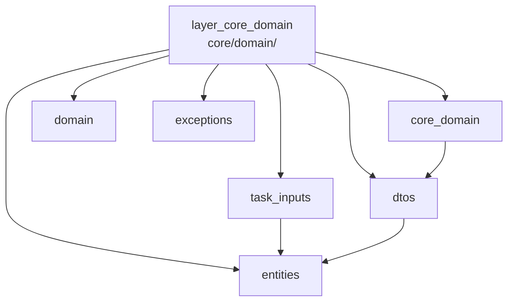

---
tags:
  - secinterp
  - code-walkthrough
  - layer
  - core
aliases:
  - layer_core_domain
  - core/domain/
cssclass: secinterp-note
---

# 🧭 `core/domain/` Layer — Domain Types

> [!abstract]
> Navigation hub for the core domain: the types naming and shaping everything
> crossing the GUI → Core boundary. The facade re-exports 24 symbols, input
> DTOs decouple async work, complex DTOs consolidate the preview, entities
> name the results, auxiliaries add enums and spatial metadata, and exceptions
> rank domain failures.

**Path**: `core/domain/` + `core/exceptions.py`
**Layer**: Core (pure types; no logic, no QGIS)
**Tags**: #secinterp #code-walkthrough #layer #core

---

## 🎯 Why does this layer exist?

Without domain types, the GUI/Core boundary would be a sea of anonymous dicts
and tuples. The domain names everything traveling across:

| Principle | How this layer applies it |
|-----------|---------------------------|
| Typed boundary | [[task_inputs]]: decoupled contexts for async tasks |
| Consolidated output | [[dtos]]: `PreviewParams` in, `PreviewResult` out |
| Named results | [[entities]]: segments, measurements, polygons, projections |
| Expressive auxiliaries | [[core_domain]]: PyQt-free `FieldType`, 2D/3D `SpatialMeta` |
| Classified failures | [[exceptions]]: `SecInterpError` and its hierarchy |
| Single import | [[domain]]: 24-symbol facade for the whole core |

> [!important] Layer rule
> The domain holds no logic: only dataclasses, aliases, enums and exceptions.
> If a type needs a live QGIS object, the design is wrong.

---

## 🧬 Mini-map

> [!tip] How to read
> [[domain]] is the import door; [[core_domain]] covers auxiliaries (`enums`,
> `spatial_meta`); the rest are type blocks by role.

---

## 📦 Members

| Note | Source | Role |
|------|--------|-----|
| [[core_domain]] | `core/domain/` (2 files, 70 lines) | Auxiliaries: `FieldType` (PyQt-free enum) and `SpatialMeta` (2D/3D bridge) |
| [[domain]] | `core/domain/__init__.py` (68 lines) | Facade: re-exports 24 symbols for single-point import |
| [[task_inputs]] | `core/domain/task_inputs.py` (79 lines) | Decoupled async DTOs: `OutcropSegments`, `GeologyContext`, `DrillholeContext` |
| [[dtos]] | `core/domain/dtos.py` (199 lines) | `PreviewParams` (input) and `PreviewResult` (output with helpers) |
| [[entities]] | `core/domain/entities.py` (161 lines) | Entities and aliases: `StructureMeasurement`, `GeologySegment`, interpretations, projections |
| [[exceptions]] | `core/exceptions.py` (65 lines) | `SecInterpError(message, details)` hierarchy by cause |

---

## 📖 Member by member

### [[core_domain]] — auxiliary types

**Source**: `core/domain/` (2 files, 70 lines)
**Role**: The auxiliary types that are neither entities nor DTOs: `FieldType`
(pyQt-free field-type enum) and `SpatialMeta` (spatial metadata bridging 2D
and 3D).
**Read when**: typing a field without dragging Qt or needing the metadata
traveling with a projected geometry.
**Also covers**: `FieldType` values, `SpatialMeta` fields, and why these
types sit apart from entities and DTOs.

### [[domain]] — import facade

**Source**: `core/domain/__init__.py` (68 lines)
**Role**: Re-exports the 24 public symbols of `dtos.py`, `entities.py`,
`enums.py`, `spatial_meta.py` and `task_inputs.py` for single-point import
from `core.domain`.
**Read when**: importing domain types (use the facade) or registering a new
symbol in the public API.
**Also covers**: the 24-symbol list, the export bar, and the facade pattern
applied to types.

### [[task_inputs]] — decoupled inputs

**Source**: `core/domain/task_inputs.py` (79 lines)
**Role**: Input DTOs the GUI hands the core for async processing —
`OutcropSegments`, `GeologyContext`, `DrillholeContext`— all free of live
QGIS objects.
**Read when**: launching a `QgsTask` or designing a new service's input
context.
**Also covers**: each context and its fields, the "no live QGIS" guarantee,
and the Extract (GUI) → Compute (service) cycle.

### [[dtos]] — consolidated preview

**Source**: `core/domain/dtos.py` (199 lines)
**Role**: Complex boundary DTOs: `PreviewParams` (consolidated generation
input) and `PreviewResult` (consolidated output with elevation/distance range
helpers).
**Read when**: consuming or producing the preview result, or using its range
helpers.
**Also covers**: params/result fields, range helpers, and each DTO's
producer/consumer.

### [[entities]] — named results

**Source**: `core/domain/entities.py` (161 lines)
**Role**: Domain entities (dataclasses) and type aliases: structural
measurements, geological segments, interpretation polygons and drillhole
projections.
**Read when**: reading a result's fields (segment, measurement, polygon) or
creating a new entity.
**Also covers**: each entity and its fields, collection aliases, and
construction conventions.

### [[exceptions]] — classified failures

**Source**: `core/exceptions.py` (65 lines)
**Role**: Exception hierarchy on the `SecInterpError(message, details)` base,
distinguishing validation, processing, geometry, export and configuration.
**Read when**: raising or catching a domain error, or choosing which subclass
to create.
**Also covers**: each subclass and its cause, the `details` field, and the
per-level catching criterion.

---

## 🔄 How the members fit together

The GUI builds [[task_inputs]] and input [[dtos]] (Extract), services consume
them and return [[entities]] (Compute), [[core_domain]] auxiliaries dress
those results with field types and spatial metadata, and any failure travels
as [[exceptions]] instead of generic `ValueError`. [[domain]] is the single
door through which the whole core imports these symbols.

| Phase | Who | Part |
|-------|-----|------|
| Async input | [[task_inputs]] | QGIS-free contexts for `QgsTask` |
| Preview input | [[dtos]] (`PreviewParams`) | consolidated parameters |
| Preview output | [[dtos]] (`PreviewResult`) | result + range helpers |
| Results | [[entities]] | segments, measurements, polygons |
| Dressing | [[core_domain]] | `FieldType`, `SpatialMeta` |
| Failures | [[exceptions]] | `SecInterpError` hierarchy |
| Import | [[domain]] | 24 symbols from one point |

---

## 📚 Suggested reading order

1. [[domain]] — the 24-symbol catalog (aerial view).
2. [[entities]] — the results everything produces.
3. [[task_inputs]] — the inputs everything consumes.
4. [[dtos]] — the consolidated preview case.
5. [[core_domain]] — auxiliaries (`FieldType`, `SpatialMeta`).
6. [[exceptions]] — how failures travel (short, self-contained).

---

## 🔗 Related hubs

- [[Index]] — vault index
- [[layer_core]] — parent nucleus hub
- [[layer_core_services]] — services consuming and producing these types
- [[layer_core_validation]] — validates `LayerMetadata`/`ValidationParams`
- [[layer_core_interfaces]] — contracts signed with these DTOs

---

*Note of the SecInterp Code Walkthrough v2 vault — v3.9.1*
