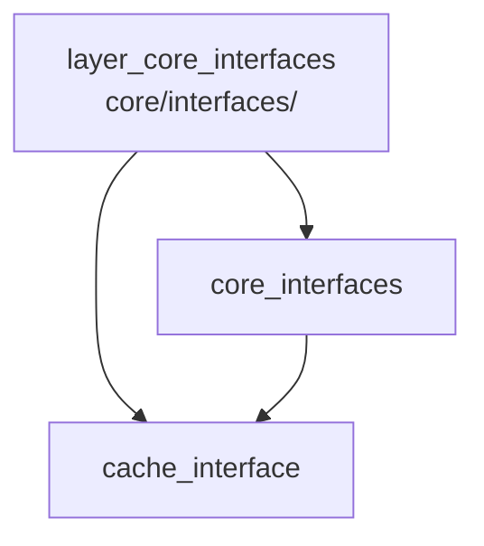

---
tags:
  - secinterp
  - code-walkthrough
  - layer
  - core
aliases:
  - layer_core_interfaces
  - core/interfaces/
cssclass: secinterp-note
---

# 🧭 `core/interfaces/` Layer — Ports and Contracts

> [!abstract]
> Navigation hub for the `core/interfaces/` package: the nucleus's ports in
> the hexagonal sense. The package note walks the 6 contracts
> (`ICacheService`, `IDrillholeService`, `IGeologyService`, `IRenderer3D`,
> `IPreviewService`, `IStructureService`) with their `Protocol` vs `ABC`
> criterion, while the cache note details the structural bucket-cache
> contract that `DataCache` honors without inheriting.

**Path**: `core/interfaces/` (7 files, ~148 lines)
**Layer**: Core (pure contracts; zero QGIS imports)
**Tags**: #secinterp #code-walkthrough #layer #core

---

## 🎯 Why does this layer exist?

Dependency inversion requires the controller, GUI and exporters to program
against contracts, not concrete classes, so implementations can be swapped
and mocked in tests:

| Principle | How this layer applies it |
|-----------|---------------------------|
| Hexagonal ports | Each service gets its `I*` fixing the signature |
| Structural vs nominal | `ICacheService` is a `Protocol`; the rest are `ABC`s |
| `runtime_checkable` | The cache supports `isinstance` without inheritance |
| DTOs in signatures | Domain contexts, never QGIS layers |
| Injected callbacks | `elevation_sampler` crosses as a `Callable`, not a raster |
| `feedback` as `Any` | Progress/cancellation without importing `QgsTask` |

> [!important] Layer rule
> A new service earns an interface only with multiple implementations, mocks
> in consumer tests, or as an external extension point. Single-use code needs
> no `I*`.

---

## 🧬 Mini-map

> [!tip] How to read
> [[core_interfaces]] is the full view of the 6 contracts with implementers
> and usage guidance; [[cache_interface]] zooms into the package's only
> `Protocol`. The arrow means "details".

---

## 📦 Members

| Note | Source | Role |
|------|--------|-----|
| [[core_interfaces]] | `core/interfaces/` (7 files, ~148 lines) | The 6 ports: ABCs/Protocols, implementers and usage guide |
| [[cache_interface]] | `core/interfaces/cache_interface.py` (62 lines) | `ICacheService`: 5 bucketed methods with structural typing |

---

## 📖 Member by member

### [[core_interfaces]] — the 6 ports

**Source**: `core/interfaces/` (7 files, ~148 lines)
**Role**: Declares the core ports —ABCs and Protocols stating what each
service must do— so controller, GUI and exporters depend on contracts:
`ICacheService`, `IDrillholeService`, `IGeologyService`, `IRenderer3D`,
`IPreviewService`, `IStructureService`.
**Read when**: implementing or consuming a service, mocking the core in a
test, or deciding whether a new service needs an interface.
**Also covers**: each contract with its signature, the `Protocol` vs `ABC`
criterion, the contract→real-implementer table, the cache-aside pattern,
cooperative cancellation via `feedback`, the "when to create a contract"
guide, and the contract↔domain-DTO pairing.
**Contracts and signatures**: `ICacheService.get/set/invalidate/clear/get_metadata`;
`IDrillholeService.process_context`; `IGeologyService.build_segments`;
`IRenderer3D.render_3d/clear`; `IPreviewService.generate_all`;
`IStructureService.project_structures` with injected `elevation_sampler`.

### [[cache_interface]] — the structural contract

**Source**: `core/interfaces/cache_interface.py` (62 lines)
**Role**: Defines `ICacheService`, the bucket-cache contract: 5 methods
(`get`, `set`, `invalidate`, `clear`, `get_metadata`) with structural typing
and `runtime_checkable`, honored by `DataCache` with no forced inheritance.
**Read when**: replacing the cache (e.g. in tests), invalidating by bucket or
key, or understanding the plugin's cache-aside pattern.
**Also covers**: per-bucket semantics (`topo`, `geol`, `struct`, `drill`),
`invalidate` granularity, arbitrary metadata (LOD), and why this contract is
a `Protocol` while the rest are `ABC`s.
**Check**: `isinstance(DataCache(), ICacheService)` passes by shape, not
inheritance, so test mocks honor the contract with a minimal class.

---

## 🔄 How the members fit together

[[core_interfaces]] is the map and [[cache_interface]] the magnifier over its
most singular contract: the package defines 6 ports in two styles
(structural for the replaceable cache, nominal for rigid-signature services);
consumers import only the contract and implementations live outside (core,
GUI, exporters); the cache, detailed in [[cache_interface]], alone allows
shape-based compliance, simplifying mocks and substitutes.

| Contract | Style | Implementer | Detailed in |
|----------|-------|-------------|-------------|
| `ICacheService` | `Protocol` | `DataCache` (core) | [[cache_interface]] |
| `IDrillholeService` | `ABC` | `DrillholeService` | [[core_interfaces]] |
| `IGeologyService` | `ABC` | `GeologyService` | [[core_interfaces]] |
| `IStructureService` | `ABC` | `StructureService` | [[core_interfaces]] |
| `IPreviewService` | `ABC` | `PreviewService` | [[core_interfaces]] |
| `IRenderer3D` | `ABC` | 3D exporter | [[core_interfaces]] |

---

## 📚 Suggested reading order

1. [[core_interfaces]] — the 6 contracts, implementers and usage rules.
2. [[cache_interface]] — the `Protocol` case in detail.
3. The [[layer_core_domain]] hub — the DTOs signing these contracts.

> [!note] Implementing a port
> Subclass the `ABC` (or match the `Protocol` shape), sign with domain DTOs,
> accept `feedback: Any | None` for cooperative cancellation, and raise the
> `SecInterpError` hierarchy on failure. All three points are covered between
> [[core_interfaces]] and [[layer_core_domain]].

---

## 🧩 Where it is used in the plugin

| Consumer | Imported contract | For what |
|----------|-------------------|----------|
| Controller | `IDrillholeService`, `IGeologyService`, `IStructureService` | decoupled computation |
| Controller | `ICacheService` | per-component granular cache |
| Preview | `IPreviewService` | consolidated generation |
| Exporters | `IRenderer3D` | 3D render of the `PreviewResult` |
| Tests | all (mocks) | consumers without real implementations |

> [!tip] Mock-first
> In tests, consumers run against contract-honoring mocks, not real services.
> The cache `Protocol` makes those mocks trivial.

---

## 🔗 Related hubs

- [[Index]] — vault index
- [[layer_core]] — parent nucleus hub
- [[layer_core_services]] — implementers of these contracts
- [[layer_core_domain]] — DTOs and exceptions in the signatures

---

*Note of the SecInterp Code Walkthrough v2 vault — v3.9.1*
