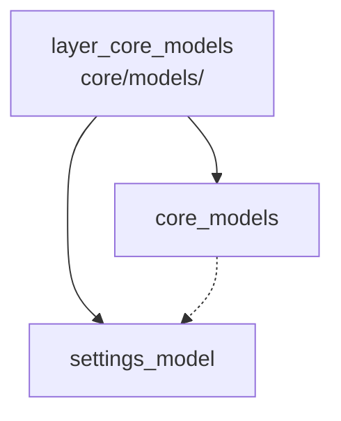

---
tags:
  - secinterp
  - code-walkthrough
  - layer
  - core
aliases:
  - layer_core_models
  - core/models/
cssclass: secinterp-note
---

# 🧭 `core/models/` Layer — Validated Configuration

> [!abstract]
> Navigation hub for the `core/models/` package: the plugin's validated
> configuration dataclasses. The package note describes the namespace and its
> current state, while the settings module defines the 8 per-page sub-models
> grouped under the `PluginSettings` root container, with validation and
> clamping in `__post_init__` so no invalid option reaches computation.

**Path**: `core/models/` (core models package)
**Layer**: Core (pure dataclasses with self-validation)
**Tags**: #secinterp #code-walkthrough #layer #core

---

## 🎯 Why does this layer exist?

Plugin configuration spans every dialog page and every service; without one
model, each reader would apply its own defaults:

| Principle | How this layer applies it |
|-----------|---------------------------|
| One root container | `PluginSettings` groups the 8 sub-models |
| One sub-model per page | Section, Dem, Geology, Structure, Drillhole, Interpretation, Preview, Export |
| Validation at construction | `__post_init__` + `validate_and_clamp`, no late setters |
| Single producer | `ConfigService` (see the [[layer_core]] hub) builds the model |
| Typed consumers | Services and GUI read attributes, not settings dicts |

> [!important] Layer rule
> Models describe and validate; they never read `QgsSettings` or paint UI.
> Reading lives in the configuration service; forms live in the GUI.

---

## 🧬 Mini-map

> [!tip] How to read
> [[core_models]] explains the container (today an empty `__init__` with its
> own note); [[settings_model]] is the real content. The dotted arrow means
> "documents", not a code dependency.

---

## 📦 Members

| Note | Source | Role |
|------|--------|-----|
| [[core_models]] | `core/models/` (1 file, 0 lines) | Package view: namespace whose only real module has its own note |
| [[settings_model]] | `core/models/settings_model.py` (179 lines) | 8 per-page sub-models + `PluginSettings` with `validate_and_clamp` |

---

## 📖 Member by member

### [[core_models]] — overview

**Source**: `core/models/` (1 file, 0 lines)
**Role**: Note for the core models namespace: today just an empty `__init__.py`
because its only real module, `settings_model.py`, carries its own note in
this same hub.
**Read when**: needing the package map or understanding why a one-file
package deserves a hub (growth reserve for future models).
**Also covers**: the namespace's current state, the bar for a new model
entering here, and the relationship with the configuration service building
these models.
**Convention**: single-real-module packages document container and module
separately so growth (a second model) never breaks navigation.

### [[settings_model]] — the 8 sub-models

**Source**: `core/models/settings_model.py` (179 lines)
**Role**: Defines the validated configuration dataclasses: 8 per-page
sub-models (`Section`, `Dem`, `Geology`, `Structure`, `Drillhole`,
`Interpretation`, `Preview`, `Export`) grouped under the `PluginSettings`
root container, validated via `validate_and_clamp` in `__post_init__`.
**Read when**: adding an option (new field + default + clamp), changing a
default, or tracing a computation parameter's source.
**Also covers**: each sub-model and its fields, the `validate_and_clamp`
mechanics, ranges applied in `__post_init__`, and how the root container
groups the 8 pages.
**Flow example**: GUI saves → `ConfigService` reads `QgsSettings` → builds
`PluginSettings` (validated here) → services read typed attributes without
revalidating.

---

## 🔄 How the members fit together

[[core_models]] is the envelope and [[settings_model]] the letter: the
package exists for namespace and a growth point, and the module defines the
one current model. The producer (`ConfigService`) instantiates
`PluginSettings` once and consumers (controller, services, settings pages)
read already-validated attributes, so validation happens at a single point.

| Phase | Who | Input → Output |
|-------|-----|----------------|
| Container | [[core_models]] | namespace + growth criterion |
| Definition | [[settings_model]] | fields + defaults → validated dataclasses |
| Construction | configuration service | `QgsSettings` → `PluginSettings` |
| Consumption | controller, services, GUI | typed attributes (no revalidation) |

---

## 📚 Suggested reading order

1. [[core_models]] — the minimal package map (2-minute read).
2. [[settings_model]] — the 8 sub-models and the root container.
3. The configuration service note ([[layer_core]] hub) — who builds the model
   in practice.

> [!note] Adding an option
> Field with default in its page sub-model → range in `validate_and_clamp` →
> key in the configuration service → control on the GUI settings page. All
> four steps are covered between this hub and [[layer_core]].

---

## 🧩 Where it is used in the plugin

| Consumer | What it reads | For what |
|----------|---------------|----------|
| Configuration service | sub-models | building the `PluginSettings` |
| Controller and services | validated attributes | computation parameters |
| Validation (factories) | dataclass fields | coercion and ranges |
| Settings pages (GUI) | per-page sub-model | showing/editing options |

> [!tip] Directionality
> The dependency always points toward the models, never away: no import
> leaves `core/models/` for services, GUI or QGIS.

---

## 🔗 Related hubs

- [[Index]] — vault index
- [[layer_core]] — parent hub: configuration service and controller
- [[layer_core_validation]] — factories validating dataclass fields
- [[layer_core_domain]] — compute DTOs (not to confuse with config models)

---

*Note of the SecInterp Code Walkthrough v2 vault — v3.9.0*
