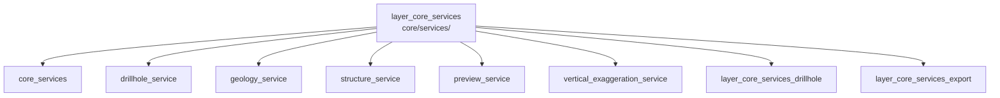

---
tags:
  - secinterp
  - code-walkthrough
  - layer
  - core
aliases:
  - layer_core_services
  - core/services/
cssclass: secinterp-note
---

# 🧭 `core/services/` Layer — Compute Services

> [!abstract]
> Navigation hub for the `core/services/` package: the nucleus's pure-compute
> services. Each per-domain service (drillholes, geology, structures, preview,
> vertical exaggeration) turns already-decoupled contexts into drawable or
> exportable results, while two sub-hubs group the drillhole processors and
> the export pipeline.

**Path**: `core/services/` (core services package)
**Layer**: Core (QGIS-agnostic)
**Tags**: #secinterp #code-walkthrough #layer #core

---

## 🎯 Why does this layer exist?

Services are the *Compute* of Extract-then-Compute: they receive DTOs the GUI
already extracted from QGIS layers and return domain structures, never
importing `qgis.*`:

| Principle | How this layer applies it |
|-----------|---------------------------|
| One service per domain | Drillholes, geology, structures, preview, VE kept apart |
| Decoupled input | `DrillholeContext`, `GeologyContext`, `struct_data` + callbacks |
| Composition over inheritance | [[drillhole_service]] coordinates pure processors from [[layer_core_services_drillhole]] |
| Export via handlers | [[layer_core_services_export]] delegates each entity to its handler |
| Cooperative progress | `feedback` (`Any`) parameter for `QgsTask` without importing Qt |

> [!important] Layer rule
> If a computation needs a layer, a raster or the canvas, it does not live
> here: the GUI extracts it and passes a DTO, a dict list or a callback (e.g.
> `elevation_sampler`). See [[preview_service]] and [[structure_service]].

---

## 🧬 Mini-map

> [!tip] How to read
> The six direct members are the services plus the re-exporting `__init__`;
> the two sub-hubs group subpackages with their own navigation.

---

## 📦 Members

| Note | Source | Role |
|------|--------|-----|
| [[core_services]] | `core/services/` (3 files, ~68 lines) | Re-exporting `__init__` + access control + compatibility shim |
| [[drillhole_service]] | `core/services/drillhole_service.py` (113 lines) | Orchestrates collar, survey, interval, trajectory from a `DrillholeContext` |
| [[geology_service]] | `core/services/geology_service.py` (87 lines) | Builds `GeologySegment`s interpolating over the master profile |
| [[structure_service]] | `core/services/structure_service.py` (187 lines) | Projects structures: station, elevation, apparent dip |
| [[preview_service]] | `core/services/preview_service.py` (175 lines) | Generates preview topography + structures as one `PreviewResult` |
| [[vertical_exaggeration_service]] | `core/services/vertical_exaggeration_service.py` (186 lines) | Stateless adaptive VE from aspect ratio and density |

### Sub-hubs of this layer

| Note | Package | Role |
|------|---------|-----|
| [[layer_core_services_drillhole]] | `core/services/drillhole/` | Pure drillhole processors (collar, intervals, trajectory) |
| [[layer_core_services_export]] | `core/services/export/` | Facade, compatibility, paths and export handlers |

---

## 📖 Member by member

### [[core_services]] — package facade

**Source**: `core/services/` (3 files, ~68 lines)
**Role**: The `__init__` re-exports the main services (`DrillholeService`,
`GeologyService`, `StructureService`), `access_control_service` manages
permissions via `QgsSettings`, and `export_service` is a compatibility shim.
**Read when**: needing the official public service list or understanding why
an access-control layer sits next to computation.

### [[drillhole_service]] — drillhole orchestrator

**Source**: `core/services/drillhole_service.py` (113 lines)
**Role**: Orchestrating service that coordinates four pure processors
(collar, survey, interval, trajectory) from a decoupled `DrillholeContext`,
returning `(geol_data, drillhole_data)` without touching QGIS. Delegates fine
work to [[layer_core_services_drillhole]].
**Read when**: tracing a drillhole's full path from context to drawable
projection.

### [[geology_service]] — geological segments

**Source**: `core/services/geology_service.py` (87 lines)
**Role**: Pure-compute service building `GeologySegment`s from a decoupled
`GeologyContext`, interpolating elevations over the master profile.
**Read when**: investigating how a segment is born or why a contact lands at
a given elevation.

### [[structure_service]] — structural projection

**Source**: `core/services/structure_service.py` (187 lines)
**Role**: Projects structural measurements onto the section plane (station,
elevation via `elevation_sampler` callback, apparent dip) without importing
QGIS.
**Read when**: debugging a misplaced structural symbol or the apparent-dip
math.

### [[preview_service]] — consolidated preview

**Source**: `core/services/preview_service.py` (175 lines)
**Role**: Synchronous orchestrator generating preview topography and
structures as one consolidated `PreviewResult`, backed by the injected
controller's adapters and services.
**Read when**: following the "preview" button down to the `PreviewResult` the
GUI paints.

### [[vertical_exaggeration_service]] — vertical exaggeration

**Source**: `core/services/vertical_exaggeration_service.py` (186 lines)
**Role**: Stateless service computing adaptive VE from the aspect ratio
(elevation range / distance range) modulated by structure density.
**Read when**: tuning automatic vertical scale or understanding why a section
looks "flattened".

### [[layer_core_services_drillhole]] — drillhole sub-hub

**Package**: `core/services/drillhole/`
**Role**: Groups the pure drillhole-domain processors: collar projection,
interval interpolation and trajectory orchestration.
**Read when**: going one level down from [[drillhole_service]] to per-hole
detail.

### [[layer_core_services_export]] — export sub-hub

**Package**: `core/services/export/`
**Role**: Groups the export facade, the compatibility mixin, the path
resolver and the per-entity handlers.
**Read when**: following computed data all the way to CSV/vector files on
disk.

---

## 🔄 How the members fit together

Each service is independent and combines with the rest only through the
controller: [[drillhole_service]] delegates to
[[layer_core_services_drillhole]] processors; [[geology_service]] and
[[structure_service]] produce the segments and symbols [[preview_service]]
consolidates with topography into the `PreviewResult`;
[[vertical_exaggeration_service]] adjusts that result's scale; and
[[layer_core_services_export]] dumps everything to disk on export.
[[core_services]] is the documentary facade re-exporting the package API.

| Flow | Input | Service | Output |
|------|-------|---------|--------|
| Drillholes | `DrillholeContext` | [[drillhole_service]] + drillhole sub-hub | `(geol_data, drillhole_data)` |
| Geology | `GeologyContext` | [[geology_service]] | `GeologySegment`s |
| Structures | `struct_data` + `elevation_sampler` | [[structure_service]] | `StructureData` |
| Preview | params + transform context | [[preview_service]] | `PreviewResult` |
| Scale | ranges + density | [[vertical_exaggeration_service]] | VE factor |
| Export | computed data + options | [[layer_core_services_export]] | CSV/vector files |

---

## 🔗 Related hubs

- [[Index]] — vault index
- [[layer_core]] — parent nucleus hub
- [[layer_core_services_drillhole]] — drillhole processors
- [[layer_core_services_export]] — export pipeline
- [[layer_core_domain]] — DTOs consumed by these services
- [[layer_core_interfaces]] — contracts implemented by these services

---

*Note of the SecInterp Code Walkthrough v2 vault — v3.9.0*
