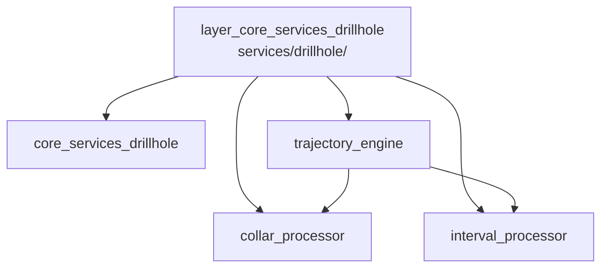

---
tags:
  - secinterp
  - code-walkthrough
  - layer
  - core
aliases:
  - layer_core_services_drillhole
  - core/services/drillhole/
cssclass: secinterp-note
---

# 🧭 `core/services/drillhole/` Layer — Drillhole Processors

> [!abstract]
> Navigation hub for the `core/services/drillhole/` subpackage: the pure
> drillhole-domain processors. The package note covers the set, while each
> drillhole's collar, lithological intervals and trajectory are solved in
> three specialized modules coordinated by the `DrillholeService` orchestrator
> without touching QGIS.

**Path**: `core/services/drillhole/` (6 files, 309 lines)
**Layer**: Core (QGIS-agnostic)
**Tags**: #secinterp #code-walkthrough #layer #core

---

## 🎯 Why does this layer exist?

A drillhole mixes three distinct geometric problems (where it collars, how it
deviates in 3D, which lithology it crosses) best solved separately:

| Principle | How this layer applies it |
|-----------|---------------------------|
| Separation of concerns | Collar, trajectory and intervals in their own modules |
| Total purity | Only primitives and DTOs; neither `qgis.*` nor GUI |
| Two-level orchestration | `trajectory_engine` orchestrates per hole; `DrillholeService` per context |
| Drawable result | Everything converges on `DrillholeProjection` + `GeologySegment` |
| Off-section means `None` | A collar outside the buffer drops the hole, no exceptions |

> [!important] Layer rule
> These processors never see QGIS layers: they receive already-extracted
> coordinates, surveys and intervals. Extraction lives in the GUI; only
> geometry lives here.

---

## 🧬 Mini-map

> [!tip] How to read
> [[core_services_drillhole]] is the package overview; [[trajectory_engine]]
> combines [[collar_processor]] and [[interval_processor]] per drillhole.

---

## 📦 Members

| Note | Source | Role |
|------|--------|-----|
| [[core_services_drillhole]] | `core/services/drillhole/` (6 files, 309 lines) | Package view: pure processors consumed by `DrillholeService` |
| [[collar_processor]] | `core/services/drillhole/collar_processor.py` (100 lines) | Projects the collar, extracts elevation/depth; `None` if outside |
| [[interval_processor]] | `core/services/drillhole/interval_processor.py` (50 lines) | Turns `(from, to, lithology)` intervals into `GeologySegment`s |
| [[trajectory_engine]] | `core/services/drillhole/trajectory_engine.py` (111 lines) | Per-hole orchestration: 3D → projection → intervals → `DrillholeProjection` |

---

## 📖 Member by member

### [[core_services_drillhole]] — overview

**Source**: `core/services/drillhole/` (6 files, 309 lines)
**Role**: Package note grouping the pure drillhole-domain processors —collar
projection, end depth, interval interpolation and trajectory orchestration—
all QGIS-agnostic and consumed by the upper-level orchestrator service.
**Read when**: needing the subpackage map before dropping into one processor.
**Also covers**: the buffer-drop criterion, the `DrillholeProjection`
convention as result, and how the six files fit.

### [[collar_processor]] — hole collar

**Source**: `core/services/drillhole/collar_processor.py` (100 lines)
**Role**: Pure processor projecting the collar onto the section line and
extracting its elevation and total depth from decoupled data, returning a
`DrillholeProjection` or `None` when the collar falls outside the buffer.
**Read when**: a drillhole vanishes from the profile (almost always the collar
buffer) or you want the collar-elevation source.
**Also covers**: point→line projection, buffer tolerance, and total-depth
extraction with no live QGIS objects.

### [[interval_processor]] — lithological intervals

**Source**: `core/services/drillhole/interval_processor.py` (50 lines)
**Role**: Pure processor turning `(from, to, lithology)` intervals into
`GeologySegment` objects with 2D, 3D and projected points, interpolating them
along an already-projected trajectory.
**Read when**: hole lithology colors mismatch the interval table or you debug
interval→geometry interpolation.
**Also covers**: measured-distance splitting over the trajectory, the three
point sets, and the interval→segment link.

### [[trajectory_engine]] — per-hole orchestrator

**Source**: `core/services/drillhole/trajectory_engine.py` (111 lines)
**Role**: Pure per-hole orchestrator: computes the 3D trajectory, projects it
onto the section, interpolates lithological intervals and packs the result
into a `DrillholeProjection` with `SpatialMeta` and `GeologySegment`.
**Read when**: following one hole's full lifecycle or learning who calls
[[collar_processor]] and [[interval_processor]] in which order.
**Also covers**: 3D deviation from surveys, projection onto the section
plane, final `DrillholeProjection` assembly and its spatial metadata.

---

## 🔄 How the members fit together

For each context hole, [[trajectory_engine]] first asks [[collar_processor]]
for the collar position (`None` drops the hole); with a valid collar it
computes the deviated 3D trajectory, projects it onto the section and hands
that geometry to [[interval_processor]], which spreads lithological intervals
over it as `GeologySegment`s; the engine packs trajectory + segments +
`SpatialMeta` into the final `DrillholeProjection`.
[[core_services_drillhole]] documents the collective contract the upper-level
service consumes.

| Phase | Who | Input → Output |
|-------|-----|----------------|
| Collar | [[collar_processor]] | coords + line → `DrillholeProjection` / `None` |
| 3D deviation | [[trajectory_engine]] | surveys + collar → 3D trajectory |
| Projection | [[trajectory_engine]] | 3D trajectory + line → 2D geometry |
| Lithology | [[interval_processor]] | intervals + trajectory → `GeologySegment`s |
| Packing | [[trajectory_engine]] | all of the above → `DrillholeProjection` |

---

## 📚 Suggested reading order

1. [[core_services_drillhole]] — subpackage map and conventions.
2. [[collar_processor]] — the first filter: which holes survive.
3. [[trajectory_engine]] — the skeleton ordering the whole process.
4. [[interval_processor]] — the lithological detail dressing the trajectory.

> [!note] Internal dependencies
> [[trajectory_engine]] depends on [[collar_processor]] and
> [[interval_processor]]; the latter two are independent of each other and
> never call back upward.

---

## 🔗 Related hubs

- [[Index]] — vault index
- [[layer_core_services]] — parent services hub
- [[layer_core_services_export]] — handlers exporting these results
- [[layer_core_domain]] — `DrillholeProjection`, `GeologySegment`, `SpatialMeta`

---

*Note of the SecInterp Code Walkthrough v2 vault — v3.9.1*
