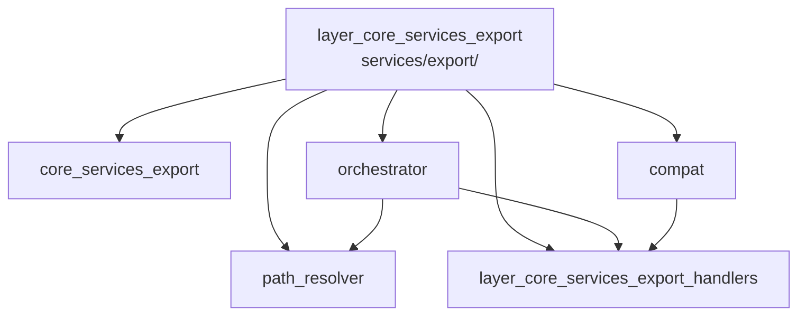

---
tags:
  - secinterp
  - code-walkthrough
  - layer
  - core
aliases:
  - layer_core_services_export
  - core/services/export/
cssclass: secinterp-note
---

# 🧭 `core/services/export/` Layer — Export Pipeline

> [!abstract]
> Navigation hub for the `core/services/export/` subpackage: the pipeline
> carrying already-computed profile data to CSV files and vector layers on
> disk. The package note introduces the set, the facade orchestrates per
> entity, the mixin preserves the legacy API, the resolver unifies names and
> paths, and the handlers sub-hub performs the real per-entity writes.

**Path**: `core/services/export/` (core export package)
**Layer**: Core (`QgsMapSettings` construction isolated in one module)
**Tags**: #secinterp #code-walkthrough #layer #core

---

## 🎯 Why does this layer exist?

Exporting mixes three responsibilities (what to write, under which name and
where, how to write it) that the package splits into pieces with a single
reason to change:

| Principle | How this layer applies it |
|-----------|---------------------------|
| Single facade | [[orchestrator]] is the only export entry point |
| Declarative table | Each handler triggers on option flags, not scattered `if`s |
| Uniform paths | [[path_resolver]] derives profile name, path and layer name |
| Compatibility without debt | [[compat]] keeps the `_export_*` API delegating to handlers |
| Normalized errors | Write failures translate to `ExportError` |
| Isolated QGIS | `QgsMapSettings` construction lives in one factory module |

> [!important] Layer rule
> Handlers receive already-computed data (profile, segments, measurements),
> never live layers. Resolving CRS, layers and format belongs to the facade,
> not to each writer.

---

## 🧬 Mini-map

> [!tip] How to read
> [[core_services_export]] presents the package and the map-settings factory;
> [[orchestrator]] directs; [[path_resolver]] names; [[compat]] translates the
> old API; the handlers sub-hub writes.

---

## 📦 Members

| Note | Source | Role |
|------|--------|-----|
| [[core_services_export]] | `core/services/export/` (2 files, ~43 lines) | Package view: public API + isolated `QgsMapSettings` factory |
| [[compat]] | `core/services/export/compat.py` (129 lines) | `_export_*` mixin delegating the legacy API to handlers |
| [[orchestrator]] | `core/services/export/orchestrator.py` (207 lines) | Facade: orchestrates per-entity CSV/vector writes from options |
| [[path_resolver]] | `core/services/export/path_resolver.py` (60 lines) | Derives profile name, output path and logical layer name |

### Sub-hub of this layer

| Note | Package | Role |
|------|---------|-----|
| [[layer_core_services_export_handlers]] | `core/services/export/handlers/` | Real per-entity writes (topo, geology, holes, 3D, structures, interpretations) |

---

## 📖 Member by member

### [[core_services_export]] — overview

**Source**: `core/services/export/` (2 files, ~43 lines)
**Role**: The `__init__.py` re-exports the public API (`ExportService`,
`create_map_settings`, `get_profile_name`, `resolve_export_path`) and
`map_settings_factory.py` isolates `QgsMapSettings` construction in a single
module holding the package's only QGIS coupling.
**Read when**: needing the pipeline map or learning where touching
`QgsMapSettings` is allowed and where it is banned.
**Also covers**: the public symbol list, the QGIS-isolation criterion, and
how the factory keeps the rest of the package agnostic.

### [[compat]] — backward compatibility

**Source**: `core/services/export/compat.py` (129 lines)
**Role**: Mixin preserving the legacy `_export_*` private API of
`ExportService`, delegating each wrapper to the matching `handlers/` handler
without coupling QGIS types.
**Read when**: finding `_export_topography`-style calls and wanting the modern
handler they redirect to.
**Also covers**: the old-API → handler equivalence table, the mixin as
contained debt, and why the old API was not removed at once.

### [[orchestrator]] — export facade

**Source**: `core/services/export/orchestrator.py` (207 lines)
**Role**: Facade receiving the profile's computed data and orchestrating
per-entity CSV/vector writes, delegating to handlers per options while
resolving layers, CRS and format.
**Read when**: tracing an export end to end or adding a newly exportable
entity to the pipeline.
**Also covers**: option-based dispatch, CRS/format resolution, write order
(topography first) and `ExportError` propagation.

### [[path_resolver]] — names and paths

**Source**: `core/services/export/path_resolver.py` (60 lines)
**Role**: Resolves where and under which name each file is written: derives
the profile name and composes the output path (plus logical layer name)
uniformly for all exporters.
**Read when**: an exported file shows an unexpected name or you add a new
naming convention.
**Also covers**: profile-name derivation, per-entity path composition, and
the logical layer name users see in QGIS.

### [[layer_core_services_export_handlers]] — handlers sub-hub

**Package**: `core/services/export/handlers/`
**Role**: Groups the real per-entity writes: topography, geology, 2D and 3D
drillholes, structures and interpretations, each with CSV plus vector layer.
**Read when**: dropping from the facade to the code actually writing bytes to
disk.

---

## 🔄 How the members fit together

The user invokes the [[orchestrator]] facade, which asks [[path_resolver]]
for each output's name and path, checks options for active entities, and
dispatches each to its [[layer_core_services_export_handlers]] handler; when
the caller uses the legacy API, [[compat]] intercepts the `_export_*` call
and redirects it to the same handler, so both APIs converge on one writing
codebase. [[core_services_export]] documents the collective contract and
isolates the `QgsMapSettings` factory.

| Phase | Who | Input → Output |
|-------|-----|----------------|
| Contract | [[core_services_export]] | public imports + isolated QGIS factory |
| Facade | [[orchestrator]] | data + options → per-entity dispatch |
| Names | [[path_resolver]] | profile + entity → path + layer name |
| Writes | [[layer_core_services_export_handlers]] | rows + path → CSV + vector layer |
| Legacy | [[compat]] | `_export_*` → modern handler |

---

## 📚 Suggested reading order

1. [[core_services_export]] — pipeline map and public API.
2. [[orchestrator]] — the dispatch flow ordering everything.
3. [[path_resolver]] — how outputs are named (short, self-contained).
4. [[layer_core_services_export_handlers]] — the real per-entity writes.
5. [[compat]] — only when maintaining legacy-API callers.

> [!note] Internal dependencies
> [[orchestrator]] depends on [[path_resolver]] and the handlers; [[compat]]
> depends only on the handlers; [[path_resolver]] depends on nobody in the
> package (a pure naming utility).

---

## 🔗 Related hubs

- [[Index]] — vault index
- [[layer_core_services]] — parent services hub
- [[layer_core_services_drillhole]] — produces the drillhole data exported here
- [[layer_core_services_export_handlers]] — per-entity writes
- [[layer_core_domain]] — `ExportError` and exported types

---

*Note of the SecInterp Code Walkthrough v2 vault — v3.9.0*
