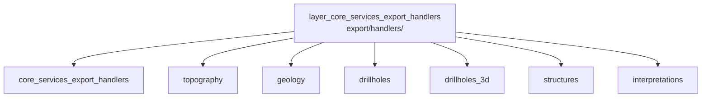

---
tags:
  - secinterp
  - code-walkthrough
  - layer
  - core
aliases:
  - layer_core_services_export_handlers
  - core/services/export/handlers/
cssclass: secinterp-note
---

# 🧭 `core/services/export/handlers/` Layer — Per-entity Handlers

> [!abstract]
> Navigation hub for the export handlers: one module per profile entity
> (topography, geology, 2D and 3D drillholes, structures, interpretations)
> dumping already-computed data to CSV and vector layer. The package note
> describes the container, and each handler documents its task table, its CSV
> columns and its failure translation to `ExportError`.

**Path**: `core/services/export/handlers/` (handlers package)
**Layer**: Core (file writes + output vector layers)
**Tags**: #secinterp #code-walkthrough #layer #core

---

## 🎯 Why does this layer exist?

Each profile entity has its own shape (line, points, polygons, 3D traces) and
columns; a single monolithic exporter would mix six different formats:

| Principle | How this layer applies it |
|-----------|---------------------------|
| One handler per entity | Topo, geology, holes, 3D, structures, interpretations |
| Always CSV + vector | Each handler yields both outputs from the same logical rows |
| Per-profile paths | All resolve paths with the same resolver, no private logic |
| Normalized failures | Write exceptions become `ExportError` with context |
| Flag-driven activation | 3D/2D tasks and real/projected variants driven by options |
| Gated access | 3D interpretations gated on access control and valid line |

> [!important] Layer rule
> Handlers do not compute: they derive rows from computed `GeologySegment`s,
> measurements and profiles. Missing data is an input error, not a handler
> bug.

---

## 🧬 Mini-map

> [!tip] How to read
> [[core_services_export_handlers]] describes the container (axes + `__init__`);
> the six handlers are mutually independent and share conventions.

---

## 📦 Members

| Note | Source | Role |
|------|--------|-----|
| [[core_services_export_handlers]] | `core/services/export/handlers/` (2 files, ~39 lines) | Package view: axes handler + empty `__init__` |
| [[topography]] | `core/services/export/handlers/topography.py` (63 lines) | Topo profile to CSV (dist, elev) + line layer; pipeline first step |
| [[geology]] | `core/services/export/handlers/geology.py` (66 lines) | Lithological segments to CSV (dist, elev, unit) + vector layer |
| [[drillholes]] | `core/services/export/handlers/drillholes.py` (70 lines) | 2D holes: traces and intervals as layers, per-profile paths |
| [[drillholes_3d]] | `core/services/export/handlers/drillholes_3d.py` (82 lines) | Real/projected 3D holes via declarative task table and flags |
| [[structures]] | `core/services/export/handlers/structures.py` (77 lines) | Measurements to CSV (dist, apparent dip) + layer, raster-scaled |
| [[interpretations]] | `core/services/export/handlers/interpretations.py` (93 lines) | Mandatory 2D polygons + 3D when access and line allow |

---

## 📖 Member by member

### [[core_services_export_handlers]] — overview

**Source**: `core/services/export/handlers/` (2 files, ~39 lines)
**Role**: Package note grouping the profile-axes handler (`axes.py`) and an
empty `__init__.py`; the six per-entity handlers carry individual notes in
this same hub.
**Read when**: needing the package map or understanding "axes" versus
"entities".
**Also covers**: the axes/entities split criterion, why the `__init__`
re-exports nothing, and the handler inventory.

### [[topography]] — topographic profile

**Source**: `core/services/export/handlers/topography.py` (63 lines)
**Role**: Dumps the topographic profile to CSV (dist, elev) and a profile
line vector layer, as the export pipeline's first step.
**Read when**: the base export fails (everything else needs topo to exist) or
you review the dist/elev column format.
**Also covers**: profile-to-rows sampling, line-layer creation, and why this
handler runs before the rest.

### [[geology]] — lithological segments

**Source**: `core/services/export/handlers/geology.py` (66 lines)
**Role**: Dumps lithological segments to CSV (dist, elev, unit) and vector
layer, deriving rows from `GeologySegment`s and normalizing errors to
`ExportError`.
**Read when**: a unit is missing from the CSV or the vector dump mismatches
computed segments.
**Also covers**: row←segment derivation, unit columns, and write-error
normalization.

### [[drillholes]] — 2D drillholes

**Source**: `core/services/export/handlers/drillholes.py` (70 lines)
**Role**: Exports traces (polylines) and intervals (lithology) as 2D vector
layers, resolving per-profile paths and translating failures to `ExportError`.
**Read when**: debugging projected-hole export or per-profile output paths.
**Also covers**: the trace/interval split, path resolution, and lithology
attribute → vector field mapping.

### [[drillholes_3d]] — 3D drillholes

**Source**: `core/services/export/handlers/drillholes_3d.py` (82 lines)
**Role**: Exports 3D traces and intervals, each in two variants (real and
projected), driven by a declarative task table and option flags.
**Read when**: adding an export variant or understanding the
real/projected × trace/interval matrix.
**Also covers**: the declarative task table, per-variant flags, and real vs
projected geometry.

### [[structures]] — structural measurements

**Source**: `core/services/export/handlers/structures.py` (77 lines)
**Role**: Dumps measurements to CSV (dist, apparent dip) and vector layer,
reading raster resolution to scale the dip.
**Read when**: exported dips mismatch profile symbols or you review
resolution scaling.
**Also covers**: dist/dip columns, raster-resolution scaling, and measurement
→ feature serialization.

### [[interpretations]] — interpreted polygons

**Source**: `core/services/export/handlers/interpretations.py` (93 lines)
**Role**: Exports polygons mandatorily in 2D and, when access control allows
and the section line is valid, in 3D as well.
**Read when**: the 3D variant is missing (check access + line) or you change
the gate conditions.
**Also covers**: the access-control gate, section-line validation, and dual
2D/3D polygon output.

---

## 🔄 How the members fit together

The six handlers are independent and never call each other: the facade
invokes them in order (topography first, rest after) with the same computed
data and options. All share three conventions: same per-profile path
criterion, CSV + vector layer from the same logical rows, and every failure
translated to `ExportError`. [[core_services_export_handlers]] documents the
container plus the axes handler, which cuts across entities.

| Handler | Logical rows | Outputs |
|---------|--------------|---------|
| [[topography]] | profile (dist, elev) | CSV + profile line |
| [[geology]] | (dist, elev, unit) | CSV + segment layer |
| [[drillholes]] | 2D traces + intervals | vector layers |
| [[drillholes_3d]] | traces + intervals × real/projected | 3D layers per task |
| [[structures]] | (dist, apparent dip) | CSV + measurement layer |
| [[interpretations]] | 2D polygons (+ gated 3D) | interpretation layers |

---

## 📚 Suggested reading order

1. [[core_services_export_handlers]] — container, axes and conventions.
2. [[topography]] — simplest handler; sets the CSV + layer pattern.
3. [[geology]] — same pattern applied to segments.
4. [[drillholes]] and [[drillholes_3d]] — the matrix case (flag variants).
5. [[structures]] and [[interpretations]] — gated cases (raster, access).

---

## 🔗 Related hubs

- [[Index]] — vault index
- [[layer_core_services_export]] — parent hub: facade, paths, compatibility
- [[layer_core_services]] — services computing what is dumped here
- [[layer_core_services_drillhole]] — source of the drillhole data

---

*Note of the SecInterp Code Walkthrough v2 vault — v3.8.0*
