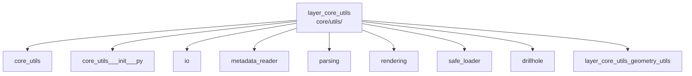

---
tags:
  - secinterp
  - code-walkthrough
  - layer
  - core
aliases:
  - layer_core_utils
  - core/utils/
cssclass: secinterp-note
---

# 🧭 `core/utils/` Layer — Pure Utilities

> [!abstract]
> Navigation hub for the `core/utils/` package: the atomic pure helpers the
> whole plugin reuses. The package note covers the
> geology/i18n/sampling/spatial group, the facade re-exports 14 symbols, and
> each specialized module (drillhole geometry, parsing, rendering, IO,
> metadata, safe loading) solves one small bounded problem, with planar
> geometry grouped in its own sub-hub.

**Path**: `core/utils/` (core utilities package)
**Layer**: Core (mostly pure; `io` wraps `QgsVectorFileWriter`)
**Tags**: #secinterp #code-walkthrough #layer #core

---

## 🎯 Why does this layer exist?

Services and GUI share dozens of tiny operations (project a point, parse a
strike, interpolate an elevation) deserving neither a service nor duplication:

| Principle | How this layer applies it |
|-----------|---------------------------|
| Pure functions first | Stateless, QGIS-free, testable with plain asserts |
| Single facade | [[core_utils___init___py]] re-exports 14 helpers (`scu.*`) |
| One module, one topic | Geometry, parsing, rendering, IO, metadata, loading |
| Noise tolerance | [[parsing]] accepts varied strike/dip and azimuth formats |
| Graceful degradation | [[safe_loader]] returns `None`/fallback when an optional fails |
| Geometry sub-hub | Planar work lives in [[layer_core_utils_geometry_utils]] |

> [!important] Layer rule
> A new helper belongs here only with ≥2 consumers or logic subtle enough for
> its own tests. Single-use code stays in its module.

---

## 🧬 Mini-map

> [!tip] How to read
> [[core_utils]] covers the base group (geology, i18n, sampling, spatial);
> [[core_utils___init___py]] is the facade; the rest are specialties.

---

## 📦 Members

| Note | Source | Role |
|------|--------|-----|
| [[core_utils]] | `core/utils/` (`geology`, `i18n`, `sampling`, `spatial` group) | Apparent dip, i18n mixin, elevation interpolation, line azimuth |
| [[core_utils___init___py]] | `core/utils/__init__.py` (82 lines) | Facade: 14 re-exported helpers + `__all__` (`scu.*`) |
| [[io]] | `core/utils/io.py` (101 lines) | `QgsVectorFileWriter` factory (SHP, GPKG, DXF) by extension |
| [[metadata_reader]] | `core/utils/metadata_reader.py` (129 lines) | `metadata.txt` via `ConfigParser` as cached dict |
| [[parsing]] | `core/utils/parsing.py` (222 lines) | Noisy strike/dip and azimuths → clean Python primitives |
| [[rendering]] | `core/utils/rendering.py` (129 lines) | Padded bbox, data→pixel transform, "nice" axes |
| [[safe_loader]] | `core/utils/safe_loader.py` (79 lines) | Lazy imports with fallback (`None`) on failure |
| [[drillhole]] | `core/utils/drillhole.py` (298 lines) | 3D trajectory, section projection, interval splitting |

### Sub-hub of this layer

| Note | Package | Role |
|------|---------|-----|
| [[layer_core_utils_geometry_utils]] | `core/utils/geometry_utils/` | Pure planar geometry: measurement, simplification, densification |

---

## 📖 Member by member

### [[core_utils]] — base group

**Source**: `core/utils/` (`geology.py`, `i18n.py`, `sampling.py`, `spatial.py`)
**Role**: Package note for group C: `geology` (apparent dip), `i18n`
(translation mixin), `sampling` (elevation interpolation) and `spatial` (line
azimuth), atomic helpers reused by services and GUI.
**Read when**: looking for the existing small function (azimuth, elevation,
dip) before writing your own.
**Also covers**: the "group C" criterion, each helper's signature, and who
consumes them.

### [[core_utils___init___py]] — facade

**Source**: `core/utils/__init__.py` (82 lines)
**Role**: Re-exports 14 pure helpers (geology, drillholes, parsing,
rendering, sampling, spatial) and defines `__all__` for `from
sec_interp.core import utils as scu`.
**Read when**: importing utilities (use the facade, not deep paths) or
registering a new helper in the public API.
**Also covers**: the 14-symbol list, the `scu` alias, and the bar for adding
an export.

### [[io]] — vector writing

**Source**: `core/utils/io.py` (101 lines)
**Role**: `QgsVectorFileWriter` factory unifying Shapefile, GeoPackage and
DXF behind one function, resolving the driver by extension and applying
overwrite and encoding policies.
**Read when**: writing a new vector file or changing overwrite policy.
**Also covers**: extension←driver resolution, per-format policies, and the
applied encoding.

### [[metadata_reader]] — plugin metadata

**Source**: `core/utils/metadata_reader.py` (129 lines)
**Role**: Reads the standard QGIS `metadata.txt` with `ConfigParser` and
exposes it as a cached dict: single source of truth for name, version,
author and email.
**Read when**: showing the version in the UI or avoiding hardcoded metadata.
**Also covers**: `ConfigParser` parsing, caching, and exposed keys.

### [[parsing]] — noisy inputs

**Source**: `core/utils/parsing.py` (222 lines)
**Role**: Converts raw structural inputs (varied strike/dip, cardinal
azimuths, feature attributes) to clean primitives, noise-tolerant and ready
for pure core Compute.
**Read when**: an oddly formatted strike fails or you add a new input format.
**Also covers**: accepted formats, noise tolerance, and
attribute→primitive conversion.

### [[rendering]] — drawing utilities

**Source**: `core/utils/rendering.py` (129 lines)
**Role**: Computes the padded bbox, builds the data→pixel function (with
vertical exaggeration) and generates "nice" axis intervals.
**Read when**: tuning framing, scales, or preview axis labeling.
**Also covers**: bbox padding, the VE-aware transform, and the nice-ticks
algorithm.

### [[safe_loader]] — defensive loading

**Source**: `core/utils/safe_loader.py` (79 lines)
**Role**: Lazily and safely loads modules and classes, catching
import/instantiation errors and returning `None` (or a fallback) so the
plugin stays functional without an optional component.
**Read when**: integrating an optional dependency or debugging an unexpected
`None` from a deferred import.
**Also covers**: lazy loading, error capture, and the fallback convention.

### [[drillhole]] — drillhole geometry

**Source**: `core/utils/drillhole.py` (298 lines)
**Role**: Computes the 3D trajectory from surveys, projects it onto the
section line and splits lithological intervals over it, all without touching
QGIS.
**Read when**: debugging low-level drillhole geometry (below the service
sub-hub processors).
**Also covers**: survey-based deviation, section projection, and interval
splitting over the trajectory.

### [[layer_core_utils_geometry_utils]] — planar sub-hub

**Package**: `core/utils/geometry_utils/`
**Role**: Groups pure planar profile geometry: measurement (projection,
metrics), optimization (Douglas-Peucker, curvature) and processing
(densification, interpolation).
**Read when**: working with low-level profile polylines.

---

## 🔄 How the members fit together

The modules are mutually independent and combine only in their consumers:
services use [[drillhole]] and [[core_utils]] (sampling, spatial) for
geometry, [[parsing]] to clean inputs, [[rendering]] for preview, [[io]] to
write outputs, [[metadata_reader]] for plugin identity and [[safe_loader]]
for optionals; fine planar geometry lives in
[[layer_core_utils_geometry_utils]]. [[core_utils___init___py]] is the single
door re-exporting the most-used pieces.

| Need | Helper | Typical consumer |
|------|--------|------------------|
| Azimuth / elevation / dip | [[core_utils]] | services and GUI |
| Hole trajectory | [[drillhole]] | drillhole processors |
| Profile polylines | [[layer_core_utils_geometry_utils]] | preview and topo |
| Noisy inputs | [[parsing]] | structural services |
| Drawing and axes | [[rendering]] | preview |
| Vector writing | [[io]] | export handlers |
| Version/author | [[metadata_reader]] | UI and logging |
| Fragile optionals | [[safe_loader]] | plugin startup |

---

## 📚 Suggested reading order

1. [[core_utils___init___py]] — what `import utils as scu` gives you.
2. [[core_utils]] — the most-used base group.
3. Your specialty: [[drillhole]], [[parsing]], [[rendering]] or [[io]].
4. [[layer_core_utils_geometry_utils]] — fine planar geometry.
5. [[metadata_reader]] + [[safe_loader]] — infrastructure (rarely changes).

---

## 🔗 Related hubs

- [[Index]] — vault index
- [[layer_core]] — parent nucleus hub
- [[layer_core_utils_geometry_utils]] — planar geometry in detail
- [[layer_core_services]] — main consumer of these helpers

---

*Note of the SecInterp Code Walkthrough v2 vault — v3.9.0*
