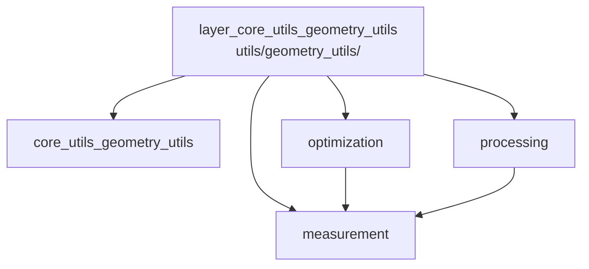

---
tags:
  - secinterp
  - code-walkthrough
  - layer
  - core
aliases:
  - layer_core_utils_geometry_utils
  - core/utils/geometry_utils/
cssclass: secinterp-note
---

# 🧭 `core/utils/geometry_utils/` Layer — Planar Geometry

> [!abstract]
> Navigation hub for the `core/utils/geometry_utils/` subpackage: pure planar
> geometry for topographic profiles, with no QGIS and no state. The package
> note describes the 4-file container, while measurement projects points and
> aggregates metrics, optimization simplifies and samples by curvature, and
> processing densifies and interpolates elevations over polylines.

**Path**: `core/utils/geometry_utils/` (4 files, ~416 lines)
**Layer**: Core (pure planar geometry, QGIS-agnostic)
**Tags**: #secinterp #code-walkthrough #layer #core

---

## 🎯 Why does this layer exist?

Profile polylines (section line, sampled topo, axes) need three distinct
operations evolving at different paces:

| Principle | How this layer applies it |
|-----------|---------------------------|
| Measure ≠ simplify ≠ densify | One module per polyline operation |
| Mathematical purity | `(x, y)` tuple lists in and out; no QGIS geometries |
| Fluid preview | [[optimization]] drops vertices adding nothing |
| Continuous elevations | [[processing]] interpolates elevation between vertices |
| Aggregate questions | [[measurement]] answers length, relief, slope |
| No re-exports | The `__init__` is a namespace marker (see [[core_utils_geometry_utils]]) |

> [!important] Layer rule
> Everything enters and leaves as tuple sequences. Conversion to/from
> `QgsGeometry` happens outside, in the GUI or the services.

---

## 🧬 Mini-map

> [!tip] How to read
> [[core_utils_geometry_utils]] is the package view; the three modules are
> independent, with [[measurement]] as the base vocabulary the other two
> reuse conceptually.

---

## 📦 Members

| Note | Source | Role |
|------|--------|-----|
| [[core_utils_geometry_utils]] | `core/utils/geometry_utils/` (4 files, ~416 lines) | Package view: no-re-export namespace + measure/optimize/process split |
| [[measurement]] | `core/utils/geometry_utils/measurement.py` (136 lines) | Point→polyline projection and aggregate metrics (length, relief, slope) |
| [[optimization]] | `core/utils/geometry_utils/optimization.py` (197 lines) | Douglas-Peucker, angular-deviation curvature, adaptive sampling |
| [[processing]] | `core/utils/geometry_utils/processing.py` (80 lines) | Densification via midpoints plus (dist, elev) interpolation |

---

## 📖 Member by member

### [[core_utils_geometry_utils]] — overview

**Source**: `core/utils/geometry_utils/` (4 files, ~416 lines)
**Role**: Package note: `__init__` as namespace marker, `measurement`
(measurement), `optimization` (simplification) and `processing`
(densification/interpolation); pure planar profile geometry with no
`__init__` re-exports.
**Read when**: needing the subpackage map or deciding where a new geometric
function goes (measure, simplify or densify).
**Also covers**: the three-module split criterion, the `(x, y)` tuple
convention, and why the `__init__` does not re-export (explicit per-module
imports).

### [[measurement]] — measuring polylines

**Source**: `core/utils/geometry_utils/measurement.py` (136 lines)
**Role**: Projects a point onto a polyline and computes aggregate metrics
(total, horizontal and relief distances, mean slope) without touching QGIS.
**Read when**: needing a point's station along the section or numeric profile
summaries.
**Also covers**: point→segment projection with accumulated station, each
aggregate metric, and degenerate cases (empty polyline, coincident point).

### [[optimization]] — simplifying with judgment

**Source**: `core/utils/geometry_utils/optimization.py` (197 lines)
**Role**: Simplifies polylines with Douglas-Peucker, estimates local
curvature by angular deviation and samples adaptively by curvature, for fluid
preview renders that keep their shape.
**Read when**: the preview drags on dense lines or you tune the
fidelity/performance balance.
**Also covers**: the Douglas-Peucker algorithm and tolerance, curvature
estimation, adaptive sampling, and when NOT to simplify.

### [[processing]] — densifying and interpolating

**Source**: `core/utils/geometry_utils/processing.py` (80 lines)
**Role**: Densifies polylines by inserting intermediate vertices and converts
interval boundary distances to `(dist, elev)` points with sampled elevation,
without touching QGIS.
**Read when**: needing more resolution on a polyline or mapping a distance
interval to elevated points.
**Also covers**: the vertex-insertion criterion, inter-vertex elevation
interpolation, and interval→points conversion.

---

## 🔄 How the members fit together

The typical cycle over a profile polyline: [[processing]] densifies it for
enough resolution, services sample elevations over it, [[measurement]]
answers questions (stations, lengths, slopes) and [[optimization]] simplifies
it before painting so previews stay fluid. [[core_utils_geometry_utils]]
documents the collective contract: all tuples, no state, no QGIS.

| Phase | Who | Input → Output |
|-------|-----|----------------|
| Prepare | [[processing]] | coarse polyline → dense polyline |
| Ask | [[measurement]] | point/polyline → station or metrics |
| Lighten | [[optimization]] | dense polyline → simplified polyline |
| Contract | [[core_utils_geometry_utils]] | package conventions |

---

## 📚 Suggested reading order

1. [[core_utils_geometry_utils]] — package conventions and split.
2. [[measurement]] — the base vocabulary (station, distances).
3. [[processing]] — how the measured polylines get built.
4. [[optimization]] — how they slim down before painting (longest module).

> [!note] Internal dependencies
> The three modules are import-independent; the dependency is conceptual:
> optimizing and processing only make sense over [[measurement]] notions.

---

## 🔗 Related hubs

- [[Index]] — vault index
- [[layer_core_utils]] — parent utilities hub
- [[layer_core_services]] — services consuming this geometry
- [[layer_core_domain]] — `SpatialMeta`, the 2D/3D bridge of these polylines

---

*Note of the SecInterp Code Walkthrough v2 vault — v3.9.0*
