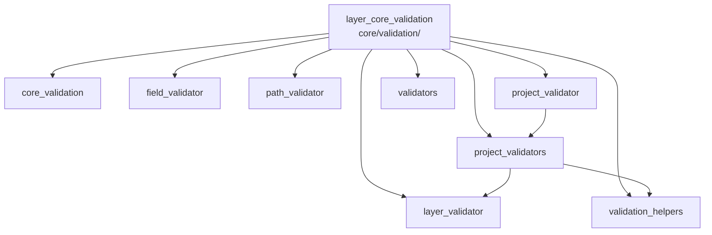

---
tags:
  - secinterp
  - code-walkthrough
  - layer
  - core
aliases:
  - layer_core_validation
  - core/validation/
cssclass: secinterp-note
---

# 🧭 `core/validation/` Layer — 3-level Validation

> [!abstract]
> Navigation hub for the `core/validation/` package: the nucleus's data entry
> gate. The package note declares the `IValidator` interface, the
> `LayerMetadata` DTO and the `ValidationPipeline`; field, layer and project
> validators filter inputs at growing levels, and the helpers add error
> accumulation, conditional rules and reusable factories.

**Path**: `core/validation/` (core validation package)
**Layer**: Core (QGIS-agnostic; works on decoupled `LayerMetadata`)
**Tags**: #secinterp #code-walkthrough #layer #core

---

## 🎯 Why does this layer exist?

No computation should run on malformed data. Validation is layered to fail
fast on the cheap (types) and accumulate context on the costly (business
rules):

| Principle | How this layer applies it |
|-----------|---------------------------|
| Level 1: fields | [[field_validator]] and [[validators]] coerce and type |
| Level 1/2: layers | [[layer_validator]] and [[path_validator]] check geometry, CRS, raster, paths |
| Level 2: business | [[validation_helpers]] accumulates errors and conditional rules |
| Level 3: project | [[project_validator]] and [[project_validators]] orchestrate per component |
| Decoupled from QGIS | Everything validates `LayerMetadata`/`ValidationParams`, never live layers |
| Common contract | `IValidator.validate(params, context)` in [[core_validation]] |

> [!important] Layer rule
> Validating is not processing. These modules never compute geometry or write
> files: they return errors/warnings or raise `ValidationError`/`SecInterpError`.

---

## 🧬 Mini-map

> [!tip] How to read
> [[core_validation]] defines the contract; [[project_validator]]
> orchestrates; [[project_validators]] implements per component; the rest are
> building blocks.

---

## 📦 Members

| Note | Source | Role |
|------|--------|-----|
| [[core_validation]] | `core/validation/` (4 files, ~148 lines) | `IValidator`, `LayerMetadata`, `ValidationPipeline` and public API |
| [[field_validator]] | `core/validation/field_validator.py` (184 lines) | Level 1: numeric coercion and field existence/type |
| [[layer_validator]] | `core/validation/layer_validator.py` (200 lines) | Level 1/2 spatial: features, geometry, raster, CRS, requirements |
| [[path_validator]] | `core/validation/path_validator.py` (111 lines) | Safe paths: traversal, confinement, creation and writing |
| [[project_validator]] | `core/validation/project_validator.py` (151 lines) | `ValidationParams` + `ProjectValidator` per-domain orchestrator |
| [[project_validators]] | `core/validation/project_validators.py` (240 lines) | Per-component validators (section, DEM, geology, holes, output) |
| [[validation_helpers]] | `core/validation/validation_helpers.py` (195 lines) | Level 2: accumulator context, rich error, rules, sane ranges |
| [[validators]] | `core/validation/validators.py` (252 lines) | Reusable dataclass-field factories + `FieldValidator` |

---

## 📖 Member by member

### [[core_validation]] — contract and pipeline

**Source**: `core/validation/` (4 files, ~148 lines)
**Role**: Declares the `IValidator` interface, the `LayerMetadata` DTO, the
`ValidationPipeline` orchestrator and the `__init__` re-exporting the public
validation API, all QGIS-agnostic.
**Read when**: creating a new validator (implement `IValidator`) or learning
which decoupled data validation sees.
**Also covers**: the `validate(params, context)` signature, the
`LayerMetadata` shape, and pipeline chaining.

### [[field_validator]] — fields and attributes

**Source**: `core/validation/field_validator.py` (184 lines)
**Role**: Level-1 QGIS-agnostic validators for layer fields and attributes:
string→number/int coercion plus existence/type checks over decoupled
`LayerMetadata`.
**Read when**: a field "exists but fails" (usually type or coercion) or you
add a new field check.
**Also covers**: tolerant string coercion, existence/type checks, and
per-field error messages.

### [[layer_validator]] — layers and geometry

**Source**: `core/validation/layer_validator.py` (200 lines)
**Role**: Level-1/2 spatial validators: layer with features and expected
geometry, raster with requested band, geology/structure requirements and CRS
compatibility over `LayerMetadata`.
**Read when**: a valid-looking layer "does not pass" (geometry, CRS, band) or
you define a new domain's requirements.
**Also covers**: non-empty feature checks, per-domain expected geometry,
raster band checks and CRS comparison.

### [[path_validator]] — output paths

**Source**: `core/validation/path_validator.py` (111 lines)
**Role**: Safe `pathlib.Path` validation of output paths: null bytes,
directory traversal, confinement to a base directory, existence/creation and
real on-disk writability.
**Read when**: an export fails on its path or you harden allowed-destination
policy.
**Also covers**: the real-write test, base-directory confinement, and
intermediate directory creation.

### [[project_validator]] — project orchestrator

**Source**: `core/validation/project_validator.py` (151 lines)
**Role**: Defines the `ValidationParams` DTO (every layer parameter to
validate) and the `ProjectValidator` orchestrator composing the specialized
validator pipeline with per-domain "completeness" helpers.
**Read when**: running full project validation or learning what a "complete"
project means per domain.
**Also covers**: the `ValidationParams` shape, pipeline composition, and
completeness helpers.

### [[project_validators]] — per-component validators

**Source**: `core/validation/project_validators.py` (240 lines)
**Role**: Specialized per-component validators (section, DEM, geology,
structures, holes, output), each implementing
`IValidator.validate(params, context)` to accumulate business errors.
**Read when**: one domain reports errors or you add a new component's rules.
**Also covers**: per-component rules, accumulation over `ValidationParams`,
and each domain's typical business errors.

### [[validation_helpers]] — level-2 business tools

**Source**: `core/validation/validation_helpers.py` (195 lines)
**Role**: `ValidationContext` accumulating errors/warnings instead of failing
fast, `RichValidationError` as error-with-context, `DependencyRule` for
conditional rules, and `validate_reasonable_ranges` for extreme values.
**Read when**: designing "if A then B" rules or choosing hard error versus
warning.
**Also covers**: accumulator vs fail-fast, dependency rules, and sane-range
thresholds.

### [[validators]] — reusable factories

**Source**: `core/validation/validators.py` (252 lines)
**Role**: Reusable validator factories for dataclass fields: higher-order
functions validating/coercing and raising `ValidationError`, composed via the
`FieldValidator` class (chaining) plus convenience helpers (percentage,
probability, positive int).
**Read when**: validating a `PluginSettings` field or composing a coercion
chain.
**Also covers**: `FieldValidator` chaining, higher-order factories, and
numeric convenience helpers.

---

## 🔄 How the members fit together

[[project_validator]] receives `ValidationParams` and runs the
[[core_validation]] pipeline, dispatching to each [[project_validators]]
validator; those use [[field_validator]] and [[layer_validator]] for atomic
checks, [[path_validator]] for destinations, [[validation_helpers]] to
accumulate errors and conditional rules, and [[validators]] to coerce
configuration fields. The result is a per-domain error/warning list, not an
exception at the first failure.

| Phase | Who | Input → Output |
|-------|-----|----------------|
| Contract | [[core_validation]] | `IValidator` + `LayerMetadata` + pipeline |
| Orchestrates | [[project_validator]] | `ValidationParams` → per-domain errors |
| Component | [[project_validators]] | params + context → accumulated errors |
| Atomic | [[field_validator]] / [[layer_validator]] | field/layer → ok or error |
| Paths | [[path_validator]] | candidate path → safe path or error |
| Business | [[validation_helpers]] | rules → accumulated errors/warnings |
| Factories | [[validators]] | raw value → coerced value |

---

## 📚 Suggested reading order

1. [[core_validation]] — contract, DTO and pipeline (the frame).
2. [[project_validator]] — what is validated and what "complete" means.
3. [[project_validators]] — per-component rules.
4. [[field_validator]] + [[layer_validator]] — the atomic layer.
5. [[validation_helpers]] + [[validators]] — accumulation and factories.
6. [[path_validator]] — the self-contained paths special case.

---

## 🔗 Related hubs

- [[Index]] — vault index
- [[layer_core]] — parent nucleus hub
- [[layer_core_domain]] — `LayerMetadata`, `ValidationParams` and exceptions
- [[layer_core_models]] — whose dataclass fields the factories validate

---

*Note of the SecInterp Code Walkthrough v2 vault — v3.8.0*
