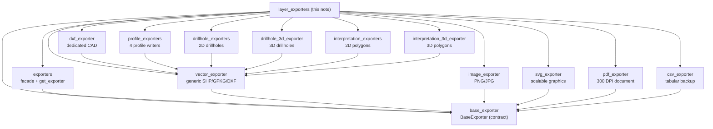

---
tags:
  - secinterp
  - code-walkthrough
  - layer
  - exporters
aliases:
  - layer_exporters
  - exporters layer
  - exporters (layer)
cssclass: secinterp-note
---

# `exporters/` layer — Profile result writing

> [!abstract] Navigation map
> The `exporters/` layer is the **"Write" side** of the plugin: it turns the
> already-computed profile data (topography, geology, structures, drillholes,
> interpretations) into real files — 2D/3D vectors, CSV, DXF, PNG/JPG, SVG and
> PDF — under the `BaseExporter` contract and the `get_exporter()` factory.

**Path**: `exporters/` (13 notes in this layer)
**Contract**: `BaseExporter` (see [[base_exporter]])
**Factory**: `get_exporter()` (see [[exporters]])
**Layer**: Exporters (GUI · QGIS-dependent, except `CSVExporter`)
**Tags**: #secinterp #code-walkthrough #layer #exporters

---

## 🎯 Why does this layer exist?

The core computes (Compute) and the GUI extracts (Extract). A third verb is
missing: **persist**. Without this layer, every dialog or service would write
files by hand, duplicating path validation, OGR driver choice and map
rendering:

| Problem | Solution in this layer |
|---------|------------------------|
| Each format validates paths and extensions its own way | `BaseExporter` pins the Template Method and validation |
| Consumers memorise internal paths of 12 writers | `exporters/__init__.py` re-exports and offers `get_exporter()` |
| Vector data needs an auditable tabular backup | `CSVExporter` accompanies every vector output from the handlers |
| The 2D profile must be seen in 3D and in CAD | Dedicated 3D writers plus `DXFExporter` with defensive validation |
| The preview must be frozen for reports | Render writers (image, SVG, PDF) over `QgsMapSettings` |

> [!important] Layer rule
> Writers **do not compute**: they receive already-projected data
> (`distance, elevation` coordinates or `PolygonZ`/`LineStringZ`) and only
> write. Computation lives in the core and per-entity orchestration in
> [[orchestrator]].

---

## 🧬 Layer mini-map

> [!tip] How to read
> [[exporters]] is the entry door (which writer to use) and [[base_exporter]]
> is the contract (how it must behave). Every concrete writer hangs off one of
> those two nodes.

---

## 📦 Layer members

| Note | Source | Role |
|---|---|---|
| [[exporters]] | `exporters/__init__.py` | Package facade: re-exports the 16 writers and offers `get_exporter()` by extension |
| [[base_exporter]] | `exporters/base_exporter.py` | Abstract `BaseExporter` contract: Template Method, path validation and settings access |
| [[csv_exporter]] | `exporters/csv_exporter.py` | Pure-stdlib tabular writer: `headers` + `rows` to UTF-8 CSV without touching QGIS |
| [[drillhole_3d_exporter]] | `exporters/drillhole_3d_exporter.py` | Drillholes to 3D (`LineStringZ` traces and intervals) with a `use_projected` switch |
| [[drillhole_exporters]] | `exporters/drillhole_exporters.py` | Drillholes in 2D profile coordinates (`distance, elevation`): traces with `hole_id`, intervals with `from_depth/to_depth/unit` |
| [[dxf_exporter]] | `exporters/dxf_exporter.py` | Dedicated CAD output: same OGR pipeline with defensive `_prepare_fields` and own logs |
| [[image_exporter]] | `exporters/image_exporter.py` | PNG/JPG raster via `QgsMapRendererCustomPainterJob` onto `QImage` with optional legend |
| [[interpretation_3d_exporter]] | `exporters/interpretation_3d_exporter.py` | Interpretation polygons as `PolygonZ` on the vertical plane, with 2D QML style and rule-based 3D renderer |
| [[interpretation_exporters]] | `exporters/interpretation_exporters.py` | 2D interpretation polygons as `Polygon` with 5 fixed fields plus custom columns |
| [[pdf_exporter]] | `exporters/pdf_exporter.py` | PDF document at 300 DPI over `QPdfWriter` with custom page size, zero margins and optional legend |
| [[profile_exporters]] | `exporters/profile_exporters.py` | Four 2D profile writers: topographic line, geological segments, structural ticks and axes |
| [[svg_exporter]] | `exporters/svg_exporter.py` | Scalable SVG graphics via `QSvgGenerator` with translatable title/description and optional legend |
| [[vector_exporter]] | `exporters/vector_exporter.py` | Generic SHP/GPKG/DXF vector writer via `QgsVectorFileWriter` with types inferred from the first feature |

---

## 🧭 Tour by group

### Contract and facade

Everything starts at [[base_exporter]]: `export()` and
`get_supported_extensions()` pin the shape each format must satisfy, while
safe path validation and settings access keep every writer from reinventing
the same. [[exporters]] completes the pair as the single import point: it
re-exports the 16 writer classes and resolves a class by extension with
`get_exporter()`, so the GUI asks for a writer by file name, not by module
path.

### 2D profile vectors

[[vector_exporter]] is the generic engine: it turns lists of
`{geometry, attributes}` into real OGR layers with correct CRS and fields.
Specialised on top of it are [[profile_exporters]] (the four profile writers
in `distance, elevation` coordinates), [[drillhole_exporters]] (drillhole
traces and intervals on the same plane) and [[interpretation_exporters]]
(polygons with 5 fixed fields plus custom attributes). [[dxf_exporter]]
reuses the same pipeline with stricter input validation for CAD exchange.

### The 3D jump

[[drillhole_3d_exporter]] and [[interpretation_3d_exporter]] move the 2D
section into the real world: traces and intervals as `LineStringZ` and
polygons as `PolygonZ` on the section's vertical plane. The interpretation
one additionally ships the categorised 2D QML style and the rule-based 3D
renderer, closing the loop between 2D digitising and 3D visualisation.

### Render outputs for reports

[[image_exporter]], [[svg_exporter]] and [[pdf_exporter]] freeze the preview
`QgsMapSettings` with the same engine (`QgsMapRendererCustomPainterJob`) on
three different canvases: `QImage` for raster, `QSvgGenerator` for editable
vectors and `QPdfWriter` at 300 DPI for the printable document. All three
share the optional legend and translatable titles where applicable.

### Tabular backup

[[csv_exporter]] is the only 100 % QGIS-agnostic writer (just `csv` +
`pathlib`): it writes `headers` + `rows` in UTF-8 as the readable, auditable
representation accompanying every vector file the handlers produce.

---

## 🔄 Data flow

| Phase | Actor | Input → Output |
|------|-------|----------------|
| Compute | [[controller]] | QGIS layers → unified profile result tuple |
| Orchestration | [[orchestrator]] | Results + options → per-entity delegation to handlers |
| Vector/tabular writing | 2D/3D writers + CSV | DTOs and geometries → SHP/GPKG/DXF/CSV on disk |
| Image writing | [[dialog_export_manager]] + render writers | `QgsMapSettings` → PNG/JPG/SVG/PDF |

The typical path is: the dialog asks the controller for data, the export
service decides which entities to write and in which format, and each writer
persists its share. For the profile image, the dialog's export manager
resolves the writer with `get_exporter()` from the chosen extension and
renders the current map settings.

> [!note] Where each decision lives
> **What** gets exported is decided by [[orchestrator]]; **with which class**
> is resolved by [[exporters]]; **how** it is written is implemented by each
> writer under the [[base_exporter]] contract; **when** the GUI fires it is
> coordinated by [[dialog_export_manager]].

---

## 🏛️ Layer patterns

| Pattern | Where | Purpose |
|---------|-------|---------|
| **Template Method** | [[base_exporter]] | Pin common `export` and validation, delegate the writing |
| **Facade + Factory** | [[exporters]] | One import and extension-based resolution (`get_exporter`) |
| **Strategy per format** | Each writer | Swap raster, vector, CAD and document outputs without changing callers |
| **Extract-then-Compute-then-Write** | Whole layer | Core computes, orchestrator delegates, writer persists |

---

## 🔗 Related notes

- [[Index]] — vault index
- [[orchestrator]] — orchestrates per-entity CSV/vector writing and delegates to handlers
- [[controller]] — produces the unified result tuple the writers persist
- [[dialog_export_manager]] — fires image and data export from the GUI

---

*Note of the SecInterp Code Walkthrough v2 vault — v3.9.0*
