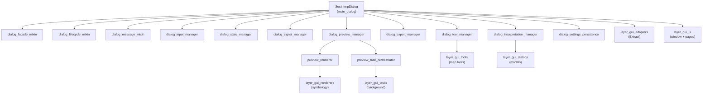

---
tags:
  - secinterp
  - code-walkthrough
  - layer
  - gui
aliases:
  - gui/
  - GUI layer
  - layer/gui
cssclass: secinterp-note
---

# 🖥️ GUI Layer — composition, managers and preview

> [!abstract] Purpose
> Hub note (MOC) for the **GUI layer**: the main `SecInterpDialog`, its
> specialized managers, the lifecycle and facade mixins, and the whole preview
> pipeline (cache, tasks, layer factory, rendering and legend). It is the
> **Extract + Present** side of the architecture: the GUI extracts decoupled
> DTOs from QGIS and presents the core's results.

**Scope**: `gui/` — dialog, managers, mixins, preview and utilities (31 notes)
**Sub-hubs**: 6 (`adapters`, `renderers`, `tasks`, `tools`, `ui`, `dialogs`)
**Layer**: GUI (depends on QGIS; the core never depends on it)
**Tags**: #secinterp #code-walkthrough #layer #gui

---

## 🧭 Layer map

> [!tip] How to read
> `SecInterpDialog` is the **composition root**: it holds no logic itself, it
> only wires managers. Each arrow is a delegation (`_init_managers`). The
> preview hangs off `dialog_preview_manager`, which in turn owns the renderer
> and the task orchestrator.

---

## 📦 Members

| Note | Source | Role |
|---|---|---|
| [[gui]] | `gui/` (package, 37 lines) | Public facade + `Pages` dependency container |
| [[main_dialog]] | `gui/main_dialog.py` (193 lines) | Composition root: combines mixins and wires 9 managers |
| [[main_dialog_config]] | `gui/main_dialog_config.py` (195 lines) | Dialog constants, defaults and i18n messages |
| [[dialog_export_manager]] | `gui/dialog_export_manager.py` (218 lines) | Dialog outputs: preview image + SHP/CSV data |
| [[dialog_facade_mixin]] | `gui/dialog_facade_mixin.py` (166 lines) | Stable public API as thin proxies to managers |
| [[dialog_input_manager]] | `gui/dialog_input_manager.py` (200 lines) | Aggregates pages into `ValidationParams`; `can_preview`/`can_export` gates |
| [[dialog_interpretation_manager]] | `gui/dialog_interpretation_manager.py` (107 lines) | Polygon flow: inheritance → properties → persist → refresh |
| [[dialog_settings_persistence]] | `gui/dialog_settings_persistence.py` (198 lines) | Three-level persistence: project, `ConfigService`, layer resolution |
| [[dialog_lifecycle_mixin]] | `gui/dialog_lifecycle_mixin.py` (77 lines) | Deterministic 4-phase cleanup + auto-save on close |
| [[dialog_message_mixin]] | `gui/dialog_message_mixin.py` (78 lines) | QGIS message bar + centralized errors (`SecInterpError` vs the rest) |
| [[dialog_preview_manager]] | `gui/dialog_preview_manager.py` (244 lines) | Preview owner: validates, generates, hash-caches, delegates heavy work |
| [[dialog_signal_manager]] | `gui/dialog_signal_manager.py` (354 lines) | Signal hub in 4 idempotent, leak-free groups |
| [[dialog_state_manager]] | `gui/dialog_state_manager.py` (117 lines) | Orchestrates visual state, persistence and its own wiring |
| [[dialog_tool_manager]] | `gui/dialog_tool_manager.py` (203 lines) | Canvas tools (pan/measure/interpret) + wheel zoom |
| [[interpretation_inheritance_mixin]] | `gui/interpretation_inheritance_mixin.py` (190 lines) | Inherits attributes from the nearest segment or interval |
| [[interpretation_persistence_mixin]] | `gui/interpretation_persistence_mixin.py` (177 lines) | Persists to project JSON or an external vector layer |
| [[layer_notification_manager]] | `gui/layer_notification_manager.py` (73 lines) | Invalidates `DataCache` buckets on `dataChanged` (real note, not a hub) |
| [[legend_widget]] | `gui/legend_widget.py` (81 lines) | Legend overlay on the canvas, never stealing the mouse |
| [[main_dialog_utils]] | `gui/main_dialog_utils.py` (50 lines) | Static QGIS-entity helpers for the facade |
| [[preview_axes_manager]] | `gui/preview_axes_manager.py` (204 lines) | Preview grid and labels with "nice" 1-2-5 intervals |
| [[preview_callbacks_mixin]] | `gui/preview_callbacks_mixin.py` (127 lines) | Receives async `QgsTask` signals and re-renders |
| [[preview_layer_factory]] | `gui/preview_layer_factory.py` (471 lines) | Turns each `PreviewResult` branch into styled memory layers |
| [[preview_legend_renderer]] | `gui/preview_legend_renderer.py` (178 lines) | Paints the legend on a `QPainter`, auto-sized |
| [[preview_param_hasher]] | `gui/preview_param_hasher.py` (133 lines) | Stable SHA-256 hash of `PreviewParams` for caching |
| [[preview_render_mixin]] | `gui/preview_render_mixin.py` (129 lines) | Render pipeline: LOD + vertical exaggeration + zoom debounce |
| [[preview_renderer]] | `gui/preview_renderer.py` (315 lines) | Canvas render orchestrator + leak-free cleanup |
| [[preview_reporter]] | `gui/preview_reporter.py` (181 lines) | Formats the `PreviewResult` into the dialog results text |
| [[preview_state]] | `gui/preview_state.py` (57 lines) | Shared `PreviewCache` + `RenderState` containers |
| [[preview_task_orchestrator]] | `gui/preview_task_orchestrator.py` (158 lines) | Owner of the geology and drillhole `QgsTask`s |
| [[ui_status_manager]] | `gui/ui_status_manager.py` (221 lines) | Visual state: validity icons, buttons, checkboxes; CRS warnings |
| [[gui_utils_py]] | `gui/utils.py` (76 lines) | Cross-cutting `create_memory_layer` + `show_user_message` |

> [!note] A real note among the members
> [[layer_notification_manager]] is a **file note** (not a hub): it is linked
> here as a member because it lives in `gui/` and drives core cache
> invalidation, but its content describes a single module.

---

## 🗂️ Layer sub-hubs

| Hub | Package | Role |
|---|---|---|
| [[layer_gui_adapters]] | `gui/adapters/` | Extract phase: live QGIS → decoupled DTOs |
| [[layer_gui_renderers]] | `gui/renderers/` | Present side: QGIS symbology over extracted layers |
| [[layer_gui_tasks]] | `gui/tasks/` | Background `QgsTask`s for geology and drillholes |
| [[layer_gui_tools]] | `gui/tools/` | Interactive map tools of the profile canvas |
| [[layer_gui_ui]] | `gui/ui/` | Main window, sidebar and settings pages |
| [[layer_gui_dialogs]] | `gui/dialogs/` | Modal dialogs (interpretation properties) |

---

## 🧩 Families inside the layer

### Dialog composition

[[main_dialog]] holds no business logic: it inherits three mixins
([[dialog_facade_mixin]], [[dialog_lifecycle_mixin]], [[dialog_message_mixin]])
and builds the nine managers in `_init_managers`. [[main_dialog_config]]
provides the constants and [[main_dialog_utils]] isolates `QgsProject` access
so the facade never calls it directly.

### State and signal managers

[[dialog_input_manager]] aggregates the six pages into a flat dictionary or a
`ValidationParams` and exposes `can_preview()` / `can_export()` as UI gates.
[[dialog_state_manager]] delegates visuals to [[ui_status_manager]] and
persistence to [[dialog_settings_persistence]], while
[[dialog_signal_manager]] concentrates wiring in four idempotent groups with
surgical disconnection.

### The preview pipeline

[[dialog_preview_manager]] validates inputs, generates the `PreviewResult`
through the core `PreviewService`, and caches it by the hash of
[[preview_param_hasher]]. Heavy work runs in [[preview_task_orchestrator]]
(`QgsTask`), whose results are collected by [[preview_callbacks_mixin]];
drawing is done by [[preview_render_mixin]] + [[preview_renderer]] with layers
from [[preview_layer_factory]], grid from [[preview_axes_manager]], legend
from [[preview_legend_renderer]] / [[legend_widget]], and the report from
[[preview_reporter]]. Shared state lives in [[preview_state]].

### Interpretations and outputs

[[dialog_interpretation_manager]] combines [[interpretation_inheritance_mixin]]
and [[interpretation_persistence_mixin]] with the finish flow (properties
dialog → append → persist → refresh). [[dialog_export_manager]] holds both
outputs (image + data) and [[dialog_tool_manager]] owns the canvas tools.
[[layer_notification_manager]] closes the loop by invalidating the core cache
when a layer changes.

---

## 🔄 Data flow

| Phase | Who | Input → Output |
|---|---|---|
| Configure | [[layer_gui_ui]] pages | widgets → `get_data()` / `dump()` |
| Aggregate | [[dialog_input_manager]] | six pages → `ValidationParams` |
| Extract | [[layer_gui_adapters]] | QGIS layers → decoupled contexts |
| Compute | core (`PreviewService`, etc.) | contexts → `PreviewResult` (in `QgsTask`) |
| Present | [[preview_renderer]] + preview family | `PreviewResult` → memory layers + canvas |
| Export | [[dialog_export_manager]] | preview / data → PNG, PDF, SVG, SHP, CSV |

The layer rule is **Extract-then-Compute**: no live QGIS object crosses into
the core or the background threads; only WKT, dicts and DTOs travel.

---

## 🏛️ Design patterns

| Pattern | Where | Purpose |
|---|---|---|
| **Composition root** | [[main_dialog]] | Wiring managers with injected dependencies |
| **Facade** | [[dialog_facade_mixin]] | Stable public API over internal managers |
| **Mixin** | lifecycle, message, render, callbacks | Horizontal composition without deep inheritance |
| **Hash-based cache-aside** | [[preview_param_hasher]] + preview manager | Skipping preview regeneration when nothing changed |
| **Observer (signals)** | [[dialog_signal_manager]] | Centralized, idempotent wiring |
| **Factory** | [[preview_layer_factory]] | `PreviewResult` → styled memory layers |

---

## 🔗 Related notes

- [[Index]] — vault index
- [[layer_gui_adapters]] — Extract: from QGIS to DTOs
- [[layer_gui_renderers]] — preview symbology
- [[layer_gui_tasks]] — background `QgsTask` tasks
- [[layer_gui_tools]] — canvas map tools
- [[layer_gui_ui]] — window, sidebar and pages
- [[layer_gui_dialogs]] — modal dialogs
- [[gui]] — `gui/` root package note
- [[main_dialog]] — dialog composition root

---

*Note of the SecInterp Code Walkthrough v2 vault — v3.9.1*
