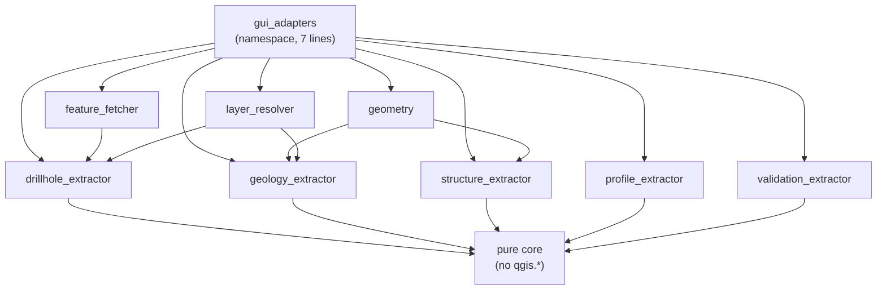

---
tags:
  - secinterp
  - code-walkthrough
  - layer
  - gui
aliases:
  - gui/adapters/
  - Extract adapters
  - layer/gui/adapters
cssclass: secinterp-note
---

# 🔌 GUI/Adapters Layer — Extract phase (QGIS → DTOs)

> [!abstract] Purpose
> Hub note (MOC) for the `gui/adapters/` package: the **Extract** phase of the
> Extract-then-Compute pattern. Its eight extractors read live QGIS objects
> (layers, features, DEM) and return decoupled contexts and records
> (`DrillholeContext`, `GeologyContext`, `SectionContext`, `ProfileData`,
> `LayerMetadata`), so the core never imports `qgis.*`.

**Scope**: `gui/adapters/` — namespace + 8 extractor modules (9 notes)
**Layer**: GUI / Extract (the only place touching `QgsVectorLayer` and rasters)
**Sub-hub of**: [[layer_gui]]
**Tags**: #secinterp #code-walkthrough #layer #gui

---

## 🧭 Sub-hub map

> [!tip] How to read
> Arrows between extractors are **helper dependencies** (`feature_fetcher`
> serves the drillhole extractor; `geometry` serves geology and structures;
> `layer_resolver` resolves layers for everyone). Arrows toward the core are
> **DTO deliveries**, never QGIS objects.

---

## 📦 Members

| Note | Source | Role |
|---|---|---|
| [[gui_adapters]] | `gui/adapters/` (namespace, 7 lines) | States the bridge-package contract toward the core |
| [[drillhole_extractor]] | `gui/adapters/drillhole_extractor.py` (369 lines) | Drillholes: collars + surveys + intervals → `DrillholeContext` |
| [[feature_fetcher]] | `gui/adapters/feature_fetcher.py` (84 lines) | Single pass per child layer with `IN` expression; flat depth tuples |
| [[geology_extractor]] | `gui/adapters/geology_extractor.py` (235 lines) | Densifies, samples master profile, intersects → `GeologyContext` |
| [[geometry]] | `gui/adapters/geometry.py` (226 lines) | QGIS toolkit: densification, vertices, ranges, DEM sampling |
| [[layer_resolver]] | `gui/adapters/layer_resolver.py` (113 lines) | ID/name/object → `QgsMapLayer` with class-level cache (real note) |
| [[profile_extractor]] | `gui/adapters/profile_extractor.py` (86 lines) | Samples the DEM along the section → `ProfileData` + LOD interval |
| [[structure_extractor]] | `gui/adapters/structure_extractor.py` (226 lines) | Buffer-filters and detaches to `SectionContext` + elevations |
| [[validation_extractor]] | `gui/adapters/validation_extractor.py` (176 lines) | Layers → `LayerMetadata` + pure `ValidationParams` for the validator |

> [!note] A real note among the members
> [[layer_resolver]] is a **file note** (not a hub): it is linked as a member
> because it resolves the layers the extractors consume, but it describes a
> single module with its class-level cache.

---

## 👀 Member walkthrough

### [[gui_adapters]] — the package contract

Its 7-line `__init__.py` holds no re-exports: it states the package
**intent** (bridge between live QGIS objects and the agnostic core). It is the
conceptual entry gate; the eight sibling extractors live in their own notes
and are linked from here.

### [[drillhole_extractor]] — the big extractor

Reads the section line and the three drillhole layers (collars, surveys,
intervals) and returns a fully detached `DrillholeContext`. It delegates child
reading to [[feature_fetcher]] and layer resolution to [[layer_resolver]]:
it is the largest extractor (369 lines) because it coordinates three
heterogeneous sources.

### [[feature_fetcher]] — one pass per layer

Minimalist `DataFetcher` (84 lines): reads surveys and intervals in a single
pass per layer with an `IN` expression and returns flat depth-ordered tuples.
Thanks to it, the core never sees a `QgsFeatureRequest`.

### [[geology_extractor]] — densify, sample, intersect

Densifies the section line over the DEM, samples the master topographic
profile, and intersects the line with outcrop polygons to return a detached
`GeologyContext` to `GeologyService`. It uses the [[geometry]] toolkit for
densification and sampling.

### [[geometry]] — the toolkit that fled the core

Stateless QGIS functions (`QgsDistanceArea`, densification, vertices, ranges,
DEM sampling) that used to live in `core/utils` and were moved here precisely
to keep the core QGIS-agnostic. Shared by [[geology_extractor]] and
[[structure_extractor]].

### [[layer_resolver]] — centralized resolution

Converts ID, name or object references into valid `QgsMapLayer`s via
`QgsProject`, with a class-level singleton cache. Stops every dialog from
repeating `mapLayer` / `mapLayersByName` logic.

### [[profile_extractor]] — pure topography

`ProfileExtractor` (86 lines) samples DEM elevations along the section and
returns `ProfileData` (rounded `list[(distance, elevation)]`), plus the LOD
interval computation the preview uses for decimation.

### [[structure_extractor]] — buffer and detach

Reads the section line and the measurement layer, buffer-filters, detaches
points and attributes to primitives (`SectionContext`), and samples DEM
elevations, so `StructureService` never touches QGIS.

### [[validation_extractor]] — validating without QGIS

Functions only, no classes: converts references and layers into detached
`LayerMetadata` records and builds pure `ValidationParams`, so the core
`ProjectValidator` validates without importing QGIS.

---

## 🔄 Data flow

| Phase | Who | Input → Output |
|---|---|---|
| Resolve | [[layer_resolver]] | ID / name / object → valid `QgsMapLayer` |
| Read children | [[feature_fetcher]] | survey/interval layers → flat tuples |
| Sample | [[geometry]] + [[profile_extractor]] | DEM + line → `ProfileData` / elevations |
| Extract | [[drillhole_extractor]], [[geology_extractor]], [[structure_extractor]], [[validation_extractor]] | layers + profile → decoupled contexts |
| Compute | core | contexts → segments, structures, preview |

Everything crossing into the core is primitives, WKT and DTOs. Extractors
always run on the **main thread** (live QGIS objects are not thread-safe);
only the resulting DTOs travel to the [[layer_gui_tasks]] `QgsTask`s.

---

## 🏛️ Design patterns

| Pattern | Where | Purpose |
|---|---|---|
| **Adapter (Extract)** | the four extractors | Live QGIS → pure DTOs |
| **Read facade** | [[feature_fetcher]] | Single pass per child layer |
| **Singleton (cache)** | [[layer_resolver]] | Resolving layers without repeating `QgsProject` |
| **Pure helper functions** | [[geometry]], [[validation_extractor]] | Stateless toolkit, testable without QGIS |

---

## 🔗 Related notes

- [[Index]] — vault index
- [[layer_gui]] — parent hub of the whole GUI layer
- [[layer_gui_tasks]] — the `QgsTask`s consuming these DTOs
- [[layer_gui_ui_pages_drillhole]] — tabs configuring the drillhole layers
- [[gui_adapters]] — package namespace note
- [[drillhole_extractor]] / [[geology_extractor]] / [[structure_extractor]] — the three big extractors
- [[layer_resolver]] — centralized layer resolution

---

*Note of the SecInterp Code Walkthrough v2 vault — v3.8.0*
