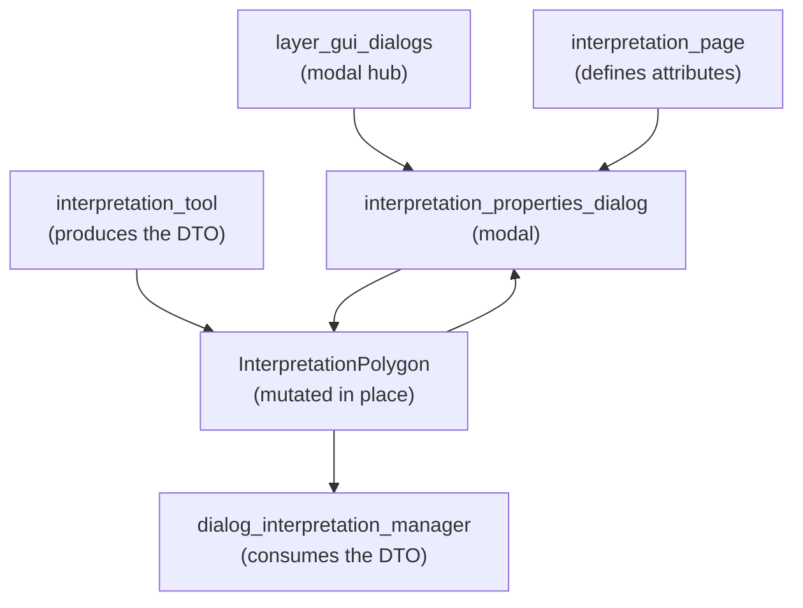

---
tags:
  - secinterp
  - code-walkthrough
  - layer
  - gui
aliases:
  - gui/dialogs/
  - modal dialogs
  - layer/gui/dialogs
cssclass: secinterp-note
---

# 💬 GUI/Dialogs Layer — modal dialogs

> [!abstract] Purpose
> Hub note (MOC) for the `gui/dialogs/` package: the plugin's modal dialogs.
> Today it holds the interpretation properties dialog — editing the name,
> type, color and attributes of a freshly digitized polygon by mutating the
> DTO in place — and links its producer and consumer as related notes.

**Scope**: `gui/dialogs/` — 1 modal dialog + 2 related notes
**Layer**: GUI / Interaction (programmatic modal, no `.ui`, no leaks)
**Sub-hub of**: [[layer_gui]]
**Tags**: #secinterp #code-walkthrough #layer #gui

---

## 🧭 Sub-hub map

> [!tip] How to read
> The DTO is born in the map tool ([[layer_gui_tools]]), the modal edits it
> **in place** (no copies, no returns), and the manager persists it. The
> interpretation page provides the custom attributes the dialog offers.
> It is the flow's only synchronous point: everything else is async.

---

## 📦 Members

| Note | Source | Role |
|---|---|---|
| [[interpretation_properties_dialog]] | `gui/dialogs/interpretation_properties_dialog.py` (149 lines) | Modal editing name, type, color and attributes, mutating the DTO in place |

---

## 🧷 Related notes (producer and consumer)

| Note | Role in the flow |
|---|---|
| [[dialog_interpretation_manager]] | Orchestrates the full flow: inheritance → this dialog → append → persist → refresh |
| [[interpretation_page]] | Defines the store source and custom attributes the dialog edits |

---

## 👀 The full polygon flow

### Digitize → [[interpretation_tool]]

The user digitizes vertices on the profile canvas with snapping and a rubber
band. On finalize, the tool emits a domain `InterpretationPolygon` with
geometry and pending inherited attributes (see [[layer_gui_tools]] and
[[interpretation_inheritance_mixin]] in [[layer_gui]]).

### Edit → [[interpretation_properties_dialog]]

The manager opens this modal **before** appending the polygon: name, type,
color and custom attributes (those defined by [[interpretation_page]]). The
dialog mutates the DTO in place and on close disconnects its signals to leave
no leaks — it returns nothing, it copies nothing.

### Persist → [[dialog_interpretation_manager]]

Back in the manager: the edited polygon joins the collection, is persisted
(project JSON or external layer via [[interpretation_persistence_mixin]]),
and the preview refreshes. If the user cancels the modal, the polygon is
discarded with no side effects.

---

## 🔄 Data flow

| Phase | Who | Input → Output |
|---|---|---|
| Digitize | `interpretation_tool` ([[layer_gui_tools]]) | gesture → `InterpretationPolygon` |
| Inherit | `interpretation_inheritance_mixin` | nearest segment/interval → attributes |
| Edit | [[interpretation_properties_dialog]] | DTO → mutated DTO (or discard on cancel) |
| Persist | [[dialog_interpretation_manager]] | DTO → project JSON / external layer |
| Refresh | preview ([[layer_gui]]) | collection → updated canvas |

The modal is the flow's only synchronous point: everything else (extraction,
tasks, rendering) is async or deferred. That is why it lives in its own
package: it marks the boundary between interactive capture and persistence.

---

## 🏛️ Design patterns

| Pattern | Where | Purpose |
|---|---|---|
| **Modal editor** | [[interpretation_properties_dialog]] | Blocking edit before confirm |
| **In-place mutation** | shared DTO | No copies, no return values |
| **Disconnect on close** | dialog signals | Zero leaks across repeated openings |
| **Coordinator** | [[dialog_interpretation_manager]] | The dialog never persists; the manager does |

---

## ➕ How to add a new modal

For a second dialog in the package without breaking the scheme:

1. Build it programmatically (no `.ui`), like [[interpretation_properties_dialog]].
2. Take the DTO and mutate it in place; no complex returns.
3. Disconnect signals on close to avoid accumulated leaks.
4. Leave persistence to the coordinating manager, never the modal.
5. Register the hub here as a new member-table row.

---

## 🔗 Related notes

- [[Index]] — vault index
- [[layer_gui]] — parent hub of the whole GUI layer
- [[interpretation_properties_dialog]] — the properties modal
- [[dialog_interpretation_manager]] — flow coordinator
- [[interpretation_page]] — editable custom attributes
- [[layer_gui_tools]] — the map tool producing the DTO
- [[interpretation_inheritance_mixin]] — inheritance before the dialog
- [[interpretation_persistence_mixin]] — persistence after the dialog

---

*Note of the SecInterp Code Walkthrough v2 vault — v3.9.0*
