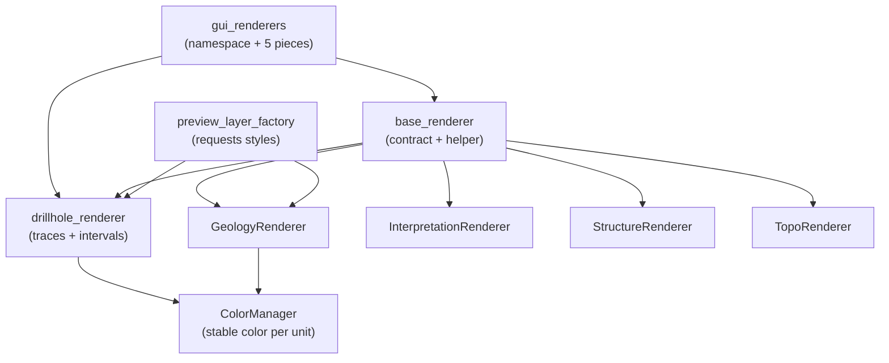

---
tags:
  - secinterp
  - code-walkthrough
  - layer
  - gui
aliases:
  - gui/renderers/
  - preview renderers
  - layer/gui/renderers
cssclass: secinterp-note
---

# 🎨 GUI/Renderers Layer — preview symbology

> [!abstract] Purpose
> Hub note (MOC) for the `gui/renderers/` package: the **Present** side of the
> architecture. Its renderers apply QGIS symbology onto already-extracted
> memory layers (drillhole traces, lithology intervals, geology, structures,
> topography) without ever touching the Extract phase or the core.

**Scope**: `gui/renderers/` — namespace + Present pieces (3 notes with own note)
**Layer**: GUI / Present (only symbology `qgis.core`, no geological logic)
**Sub-hub of**: [[layer_gui]]
**Tags**: #secinterp #code-walkthrough #layer #gui

---

## 🧭 Sub-hub map

> [!tip] How to read
> `base_renderer` is the **polymorphic base**: every renderer inherits
> `apply_style()`. `preview_layer_factory` (documented under [[layer_gui]])
> consumes these styles when building memory layers. `ColorManager` guarantees
> that one geological unit always paints in the same color.

---

## 📦 Members

| Note | Source | Role |
|---|---|---|
| [[gui_renderers]] | `gui/renderers/` (6 files, 170 lines) | Namespace + the five Present pieces with `ColorManager` |
| [[base_renderer]] | `gui/renderers/base_renderer.py` (60 lines) | `apply_style()` contract + categorized-line helper |
| [[drillhole_renderer]] | `gui/renderers/drillhole_renderer.py` (71 lines) | Labeled gray traces + unit-categorized intervals |

---

## 👀 Member walkthrough

### [[gui_renderers]] — the namespace and its five pieces

The `__init__.py` is empty (0 lines): the package is a pure grouper. The note
documents the set — `ColorManager` (stable color per geological unit),
`GeologyRenderer`, `InterpretationRenderer`, `StructureRenderer` and
`TopoRenderer` — applying QGIS symbology onto already-extracted layers. Of
these, `base_renderer` and `drillhole_renderer` have their own notes (this
hub's members); the rest is described inside the group note.

### [[base_renderer]] — the polymorphic contract

Defines `BasePreviewRenderer.apply_style()` and the
`build_categorized_line_style()` helper: the base on which all five renderers
apply symbology without duplicating code. It is the only coupling allowed
toward style `qgis.core` (`QgsCategorizedSymbolRenderer`, `QgsLineSymbol`):
a symbology API change is absorbed here exactly once.

### [[drillhole_renderer]] — a dual role on the hole

Paints drillhole traces as thin gray lines labeled with `hole_id`, plus
lithological intervals categorized by unit with the stable `ColorManager`
colors. It carries the most visual logic in the package because it combines
two different symbologies over the same hole.

---

## 🔄 Data flow

| Phase | Who | Input → Output |
|---|---|---|
| Build | `preview_layer_factory` ([[layer_gui]]) | `PreviewResult` branch → memory layer |
| Style | concrete renderer (`apply_style()`) | layer + `ColorManager` colors → applied symbology |
| Register | [[preview_renderer]] | styled layers → project (no legend) + canvas |

Renderers never read project layers nor query the core: they receive the
already-built memory layer and only apply symbols and labels. That is why
they are **pure Present** and are tested with synthetic layers.

---

## 🏛️ Design patterns

| Pattern | Where | Purpose |
|---|---|---|
| **Template Method** | [[base_renderer]] (`apply_style`) | Shared skeleton, per-renderer detail |
| **Helper / Builder** | `build_categorized_line_style()` | Categorized symbology without repetition |
| **Color registry** | `ColorManager` | Visual stability across sessions and branches |

---

## ➕ How to add a new renderer

To cover a new `PreviewResult` branch without breaking what exists:

1. Subclass `BasePreviewRenderer` ([[base_renderer]]) and implement `apply_style()`.
2. Reuse `build_categorized_line_style()` when the symbology is categorized.
3. Ask `ColorManager` for colors instead of hardcoding RGB.
4. Register the renderer in the factory (`preview_layer_factory`, see [[layer_gui]]).
5. Test with a synthetic memory layer: renderers need no project.

> [!warning] Layer rule
> A renderer never reads `QgsProject` nor calls the core: it receives the
> already-built layer and returns the same layer styled. If you need new data,
> it belongs in the factory or in a [[layer_gui_adapters]] extractor, not here.

---

## 🔗 Related notes

- [[Index]] — vault index
- [[layer_gui]] — parent hub of the whole GUI layer
- [[gui_renderers]] — package note and its five pieces
- [[base_renderer]] — base style contract
- [[drillhole_renderer]] — drillhole styles
- [[preview_renderer]] — consumer pushing layers to the canvas
- [[preview_layer_factory]] — factory requesting these styles

---

*Note of the SecInterp Code Walkthrough v2 vault — v3.8.0*
