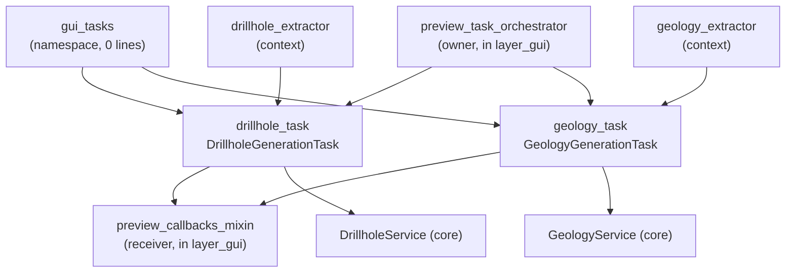

---
tags:
  - secinterp
  - code-walkthrough
  - layer
  - gui
aliases:
  - gui/tasks/
  - QgsTask workers
  - layer/gui/tasks
cssclass: secinterp-note
---

# ⚙️ GUI/Tasks Layer — background generation

> [!abstract] Purpose
> Hub note (MOC) for the `gui/tasks/` package: the two `QgsTask`s running the
> core's pure services on background threads, taking only decoupled DTOs and
> returning results via signal to the main thread, never touching live QGIS
> objects in the worker.

**Scope**: `gui/tasks/` — namespace + 2 background tasks (3 notes)
**Layer**: GUI / Background (thread boundary: DTOs in, signals out)
**Sub-hub of**: [[layer_gui]]
**Tags**: #secinterp #code-walkthrough #layer #gui

---

## 🧭 Sub-hub map

> [!tip] How to read
> The orchestrator ([[preview_task_orchestrator]], in [[layer_gui]]) extracts
> contexts on the main thread and launches each task; the task runs the core
> service in the background and emits the result; the callbacks
> ([[preview_callbacks_mixin]]) collect it and re-render. Tasks are the
> thread-safe bridge between both.

---

## 📦 Members

| Note | Source | Role |
|---|---|---|
| [[gui_tasks]] | `gui/tasks/` (namespace, 0 lines) | Groups the two background tasks with their own notes |
| [[drillhole_task]] | `gui/tasks/drillhole_task.py` (107 lines) | Projects drillholes in background with `DrillholeContext` + service |
| [[geology_task]] | `gui/tasks/geology_task.py` (101 lines) | Builds geological segments in background with `GeologyContext` |

---

## 👀 Member walkthrough

### [[gui_tasks]] — the empty namespace

Its `__init__.py` is 0 lines: the package exists only to group. The note
documents the set's role — running the core's pure services on `QgsTask`
threads taking only detached DTOs and returning results by signal — and links
the two sibling tasks with their own notes.

### [[drillhole_task]] — drillholes in background

Cancelable `QgsTask` projecting drillholes with detached DTOs
(`DrillholeContext` + `DrillholeService`), deferred result emission to the
main thread, and never touching live QGIS objects in the worker. The context
is extracted before launch, on the main thread, via [[drillhole_extractor]].

### [[geology_task]] — geology in background

Cancelable `QgsTask` building geological segments (`GeologyContext` +
`GeologyService.build_segments()`), with deferred delivery to the main thread
and a worker free of live QGIS objects. Symmetric to the drillhole one: same
extract → launch → emit → collect cycle.

---

## 🔄 Data flow

| Phase | Who | Input → Output |
|---|---|---|
| Extract (main thread) | [[layer_gui_adapters]] extractors | QGIS layers → decoupled context |
| Launch | [[preview_task_orchestrator]] | context + service → running `QgsTask` |
| Compute (background) | [[drillhole_task]] / [[geology_task]] | context → pure result (+ `feedback`) |
| Collect (main thread) | [[preview_callbacks_mixin]] | signal → cache + re-render + report |

Cancellation is cooperative: the service polls `feedback.isCanceled()` and
the task emits partial results. The orchestrator anchors tasks so Qt6 never
collects them before they finish (see [[preview_task_orchestrator]]).

---

## 🏛️ Design patterns

| Pattern | Where | Purpose |
|---|---|---|
| **Background Task** | [[drillhole_task]], [[geology_task]] | Keeping the UI responsive during long computes |
| **Boundary DTO** | [[layer_gui_adapters]] contexts | Crossing threads without live QGIS objects |
| **Deferred signal** | emission to the main thread | Thread-safe result delivery |
| **Cooperative cancellation** | `feedback` | Aborting without control-flow exceptions |

---

## ➕ How to add a new task

To move another core service to the background without breaking the scheme:

1. Extract the decoupled context on the main thread (new or existing extractor).
2. Create the `QgsTask` following the [[geology_task]] mold: DTOs in, signals out.
3. Register launch and anchoring in [[preview_task_orchestrator]].
4. Collect the result in [[preview_callbacks_mixin]] (cache + re-render).

> [!warning] Thread rule
> The worker never touches `QgsVectorLayer`, canvas or widgets: only the
> context and the pure service. All QGIS access lives before `run()`
> (extraction) or after, in the signal slot (presentation).

---

## 🔗 Related notes

- [[Index]] — vault index
- [[layer_gui]] — parent hub of the whole GUI layer
- [[layer_gui_adapters]] — extractors producing the contexts
- [[gui_tasks]] — package namespace note
- [[drillhole_task]] — drillhole task
- [[geology_task]] — geology task
- [[preview_task_orchestrator]] — owner launching and anchoring tasks
- [[preview_callbacks_mixin]] — receiver caching and re-rendering

---

*Note of the SecInterp Code Walkthrough v2 vault — v3.9.0*
