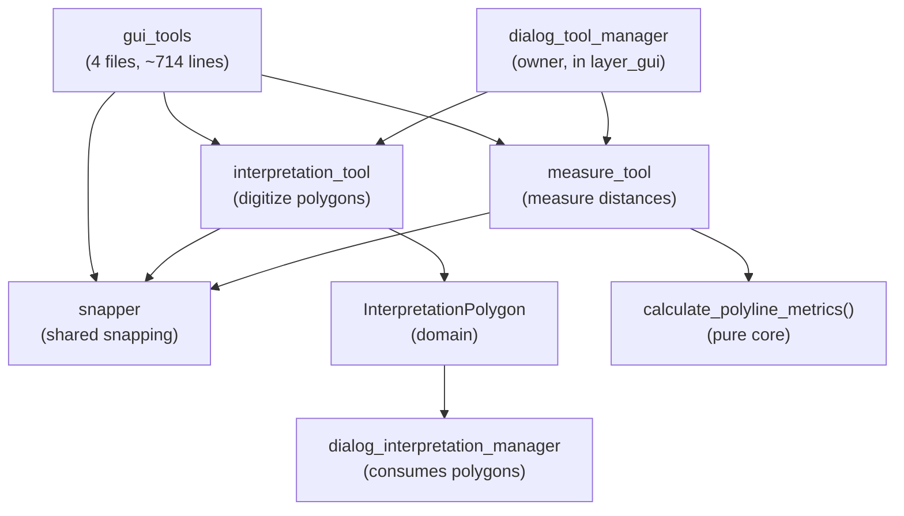

---
tags:
  - secinterp
  - code-walkthrough
  - layer
  - gui
aliases:
  - gui/tools/
  - profile map tools
  - layer/gui/tools
cssclass: secinterp-note
---

# 🧰 GUI/Tools Layer — profile-canvas map tools

> [!abstract] Purpose
> Hub note (MOC) for the `gui/tools/` package: the interactive `QgsMapTool`
> tools of the profile view — interpretation-polygon digitizing, distance
> measurement and the shared snapping helper — with no geological logic, only
> canvas interaction.

**Scope**: `gui/tools/` — package + 3 tools (4 notes)
**Layer**: GUI / Interaction (preview canvas, no Extract phase, no core)
**Sub-hub of**: [[layer_gui]]
**Tags**: #secinterp #code-walkthrough #layer #gui

---

## 🧭 Sub-hub map

> [!tip] How to read
> `snapper` is the **shared helper**: both tools use it to snap the mouse.
> `interpretation_tool` emits a domain DTO consumed by
> [[dialog_interpretation_manager]]; `measure_tool` delegates metrics to a
> pure core function. Both are owned by [[dialog_tool_manager]].

---

## 📦 Members

| Note | Source | Role |
|---|---|---|
| [[gui_tools]] | `gui/tools/` (4 files, ~714 lines) | `QgsMapTool` tools for the profile view, no geological logic |
| [[interpretation_tool]] | `gui/tools/interpretation_tool.py` (269 lines) | Digitizes polygons, emits a domain `InterpretationPolygon` |
| [[measure_tool]] | `gui/tools/measure_tool.py` (330 lines) | Multi-point polyline with pure-core metrics |
| [[snapper]] | `gui/tools/snapper.py` (112 lines) | Pixels → snapped `QgsPointXY` (12 px, `QgsPointLocator` cache) |

---

## 👀 Member walkthrough

### [[gui_tools]] — the interaction package

Documents the four-file set (~714 lines): interpretation-polygon drawing,
distance measurement and the snapping helper. Its implicit contract is
"canvas interaction only": no tool computes geology, each only captures
gestures and turns them into data.

### [[interpretation_tool]] — digitize and emit

Interactive map tool (`QgsMapToolEmitPoint`) for digitizing polygons on the
profile canvas: snapped vertices (via [[snapper]]), preview rubber band, and
emission of a domain `InterpretationPolygon` on finalize. That DTO is what
[[dialog_interpretation_manager]] inherits, persists and refreshes.

### [[measure_tool]] — measuring with the pure core

Multi-point map tool: snapped polyline, metrics computed by the core's pure
`calculate_polyline_metrics()`, and a lifecycle with a persistent finalized
measurement. A textbook GUI/core boundary: the tool captures points, the core
computes.

### [[snapper]] — the shared magnet

Geology-free helper: turns mouse pixels into `QgsPointXY` snapped to the
nearest vertex or edge (12 px tolerance) with a per-layer `QgsPointLocator`
cache. Stops every tool from reinventing snapping and keeps the tolerance in
a single tuning point.

---

## 🔄 Data flow

| Phase | Who | Input → Output |
|---|---|---|
| Activate | [[dialog_tool_manager]] | exclusive pan / measure / interpret switching |
| Capture | [[interpretation_tool]] / [[measure_tool]] | clicks + [[snapper]] → snapped vertices |
| Preview | rubber band | vertices → temporary canvas geometry |
| Finalize | `interpretation_tool` → DTO / `measure_tool` → metrics | gesture → `InterpretationPolygon` or persistent measurement |
| Consume | [[dialog_interpretation_manager]] | DTO → inheritance, properties, persistence |

Tools live and die with the preview canvas: on deactivation they clear their
rubber band and release the previous tool, a cycle orchestrated by
[[dialog_tool_manager]] with idempotent signal wiring.

---

## 🏛️ Design patterns

| Pattern | Where | Purpose |
|---|---|---|
| **MapTool (QGIS)** | [[interpretation_tool]], [[measure_tool]] | Native canvas interaction |
| **Shared helper** | [[snapper]] | One snapping implementation for all tools |
| **Output DTO** | `InterpretationPolygon` | Decoupling the gesture from its consumer |
| **Delegated pure function** | `calculate_polyline_metrics()` | Metrics testable without QGIS |

---

## 🧪 Testability

Tools are tested at two levels: [[snapper]] with synthetic canvases
(tolerance and locator cache without a real project) and the map tools with
simulated clicks asserting the emitted DTO or the computed metric. Geological
logic never lives here, so no test needs the core: mocked QGIS suffices
(see `tests/base_test.py`).

---

## 🔗 Related notes

- [[Index]] — vault index
- [[layer_gui]] — parent hub of the whole GUI layer
- [[gui_tools]] — tool package note
- [[interpretation_tool]] — polygon digitizing
- [[measure_tool]] — distance measurement
- [[snapper]] — shared snapping
- [[dialog_tool_manager]] — owner with exclusive switching
- [[dialog_interpretation_manager]] — polygon consumer
- [[layer_gui_dialogs]] — properties dialog after digitizing

---

*Note of the SecInterp Code Walkthrough v2 vault — v3.8.0*
