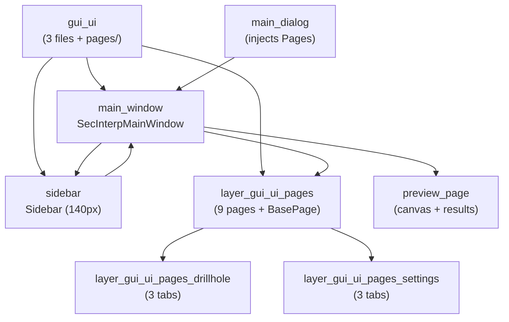

---
tags:
  - secinterp
  - code-walkthrough
  - layer
  - gui
aliases:
  - gui/ui/
  - main window
  - layer/gui/ui
cssclass: secinterp-note
---

# 🪟 GUI/UI Layer — main window and pages

> [!abstract] Purpose
> Hub note (MOC) for the `gui/ui/` package: the programmatic assembly of the
> main window — `SecInterpMainWindow` (dialog with `QSplitter` +
> `QStackedWidget`) and `Sidebar` (list navigation) — over the `pages/`
> settings pages (documented in their own sub-hub).

**Scope**: `gui/ui/` — window + sidebar + `pages/` package (3 notes + 1 sub-hub)
**Layer**: GUI / Presentation (all programmatic, no `.ui` files)
**Sub-hub of**: [[layer_gui]]
**Tags**: #secinterp #code-walkthrough #layer #gui

---

## 🧭 Sub-hub map

> [!tip] How to read
> `main_window` assembles three panes (sidebar, stacked pages, preview) in a
> `QSplitter`; `sidebar` turns rows into page indexes. Pages hang off the
> [[layer_gui_ui_pages]] sub-hub, and [[main_dialog]] injects the `Pages`
> container with all of them into the managers.

---

## 📦 Members

| Note | Source | Role |
|---|---|---|
| [[gui_ui]] | `gui/ui/` (3 files + `pages/`, ~228 lines) | Programmatic assembly: window + sidebar over `pages/` |
| [[main_window]] | `gui/ui/main_window.py` (158 lines) | `QDialog` with a three-pane `QSplitter` and premium stylesheet |
| [[sidebar]] | `gui/ui/sidebar.py` (63 lines) | 140px `QListWidget` turning rows into page indexes |

---

## 🗂️ Dependent sub-hub

| Hub | Package | Role |
|---|---|---|
| [[layer_gui_ui_pages]] | `gui/ui/pages/` | The 9 pages + `BasePage` protocol, with 2 tab sub-hubs |

---

## 👀 Member walkthrough

### [[gui_ui]] — the assembly package

Documents the set (3 files + `pages/` subpackage): the programmatic
`SecInterpMainWindow` window and `Sidebar` navigation over the pages. Its
value is architectural: it separates the **frame** (window, splitter,
navigation) from the **content** (pages), so adding a page never touches the
frame.

### [[main_window]] — three panes, zero `.ui`

`SecInterpMainWindow`: the programmatic `QDialog` assembling sidebar, seven
stacked pages and preview in a three-pane `QSplitter`, with a premium
stylesheet and `currentRowChanged` navigation. All layout is built in code
(the project's `ui-framework` standard), no Qt Designer involved.

### [[sidebar]] — rows that are indexes

`Sidebar`: a 140px `QListWidget` with QGIS-options-dialog looks turning rows
into page indexes for the main window's `QStackedWidget`. It is deliberately
dumb: it knows no pages, only integers.

---

## 🔄 Data flow

| Phase | Who | Input → Output |
|---|---|---|
| Assemble | [[main_window]] | sidebar + pages + preview → visible `QSplitter` |
| Navigate | [[sidebar]] | `currentRowChanged(row)` → `QStackedWidget` index |
| Read | pages ([[layer_gui_ui_pages]]) | widgets → per-page `get_data()` |
| Aggregate | [[dialog_input_manager]] | injected `Pages` → `ValidationParams` |
| Persist | `dump`/`load`/`reset` protocol | state ↔ QGIS project + `ConfigService` |

The window never reads values directly: it exposes the `Pages` container and
lets [[dialog_input_manager]] aggregate and [[dialog_settings_persistence]]
persist. The frame knows nothing about the domain.

---

## 🏛️ Design patterns

| Pattern | Where | Purpose |
|---|---|---|
| **Programmatic composite** | [[main_window]] | Assembling frame + content in code |
| **Index navigation** | [[sidebar]] → `QStackedWidget` | Decoupling the list from the pages |
| **Pages injection** | `dialog_dependencies.py` (see [[gui]]) | Managers receive only what they need |
| **Page protocol** | `BasePage` (see [[layer_gui_ui_pages]]) | Uniform `get_data/dump/load/reset/validate` |

---

## ➕ How to add a page

For an eighth page without touching the frame:

1. Create the page implementing the [[base_page]] protocol.
2. Register it in the [[main_window]] `QStackedWidget` with its menu entry.
3. Add the matching row in [[sidebar]] (same order, same index).
4. Expose it in the `Pages` container for [[dialog_input_manager]].
5. Document it as a [[layer_gui_ui_pages]] member.

---

## 🔗 Related notes

- [[Index]] — vault index
- [[layer_gui]] — parent hub of the whole GUI layer
- [[layer_gui_ui_pages]] — the 9 settings pages
- [[layer_gui_ui_pages_drillhole]] — drillhole tabs
- [[layer_gui_ui_pages_settings]] — settings tabs
- [[gui_ui]] — `gui/ui/` package note
- [[main_window]] — window assembly
- [[sidebar]] — list navigation
- [[main_dialog]] — root injecting `Pages` into managers

---

*Note of the SecInterp Code Walkthrough v2 vault — v3.8.0*
