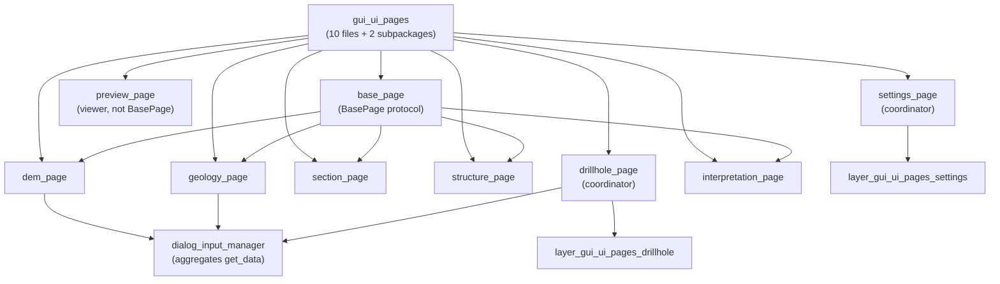

---
tags:
  - secinterp
  - code-walkthrough
  - layer
  - gui
aliases:
  - gui/ui/pages/
  - settings pages
  - layer/gui/ui/pages
cssclass: secinterp-note
---

# 📄 GUI/UI/Pages Layer — settings pages

> [!abstract] Purpose
> Hub note (MOC) for the `gui/ui/pages/` package: the namespace-registry of
> the programmatic settings pages and home of the shared `BasePage` protocol
> (`get_data` / `dump` / `load` / `reset` / `validate` + signals) every page
> implements for reading, persistence and validation.

**Scope**: `gui/ui/pages/` — namespace + 9 pages (~1346 lines, 10 notes)
**Layer**: GUI / Presentation (programmatic widgets, `BasePage` protocol)
**Sub-hub of**: [[layer_gui_ui]] · **Sub-hubs**: drillhole + settings
**Tags**: #secinterp #code-walkthrough #layer #gui

---

## 🧭 Sub-hub map

> [!tip] How to read
> `base_page` is the **contract**: every page (except the `preview_page`
> viewer) implements the same skeleton. The coordinators (`drillhole_page`,
> `settings_page`) aggregate tabs from their sub-hubs. [[dialog_input_manager]]
> only calls `get_data()` / `validate()`: it never touches widgets.

---

## 📦 Members

| Note | Source | Role |
|---|---|---|
| [[gui_ui_pages]] | `gui/ui/pages/` (10 files, ~1346 lines) | Namespace-registry + home of the `BasePage` protocol |
| [[base_page]] | `gui/ui/pages/base_page.py` (105 lines) | `get_data/dump/load/reset/validate/connect/disconnect` skeleton |
| [[dem_page]] | `gui/ui/pages/dem_page.py` (271 lines) | DEM raster: layer, band, resolution, vertical exaggeration |
| [[drillhole_page]] | `gui/ui/pages/drillhole_page.py` (130 lines) | Coordinator: Collars/Survey/Intervals `QTabWidget` toward the dialog |
| [[geology_page]] | `gui/ui/pages/geology_page.py` (120 lines) | Outcrops: polygon layer + unit field + `dataChanged` |
| [[interpretation_page]] | `gui/ui/pages/interpretation_page.py` (230 lines) | JSON/layer store, custom attributes, automatic inheritance |
| [[preview_page]] | `gui/ui/pages/preview_page.py` (262 lines) | Viewer: `QgsMapCanvas` + collapsible controls + results area |
| [[section_page]] | `gui/ui/pages/section_page.py` (117 lines) | Section line: linear layer + status + structure buffer |
| [[settings_page]] | `gui/ui/pages/settings_page.py` (124 lines) | Coordinator: Default/Advanced/Info tabs via `QgsSettings` |
| [[structure_page]] | `gui/ui/pages/structure_page.py` (166 lines) | Measurements: point layer + dip/strike + scale |

---

## 🗂️ Dependent sub-hubs

| Hub | Package | Role |
|---|---|---|
| [[layer_gui_ui_pages_drillhole]] | `gui/ui/pages/drillhole/` | The 3 forms aggregated by `drillhole_page` |
| [[layer_gui_ui_pages_settings]] | `gui/ui/pages/settings/` | Tabs aggregated by `settings_page` (info_tab lives in the group note) |

---

## 🧩 Families inside the package

### Data-source pages

[[section_page]], [[dem_page]], [[geology_page]] and [[structure_page]] share
one mold: layer combo with modern/classic filter, field refresh, and a
`dataChanged` signal toward the dialog. [[section_page]] adds the nearby
structure buffer and a mandatory `validate`; [[dem_page]] brings manual or
adaptive vertical exaggeration.

### Tab coordinators

[[drillhole_page]] and [[settings_page]] hold no domain widgets of their own:
they contain a `QTabWidget` and merge reading, persistence, reset and signals
from their tabs. Their forms live in [[layer_gui_ui_pages_drillhole]] and
[[layer_gui_ui_pages_settings]] respectively.

### Interpretation and viewer

[[interpretation_page]] concentrates storage source, the custom-attribute
table and automatic inheritance. [[preview_page]] is the package exception:
a direct `QWidget` (not `BasePage`) with `QgsMapCanvas`, status bar,
collapsible controls and a text area for the [[preview_reporter]] report.

---

## 🔄 Data flow

| Phase | Who | Input → Output |
|---|---|---|
| Edit | concrete page | widgets → internal state + `dataChanged` |
| Read | [[dialog_input_manager]] | `get_data()` of the six pages → flat dictionary |
| Validate | `validate()` + `ProjectValidator` | data → `can_preview()` / `can_export()` |
| Persist | `dump()` / `load()` / `reset()` | state ↔ QGIS project + `ConfigService` |
| Preview | [[preview_page]] | `PreviewResult` → canvas + results text |

The [[base_page]] protocol is the boundary: managers only invoke its methods
and signals, so changing a widget never ripples into the dialog.

---

## 🏛️ Design patterns

| Pattern | Where | Purpose |
|---|---|---|
| **Template / Protocol** | [[base_page]] | Uniform skeleton for all 9 pages |
| **Coordinator composite** | [[drillhole_page]], [[settings_page]] | Aggregating tabs behind one interface |
| **Observer** | per-page `dataChanged` | The dialog reacts without polling widgets |
| **Memento (triple)** | `dump`/`load` + persistence | Portable project ↔ global state |

---

## 🔗 Related notes

- [[Index]] — vault index
- [[layer_gui]] — GUI layer root hub
- [[layer_gui_ui]] — window and sidebar holding the pages
- [[layer_gui_ui_pages_drillhole]] — drillhole tabs
- [[layer_gui_ui_pages_settings]] — settings tabs
- [[gui_ui_pages]] — package namespace note
- [[base_page]] — contract of all pages
- [[dialog_input_manager]] — aggregator via `get_data()`
- [[dialog_settings_persistence]] — persistence via `dump()`/`load()`

---

*Note of the SecInterp Code Walkthrough v2 vault — v3.9.0*
