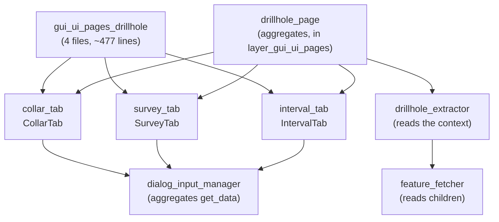

---
tags:
  - secinterp
  - code-walkthrough
  - layer
  - gui
aliases:
  - gui/ui/pages/drillhole/
  - drillhole tabs
  - layer/gui/ui/pages/drillhole
cssclass: secinterp-note
---

# 🛢️ Pages/Drillhole Layer — collar, survey and interval tabs

> [!abstract] Purpose
> Hub note (MOC) for the `gui/ui/pages/drillhole/` package: the three
> drillhole forms — `CollarTab` (collar), `SurveyTab` (deviations) and
> `IntervalTab` (lithological intervals) — with a shared mini-protocol
> (`get_data`/`dump`/`load`/`reset` + `dataChanged`) aggregated by
> `DrillholePage` in a `QTabWidget`.

**Scope**: `gui/ui/pages/drillhole/` — namespace + 3 tabs (~477 lines, 4 notes)
**Layer**: GUI / Presentation (field-mapping forms → `DrillholeContext`)
**Sub-hub of**: [[layer_gui_ui_pages]]
**Tags**: #secinterp #code-walkthrough #layer #gui

---

## 🧭 Sub-hub map

> [!tip] How to read
> The three tabs are **symmetric siblings**: layer selector + field mapping +
> `dataChanged`. [[drillhole_page]] stacks them without knowing their fields;
> [[drillhole_extractor]] (in [[layer_gui_adapters]]) reads the same layers to
> build the `DrillholeContext` traveling to the core.

---

## 📦 Members

| Note | Source | Role |
|---|---|---|
| [[gui_ui_pages_drillhole]] | `gui/ui/pages/drillhole/` (4 files, ~477 lines) | Namespace of the 3 forms + shared mini-protocol |
| [[collar_tab]] | `gui/ui/pages/drillhole/collar_tab.py` (180 lines) | Collar: point layer + ID/X/Y/Z/depth + use-geometry switch |
| [[interval_tab]] | `gui/ui/pages/drillhole/interval_tab.py` (144 lines) | Intervals: tabular layer + ID/from/to/lithology |
| [[survey_tab]] | `gui/ui/pages/drillhole/survey_tab.py` (144 lines) | Deviations: tabular layer + ID/depth/azimuth/inclination |

---

## 👀 Member walkthrough

### [[gui_ui_pages_drillhole]] — the coordinated namespace

Documents the four-file package (~477 lines): the three forms and their
shared mini-protocol (`get_data`/`dump`/`load`/`reset` + `dataChanged`) that
`DrillholePage` aggregates in a `QTabWidget`. It is the contract letting the
coordinator treat all three tabs uniformly.

### [[collar_tab]] — where each hole starts

Collar tab: point-layer selector plus field mapping (ID, X, Y, Z, depth)
with a use-geometry switch. It carries the most logic because the collar
position admits two sources: the attributes or the point geometry.

### [[survey_tab]] — the down-hole trajectory

Deviation tab: tabular-layer selector plus field mapping (ID, depth, azimuth,
inclination). Without surveys the hole is vertical; with them
`DrillholeService` rebuilds the 3D trajectory before projecting it.

### [[interval_tab]] — what the hole crosses

Interval tab: tabular-layer selector (points or no-geometry) plus mapping
(ID, from, to, lithology). Its records feed both the section projection and
attribute inheritance toward interpretations (see
[[interpretation_inheritance_mixin]] in [[layer_gui]]).

---

## 🔄 Data flow

| Phase | Who | Input → Output |
|---|---|---|
| Map | each tab | layer + fields → `get_data()` with logical names |
| Aggregate | [[drillhole_page]] | 3 tabs → one drillhole dict toward the dialog |
| Validate | per-tab `validate()` | required fields → complete / incomplete hole |
| Extract | [[drillhole_extractor]] | same layers → decoupled `DrillholeContext` |
| Persist | `dump()` / `load()` | mappings ↔ QGIS project + `ConfigService` |

Tabs never see geometries: they only store **references** (layer id + field
names). Actual reading happens in the Extract phase, on the main thread,
right before launching the [[layer_gui_tasks]] `QgsTask`s.

---

## 🏛️ Design patterns

| Pattern | Where | Purpose |
|---|---|---|
| **Mini-protocol** | `get_data/dump/load/reset` + `dataChanged` | Uniformity across the 3 tabs |
| **Reference, not data** | layer + field mappings | Tabs configure; extractors read |
| **Dumb coordinator** | [[drillhole_page]] | Stacking without knowing inner fields |

---

## 🛡️ Tab rules

> [!important] Tabs configure, they never read
> A tab never opens the layer to read features: it stores layer id + field
> names and emits `dataChanged`. Reading happens exactly once in
> [[drillhole_extractor]], on the main thread, right before launching the
> `QgsTask`s. Violating this would duplicate reads and break the thread
> boundary.

---

## 🔗 Related notes

- [[Index]] — vault index
- [[layer_gui]] — GUI layer root hub
- [[layer_gui_ui_pages]] — parent pages package + `DrillholePage`
- [[gui_ui_pages_drillhole]] — tab namespace note
- [[collar_tab]] / [[survey_tab]] / [[interval_tab]] — the three forms
- [[drillhole_extractor]] — extractor reading these same layers
- [[feature_fetcher]] — reader of the survey/interval child layers
- [[layer_gui_tasks]] — tasks consuming the `DrillholeContext`

---

*Note of the SecInterp Code Walkthrough v2 vault — v3.9.1*
