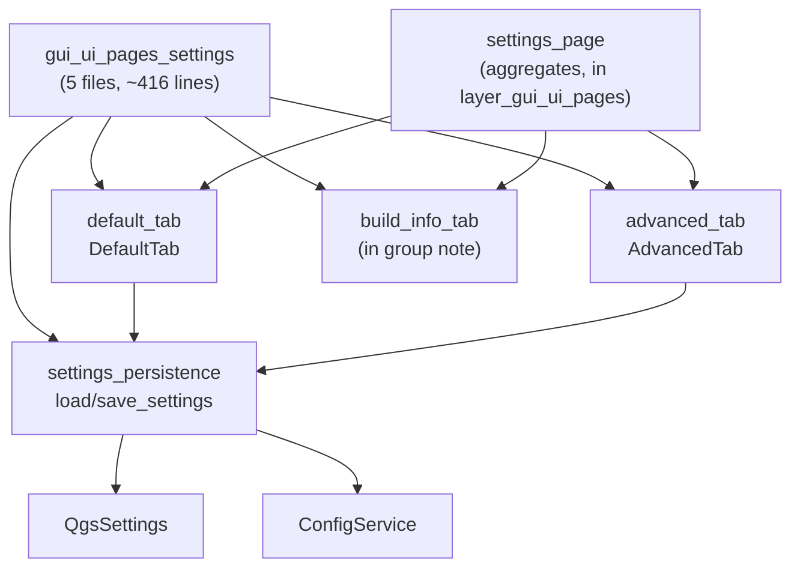

---
tags:
  - secinterp
  - code-walkthrough
  - layer
  - gui
aliases:
  - gui/ui/pages/settings/
  - settings tabs
  - layer/gui/ui/pages/settings
cssclass: secinterp-note
---

# ⚙️ Pages/Settings Layer — settings tabs and persistence

> [!abstract] Purpose
> Hub note (MOC) for the `gui/ui/pages/settings/` package: the plugin
> settings — `DefaultTab` (what gets exported), `AdvancedTab` (3D toggles),
> `build_info_tab` (read-only metadata) and `settings_persistence`
> (`load_settings`/`save_settings`) — aggregated by `SettingsPage` in a
> `QTabWidget`.

**Scope**: `gui/ui/pages/settings/` — namespace + 3 tabs + facade (~416 lines, 4 notes)
**Layer**: GUI / Presentation (preferences via `QgsSettings` + `ConfigService`)
**Sub-hub of**: [[layer_gui_ui_pages]]
**Tags**: #secinterp #code-walkthrough #layer #gui

---

## 🧭 Sub-hub map

> [!tip] How to read
> Tabs are **dumb on purpose**: they show widgets and emit changes, but know
> nothing about storage. [[settings_persistence]] is the only facade talking
> to `QgsSettings` and `ConfigService`. `info_tab` has no note of its own: it
> is documented inside the [[gui_ui_pages_settings]] group note.

---

## 📦 Members

| Note | Source | Role |
|---|---|---|
| [[gui_ui_pages_settings]] | `gui/ui/pages/settings/` (5 files, ~416 lines) | Namespace + `build_info_tab`; `SettingsPage` aggregates it |
| [[advanced_tab]] | `gui/ui/pages/settings/advanced_tab.py` (106 lines) | 3D toggles (master, traces, intervals, real/projected coords) |
| [[default_tab]] | `gui/ui/pages/settings/default_tab.py` (178 lines) | What to generate on save (5 checks), format, naming, reset |
| [[settings_persistence]] | `gui/ui/pages/settings/settings_persistence.py` (75 lines) | `load_settings` hydrates; `save_settings` dumps |

---

## 👀 Member walkthrough

### [[gui_ui_pages_settings]] — the namespace with info included

Documents the five-file package (~416 lines): `DefaultTab`, `AdvancedTab`,
`build_info_tab` (read-only metadata via `read_plugin_metadata`) and the
persistence facade. The info tab lives only here — it is a stateless builder
function, not worth its own note — alongside the contract `SettingsPage`
consumes.

### [[default_tab]] — what comes out on save

Default tab: selection of which data to generate on save (5 checkboxes),
vector format, naming pattern and reset button, with auto-save via
`ConfigService`. It is the surface users touch most and the one defining the
[[dialog_export_manager]] export behavior.

### [[advanced_tab]] — 3D switches

Advanced tab: 3D export switches (master enable, traces, intervals, real vs.
projected coordinates) persisted via `ConfigService` and `QgsSettings`.
Expert options, isolated so the default tab stays approachable.

### [[settings_persistence]] — the only one that knows storage

Persistence facade: `load_settings` hydrates the tabs from `QgsSettings` and
`save_settings` dumps them via `ConfigService`, with widgets knowing nothing
about storage. Thanks to it, tabs are tested without an instantiated QGIS.

---

## 🔄 Data flow

| Phase | Who | Input → Output |
|---|---|---|
| Show | [[default_tab]] / [[advanced_tab]] | persisted values → widgets |
| Change | widgets + auto-save | edit → immediate `ConfigService` |
| Load | [[settings_persistence]] `load_settings` | `QgsSettings` → hydrated tabs |
| Save | [[settings_persistence]] `save_settings` | tabs → `ConfigService` + `QgsSettings` |
| Consume | [[dialog_export_manager]] and exporters | settings → what and how to export |

Dual store with distinct roles: `QgsSettings` keeps application preferences
(global, surviving the project) and `ConfigService` the operational state;
the facade reconciles both without exposing them to the tabs.

---

## 🏛️ Design patterns

| Pattern | Where | Purpose |
|---|---|---|
| **Persistence facade** | [[settings_persistence]] | A single point knowing storage |
| **Dumb widgets** | [[default_tab]], [[advanced_tab]] | Display and emit, never store |
| **Builder function** | `build_info_tab` | Stateless tab as a pure function |
| **Auto-save** | `ConfigService` on change | Preferences that are never lost |

---

## 🛡️ Settings rules

> [!important] A single storage point
> No widget touches `QgsSettings` directly: everything goes through
> [[settings_persistence]]. So switching backends (e.g. QGIS-project-only)
> means editing one 75-line module instead of hunting accesses scattered
> across the tabs.

---

## 🔗 Related notes

- [[Index]] — vault index
- [[layer_gui]] — GUI layer root hub
- [[layer_gui_ui_pages]] — parent pages package + `SettingsPage`
- [[gui_ui_pages_settings]] — namespace note (includes info_tab)
- [[advanced_tab]] / [[default_tab]] — the two stateful tabs
- [[settings_persistence]] — load/save facade
- [[dialog_export_manager]] — consumer of these settings on export
- [[dialog_settings_persistence]] — whole-dialog persistence

---

*Note of the SecInterp Code Walkthrough v2 vault — v3.9.1*
