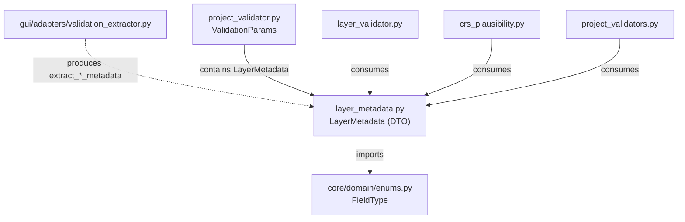
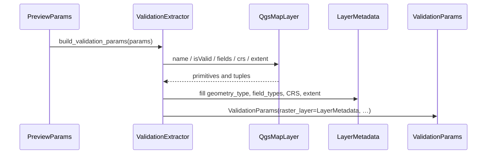

---
tags:
  - secinterp
  - code-walkthrough
  - core
  - validation
aliases:
  - layer_metadata.py
  - LayerMetadata
cssclass: secinterp-note
---

# `core/validation/layer_metadata.py`

> [!abstract] One-line summary
> Defines the **QGIS-agnostic metadata DTO** (`LayerMetadata`): validity, layer kind, geometry, fields, CRS and extent as primitives, so the core validators never touch QGIS objects.

**Path**: `core/validation/layer_metadata.py` (61 lines)
**Main class**: `LayerMetadata` (dataclass, 15 fields, 0 methods)
**Layer**: Core (QGIS-agnostic)
**Tags**: #secinterp #core #validation

---

## 🎯 Why does this file exist?

The core validators (`ProjectValidator`, `layer_validator`, `crs_plausibility`) need to
know whether a layer exists, is vector or raster, has the right fields and a coherent
CRS. But the core is **forbidden from importing `qgis.core`**. The solution is a
primitive-only DTO that the GUI fills and the core consumes:

| Problem | Solution |
|---------|----------|
| The core cannot receive `QgsVectorLayer`/`QgsRasterLayer` | `LayerMetadata` stores `kind`, `geometry_type`, fields… as `str`/`bool`/`float` |
| Validating "does this layer have features?" without QGIS | `feature_count` / `band_count` as integers |
| Detecting a mislabelled CRS without reading coordinates | `crs_authid`, `crs_is_geographic` + `extent_*` and `pixel_size_x` |
| Two layers with different CRSs | `crs_authid` on each metadata |
| Field existence must be checked by name and type | `field_names` + `field_types` (`FieldType`) |

> [!important] Extract-then-Compute bridge
> This module does **not** extract anything from QGIS: it is only the **data contract**
> (DTO). It is built by the GUI adapter `ValidationExtractor`
> (`gui/adapters/validation_extractor.py`), which in the *Extract* phase reads the
> `QgsMapLayer` and fills each field with primitives. The core then validates with flat
> data and never sees a QGIS object.

---

## 🧬 Relationship diagram



> [!tip] How to read
> Solid = imports; dashed = builds/consumes. `layer_metadata.py` is the **central link**:
> the only module in the validation package that imports the core and the only one the
> GUI produces.

---

## 📦 Imports — architectural reading

```python
# core/validation/layer_metadata.py
from __future__ import annotations

from dataclasses import dataclass, field

from sec_interp.core.domain import FieldType
```

| # | Observation |
|---|-------------|
| ① | `from __future__ import annotations` — lazy annotations, mandatory in the project. |
| ② | `dataclass, field` — pure data DTO; `field` only for `default_factory` of list/dict. |
| ③ | Imports **only** `FieldType` from the domain; **zero** QGIS imports, zero Qt. |
| ④ | Return types `list[str]` / `dict[str, FieldType]` using `X | None` syntax (PEP 604). |

---

## 🏗️ Structure inventory

**Class:** `class LayerMetadata` — 0 methods (only 15 defaulted fields).

**Geometry constants (str):** `GEOMETRY_POINT`, `GEOMETRY_LINE`, `GEOMETRY_POLYGON`, `GEOMETRY_UNKNOWN`
**Layer-kind constants (str):** `KIND_VECTOR`, `KIND_RASTER`, `KIND_UNKNOWN`

```python
GEOMETRY_POINT = "point"
GEOMETRY_LINE = "line"
GEOMETRY_POLYGON = "polygon"
GEOMETRY_UNKNOWN = "unknown"

KIND_VECTOR = "vector"
KIND_RASTER = "raster"
KIND_UNKNOWN = "unknown"
```

| Constant | Value | Meaning |
|----------|-------|---------|
| `GEOMETRY_POINT` | `"point"` | Point geometry (e.g. structural) |
| `GEOMETRY_LINE` | `"line"` | Line geometry (section) |
| `GEOMETRY_POLYGON` | `"polygon"` | Polygon geometry (geology) |
| `GEOMETRY_UNKNOWN` | `"unknown"` | Unresolved geometry |
| `KIND_VECTOR` | `"vector"` | Vector layer |
| `KIND_RASTER` | `"raster"` | Raster layer (DEM) |
| `KIND_UNKNOWN` | `"unknown"` | Unrecognised kind |

> [!note] Sentinels, not `Enum`
> Both groups are **plain strings** (not `Enum`). `GEOMETRY_UNKNOWN`/`KIND_UNKNOWN` act
> as *Null Object*: they represent "could not be determined" without raising.

---

## 📖 Field-by-field walkthrough

### `LayerMetadata` — metadata DTO

```python
@dataclass
class LayerMetadata:
    """Detached metadata describing a QGIS layer for validation.

    Produced by the GUI ``ValidationExtractor`` adapter so that the core
    validators never touch QGIS objects directly.
    """

    name: str = ""
    is_valid: bool = False
    kind: str = KIND_UNKNOWN
    geometry_type: str | None = None
    field_names: list[str] = field(default_factory=list)
    field_types: dict[str, FieldType] = field(default_factory=dict)
    band_count: int = 0
    feature_count: int = 0
    crs_authid: str | None = None
    crs_is_geographic: bool | None = None
    extent_xmin: float | None = None
    extent_ymin: float | None = None
    extent_xmax: float | None = None
    extent_ymax: float | None = None
    pixel_size_x: float | None = None
```

Every field has a **default**, so `LayerMetadata()` is always constructible (handy in
tests and as a typed "missing layer"). Mutable fields use `default_factory` so the same
list/dict is not shared between instances.

### Full field reference

| Field | Type | Default | Role | Consumed by |
|-------|------|---------|------|-------------|
| `name` | `str` | `""` | Layer name (error messages) | `layer_validator`, `crs_plausibility` |
| `is_valid` | `bool` | `False` | Was it valid at extraction time? | all validators |
| `kind` | `str` | `KIND_UNKNOWN` | `"vector"` / `"raster"` / `"unknown"` | `layer_validator`, `project_validators` |
| `geometry_type` | `str \| None` | `None` | `"point"` / `"line"` / `"polygon"` | `validate_layer_geometry` |
| `field_names` | `list[str]` | `[]` | Ordered field names | `field_validator`, `layer_validator` |
| `field_types` | `dict[str, FieldType]` | `{}` | Field → domain type | `validate_field_type` |
| `band_count` | `int` | `0` | Band count (raster) | `validate_raster_band` |
| `feature_count` | `int` | `0` | Feature count (vector) | `validate_layer_has_features` |
| `crs_authid` | `str \| None` | `None` | CRS ID (e.g. `"EPSG:4326"`) | `validate_crs_compatibility` |
| `crs_is_geographic` | `bool \| None` | `None` | Geographic CRS? (tri-state) | `section_line_geometry_error`, `crs_plausibility` |
| `extent_xmin` | `float \| None` | `None` | Minimum X (CRS units) | `crs_plausibility` |
| `extent_ymin` | `float \| None` | `None` | Minimum Y | `crs_plausibility` |
| `extent_xmax` | `float \| None` | `None` | Maximum X | `crs_plausibility` |
| `extent_ymax` | `float \| None` | `None` | Maximum Y | `crs_plausibility` |
| `pixel_size_x` | `float \| None` | `None` | Raster pixel size X (raster units) | `crs_plausibility` |

> [!important] The `crs_is_geographic` tri-state
> It is not a plain `bool`: `True`/`False` are the CRS declaration and `None` means
> **"could not be determined"**. Validators use it as a guard: when it is `None`, the
> plausibility heuristic stays silent (avoiding false positives).

### `field_names` and `field_types`

```python
    field_names: list[str] = field(default_factory=list)
    field_types: dict[str, FieldType] = field(default_factory=dict)
```

`field_names` preserves the layer **order**; `field_types` maps each name to a core
`FieldType`, a numeric mirror of `QVariant.Type`:

| `FieldType` | Value | Typical use |
|-------------|-------|-------------|
| `NULL` | 0 | Unrecognised type (fallback) |
| `BOOL` | 1 | Booleans |
| `INT` | 2 | Integers |
| `LONG_LONG` | 4 | 64-bit integers |
| `DOUBLE` | 6 | Reals (dip/strike) |
| `STRING` | 10 | Text (lithology) |
| `DATE` | 14 | Dates |
| `DATE_TIME` | 16 | Date and time |

The structural validators accept `[INT, DOUBLE, LONG_LONG, STRING]` for dip/strike, so the
DTO makes it possible to check types **without** `PyQt`.

---

## 🔄 Data flow

| Phase | Input | Transformation | Output |
|-------|-------|----------------|--------|
| Extract | `QgsVectorLayer` / `QgsRasterLayer` | `extract_vector_metadata` / `extract_raster_metadata` | `LayerMetadata` |
| Bridge | `PreviewParams` (QGIS refs) | `build_validation_params` | `ValidationParams` with `LayerMetadata` |
| Compute | `LayerMetadata` | `ProjectValidator` / `layer_validator` / `crs_plausibility` | errors and warnings |

---

## 🔌 Construction from the GUI (ValidationExtractor)

The DTO is **not self-populated**: it is produced by
`gui/adapters/validation_extractor.py`. Dispatch by layer type is explicit:

```python
def extract_layer_metadata(layer: QgsMapLayer) -> LayerMetadata:
    """Extract detached metadata from a QGIS layer object."""
    if isinstance(layer, QgsVectorLayer):
        return extract_vector_metadata(layer)
    if isinstance(layer, QgsRasterLayer):
        return extract_raster_metadata(layer)
    return LayerMetadata(name=layer.name(), is_valid=layer.isValid(), kind=KIND_UNKNOWN)
```

### Vector: `extract_vector_metadata`

```python
    metadata = LayerMetadata(
        name=layer.name(),
        is_valid=layer.isValid(),
        kind=KIND_VECTOR,
        feature_count=layer.featureCount(),
    )
    if not layer.isValid():
        return metadata

    metadata.geometry_type = _GEOMETRY_MAP.get(
        QgsWkbTypes.geometryType(layer.wkbType()), GEOMETRY_UNKNOWN
    )

    for f in layer.fields():
        metadata.field_names.append(f.name())
        metadata.field_types[f.name()] = _to_field_type(f.type())

    crs = layer.crs()
    if crs.isValid():
        metadata.crs_authid = crs.authid()
        metadata.crs_is_geographic = _is_geographic(crs)

    _populate_extent(metadata, layer)
    return metadata
```

### Raster: `extract_raster_metadata`

```python
    metadata = LayerMetadata(
        name=layer.name(),
        is_valid=layer.isValid(),
        kind=KIND_RASTER,
        band_count=layer.bandCount(),
    )
    ...
    try:
        metadata.pixel_size_x = float(layer.rasterUnitsPerPixelX())
    except (AttributeError, TypeError, ValueError, RuntimeError):
        metadata.pixel_size_x = None
```

### From DTO field to its QGIS source

| `LayerMetadata` field | Source in `validation_extractor.py` |
|-----------------------|-------------------------------------|
| `name` | `layer.name()` |
| `is_valid` | `layer.isValid()` |
| `kind` | `KIND_VECTOR` / `KIND_RASTER` / `KIND_UNKNOWN` |
| `geometry_type` | `_GEOMETRY_MAP.get(QgsWkbTypes.geometryType(layer.wkbType()), GEOMETRY_UNKNOWN)` |
| `field_names` | `f.name()` per field of `layer.fields()` |
| `field_types` | `_to_field_type(f.type())` → `FieldType(int(qvariant_type))` |
| `band_count` | `layer.bandCount()` (raster) |
| `feature_count` | `layer.featureCount()` (vector) |
| `crs_authid` | `crs.authid()` if `crs.isValid()` |
| `crs_is_geographic` | `_is_geographic(crs)` → `bool(crs.isGeographic())` or `None` |
| `extent_xmin/ymin/xmax/ymax` | `extent.xMinimum()/yMinimum()/xMaximum()/yMaximum()` via `_populate_extent` |
| `pixel_size_x` | `float(layer.rasterUnitsPerPixelX())` (raster) |

> [!note] `_populate_extent` is defensive
> It only fills the extent if `layer.extent()` exists, does **not** raise on read and
> `extent.isEmpty()` is `False`; if anything fails, it leaves the four fields as `None`.
> `_to_field_type` falls back to `FieldType.NULL` for an unknown `QVariant`.



---

## 🔢 Worked example — raster metadata

From the test `tests/gui/test_validation_extractor.py`, a DEM layer with extent
`(-99.0, 22.7, -98.99, 23.0)` and pixel `0.000138` produces:

```python
metadata.extent_xmin   # -99.0
metadata.extent_ymin   # 22.7
metadata.extent_xmax   # -98.99
metadata.extent_ymax   # 23.0
metadata.pixel_size_x  # 0.000138
```

With CRS `EPSG:4326` (`crs_is_geographic=True`) and coordinates within the lon/lat
bounds, `implausible_crs_reason(metadata)` returns `""` (plausible CRS). The same extent
with a **projected** CRS would trigger the "looks like degrees" warning, and a `1e-4`
pixel in a projected CRS would trigger the "unbelievable pixel" warning — both examples
exist in `tests/core/test_crs_plausibility.py`.

---

## 🏛️ Design patterns present

| Pattern | Where | Purpose |
|---------|-------|---------|
| **DTO** | `LayerMetadata` | Carry metadata across the GUI/Core boundary |
| **Null Object** | `GEOMETRY_UNKNOWN`, `KIND_UNKNOWN`, defaults | Represent "unknown" without raising |
| **Factory (GUI-side)** | `extract_*_metadata` | Build the DTO from the `QgsMapLayer` |
| **Enum mapping** | `FieldType`, `_GEOMETRY_MAP` | Decouple from `QVariant` / `QgsWkbTypes` |
| **Tri-state guard** | `crs_is_geographic: bool \| None` | Tell "not geographic" from "unknown" |

---

## 🧾 API summary

| Symbol | Signature / Inherits | Typical use |
|--------|----------------------|-------------|
| `LayerMetadata` | `@dataclass` (15 fields, 0 methods) | Detached metadata DTO |
| `GEOMETRY_*` | `str` constants | QGIS-agnostic geometry keys |
| `KIND_*` | `str` constants | QGIS-agnostic layer-kind keys |

---

## 🛡️ Error handling

`LayerMetadata` **raises nothing**: every field has a default and there are no methods.
The robustness lives in the extractor that populates it:

| Situation | Behaviour |
|-----------|-----------|
| Layer is neither vector nor raster | `kind=KIND_UNKNOWN`, remaining fields defaulted |
| Invalid layer (`isValid() == False`) | Fills `name`/`is_valid`/`kind` (+ count) and returns early |
| Invalid CRS | `crs_authid` and `crs_is_geographic` stay `None` |
| Extent `None`, empty or unreadable | `extent_*` stay `None` |
| Unknown `QVariant` | `FieldType.NULL` |
| `rasterUnitsPerPixelX` fails | `pixel_size_x = None` |

> [!warning] Deferred type validation
> The DTO does not validate its own invariants (there is no `__post_init__`). If the
> extractor left, say, `kind="raster"` with a populated `geometry_type`, nothing here
> would catch it; coherence is assumed upstream.

---

## 🧪 Associated tests

- `tests/gui/test_validation_extractor.py::TestRasterMetadataExtraction`
  - `test_populates_extent_and_pixel` — extent and `pixel_size_x` are copied.
  - `test_empty_extent_is_left_as_none` — empty extent → `None` fields.
- `tests/core/test_crs_plausibility.py` — builds `LayerMetadata` by hand and checks the
  heuristic (geographic vs projected extent/pixel, degenerate, missing, `None`).
- `tests/core/test_project_validator.py` — uses real `LayerMetadata` in `ValidationParams`.
- `tests/core/test_layer_validator.py` — geometry, features, bands, CRS.
- `tests/core/test_field_validator.py` — field existence and type via `field_types`.

---

## 🌐 i18n and migration notes

- **No user-facing strings**: the DTO only carries data; consuming validators emit messages.
- **Thread-safety**: primitive dataclass with `default_factory`; no shared state.
- **Migration**: `kind` and `geometry_type` are free `str` (typo-prone); candidates for
  `StrEnum`. `pixel_size_x` only covers the X axis (no `pixel_size_y` or rotation).

---

## 👀 Observations and notes

> [!success] Strengths
> - 100% QGIS-agnostic DTO: the core is tested without installing QGIS.
> - Every field defaulted → `LayerMetadata()` is always valid.
> - `crs_is_geographic: bool | None` avoids judging when there is no certainty.
> - `default_factory` prevents shared lists/dicts between instances.

> [!warning] Points of attention
> - `kind`/`geometry_type` are `str` instead of `Enum`.
> - No `__post_init__`: invariants depend on the extractor.
> - It defines no `__all__`.
> - The extent is in the layer CRS units, not reprojected.

> [!question] Open questions
> - Migrate `kind`/`geometry_type` to `StrEnum` for strong typing?
> - Add `pixel_size_y`/axis units for finer CRS heuristics?
> - A `from_qgis` classmethod in the core (with injection) to centralise the factory?

---

## 🔗 Related notes

- [[Index]] — vault index
- [[crs_plausibility]] — consumes `extent_*`, `crs_is_geographic` and `pixel_size_x`
- [[validation_extractor]] — GUI adapter that produces `LayerMetadata`
- [[project_validator]] — `ValidationParams` that groups the DTOs
- [[layer_validator]] — consumes `kind`, `geometry_type`, `feature_count`, `band_count`
- [[project_validators]] — validators that read `is_valid`/`crs_is_geographic`
- [[enums]] — defines `FieldType`
- [[core_validation]] — `validation/` package index

---

*Note of the SecInterp Code Walkthrough v2 vault — v3.9.1*
