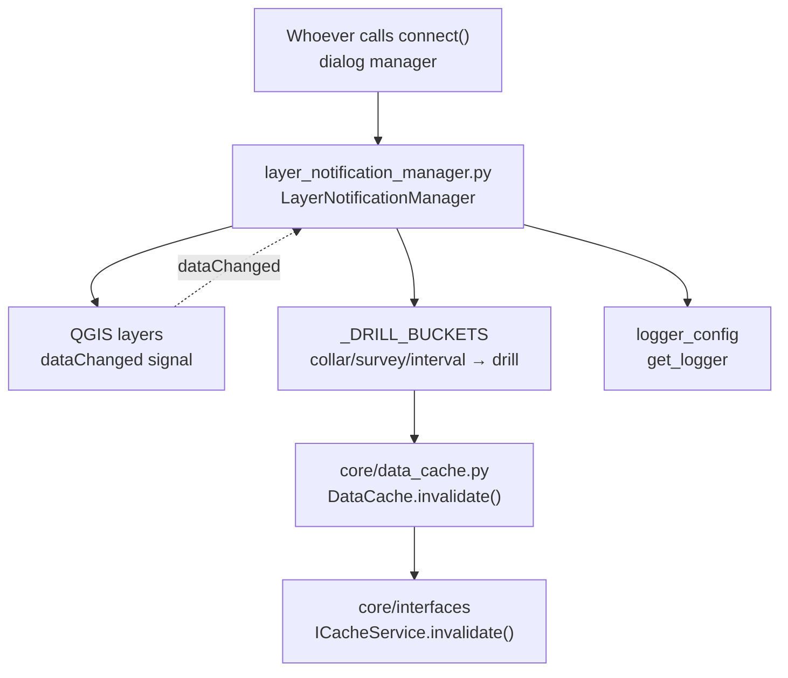

---
tags:
  - secinterp
  - code-walkthrough
  - gui
  - managers
aliases:
  - layer_notification_manager.py
  - LayerNotificationManager
cssclass: secinterp-note
---

# `gui/layer_notification_manager.py`

> [!abstract] One-line summary
> Wires QGIS layers' `dataChanged` signals to the core `DataCache.invalidate()`: any edit invalidates only its bucket (and the base section invalidates everything), with deterministic connect/disconnect.

**Path**: `gui/layer_notification_manager.py` (73 lines)
**Main class**: `LayerNotificationManager`
**Layer**: GUI · Managers (listens to QGIS signals; invokes pure core logic)
**Tags**: #secinterp #gui #managers

---

## 🎯 Why does this file exist?

The central `DataCache` speeds up the preview with buckets (`topo`, `geol`, `struct`, `drill`, `section`), but a cache without invalidation serves stale data after every edit.

| Problem | Solution |
|---------|----------|
| Editing a layer must refresh the preview without recomputing everything | `connect()` subscribes `layer.dataChanged` → per-bucket `invalidate(bucket)` |
| Three drillhole layers (collar, survey, interval) share one bucket | `_DRILL_BUCKETS` maps all three to `"drill"` |
| Changing the base section obsoletes **all** derivatives | The `"section"` callback calls bare `invalidate()` (everything) |
| Reconnecting without disconnecting would duplicate invalidations | `connect()` calls `disconnect()` first; `disconnect()` suppresses per-callback errors |

> [!important] Architectural note
> It lives in GUI **because** it wires QGIS signals, yet only invokes the core `ICacheService.invalidate()` port: the boundary holds (the manager never knows how the cache stores, only which bucket expires). It is the plugin's finest-grained **Observer**: per-bucket reaction instead of "clear everything always".

---

## 🧬 Relationship diagram



> [!tip] How to read
> Solid arrow = calls/connects; dashed = the Qt signal firing the callback. The manager translates layer names to buckets and the cache decides the purge.

---

## 📦 Imports — architectural reading

```python
# gui/layer_notification_manager.py
from __future__ import annotations

import contextlib
from typing import Any

from sec_interp.logger_config import get_logger

logger = get_logger(__name__)

_DRILL_BUCKETS = {"drill_collar", "drill_survey", "drill_interval"}
```

| # | Observation |
|---|-------------|
| ① | Zero `qgis.*` imports: layers are `Any` with `.dataChanged`, `.connect`, and `.name()`. Total duck typing, testable without QGIS. |
| ② | `data_cache: Any` in the constructor for the same reason: anything exposing `invalidate()` (the `ICacheService` port) works, with no extra core import in GUI. |
| ③ | `contextlib` only for idempotent `disconnect()`: disconnecting twice or over dead layers must not fail. |
| ④ | `_DRILL_BUCKETS` as a module constant (not an attribute): the collar/survey/interval → `drill` mapping is stable domain knowledge, visible without instantiating. |
| ⑤ | Layer `snake_case` bucket names (`drill_collar`) vs. cache buckets (`drill`): the manager is the dictionary between both vocabularies. |

---

## 🏗️ Structure inventory

**Constants (1):**

| Symbol | Value | Role |
|---------|-------|------|
| `_DRILL_BUCKETS` | `{"drill_collar", "drill_survey", "drill_interval"}` | Layer buckets collapsing into the `drill` bucket |

**Classes (1):** `LayerNotificationManager` — 4 methods.

| Method | Signature | Role |
|--------|-------|------|
| `__init__` | `(data_cache: Any) -> None` | Keeps the cache + empty connection list |
| `connect` | `(layers: dict[str, Any]) -> None` | Unwires previous, subscribes `dataChanged` per layer |
| `disconnect` | `() -> None` | Unwires everything with suppression, empties the list |
| `_create_invalidation_callback` | `(bucket: str)` | Builds the invalidating closure (with the `section` rule) |

**State:**

| Attribute | Type | Role |
|----------|------|-----|
| `data_cache` | `Any` (`ICacheService` by contract) | Cache to invalidate |
| `_connected_layers` | `list[tuple[Any, Any]]` | Live `(layer, callback)` pairs for unwiring |

---

## 📁 Files in the package

| File | Lines | Role |
|---|--:|---|
| `layer_notification_manager.py` | 73 | This note: `dataChanged` → `invalidate()` |
| `dialog_signal_manager.py` | — | Wires page `dataChanged` (geology, structures, drillholes) to UI refreshes |
| `adapters/layer_resolver.py` | — | `resolve_layer()` plus its own `invalidate(layer_id)` for resolution |
| `core/data_cache.py` | — | `DataCache`: `topo/geol/struct/drill` buckets, `invalidate(bucket?)` |
| `core/interfaces/cache_interface.py` | 62 | `ICacheService`: the `get/set/invalidate/clear/get_metadata` port |

---

## 📖 Method-by-method walkthrough

### `__init__`

```python
def __init__(self, data_cache: Any) -> None:
    self.data_cache = data_cache
    self._connected_layers: list[tuple[Any, Any]] = []
```

No wiring in the constructor: the manager is born inert and only `connect()` activates it. Storing `(layer, callback)` pairs — not just layers — is what allows unwiring **that** specific callback without dropping other `dataChanged` subscribers (e.g. `dialog_signal_manager`'s).

### `connect`

```python
def connect(self, layers: dict[str, Any]) -> None:
    self.disconnect()
    for bucket, layer in layers.items():
        if not layer:
            continue

        cache_bucket = "drill" if bucket in _DRILL_BUCKETS else bucket
        callback = self._create_invalidation_callback(cache_bucket)
        layer.dataChanged.connect(callback)
        self._connected_layers.append((layer, callback))
        logger.debug(
            f"Connected cache invalidation to layer: {layer.name()} -> bucket: {cache_bucket}"
        )
```

Idempotent by construction: leading `disconnect()` guarantees reconnecting (e.g. on project change) never duplicates. Falsy/`None` layers are skipped quietly. Each layer gets **its own closure** bound to its bucket, and every connection leaves a `debug` trace with `layer → bucket` for wiring audits.

### `disconnect`

```python
def disconnect(self) -> None:
    """Disconnect all previously connected layer signals."""
    for layer, callback in self._connected_layers:
        with contextlib.suppress(Exception):
            layer.dataChanged.disconnect(callback)
    self._connected_layers.clear()
    logger.debug("Layer signals disconnected")
```

Surgical per-callback unwiring (not a blind `disconnect()`, which would hit other subscribers) with broad suppression: destroyed layers or already-removed callbacks never interrupt the sweep. The final `clear()` + `debug` returns the manager to a pristine state.

### `_create_invalidation_callback`

```python
def _create_invalidation_callback(self, bucket: str):
    """The ``section`` bucket is the base geometry and invalidates all
    cache buckets."""

    def callback() -> None:
        """Invalidate the cache bucket."""
        if bucket == "section":
            return self.data_cache.invalidate()
        return self.data_cache.invalidate(bucket)

    return callback
```

Closure factory with the golden rule: the section is the base geometry deriving topo, geology, structures, and drillholes, so its change invalidates **everything** (bare `invalidate()`); any other bucket invalidates only itself. `bucket` is captured by closure, no `functools.partial` or inline lambdas.

> [!note] Granularity = performance
> Editing a drillhole interval only purges `drill`; cached topo and geology are reused. Only moving the section line pays the full recompute. That is this file's entire value.

### Wiring example

```python
manager = LayerNotificationManager(data_cache)
manager.connect({
    "section": section_layer,
    "topo": None,               # skipped quietly
    "drill_collar": collar_lyr, # -> "drill" bucket
    "drill_interval": iv_lyr,   # -> "drill" bucket
    "geol": geol_lyr,           # -> "geol" bucket
})
# ... the user edits intervals ...
# dataChanged -> callback -> data_cache.invalidate("drill")
manager.disconnect()  # on close or rewiring
```

One `connect()` covers the whole project; editing intervals purges `drill` and leaves `geol`/`topo` intact. On project change `connect()` is called again and the leading `disconnect()` prevents duplicates.

---

## 🔄 Data flow

| Phase | Input | Transformation | Output |
|-------|-------|----------------|--------|
| Wiring | `dict[bucket, layer]` | `disconnect()` + per-layer `dataChanged.connect(closure)` | populated `_connected_layers` |
| Edit | one layer's `dataChanged` | closure captured `bucket` | `invalidate(bucket)` or bare `invalidate()` |
| Purge | bucket (or all) | `DataCache` drops entries | next preview recomputes the expired parts |
| Unwiring | close / rewiring | per-pair `disconnect(callback)` + `clear()` | zero connections |

---

## 🏛️ Design patterns present

| Pattern | Where | Purpose |
|---------|-------|---------|
| **Observer (Qt signals)** | `dataChanged.connect(callback)` | React to edits without polling |
| **Callback factory** | `_create_invalidation_callback()` | One closure per bucket with the `section` rule |
| **Vocabulary mapping** | `_DRILL_BUCKETS` → `"drill"` | Three layers, one cache bucket |
| **Idempotent connect** | `connect()` starts with `disconnect()` | Safe rewiring on project change |
| **Deterministic cleanup** | `disconnect()` + pair list | No connections to dead layers |
| **Dependency Inversion** | `data_cache: Any` (≈ `ICacheService`) | Depend on the port, not on `DataCache` |

---

## 🧾 API summary

| Symbol | Signature | Typical use |
|--------|-------|------------|
| `LayerNotificationManager` | `(data_cache: Any)` | `LayerNotificationManager(data_cache)` |
| `connect` | `(layers: dict[str, Any]) -> None` | `connect({"section": lyr, "drill_collar": c, ...})` |
| `disconnect` | `() -> None` | On close or before rewiring |
| `_DRILL_BUCKETS` | module-level `set[str]` | collar/survey/interval → `drill` mapping |

---

## 🛡️ Error handling

| Situation | Behavior |
|-----------|----------|
| `None` layer in `connect()` | Skipped with `continue`, no log |
| Destroyed layer in `disconnect()` | Per-pair `suppress(Exception)`, sweep continues |
| Already-removed callback | Suppressed alike, `clear()` still runs |
| `dataChanged` fired after `disconnect()` | Impossible: the callback is no longer subscribed |
| `invalidate()` throwing inside the callback | Propagates to the Qt emitter; the manager does not wrap it (the cache must not fail here) |

---

## 🧪 Associated tests

No dedicated test (neither `tests/gui/` nor `tests/core/`): an honest gap with easy-to-cite neighboring coverage:

- `tests/core/test_data_cache.py` + `test_data_cache_fix.py` — cover `DataCache.invalidate(bucket?)`, the method the callbacks invoke (the contract's receiving half).
- `tests/gui/test_dialog_state_manager.py`, `test_main_dialog_signals_wiring.py` — dialog signal wiring, same idempotent `connect`/`disconnect` style.
- `tests/gui/test_cache_fix.py` — central-cache regression.

A natural Mock-first test (missing today): `MagicMock` layers with `dataChanged`, `connect({...})`, fire the captured callback, and assert `invalidate("drill")` / bare `invalidate()` for `section`. Fully mockable without QGIS since the module imports no `qgis.*`.

---

## 👀 Observations and notes

> [!success] Strengths
> - Per-bucket invalidation: the minimum possible recompute after each edit.
> - `section` → everything rule: the base→derivative dependency modeled in one line.
> - Idempotent `connect` and surgical `disconnect`: safe rewiring without dropping foreign subscribers.
> - Zero QGIS imports: the most testable manager in the GUI layer.

> [!warning] Points of attention
> - `None` layers are skipped silently: a badly resolved bucket gets no invalidation and serves stale data with no warning.
> - The callback does not wrap `invalidate()`: if the cache threw, the exception rises to the Qt emitter.
> - `_connected_layers` retains layer references: while the manager lives, those layers are not freed (intentional retention, but worth documenting).
> - No direct test despite being trivially mockable.

> [!question] Open questions
> - A `logger.warning` when `connect()` gets a falsy layer, to catch invalidation-less buckets?
> - Reuse this manager to invalidate [[snapper]]'s cached `QgsPointLocator` objects on `dataChanged`?

---

## 🔗 Related notes

- [[Index]] — vault index
- [[data_cache]] — `DataCache.invalidate()`: the receiving half
- [[cache_interface]] — `ICacheService`: the port the manager consumes
- [[controller]] — main cache consumer in the core
- [[preview_task_orchestrator]] — relaunches tasks after invalidation
- [[dialog_signal_manager]] — another `dataChanged` subscriber (UI refreshes)
- [[snapper]] — its cached locators suffer the same staleness problem

---

*Note of the SecInterp Code Walkthrough v2 vault — v3.8.0*
