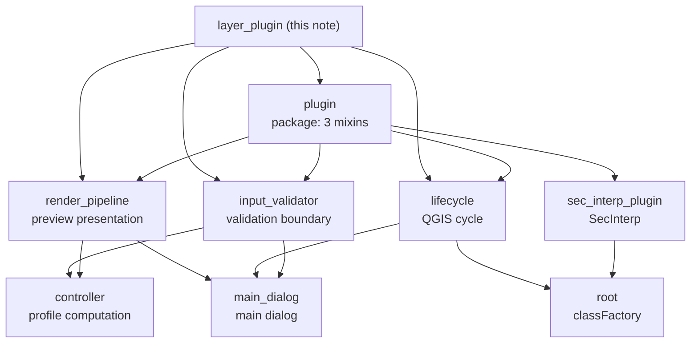

---
tags:
  - secinterp
  - code-walkthrough
  - layer
  - plugin
aliases:
  - layer_plugin
  - plugin layer
  - plugin (layer)
cssclass: secinterp-note
---

# `plugin/` layer — QGIS boundary of the plugin

> [!abstract] Navigation map
> The `plugin/` layer is the **boundary with QGIS**: the three-mixin package
> composing `SecInterp` — [[input_validator]] validates dialog input,
> [[lifecycle]] wires the `initGui`/`unload` cycle and [[render_pipeline]]
> turns the computed preview into a visible scene — gathered by [[plugin]].

**Path**: `plugin/` (4 files, ~392 lines)
**Package**: [[plugin]] (re-exports the three mixins)
**Host class**: `SecInterp` (see [[sec_interp_plugin]])
**Layer**: Plugin / GUI (the only one talking to `iface`, `QAction` and widgets)
**Tags**: #secinterp #code-walkthrough #layer #plugin

---

## 🎯 Why does this layer exist?

QGIS instantiates the plugin by convention (`classFactory`, `initGui`,
`unload`) and for the rest of the time the plugin only needs to validate
inputs, open its dialog and draw the preview. Without this layer, that wiring
would be tangled with computation:

| Problem | Solution in this layer |
|---------|------------------------|
| Each preview re-extracts widgets and half-validates | [[input_validator]] centralises Extract + validation into `PreviewParams` |
| QGIS wiring gets mixed with business logic | [[lifecycle]] isolates `initGui`/`unload` and deterministic cleanup |
| Computed data and visible section need presentation choices | [[render_pipeline]] filters visibility, derives exaggeration and publishes the render |
| Three orthogonal capabilities in one class | [[plugin]] composes them as mixins over `SecInterp` |

> [!important] Layer rule
> This is the **only layer touching `iface`, the canvas and the widgets**. It
> never computes geometry: it extracts parameters, delegates computation to
> the core via [[controller]] and presents the result. See
> [[sec_interp_plugin]] as the final composition and [[root]] as the load
> point.

---

## 🧬 Layer mini-map

> [!tip] How to read
> [[plugin]] is the package index; the three mixins are the branches. Outbound
> arrows show the composition: everything converges on [[sec_interp_plugin]]
> (the `SecInterp` class) and loads from [[root]].

---

## 📦 Layer members

| Note | Source | Role |
|---|---|---|
| [[plugin]] | `plugin/__init__.py` | Boundary package: re-exports the three mixins composing `SecInterp` |
| [[input_validator]] | `plugin/input_validator.py` | Extracts dialog values, builds and validates `PreviewParams`, arms layer notifications |
| [[lifecycle]] | `plugin/lifecycle.py` | Wires `classFactory` → `initGui`/`unload`, opens the dialog, releases actions, signals and renderer |
| [[render_pipeline]] | `plugin/render_pipeline.py` | Filters by visibility, derives vertical exaggeration and dip length, invokes the renderer, publishes to legend |

---

## 🧭 Tour mixin by mixin

### [[plugin]] — the package index

The package `__init__` holds no logic: it re-exports `InputValidationMixin`,
`PluginLifecycleMixin` and `RenderPipelineMixin` so the host class composes
them in a single line. It is the layer map in code: anyone reading the
package immediately knows the plugin is exactly three capabilities. Its note
also documents the boundary — what this layer may import (widgets, `iface`,
core validators) and what is forbidden to it (computing geometry).

### [[input_validator]] — the validation boundary

It extracts raw values from the dialog widgets, builds a typed
`PreviewParams` and submits it to the core `ProjectValidator` before any
computation runs. It is the Extract pattern applied to input: from widget to
DTO in a single point, with one error message back to the GUI. It also arms
layer-change notifications, so the preview knows when its parameters have
gone stale.

> [!note] Why validate here and not in the dialog
> The dialog ([[main_dialog]]) composes managers; validating in the mixin
> keeps each manager from repeating extraction and guarantees the
> [[controller]] only receives already-sanitised parameters.

### [[lifecycle]] — the QGIS cycle

It covers the entry mechanics QGIS mandates: `classFactory` creates the
instance (see [[root]]), `initGui` registers the action and toolbar, and
`unload` removes it with deterministic release of actions, signals and the
renderer. It also opens the main dialog on demand. Without this mixin, the
lifecycle would tangle with validation and rendering; isolated, resource
leaks can be reasoned about in a single 167-line file.

### [[render_pipeline]] — from data to visible scene

It receives the already-computed preview and makes the presentation choices
belonging neither to computation nor to the low-level renderer: it filters
layers by visibility options, derives vertical exaggeration and dip-line
length, invokes the preview renderer and publishes the result to render
state and legend. It is the last link before the user sees the section on
the canvas.

---

## 🔄 Data flow

| Phase | Actor | Input → Output |
|------|-------|----------------|
| Load | [[root]] | QGIS imports the package → `classFactory(iface)` creates `SecInterp` |
| Registration | [[lifecycle]] | Instance → toolbar and menu action |
| Validation | [[input_validator]] | [[main_dialog]] widgets → validated `PreviewParams` |
| Computation | [[controller]] | `PreviewParams` → profile result tuple |
| Presentation | [[render_pipeline]] | Results + options → QGIS scene + legend |

The typical preview path is: the user opens the dialog (lifecycle), presses
preview (the validator extracts and sanitises), the core controller
computes, and the render pipeline publishes the scene. The
[[sec_interp_plugin]] class orchestrates these phases without computing: it
composes the three mixins, wires services and extractors, and loads the
locale translation.

> [!note] Where each decision lives
> **When** the plugin exists is decided by [[lifecycle]]; **with which
> parameters** it works is decided by [[input_validator]]; **how** the result
> looks is decided by [[render_pipeline]]; **what** gets computed is decided
> by [[controller]]; **who** composes everything is [[sec_interp_plugin]].

---

## 🏛️ Layer patterns

| Pattern | Where | Purpose |
|---------|-------|---------|
| **Mixin composition** | [[plugin]] + [[sec_interp_plugin]] | Three orthogonal capabilities in one class without deep inheritance |
| **Boundary / Extract** | [[input_validator]] | Turn widgets into a validated DTO before computation |
| **Lifecycle / Disposable** | [[lifecycle]] | Deterministic registration and release of QGIS resources |
| **Presentation pipeline** | [[render_pipeline]] | Separate visual choices from computation and the base renderer |

---

## 🔗 Related notes

- [[Index]] — vault index
- [[sec_interp_plugin]] — `SecInterp` class: composes the mixins and wires services via `SafeLoader`
- [[root]] — `classFactory(iface)` with lazy import plus dev bootstrap
- [[main_dialog]] — dialog composition root governed by the mixins
- [[controller]] — core orchestrator to which the layer delegates all computation

---

*Note of the SecInterp Code Walkthrough v2 vault — v3.9.1*
